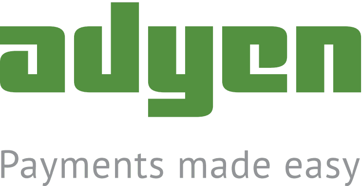

# Módulos de Plataformas de pago

Con PrestaShop, puedes aceptar las transacciones de tus clientes a través de varios métodos de pago diferentes, tales como cheques, transferencia bancaria, contra reembolso, y algunos módulos de asociados como Hipay, Moneybookers, PayPal, etc. Estos módulos ya están incluidos en tu tienda y están listos para ser utilizados. Sin embargo, es necesario que los configures para que funcionen correctamente.

PrestaShop tiene tres módulos básicos de pago, que puedes utilizar directamente sin tener que registrarte en ningún servicio de terceros:

* Transferencia bancaria
* Pago contra reembolso
* Cheque

Además, varios módulos de pago ofrecidos por terceros, están disponibles de forma predeterminada: Estos módulos son desarrollados por socios de PrestaShop, en estrecha colaboración con nuestros desarrolladores. Todos ellos son seguros de utilizar y encontrarás la documentación específica de cada uno de ellos en la página de configuración de cada módulo.

Ten en cuenta que puedes encontrar muchos otros módulos de pago en el marketplace oficial de PrestasShop (Addons): [http://addons.prestashop.com/es/4-pagos-prestashop-modulos](http://addons.prestashop.com/es/4-pagos-prestashop-modulos)

## Adyen 

Adyen es una compañía global de pagos liderando el camino en la definición de una nueva generación de servicios de pago. Construida desde cero en tecnologías de vanguardia, su plataforma de pago global permite a las empresas aceptar pagos desde cualquier lugar del mundo utilizando la misma plataforma técnica y administrativa a través de una interfaz back-office. Ésta es compatible con todos los canales de venta pertinentes, incluyendo online, móvil y Terminales de punto de venta (Point-of-Sale (POS)), y puede procesar 224 métodos de pago diferentes y 187 monedas de transacción utilizadas en seis continentes. Cumpliendo con los más altos estándares de seguridad y estabilidad, la plataforma de pago Adyen está certificada como PCI Level 1.

El módulo Adyen hace posible que tu tienda pueda aceptar pagos con tarjeta de crédito.

Debes tener una cuenta Adyen, para poder utilizar este módulo.\
&#x20;Posteriormente, deberás configurar el módulo con su Merchant Account, tu Notification username password, el código ISO de tu país y tu idioma local.

Por último, puedes elegir los métodos de pago.

Una vez realizada la configuración, podrás ver que las opciones de pago elegidas aparecen en el front-office de tu tienda como parte de los métodos de pago disponibles.

## Transferencia bancaria 

Este módulo hace posible que tus clientes paguen mediante una transferencia bancaria.

Para que el módulo acepte las transferencias bancarias por parte de tus clientes, tienes que rellenar la dirección del banco que utiliza tu tienda, junto con el nombre del dueño de la cuenta y los otros detalles de la cuenta (sucursal bancaria, número IBAN, BIC, etc.). Esto se realiza en la página de configuración del módulo.

Una vez que la configuración  ha sido establecida, tus clientes podrán ver que la opción "Pago por transferencia bancaria" aparece en el front-office de la tienda como parte de los métodos de pago disponibles. Después de que ellos lo hayan seleccionado y hayan elegido su moneda, aparecerá la información de su banco.\
&#x20;Ten en cuenta que al recibir una transferencia bancaria del cliente, **deberás** cambiar manualmente el estado del pedido a "Pago aceptado" en el back-office de tu tienda. Esta es la diferencia con un pago realizado mediante tarjeta de crédito, donde el pago se realiza de forma automática. Puedes encontrar el pedido y cambiar su estado desde la página "Pedidos", bajo el menú "Pedidos".

## Pago contra reembolso 

Este módulo hace posible que tus clientes te comuniquen que van a pagar por el producto directamente a la persona que lo entrega. El envío y el pago pueden ser realizados por una agencia de transporte, o bien podrían realizarlo tus propios empleados en el caso de que la entrega sea a nivel local.

No hay ninguna página de configuración: tu cliente puede simplemente optar por recoger sus productos en tu tienda.

## FerBuy 

Gracias al nuevo servicio de pago Todo-En-Uno de FerBuy sus clientes pueden disfrutar de un nuevo nivel de simplicidad, seguridad y flexibilidad. FerBuy ofrece un crédito instantáneo a clientes de hasta 500 € por compra y un crédito total de hasta 1.500 €. Los comerciantes podrán disfrutar de ingresos cada vez mayor debido al incremento que se produce en las tasas de conversión, además de contar con plena seguridad ya que FerBuy cubrirá todo el crédito y el riesgo de fraude.\
FerBuy es un método de pago que permite a los comerciantes ofrecer pagos libres de riesgo por factura y en cuotas.

## Hipay 

El módulo de Hipay hace posible que tu tienda acepte pagos con tarjeta de crédito.

Debes tener una cuenta en Hipay para poder utilizar este módulo. Haz clic en el botón "Crear una cuenta" para iniciar el proceso de registro y obtenerla.\
A continuación, configura el módulo con tu Account number, tu Merchant password y tu Site ID.\
&#x20;Por último, puedes elegir el grupo de edad autorizada, y restringir el módulo a ciertas zonas.

Una vez que la configuración ha sido establecida, tus clientes podrán ver que la opción "Hipay" aparece en el front-office de la tienda como parte de los métodos de pago disponibles.

## Kwixo 

El módulo Kwixo hace posible que tu tienda acepte pagos a través de los servicios de pago que ofrece Kwixo. Kwixo es parte de FIA-Net, el sello francés de comercio electrónico de confianza, y de dos importantes bancos franceses, Crédit Agricole y LCL. Los clientes deben tener una cuenta de Kwixo, y tener registrada una tarjeta de crédito en su servicio.

Debes tener una cuenta en Kwixo para poder utilizar este módulo. Puedes llegar al formulario de inscripción haciendo clic en el enlace que aparece en la página de configuración.\
&#x20;A continuación, configura el módulo con tu identificador de vendedor y tu clave cifrada, e indica si deseas trabajar en modo de prueba o en modo de producción, el tipo de pago que quieres aceptar, y tu demora para la entrega.\
&#x20;A partir de aquí, completa la información de configuración mediante la indicación de tus principales tipos de productos en la sección "Información sobre los productos que se venden en tu tienda", y tu transportista en la sección "Configuración del transportista".

Una vez que la configuración haya sido establecida, tus clientes podrán ver que la opción "Kwixo" aparece en el front-office de la tienda como parte de los métodos de pago disponibles.

Como comerciante, puedes acceder al  back-office de Kwixo desde la URL que se encuentra en la sección "Gestiona tus pagos en tu interfaz de administración Kwixo".

## Ogone 

El módulo Ogone hace posible que tu tienda acepte pagos con tarjeta de crédito.

Debes tener una cuenta en Ogone para poder utilizar este módulo. Puedes llegar al formulario de inscripción haciendo clic en el botón "¡Crea tu cuenta de prueba gratuita!" en la página de configuración.\
&#x20;A continuación, configura el módulo con su PSPID, tu firma de entrada SHA, tu firma de salida SHA, y, finalmente, elige si deseas utilizar el módulo en modo de prueba o en el modo de producción.

Una vez que la configuración ha sido establecida, tus clientes podrán ver que la opción "Ogone" aparece en el front-office de la tienda como parte de los métodos de pago disponibles.

## Pago por Cheque 

Este módulo hace posible que tus clientes paguen enviando un cheque.

Para configurar el pago por cheque, abre la página de configuración del módulo e indica la orden que tu cliente debe dar para realizar el pago mediante cheque – la mayoría de las veces, tu nombre o el nombre de tu empresa y tu dirección.\
&#x20;Esta información será mostrada al usuario al final del proceso de pedido, tras realizar clic en la opción "Pago por Cheque", y confirmar esta elección haciendo clic en el botón "Confirmo mi pedido".

Ten en cuenta que al recibir un pago por cheque de parte del cliente, **deberás** cambiar manualmente el estado del pedido a "Pago aceptado" en el back-office de tu tienda. Esta es la diferencia con un pago realizado mediante tarjeta de crédito, donde el pago se realiza de forma automática. Puedes encontrar el pedido y cambiar su estado desde la página "Pedidos", bajo el menú "Pedidos".

## PayPal Europa 

**Solamente para Europa.**

El módulo PayPal permite que tu tienda acepte pagos con tarjeta de crédito o utilizar los servicios de pago proporcionados por PayPal.

Debes tener una cuenta en PayPal para poder utilizar este módulo. Puedes llegar al formulario de inscripción haciendo clic en el botón "Abrir una cuenta" en la página de configuración.\
&#x20;A continuación, configura el módulo e introduce tu nombre de usuario API, tu contraseña API y tu firma API. Tambiéns debe asegurarte de que las otras configuraciones se ajustan a tus necesidades.

Una vez que la configuración ha sido establecida, tus clientes podrán ver que la opción "PayPal" aparece en el front-office de la tienda como parte de los métodos de pago disponibles.

## Realex 

Realex Payments procesa los pagos de más de £ 18 mil millones por año para más de 12,500 tiendas en línea, entre las que se incluyen algunas de las principales marcas del mundo – Vodafone, Aer Lingus, Virgin Atlantic, Paddy Power, Chain Reaction Cycles, AA, 32Red, notonthehighstreet.com por tan sólo nombrar algunas de ellas.

## Skrill 

Skrill lleva moviendo dinero digital desde el año 2001, ofreciendo soluciones de pago en línea para empresas y consumidores, permitiendo a ellos cobrar y pagar transacciones en todo el mundo. Más de 36 millones de titulares de cuentas y 158.000 comerciantes ya confían en Skrill.

El módulo Skrill de Moneybookers hace que tu tienda pueda aceptar pagos realizados con tarjetas de crédito.

Debes tener una cuenta en Moneybookers para poder utilizar este módulo. Puedes llegar al formulario de inscripción haciendo clic en la imagen que aparece en la sección "Abrir una cuenta".\
&#x20;A continuación, haz clic en el botón "Ya tengo una cuenta en Moneybookers" para continuar con la configuración del módulo.

Una vez que la configuración haya sido establecida, tus clientes podrán ver que la opción "Moneybookers Skrill" aparece en el front-office de la tienda como parte de los métodos de pago disponibles.

## Sofort 

Sofort Banking: El método de pago atractivo e indicado para ti.\
\
SOFORT Banking es uno de los sistemas de pago en línea más seguros de internet. Esto se debe a que con SOFORT Banking, utilizas el acreditado y seguro procedimiento de banca en línea. Los datos de acceso a la banca en línea y las claves de confirmación sólamente se introducen en el formulario de pago seguro de SOFORT AG y no en la página web del comercio.

Recibirás una confirmación de la transacción en tiempo real, inmediatamente después de que la transferencia se haya completado. ¡Y todo esto con tarifas ecónomicas inigualables!.

## Trustly 

Permite que tus clientes paguen desde sus cuentas bancarias en línea directamente en tu tienda en línea. La única forma de pago en España, con cobertura bancaria del 90%.
