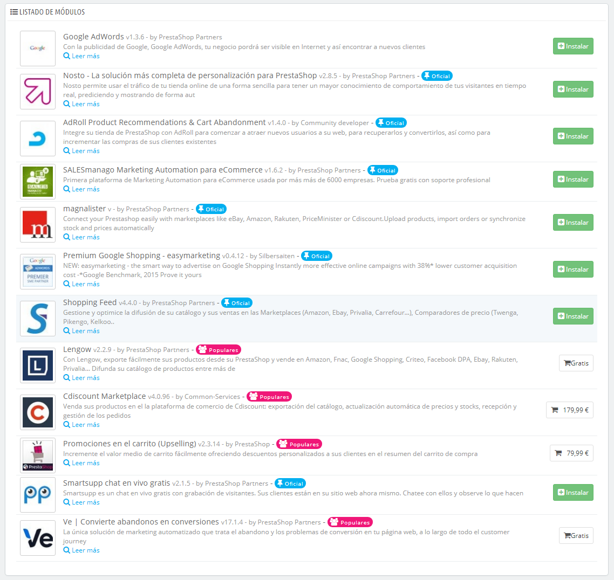

# Módulos de Marketing

Esta página reúne en un mismo lugar algunos de los módulos más importantes de los módulos de marketing disponibles en la instalación de PrestaShop. Ésta sirve como enlace directo a determinadas categorías de módulos de la página "Módulos y Servicios".

Los módulos de esta página proceden de las secciones "Publicidad y Marketing", "Marketplace" y "Comercialización" de la página "Módulos y Servicios".

Puedes instalar módulos directamente desde esta página. Al hacer clic en el botón "Instalar", el módulo será instalado y serás redireccionado a la página de "módulos", donde podrás abrir la página de configuración del módulo haciendo clic en su vínculo "Configurar". También puedes regresar a esta página de "Marketing" y abrir desde aquí su página de configuración, o eliminar, desactivar, reiniciar o desinstalar el módulo, dependiendo de su estado.
