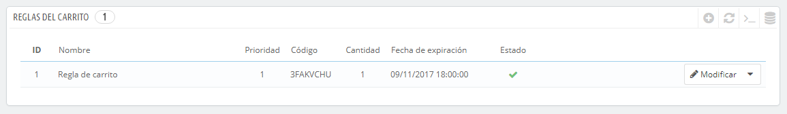
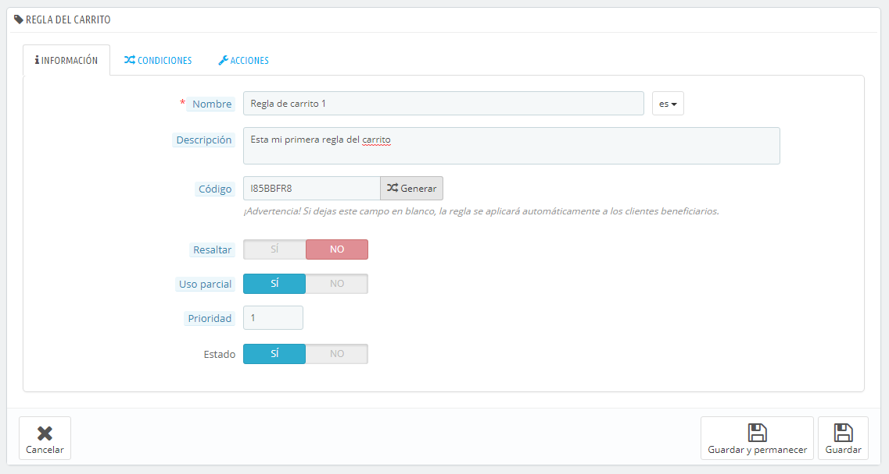
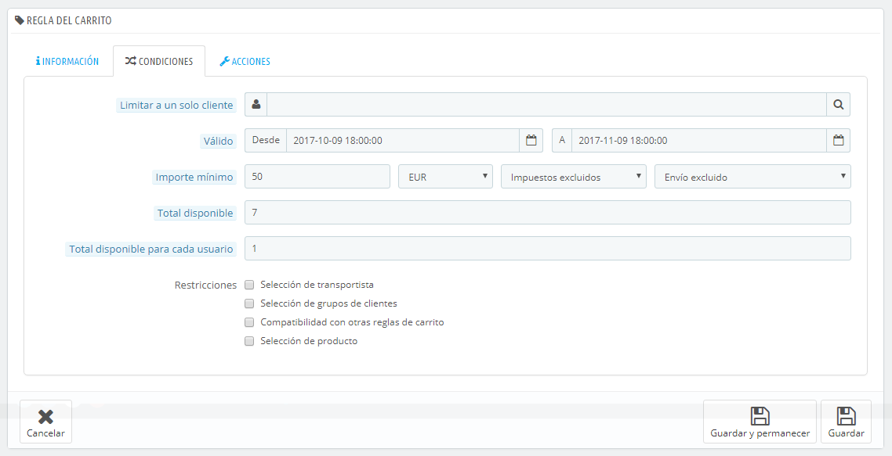
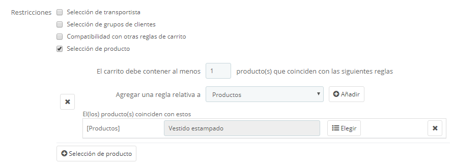
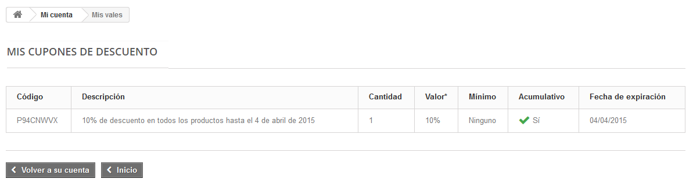
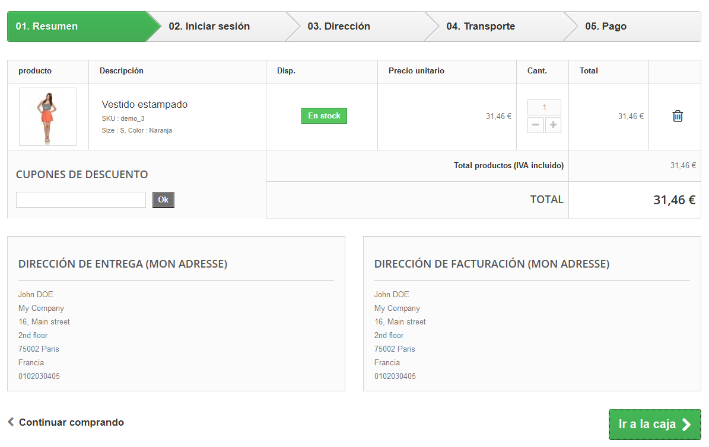
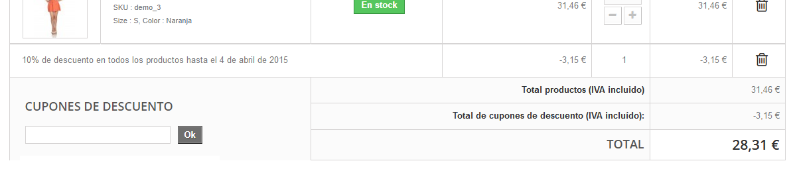

# Reglas del carrito

La página "Reglas del carrito" te da acceso a una herramienta avanzada que sustituye y mejora el sistema de cupones de descuento utilizado en PrestaShop 1.4. Los usuarios más experimentados de PrestaShop no se sorprenderán con las funcionalidades que se han añadido, pero tendrán que adaptarse al nuevo nombre: cuando esta guía menciona cupones de descuento, en realidad nos estamos refiriendo a las reglas del carrito – que, en sí mismas, son bastante diferentes a las facturas por abono/notas de crédito.

Diferencias entre una factura por abono, un cupón de descuento y una regla de carrito

Una **factura por abono** o **nota de crédito** es ante todo una prueba por escrito de que un producto ha sido devuelto. La mayoría de las veces, ésta puede ir acompañada de un cupón de descuento que puedes emitir al cliente para que lo utilice en su próxima compra.

Un **cupón** es un código de descuento, que no tiene porque estar relacionado con una devolución de mercancía o reembolso, y que puede tomar más formas que la de estar emitido por una factura por abono:

* Un descuento en un pedido (porcentaje)
* Un descuento en un pedido (cantidad).
* Envío gratuito.

Puedes aplicar un cupón a todos los clientes, o a un grupo de clientes, o a un cliente único; también puedes establecer su fecha de caducidad.

Una **regla de carrito** es básicamente una versión avanzada de un cupón de descuento. Ésta te permite:

* Darle un nombre al descuento.
* Permitir al cliente utilizar solamente una parte del descuento.
* Asignar prioridades entre las reglas del carrito.
* Establecer la compatibilidad entre las reglas del carrito.
* Hacer que el descuento sólo funcione con algunos transportistas.
* Hacer que el descuento sólo funcione con una selección de productos y/o categorías y/o fabricantes y/o proveedores y/o atributos... ¡o todos al mismo tiempo si es necesario!.
* Hacer que el descuento sea aplicable para envíos gratuitos y/o un descuento en un pedido y/o un regalo... ¡o todos al mismo tiempo si es necesario!.

En esta guía del usuario, "regla del carrito" y "cupón de descuento" son sinónimos e intercambiables.

La página "Reglas del carrito" muestra un listado de las reglas de carrito existentes en la actualidad, que puedes activar o desactivar haciendo clic en el icono disponible en la columna "Estado".

## Crear una nueva Regla de Carrito 

Un cupón de descuento puede ser creado de manera automática tras la devolución de un producto, pero también puede ser creado en cualquier momento de forma manual, especificando con detalle sus propiedades.

El formulario de creación muestra tres pestañas, que te permite, precisamente, construir nuevas reglas y cupones de descuento.

### Pestaña Información 

La primera pestaña, "Información", contiene los identificadores de la regla y sus principales ajustes.

* **Nombre**. El nombre es público, por lo que debe ser entendible por el cliente.
* **Descripción**. La descripción no es pública. Esta es de ayuda a los empleados de tu tienda para entender la razón por cual la regla fue creada.
* **Código**. Otorga a tu regla un código único. Puedes crear uno manualmente (y por lo tanto usar palabras legibles, como 1CUPONPARAJOE), o hacer que PrestaShop genere una cadena única haciendo clic en el botón "Clic para generar un código aleatorio". Por supuesto, también puedes utilizar cualquier otro generador de cadenas (como por ejemplo [http://www.random.org/strings/](http://www.random.org/strings/)).\
  Ten en cuenta que si no se establece un código, la regla se aplicará a cualquier cliente que encaje dentro de las otras condiciones:\

  * Si hay un código, entonces el cliente tiene que introducirlo durante el proceso de pedido.
  * Si no hay ningún código, entonces la regla se aplica automáticamente, beneficiando a todos los clientes.
* **Resaltar**. Si está opción se encuentra activada, PrestaShop informará al usuario que un cupón de descuento correspondiente al contenido de su carrito está disponible y puede utilizarlo para beneficiarse del descuento.
* **Uso parcial**. Si esta opción se encuentra desactivada, la regla de descuento/cupón sólo puede ser utilizado una vez, incluso si éste no se usa completamente. Si está activada, un nuevo cupón de descuento será creado cuando el actual no se ha utilizado completamente.
* **Prioridad**. Si un cliente (o grupo de clientes) tiene para utilizar más de un cupón de descuento, o si más de un cupón de descuento puede ser aplicado a un pedido, PrestaShop aplicará el más adecuado por orden alfabético. Puedes cambiar ese orden, otorgando una prioridad más baja a tu cupón de descuento. Por defecto, todos ellos tienen prioridad 1. Si estableces éste a un número más alto, el cupón se aplicará tras utilizar los cupones con un número inferior.
* **Estado**. Puedes deshabilitar y habilitar una regla cada vez que lo consideres necesario.

### Pestaña Condiciones 

La segunda pestaña, "Condiciones", contiene un amplio conjunto de posibilidades, que te permite especificar de manera precisa quién debe beneficiarse de esta regla.

* **Limitar a un solo cliente**. Aquí es donde se indica que el cupón que estás creando es para un único cliente. Por ejemplo, si hay un retraso en la entrega de un pedido y quieres tener un gesto de buena voluntad con el cliente, puedes crear un cupón de descuento para este cliente al que solamente éste puede tener acceso. Para encontrar rápidamente el cliente, escribe las primeras letras de su nombre, apellido o dirección de correo electrónico en el campo de texto.\
  &#x20;Si está vacío, PrestaShop entenderá que cualquier cliente puede utilizarlo... a menos que haya añadido un grupo de clientes, como condición adicional (revisa la casilla de verificación "Selección de Grupo de clientes" situada en la parte inferior de esta página para añadir esta condición adicional).
* **Válido**. La validez predeterminada es de un mes, pero puede ser reducida a una semana o incluso a un único día.
* **Importe mínimo**. La cantidad mínima del pedido para la que este cupón es aplicable. Tu cupón de descuento sólo será aplicable si el pedido del cliente está por encima de la cantidad especificada en este campo. Puedes elegir si esa cantidad debe incluir los impuestos y/o gastos de envío.
* **Total disponible**. Establece una cantidad de cupones de descuento disponibles: "1" si está destinado para ser utilizado por un cliente, o cualquier número si el cupón está destinado a ser utilizado solamente por los primeros.
* **Total disponible para cada usuario**. Puedes establecer el número de veces que un cupón de descuento puede ser utilizado por cada usuario. Ese número debe ser al menos igual a la cantidad de cupones de descuento disponibles arriba (en el campo "Total disponible").\

  * Si este número es inferior a la cantidad total de cupones de descuento disponibles, entonces ningún cliente será capaz de utilizarlos.
  * Si mantienes este número establecido a "1", te aseguras de que cada uno de tus clientes podrá utilizar el cupón una sola vez. En este caso, asegúrate de que el cupón se aplique a un grupo en lugar de a un cliente.

Las casillas de verificación situadas en la parte inferior de esta sección son muy importantes, ya que ayudan a filtrar aún más a qué o a quién debe aplicarse la regla.

* **Selección de transportista**. Puedes asegurarte de que el cliente solo acceda a esta regla si elige a un determinado transportista para el envío de su pedido.
* **Selección de grupos de clientes**. Esto es muy útil. Gracias a la herramienta de creación de grupo de PrestaShop, puedes crear un descuento que se aplique solamente al grupo/s de clientes seleccionado/s, y construir otras condiciones en la parte superior de ese descuento gracias a la herramienta de creación de reglas del carrito.
* **Compatibilidad con otras reglas del carrito**. De manera predeterminada, un pedido puede beneficiarse de cualquier número de reglas del carrito. Con esta opción, puedes decirle a PrestaShop que esta regla no se puede combinar con una selección de otras reglas. Esta opción sólo aparece si tienes disponible más de una regla de carrito.
* **Selección de productos**. Otra herramienta muy útil, que permite crear automáticamente cupones de descuento para carritos que contengan productos específicos. La herramienta será explicada detalladamente a continuación.
* **Selección de tienda**. De manera predeterminada, una regla de carrito se aplica a todas tus tiendas. Con esta opción, puedes hacer que una regla sólo se aplique a una selección de tus tiendas.

La opción "Selección de productos" abre un nuevo y completo formulario, que te permite crear no solamente cupones de descuento por productos, sino también por categorías, por marcas (fabricantes), por proveedores e incluso por atributos. Como beneficio adicional, puedes combinar todos estas con el fin de especificar tu cliente objetivo tanto como sea posible.

Por ejemplo, puedes crear automáticamente cupones de descuento para un cliente con esta condición "¡Compre un mínimo de 3 producto Apple, y no pague los gastos de envío!"\
&#x20;Esta es realmente una herramienta incluida dentro de la regla del carrito, y su configuración es muy específica. Puedes añadir tantas selecciones de productos, como necesites, siguiendo estos pasos:

1. Haz clic en el enlace "Selección de producto" para añadir una nueva sección.
2. Indica el número de productos necesarios para que el descuento sea aplicado.
3. Añade al menos una regla del tipo que quieras: productos, atributos, categorías, marcas (fabricantes), proveedores. Puedes añadir tantas reglas para la selección de productos como desees, e incluso en caso de ser necesario una para cada tipo.
4. Haz clic en el botón "OK" una nueva fila se añade a la selección. Para cada tipo, debes dar detalles sobre el contenido al que se aplica la regla. Haz clic en el enlace "Elegir", se abrirá una ventana que lista el contenido disponible para este tipo (productos, categorías...). Mueve el contenido desde el panel izquierdo al derecho, haciendo clic en el botón "Añadir >>", y cierra la ventana haciendo clic sobre la "X" situada en la parte superior derecha. Si solamente un contenido es seleccionado, el contenido del campo mostrará su nombre; de lo contrario, se indicará el número de contenido seleccionado.

Puedes añadir tantas reglas dentro de una selección como sea necesario. Estas reglas son acumulativas: o todas ellas se cumplen, o el descuento no se concede.

Las selecciones de productos funcionan de manera independiente, puedes añadir tantas como sea necesario, y estas no interfieren unas con otras. Esto te permite crear una amplia gama de productos a los que se aplicará la regla del carrito.

### Pestaña Acciones 

La tercera y última pestaña, "Acciones", te permite establecer en que consiste realmente el descuento.

* **Envío gratuito**. Esta regla ofrece el envío gratuito a los clientes a los que se pueda aplicar.
* **Aplicar un descuento**.
  * **Porcentaje (%)**. La regla se aplica a un porcentaje del total del pedido. Por ejemplo, supongamos que el pedido está valorado en 200 dólares (impuestos no incluidos). La regla tiene un valor de 15%. Los clientes que se beneficien de esta regla sólo tendrán que pagar 170 dólares (sin incluir impuestos y gastos de envío).
  * **Importe**. La regla aplica un descuento monetario al precio total del pedido. Por ejemplo, supongamos que el pedido está valorado en 200 dólares (impuestos no incluidos). El descuento ofrece 20 dólares de descuento en la compra. Los clientes que se beneficien de esta regla sólo pagarán 80 dólares (impuestos no incluidos). Puedes elegir si los impuestos se aplican al descuento o no.
  * **Ninguno**. La regla no ofrece ningún descuento en el pedido. Al seleccionar esta opción, la siguiente sección "Aplicar descuento a", desaparecerá.
* **Aplicar descuento a**.
  * **Pedido (sin gastos de envío)**. El descuento se aplica a toda el pedido.
  * **Producto específico**. Puedes elegir a qué producto se debe aplicar el descuento: escribe las primeras letras del producto y selecciónalo en la lista de nombres coincidentes.
  * **Producto más barato**. Sólo disponible para la opción "Porcentaje (%)".
  * **Producto(s) seleccionado(s)**. El cliente puede elegir a qué productos se debe aplicar el descuento. Sólo disponible para la opción "Porcentaje (%)".
* **Enviar un regalo**. Puedes optar por ofrecer un regalo bajo ciertas condiciones (y mantener el descuento). Al seleccionar esta opción, un nuevo campo aparece: escribe las primeras letras del producto y selecciónalo en la lista de nombres coincidentes.

Una vez que todo ha sido guardado, puedes enviar el código del cupón de descuento a tus clientes, o dejar que el sistema gestione las reglas del carrito de manera automática, lo que dependerá de la configuración establecida.

Tu cupón de descuento aparecerá en la página "Reglas del carrito", bajo el menú "Reglas de descuentos". Puedes eliminar o modificar este cupón de descuento en cualquier momento. Si el cupón de descuento fue establecido a un grupo específico o cliente, entonces este aparecerá en el Front-Office, en la sección "Mis cupones de descuento" de la cuenta de su cliente, así como en el carrito (si así lo deseas), donde ellos pueden elegir cuál de ellos quieren aplicar a su pedido.

Las reglas del carrito que son establecidas para aplicarlas sobre todos los clientes no aparecen en la página "Mis cupones de descuento": con el fin de que estos cupones sean utilizados por sus clientes, te corresponderá a ti informarles sobre dichos descuentos.

Para aplicar una regla de carrito, el cliente tiene que visitar su carrito e introducir el código del cupón de descuento en el campo "Cupones de descuento" y hacer clic en el botón "OK". El cliente no podrá aplicar el cupón de descuento si la compra ya ha sido validada.

Una vez aplicado, el resumen del carrito muestra el impacto del cupón de descuento sobre la cantidad del pedido.

