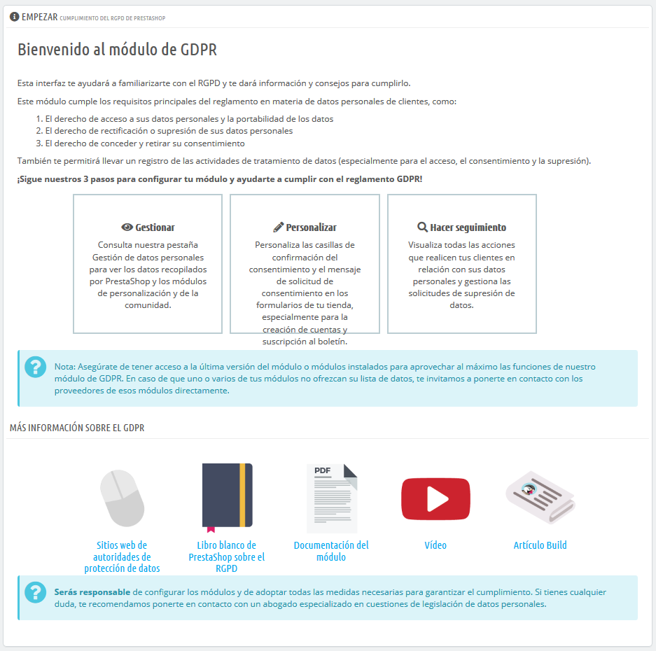
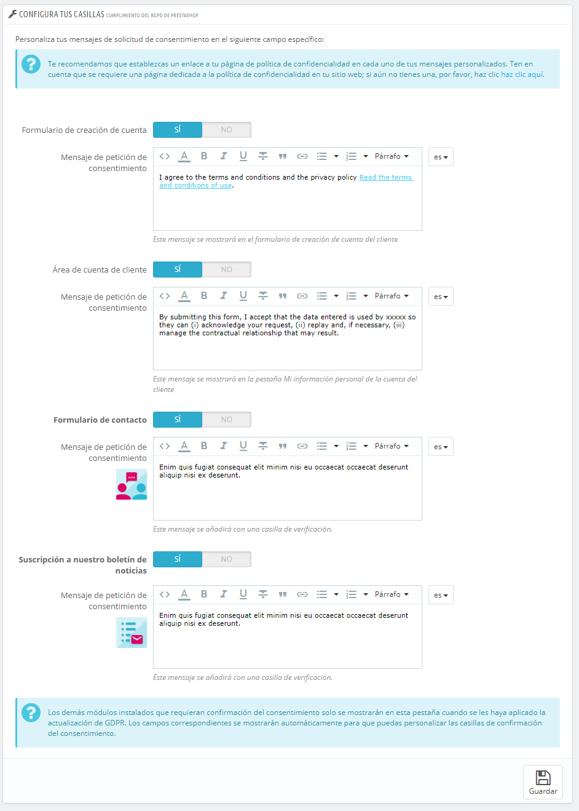

# Cumplimiento de la legislación europea del RGPD

## Introducción 

El Reglamento General de Protección de Datos (RGPD) entra en vigencia el 25 de mayo y tiene como objetivo unificar las regulaciones relacionadas con las políticas de privacidad de datos en la Unión Europea. Este texto refuerza los derechos de las personas e impone una nueva lógica de responsabilidad a las entidades involucradas al exigirles que tomen las medidas necesarias y adecuadas para garantizar un nivel adecuado de seguridad a la hora de [procesar datos personales](https://addons.prestashop.com/en/free-prestashop-modules/31944-gdpr-whitepaper-.html)[.](https://addons.prestashop.com/en/free-prestashop-modules/31944-gdpr-whitepaper-.html)&#x20;

## ¿Por qué deberías preocuparte por este asunto? 

Dada la llegada y el alcance de estos términos y el hecho de que tienes en funcionamiento un negocio de comercio electrónico, es muy probable que proceses datos personales. Por otra parte, el RGPD no solamente afecta a todas las empresas europeas, sino también a empresas ubicadas fuera de Europa que recopilan datos personales de ciudadanos europeos. Por tanto, ningún comerciante puede eludir este reglamento y debe actualizar el cumplimiento de su tienda a esta normativa.

Requisitos principales\
 
-----------------------------------------------------------------------------------------------------------------------------------------------------

Nuestro módulo RGPD se encuentra disponible en el [marketplace Addons](https://addons.prestashop.com/es/marco-legal-ley-europea/32323-cumplimiento-del-rgpd-by-prestashop-15-16.html) y tiene como objetivo para proteger los datos de tus clientes. Ellos deben poder acceder a sus datos personales así como a la portabilidad de los mismos, el derecho a obtener la rectificación y / o eliminación de sus datos personales y, sobretodo, a otorgar o retirar su consentimiento.\
\
Para los comerciantes, la ley exige mantener un registro de las actividades de tratamiento, tanto como del acceso, el consentimiento y la eliminación de los mismos. Este módulo se adapta a estas necesidades permitiéndole mantener un registro de todas las actividades de tus clientes con respecto a sus datos personales (incluida la accesibilidad, el consentimiento y la eliminación de datos). De esta manera, puedes demostrar que cumples con tus obligaciones conforme a los requerimientos de reglamento.\

Atención, el artículo 83 del RGPD establece sanciones de hasta 20 millones de euros o, en el caso de una empresa, hasta el 4% de la facturación anual global del ejercicio financiero anterior.\

### Configurar el módulo RGPD  

#### Empezar 

Esta pestaña te ayudará a familiarizarte con el Reglamento General de Protección de Datos (RGPD) y con nuestro módulo. Aquí encontrarás información general sobre este reglamento de la UE (nuestro documento técnico, video, artículo, etc.), así como la guía del usuario de nuestro módulo para descargar en formato PDF para ayudarte a configurarlo.

#### Gestión de datos personales 

En esta pestaña, lo primero que encontrarás es el listado de módulos instalados en tu tienda que cumplen con el RGPD.

Si consideras que uno o más módulos recopilan datos personales y no aparecen en esta lista, asegúrate de tener instalada la última versión de estos módulos y de que se encuentren actualizados para cumplir con la normativa actual del RGPD.\

Si aún así estos módulos no se muestran en el listado, te invitamos a que contactes con sus respectivos desarrolladores para obtener [más información](http://build.prestashop.com/howtos/module/how-to-make-your-module-compliant-with-prestashop-official-gdpr-compliance-module) [sobre dichos módulos.](http://build.prestashop.com/howtos/module/how-to-make-your-module-compliant-with-prestashop-official-gdpr-compliance-module)

Seguidamente, puedes buscar un cliente y un usuario invitado o desconocido que haya proporcionado su dirección de correo electrónico o número de teléfono y se encuentren almacenados en tu base de datos,ver todos los datos recopilados por la solución PrestaShop y los módulos compatibles con el RGPD instalados en tu tienda. Para buscar un usuario, introduzca las primeras letras del nombre, dirección de correo electrónico o número de teléfono:

Los datos personales que puede visualizar en esta interfaz serán utilizados en dos ámbitos distintos:

* Cuando un usuario solicita acceso a sus datos: obtiene una copia de sus datos personales recopilados en tu tienda en formato PDF o CSV.
* Cuando un usuario solicita la eliminación de sus datos: si aceptas su solicitud, sus datos se suprimirán de forma permanente.

También puedes procesar todas las solicitudes de supresión de datos de sus usuarios que se realizan a través del formulario de contacto de tu tienda, estando sujetas a tu validación. Antes de aceptar la solicitud de la supresión de los datos y eliminar un usuario de manera permanentemente de la base de datos de tu tienda, te recomendamos que descargues todas las facturas vinculadas a la cuenta del usuario.

Para obtener más detalles sobre estos datos, el navegador serás redireccionado a la sección del back office de tu tienda donde se administran los perfiles guardados donde podrás visualizar la información que éstos contienen.\

Nota: Este módulo también permite la supresión de cuentas de invitado. El comerciante debe proporcionar la dirección de correo electrónico exacta o el número de teléfono para poder visualizar los detalles de la cuentas de invitado coincidente y luego eliminar los datos asociados a ella.

Una vez suprimidos los datos, el usuario ya no existe, pero sus facturas permanecen disponibles para cada pedido que haya realizado con anterioridad. Solo se suprimen sus datos personales. Sus carros abandonados se transfieren a una cuenta anónima, mientras que sus pedidos ya no se encontarán asociados a ninguna cuenta de cliente.&#x20;

#### Personalización de la de casilla de verificación de Consentimiento 

Esta pestaña te permitirá personalizar las casillas de verificación de consentimiento y los mensajes correspondientes en los diversos formularios y ámbitos de tu tienda.

**Configuración de las casillas de verificación**

Puedes activar y personalizar las casillas de verificación de confirmación de consentimiento en dos ámbitos predeterminados:

* En el formulario de creación de cuenta de tu tienda
* En la pestaña Información de la cuenta del cliente

Te recomendamos que escribas y establezcas tus mensajes de solicitud de consentimiento en todos los idiomas disponibles en tu tienda.

Dependiendo de los módulos instalados en tus tiendas y de si se han actualizado para cumplir con el RGPD, los campos de texto correspondientes se mostrarán en esta interfaz para que puedas personalizar tus mensajes de solicitud de consentimiento.

#### Seguimiento de la Actividad del Cliente 

En esta pestaña, puedes visualizar todas las acciones de tus clientes relacionadas con sus datos personales (especialmente para la accesibilidad, el consentimiento y la supresión de datos).

En esta tabla resumen encontrarás la siguiente información:

* Nombre y apellido del cliente o ID cliente
* Tipo de solicitud: accesibilidad, consentimiento o supresión de datos
* Fecha y hora de la acción

#### Ayuda 

En esta pestaña, encontrarás una lista de las preguntas más frecuentes realizadas por nuestros comerciantes, así como las respuestas proporcionadas por nuestro módulo y los expertos en el RPGD consultados.

