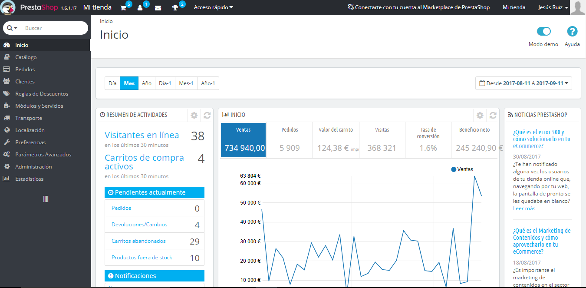
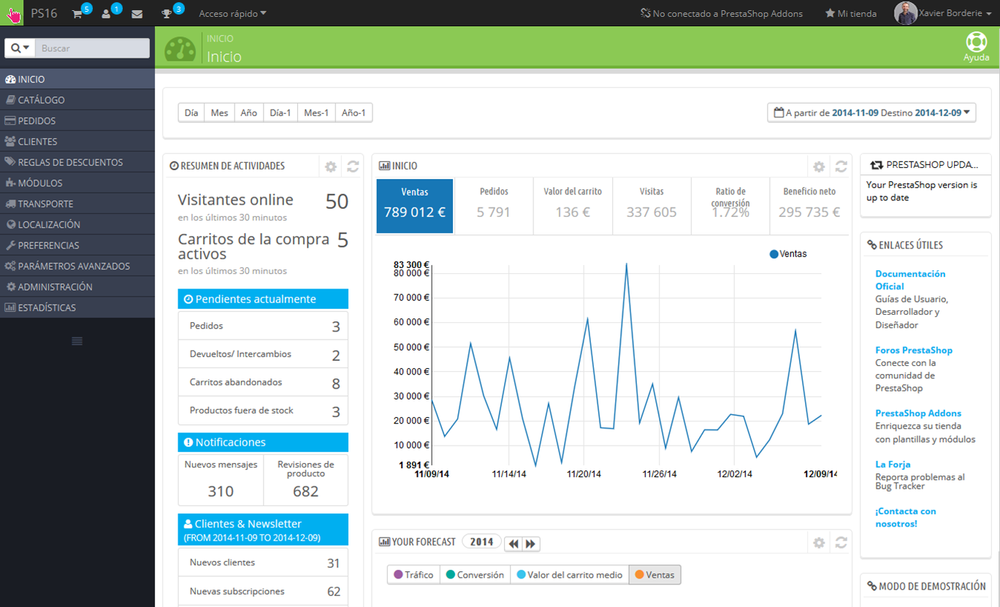
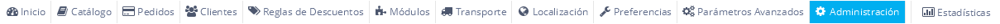
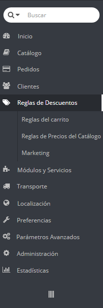
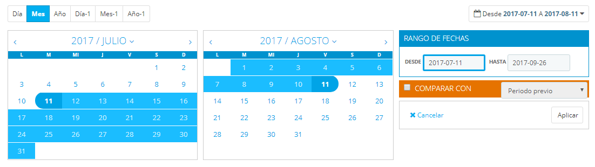
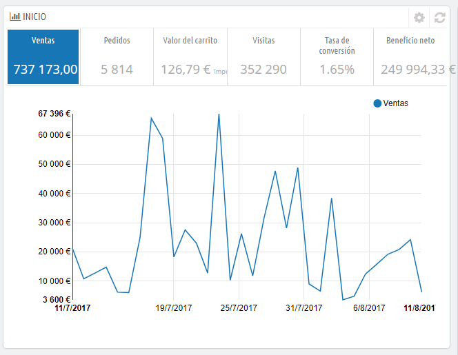
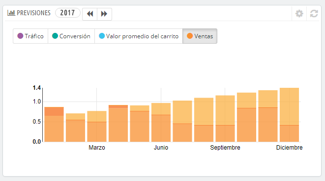
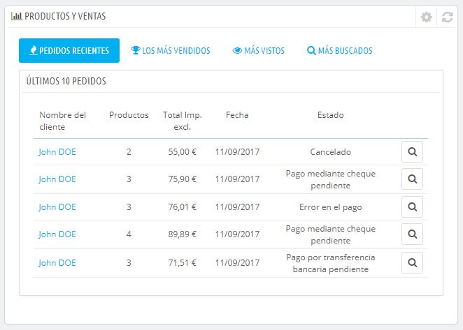
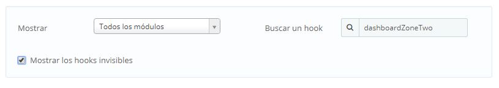
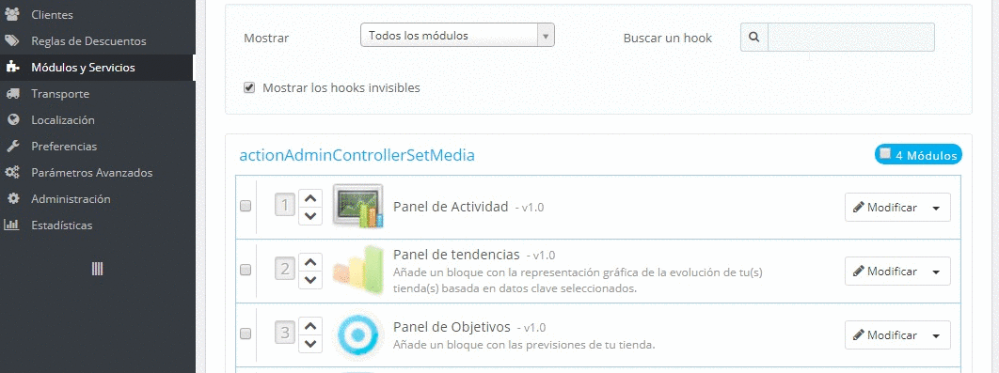

# Descubriendo el Área de Administración

**Tabla de contenidos**\
****

/\*\<!\[CDATA\[\*/\
div.rbtoc1597066505558 {padding: 0px;}\
div.rbtoc1597066505558 ul {list-style: disc;margin-left: 0px;}\
div.rbtoc1597066505558 li {margin-left: 0px;padding-left: 0px;}\
\
/\*]]>\*/

* [Descubriendo el Área de Administración](descubriendo-el-area-de-administracion.md#DescubriendoelÁreadeAdministración-DescubriendoelÁreadeAdministración)
  * [Visión general de la interfaz principal](descubriendo-el-area-de-administracion.md#DescubriendoelÁreadeAdministración-Visióngeneraldelainterfazprincipal)
    * [La barra superior](descubriendo-el-area-de-administracion.md#DescubriendoelÁreadeAdministración-Labarrasuperior)
    * [Los menús](descubriendo-el-area-de-administracion.md#DescubriendoelÁreadeAdministración-Losmenús)
  * [Los botones](descubriendo-el-area-de-administracion.md#DescubriendoelÁreadeAdministración-Losbotones)
  * [Ayuda contextual](descubriendo-el-area-de-administracion.md#DescubriendoelÁreadeAdministración-Ayudacontextual)
  * [El cuadro de mandos](descubriendo-el-area-de-administracion.md#DescubriendoelÁreadeAdministración-Elcuadrodemandos)
    * [La barra horizontal](descubriendo-el-area-de-administracion.md#DescubriendoelÁreadeAdministración-Labarrahorizontal)
    * [La columna izquierda](descubriendo-el-area-de-administracion.md#DescubriendoelÁreadeAdministración-Lacolumnaizquierda)
    * [La columna central](descubriendo-el-area-de-administracion.md#DescubriendoelÁreadeAdministración-Lacolumnacentral)
    * [La columna derecha](descubriendo-el-area-de-administracion.md#DescubriendoelÁreadeAdministración-Lacolumnaderecha)
    * [Reordenar los elementos](descubriendo-el-area-de-administracion.md#DescubriendoelÁreadeAdministración-Reordenarloselementos)

## Descubriendo el Área de Administración 

Ahora que ya tienes instalado PrestaShop 1.6 y que has iniciado sesión satisfactoriamente en el área de administración, debes asegurarte de aprender a navegar y a manejar con soltura esta interfaz de administración, comprendiendo sus notificaciones y sabiendo donde encontrar cada información específica.

El diseño del área de administración ha sido completamente renovado y modernizado en la versión 1.6 de PrestaShop con el fin de presentar una interfaz más intuitiva y ergonómica – así como para funcionar mejor sobre dispositivos móviles.

Aunque la mayoría de páginas y opciones de la versión 1.5 se encuentran todavía en donde esperas encontrarlas, es posible que te lleve un tiempo acostumbrarte a esta nueva distribución.

Hemos creado este capítulo para ayudarte a descubrir y aprovechar al máximo la interfaz de administración de PrestaShop. Aunque esta interfaz ha sido diseñada para ser muy ergonómica y fácil de usar, ¡deberías leer esta guía de principio a fin para comprender perfectamente todo el potencial de tu nueva herramienta de negocios en línea!

### Visión general de la interfaz principal 

Tómate un tiempo para examinar el cuadro de mandos del panel de control. La primera página que verás al iniciar sesión en el back-office de PrestaShop es la página de Inicio. Ésta no sólo te presenta un resumen de todo lo que necesitas saber sobre tu tienda en cualquier momento determinado, junto con enlaces rápidos a las páginas principales más utilizadas, sino que si eres principiante en PrestaShop, también te ofrece consejos sobre asuntos que deberías revisar.

El back office de PrestaShop ha sido renovado a partir de la versión 1.6.1.0, para hacerlo legible y fácil de utilizar.

Desde la versión 1.6.0.0 a la 1.6.1.0, el back office presentaba el siguiente aspecto:

#### La barra superior 

En la parte superior del back-office se encuentra una barra de color negro que contiene un puñado de enlaces:

* **El logo de PrestaShop**, junto con su número de versión actual del software.
* **El nombre de tu tienda**. Desde cualquier página donde te encuentres, este enlace te lleva de regreso a la página principal (página de Inicio) del panel de control de tu tienda.
* **Icono carrito**. Un globo de ayuda emergente indica el número de nuevos pedidos, si los hubiera. Al hacer clic sobre éste, se abre un panel que presenta los nuevos pedidos que se han producido desde la última vez que hicistes clic en este icono. Desde aquí, puedes visualizar los detalles de uno de estos nuevos pedidos, o ir a la página que muestra el listado completo de pedidos.
* **Icono persona**. Un globo de ayuda emergente indica el número de nuevos clientes registrados en la tienda, si los hubiera. Al hacer clic sobre éste, se abre un panel que presenta los últimos clientes registrados. Desde aquí, puedes visualizar los detalles de uno de estos nuevos clientes, o ir a la página que muestra el listado completo de clientes.
* **Icono Correo**. Un globo de ayuda emergente indica el número de mensajes nuevos recibidos en el servicio de atención al cliente, si los hubiera. Al hacer clic sobre éste, se abre un panel que presenta uno de estos nuevos mensajes recibidos en el área de atención al cliente, o ir a la página que muestra el listado completo de mensajes.
* **Icono trofeo.** Un globo de ayuda emergente indica el número de nuevas medallas, si las hubiera. Al hacer clic sobre éste, se abre un panel que presenta tu progreso como comerciante. Desde aquí, puedes acceder a la página que muestra el listado completo de medallas (logros) y puntos, del módulo "Experiencia Comercial".
* **Acceso rápido**. Este es el menú de Enlaces rápidos, que presenta los enlaces más útiles, los cuales se establecen en la página "Acceso rápido" bajo el menú "Administración".
* **Enlace "Conectarte con tu cuenta al Marketplace de PrestaShop"**. Abre una nueva ventana modal que permite conectar tu tienda al marketplace de Prestashop, y así obtener actualizaciones de los módulos y temas que compraste.
* **Enlace "Mi tienda"**. Abre en una nueva pestaña del navegador el front-end de tu tienda.
* **Menú personal identificado con su nombre y apellido**. Un panel desplegable que te sirve como recordatorio de la cuenta que con la que estás conectado actualmente. Contiene los siguientes enlaces:\

  * **Enlace "Mis preferencias"**. Te lleva a la página de preferencias de tu cuenta, donde puedes establecer algunas opciones personales (por ejemplo, el idioma del back-office o la contraseña).
  * **Enlace "Cerrar sesión"**. Te desconecta de la cuenta de usuario actual.

#### Los menús 

A lo largo de sus actividades diarias administrando su tienda, tendrá que navegar a través de muchas páginas y opciones del back-office.

De manera predeterminada, el sistema de menús en PrestaShop 1.6 se muestra en el lado izquierdo de la página. Puedes cambiar la posición y orientación de este menú situándolo en la parte superior de la página utilizando la opción "Orientación del menú de administrador" disponible en tu página personal de preferencias (opción a la que puedes acceder a través del enlace que lleva tu nombre en la barra superior).

Tanto en posición vertical como en horizontal, el contenido de cada menú es mostrado cuando el ratón es posicionado sobre el título del menú, reduciendo así la necesidad de cargar nuevas pantallas tan sólo para acceder a las opciones del menú.

En adición a lo anterior, la orientación vertical puede ser minimizada para tan sólo trabajar con sus iconos haciendo clic sobre el icono de "líneas paralelas" situado en la parte inferior de este menú.

Cada menú pone en acción un conjunto de tareas y contextos:

* **Campo de búsqueda con lista desplegable**. Te permite buscar dentro del contenido de tu tienda.
* **Catálogo**. Este es el corazón de tu tienda, donde podrás añadir productos, crear categorías, configurar los transportistas y proveedores...
* **Pedidos**. Una vez que los clientes empiezan a añadir productos en sus carritos, comenzarás a ver los pedidos en este menú, junto con las facturas resultantes correspondientes. Aquí es también donde gestionarás las devoluciones de mercancía, las facturas por abono y el servicio preventa al cliente, entre otras cosas.
* **Clientes**. Desde aquí puedes acceder a toda la información acerca de tus clientes, y editar sus direcciones, crear grupos de clientes a los cuales se les puede aplicar descuentos especiales, gestionar el servicio de atención al cliente, e incluso gestionar los títulos sociales si es necesario .
* **Reglas de descuentos**. Un menú muy específico, que te permite crear fácilmente cupones de descuento y promociones de descuento a través de un conjunto de reglas.
* **Módulos**. Amplía el poder y funcionalidad de tu tienda añadiendo y activando módulos: más de un centenar de ellos vienen incluidos de manera predeterminada junto con PrestaShop, pero puedes adquirir muchos más en el marketplace de PrestaShop ([http://addons.prestashop.com/](http://addons.prestashop.com/)). Este menú también permite administrar los temas de tu tienda, y poder elegir donde posicionar los bloques de contenido de los módulos en el tema (incluyendo la funcionalidad Live Edit). Una última página de menú te permite aplicar ajustes globales a los módulos de pago.
* **Transporte**. Todo lo relacionado con los transportistas y gastos de envío, así como a su comercialización por grupos.
* **Localización**. Te ayuda a configurar los valores regionales de tu tienda, tales como idioma y traducción, monedas, unidades, impuestos y reglas fiscales, y entidades geográficas (regiones, países, etc.)
* **Preferencias**. PrestaShop es una solución de comercio electrónico muy configurable, por lo que puedes modificar casi cualquiera de sus comportamientos utilizando este menú que presenta las preferencias de todas las funcionalidades.
* **Parámetros avanzados**. Este menú contiene enlaces a herramientas y páginas de información que son demasiado específicas como para encajar y tener cabida en otros menús, tales como la configuración del servicio web (webservice), la herramienta de copia de seguridad de la base de datos, o el rendimiento de la página, entre otros.
* **Administración**. Aquí se presentan los ajustes relativos al propio back office; por ejemplo, el contenido del menú de acceso rápido, la lista de empleados y permisos, y el orden de los menús, entre otros.
* **Estadísticas**. Este menú te da acceso a todas las numerosas estadísticas y gráficos recopilados y generados por PrestaShop.

Estos son los menús predeterminados. Ten en cuenta que los módulos pueden añadir nuevas opciones a las páginas existentes, nuevas páginas a los menús existentes, e incluso nuevos menús.

Además de lo indicado anteriormente, hay un menú que sólo se encuentra disponible cuando la opción adecuada está activada:

* **Stock**. Este menú te da acceso a la funcionalidad de gestión de stock, donde puedes gestionar tus almacenes, realizar movimientos de stock y realizar pedidos de suministros a tus proveedores.\
  &#x20;Éste puede ser habilitado a través de la página "Productos" bajo el menú "Preferencias", activando la opción "Activar la administración avanzada de stock" (en la sección "Stock de Productos").

Todos los menús estándar predeterminados, incluyendo el menú de "Stock", se explican en profundidad en esta guía de usuario.

### Los botones 

Muchas de las páginas del back-end tienen botones recurrentes, tanto en la parte superior como en la parte inferior de la pantalla. Por ejemplo, la página de edición de productos puede presentar hasta 8 botones disponibles.

Además de servir como simples accesos directos, estos dan acceso a las funcionalidades existentes que se utilizan con mayor frecuencia.

Los botones disponibles varían mucho dependiendo del contexto, y por lo tanto dos páginas podrían no contar con el mismo conjunto de botones. Sin embargo, hay algunos que verás muy asiduamente:

* **Añadir nuevo**. Abre la página de creación del contexto actual.
* **Módulos recomendados**. Abre una ventana emergente que contiene los módulos disponibles en el contexto actual.
* **Ayuda**. Abre la documentación en línea disponible para la página actual.

El botón "Módulos recomendados" presenta los módulos que se aplican al contexto actual. Por ejemplo, la página "Transporte > Transportistas", mostrará los módulos disponibles en la categoría de módulos "Envíos y Logística". Esto es muy útil cuando necesites encontrar rápidamente qué módulo instalar y configurar para obtener un resultado determinado.

Muchos de los formularios del back-office son validados con botones situados en la parte inferior de la pantalla:

* **Guardar**. Guarda el contenido de la página actual y retorna al listado de artículos existentes.
* **Guardar y permanecer**. Guarda el contenido de la página actual y mantiene la página abierta.
* **Cancelar**. Retorna al listado de artículos existentes.

Las tablas de datos (listas de productos, categorías, clientes, etc.) tienen su propio conjunto de botones para gestionar los elementos listados:

* **Añadir nuevo**. Crea un nuevo elemento en el contexto actual.
* **Exportar**. Descarga un archivo CSV de todos los elementos.
* **Importar**. Redirecciona el navegador a la página de opciones de importación CSV, desde donde puedes importar archivos CSV.
* **Actualizar Lista**. Recarga la lista de elementos para mostrar los cambios más recientes.
* **Mostrar Consulta SQL**. Proporciona la consulta SQL para reproducir tu búsqueda o filtrado en tu propio gestor SQL.
* **Exportar a SQL Manager**. Abre la herramienta SQL Manager de PrestaShop (disponible en el menú "Parámetros Avanzados"), desde la que puede realizar consultas a la base de datos de PrestaShop mediante sentencias SQL ("`SELECT ... FROM ... WHERE ...`").\
  Si el listado de elementos fue filtrado (por su nombre, por ejemplo), la instrucción SQL predeterminada tendrá esto en cuenta (por ejemplo, "``WHERE 1  AND b.`name` LIKE '%blusa%'``" para la lista de productos).

### Ayuda contextual 

Desde la versión 1.6.0.7 de PrestaShop, la documentación del software está integrada directamente en la interfaz de administración: al hacer clic en el botón "Ayuda" en cualquiera de las páginas del back-office se reduce el ancho de la interfaz principal, mostrándose una nueva columna a la derecha que contiene la documentación para la sección actual del back-office.

Al realizar otro clic sobre el botón "Ayuda" se cierra la ayuda contextual. Si no cierras la columna de ayuda, PrestaShop entiende que quieres que ésta sea mostrada en cada página del back-office, y por lo tanto mantendrá la columna abierta hasta que hagas clic en el botón para cerrarla.

Si el ancho de la zona de visualización del navegador es inferior a 1220 pixeles, entonces PrestaShop optará por abrir la ayuda contextual de la documentación en una nueva ventana del navegador en lugar de reducir el espacio de la pantalla dedicada a la interfaz principal.

En la parte inferior de la columna de ayuda, un pequeño formulario te permite comunicar al equipo de PrestaShop si la sección de ayuda ha sido útil o no. Valora la página de ayuda haciendo clic sobre uno de los 5 niveles de satisfacción. Si haces clic en uno de los dos niveles más bajos, PrestaShop abrirá un formulario permitiéndote detallar tu opinión sobre la ayuda recibida. Puedes cumplimentar el formulario y hacer clic en el botón "Enviar", o cerrar el formulario haciendo clic en la cruz, en cuyo caso tan sólo tu calificación será enviada a nuestro servidor.

### El cuadro de mandos 

Ahora vamos a explorar el contenido del propio cuadro de mandos. Puedes sentirte abrumado al utilizarlo por primera vez, pero comprobarás que éste le muestra un excelente resumen de las actividades diarias de tu tienda de un simple vistazo.

El cuadro de mandos está dividido en cuatro áreas principales: una barra horizontal, y tres columnas.

Modo de demostración

De manera predeterminada, el cuadro de mandos utiliza datos de ejemplo inventados para que puedas visualizar mejor las distintas estadísticas disponibles.

Cuando vayas a utilizar PrestaShop para crear una tienda online real, debes deshabilitar estos datos de ejemplo para que tan sólo se utilicen los datos reales establecidos en tu tienda: haz clic en el botón "Desactivar" del bloque "Modo demo" situado en la parte superior derecha de la pantalla.

#### La barra horizontal 

La parte superior del cuadro de mandos consta de una simple barra que te ayuda a seleccionar el periodo de tiempo que deseas utilizar para mostrar en las estadísticas del panel de control. Tres conjuntos de opciones están disponibles:

* Día, mes o año actual.
* Día, mes o año previo.
* Indicar una fecha o rango de fecha con precisión (el botón situado a la derecha, te permite abrir un selector de fecha).

Al seleccionar una opción se actualiza todo el contenido de los bloques que están presentes en el cuadro de mandos, para que éstos solamente muestren los datos correspondientes al periodo de tiempo determinado. Los bloques que no están destinados a mostrar datos estadísticos no presentarán ningún cambio.

Para seleccionar un periodo de tiempo, puedes hacer clic en la primera y la última fecha de ese período en el calendario (el orden en el que realices el clic no es determinante), o puedes introducir la fecha en las cajas de texto en el formato AAAA-MM-DD. Haz clic en "Aplicar" para ver como el panel de control cambia los datos estadísticos de acuerdo a tu ajuste de configuración.

También puedes comparar dos períodos al mismo tiempo haciendo clic en la casilla "Comparar con". Selecciona el segundo periodo de la misma forma que lo hiciste con el primero (los dos pueden incluso solaparse), a continuación, haz clic en el botón "Aplicar".\
Cuando se comparan dos períodos, algunos de los bloques de contenido se actualizarán para indicar la evolución de los datos (véase por ejemplo el bloque principal "Inicio" del cuadro de mandos, que presenta los datos del módulo Panel de Tendencias).

#### La columna izquierda 

De manera predeterminada, esta columna te muestra los datos del módulo Panel de actividad, mostrando las principales cifras estadísticas de la base de datos de tu tienda de manera que puedas revisarlos y valorarlos de un simple vistazo: &#x20;

* Visitantes en línea en los últimos 30 minutos.
* Carritos de compra activos en los últimos 30 minutos.
* Pedidos realizados pendientes, peticiones de devolución de mercancía, carritos abandonados y productos sin stock.
* Notificaciones de nuevos mensajes, consultas sobre pedidos y revisiones de comentarios de productos.
* Nuevos clientes y nuevas suscripciones al boletín de noticias (newsletter).
* Estadísticas de tráfico: visitas, visitantes únicos, fuentes de tráfico y enlaces directos.

#### La columna central 

En la columna central es en donde el término "cuadro de mandos" toma su significado: esta área presenta al usuario (a ti) los números más importantes relacionados con las actividades diarias de su tienda, junto con un gráfico de ventas y un listado de los últimos pedidos recibidos. Cada vez que inicias sesión en el área de administración de tu tienda, lo primero que verás será la evolución que han tenido estos números. Podríamos decir, que aquí es donde visualizas y tomas consciencia de que tu tienda vive y respira.

De manera predeterminada, hay tres bloques de contenido en esta columna, que son gestionados por módulos:

* **Inicio** (Módulo Panel de tendencias). Este es el bloque principal de información del cuadro de mandos. Con sus diversas gráficas, te permite comprobar si tu tienda va por el buen camino o no. Haz clic sobre uno de los tipos de gráficas disponibles para mostrarla. Adicionalmente, cuando se comparan dos períodos de tiempo, éste muestra la evolución de cada cifra en porcentajes. Sitúa el cursor del ratón sobre los gráficos para visualizar los detalles.\
  \
  Haz clic sobre su icono de configuración (situado en la parte superior derecha de este bloque) para abrir una nueva página en donde puedes establecer varios gastos que tu tienda probablemente tenga (comisión transferencia bancaria, gastos de envío por cada método de envío, gastos de hosting, etc.), con el fin de mejorar lo que indican las tendencias sobre tu tienda.
* **Tus previsiones** (Módulo Panel de metas - objetivos). Este bloque te presenta los objetivos que tienes establecidos para los próximos meses, y los que tu tienda está haciendo en comparación con estos. Sitúa el cursor del ratón sobre los gráficos para visualizar los detalles.\
  \
  Dependiendo de tus resultados mensuales, deberías actualizar tus próximos objetivos. Puedes establecer tus objetivos en el formulario de configuración (situado en la parte superior derecha de este bloque), y rellenar tus expectativas por mes en términos de tráfico, tasa de conversión, y valor promedio del carrito. La columna "Ventas" se actualizará de acuerdo con los objetivos establecidos en las otras columnas (por ejemplo, por cada 1000 visitantes con una tasa de conversión de un 2% y un valor promedio de carrito de $10, probablemente obtendrías 1000\*(2/100)\*10 = $200). Puedes cambiar la moneda en la página "Monedas" bajo el menú "Localización".
* **Productos y ventas** (Módulo Panel de Productos). Este bloque te presenta una tabla con los últimos pedidos producidos en la tienda, y un ranking de tus productos: los más vendidos, los más vistos y los más buscados (recopilados desde el buscador de tu tienda, no desde los motores de búsqueda).\
  \
  Puedes establecer el número de elementos a mostrar en cada una de ellas abriendo el formulario de configuración del bloque.

#### La columna derecha 

Esta última columna es tan sólo informativa: te muestra las últimas noticias desde [PrestaShop.com](http://prestashop.com), te notifica sobre la disponibilidad de nuevas versiones de PrestaShop, y te presenta enlaces útiles.

Ésta también cuenta con el bloque "Modo de demostración", desde la cual puedes desactivar los datos falsos inventados que son utilizados de manera predeterminada en el cuadro de mandos, y así poder utilizar tus propios datos reales (recogidos por el sistema de estadísticas de PrestaShop).

#### Reordenar los elementos 

En el cuadro de mandos de tu tienda, tienes la posibilidad de cambiar el orden de los elementos mostrados en cada columna (izquierda y central, véase más arriba). Esta funcionalidad es útil sobre todo si tu tienda dispone de módulos adicionales o si deseas focalizarte en algunas estadísticas que no están posicionadas en primera instancia.

Para cambiar el orden, por favor, sigue estos pasos:

1. Dirígete a la página Módulos y Servicios / **Posiciones de los módulos** (a través del menú de tu tienda)
2. Selecciona "**Mostrar: Todos los módulos**"
3. Marca la casilla de verificación "**Mostrar los hooks invisibles**"
4. En el campo de entrada "Buscar un hook", introduce "**dashboardZoneOne**"para la columna izquierda, o "**dashboardZoneTwo**" para la columna derecha.

Ahora verás todos los elementos enganchados en las columnas izquierda / central.

Para cambiar las posiciones, puedes arrastrarlos y soltarlos o hacer clic en la pequeña flecha cercana a los logotipos del módulo, como se muestra a continuación:

