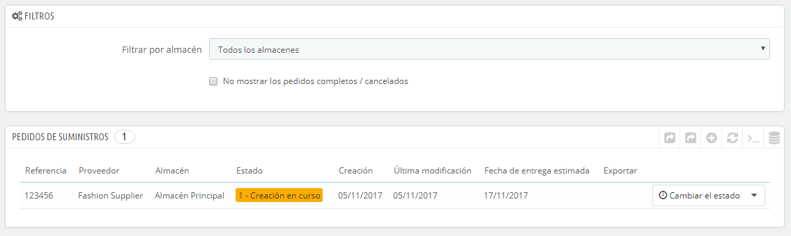

# Presentación de la interfaz back-office para gestionar el stock

/\*\<!\[CDATA\[\*/\
div.rbtoc1597066534944 {padding: 0px;}\
div.rbtoc1597066534944 ul {list-style: disc;margin-left: 0px;}\
div.rbtoc1597066534944 li {margin-left: 0px;padding-left: 0px;}\
\
/\*]]>\*/

* [Presentación de la interfaz back-office para gestionar el stock](presentacion-de-la-interfaz-back-office-para-gestionar-el-stock.md#Presentacióndelainterfazback-officeparagestionarelstock-Presentacióndelainterfazback-officeparagestionarelstock)
  * [Gestionar el stock desde la página del producto](presentacion-de-la-interfaz-back-office-para-gestionar-el-stock.md#Presentacióndelainterfazback-officeparagestionarelstock-Gestionarelstockdesdelapáginadelproducto)
  * [Gestionar almacenes](presentacion-de-la-interfaz-back-office-para-gestionar-el-stock.md#Presentacióndelainterfazback-officeparagestionarelstock-Gestionaralmacenes)
  * [Gestión de existencias](presentacion-de-la-interfaz-back-office-para-gestionar-el-stock.md#Presentacióndelainterfazback-officeparagestionarelstock-Gestióndeexistencias)
  * [Movimiento de existencias](presentacion-de-la-interfaz-back-office-para-gestionar-el-stock.md#Presentacióndelainterfazback-officeparagestionarelstock-Movimientodeexistencias)
  * [Estado actual del stock de productos](presentacion-de-la-interfaz-back-office-para-gestionar-el-stock.md#Presentacióndelainterfazback-officeparagestionarelstock-Estadoactualdelstockdeproductos)
  * [Cobertura de stock](presentacion-de-la-interfaz-back-office-para-gestionar-el-stock.md#Presentacióndelainterfazback-officeparagestionarelstock-Coberturadestock)
  * [Pedidos de suministros a proveedores](presentacion-de-la-interfaz-back-office-para-gestionar-el-stock.md#Presentacióndelainterfazback-officeparagestionarelstock-Pedidosdesuministrosaproveedores)
  * [Configuración](presentacion-de-la-interfaz-back-office-para-gestionar-el-stock.md#Presentacióndelainterfazback-officeparagestionarelstock-Configuración)

Gestionar el stock es esencial desde el momento en el que empiezas a vender tus productos, ya que las cantidades en existencia de los productos se agotan en cada venta que se realiza.\
Para asegurarte si realmente necesitas utilizar la funcionalidad de la gestión avanzada de stock de PrestaShop, consulta el anterior capítulo "Conceptos generales": [http://doc.prestashop.com/display/PS16/Conceptos+Generales](http://doc.prestashop.com/display/PS16/General+Concepts).

Si deseas utilizar la gestión avanzada de stock, debes:

* Asociar tus productos a los almacenes.
* Asociar tus almacenes a los transportistas.
* Asociar tus almacenes a las tiendas correspondientes.

Gestionar el stock dentro de PrestaShop se realiza a través de varias pantallas, pudiendo utilizar uno de los dos niveles disponibles.

Estos niveles son:

* No gestionar el stock: no hay cantidades de productos, PrestaShop asume que las cantidades en stock de un producto son ilimitadas. Utiliza esta opción si tan sólo vendes productos virtuales (archivos, servicios, etc.).
* Gestionar el stock en modo Simple: para cada producto que vendas, puedes indicar la cantidad disponible actualmente (incluyendo las combinaciones de los productos). Utiliza esta opción si tienes pocos productos o un sólo almacén.
* Gestionar el stock en modo Avanzado: para cada producto que vendas (y sus combinaciones), puedes indicar dónde se encuentran las cantidades disponible en un número ilimitado de almacenes (con diversos transportistas y métodos de valoración). También puedes visualizar tus movimientos de stock, el estado actual de tu stock, tu cobertura de stock, y hacer un pedido a tus proveedores de productos.

Estas pantallas son:

* Preferencias > Productos > Stock de productos: aquí es donde se activa la funcionalidad.
  * **Habilitar la gestión de stock**. Esta opción te permite acceder a las opciones y funcionalidades básicas del gestor de stock: puedes establecer la cantidad de unidades actuales disponibles de productos, y que PrestaShop se encargue de decrementar esta cantidad por cada perdido que se realice, y de reponer las unidades al stock para cada pedido cancelado o devuelto. De manera predeterminada, se debe dejar esta función activada, ya que al desactivarla se ve afectada completamente la gestión del stock de tu tienda. Tan solamente debes desactivar esta funcionalidad si no dispones de stock físico – por ejemplo, si solamente vendes productos virtuales.
  * **Habilitar la administración avanzada de stock**. Otra pequeña opción que tiene importantes implicaciones: ésta añade un nuevo menú denominado "Stock", que hace que sea posible gestionar de manera muy precisa las unidades en stock de tus productos, incluso por almacenes si es necesario. Puedes ver todos los detalles acerca de tus unidades en existencia: movimientos, cobertura, reposición de existencias, etc. Puedes obtener mayor información sobre la funcionalidad de la gestión avanzada de stock de PrestaShop en el capítulo "Gestion avanzada de Stock" de esta guía.
  * **Los productos nuevos usan la gestión avanzada de stock**. Si habilitas esta funcionalidad, los nuevos productos utilizarán automáticamente la función avanzada de gestión de stock. El almacén predeterminado es el que se indica en la siguiente opción.
  * **Almacén predeterminado en productos nuevos**. Si los nuevos productos utilizan automáticamente la funcionalidad avanzada de la gestión del stock, tienes que establecer tu almacén por defecto en este campo.
* Catálogo > Productos > página de producto: una o dos pestañas son añadidas a la página de creación / edición de un producto:
  * &#x20;Cantidades:
    * En modo Simple: puedes indicar manualmente la cantidad de cada producto.
    * En modo Avanzado: las cantidades son gestionadas desde el menú "Stock" de PrestaShop.
  * Almacenes: En modo Avanzado, puedes indicar la ubicación de un producto o sus combinaciones dentro de un almacén.
* Existencias de Stock: En modo Avanzado, puedes hacer uso de todas las páginas de gestión de existencias (creación de almacenes, movimiento de stock, estado de existencias, cobertura de stock, pedidos a proveedores).

La siguiente sección describe estas páginas una por una.

## Gestionar el stock desde la página del producto 

### Gestionar cantidades 

En PrestaShop 1.4, podías establecer manualmente las cantidades de los productos disponibles a la venta en tu tienda.

En PrestaShop 1.5, todavía puedes establecer manualmente las cantidades de productos disponibles para cada producto. Pero una vez se active el gestor avanzado de stock, también puedes automáticamente determinar esta cantidad en función de las cantidades físicas existentes para cada producto. Ten en cuenta que es posible habilitar globalmente la gestión avanzada de stock, aunque sólo utilices ésta para uno o varios productos.

Cuando la opción "Activar el manejo automático del inventario" está activa, todos los productos tienen una nueva pestaña en su página de administración, llamada "Cantidades". Esta interfaz clara y sencilla,  permite gestionar las cantidades disponibles para la venta en tu(s) tienda(s) para un producto específico, y todas sus posibles combinaciones.

Con sólo esta opción habilitada, puedes gestionar las cantidades de productos de los productos individuales, una por una.

Si prefieres que las cantidades de todos tus productos sean gestionadas directamente utilizando la funcionalidad de la gestión avanzada de stock de PrestaShop y desde las páginas de tus productos, tienes que habilitar la otra opción disponible en la página "Preferencias > Productos: "Activar la administración avanzada de stock".

Se abre con una sección explicativa, que te recomendamos que leas completamente. Esa sección es seguida por la propia interfaz de gestión de cantidades disponibles, que se abre con tres opciones:

* **Quiero utilizar el sistema de gestión avanzada de stock para este producto**.
* **Cantidades disponibles para el producto actual y sus combinaciones están basadas en el stock de tus almacenes**.
* **Quiero especificar manualmente las cantidades disponibles**.

De manera predeterminada, la tercera opción ("Quiero especificar las cantidades disponibles manualmente") se encuentra activa. Siempre y cuando no marques la primera opción ("Quiero utilizar el sistema de gestión avanzada de stock para este producto"), las cantidades son gestionadas de la misma manera en que eran gestionadas en la versión 1.4 de PrestaShop, lo que significa que tendrás que añadir manualmente las cantidades, y PrestaShop eliminará las cantidades que vendas.

Si prefieres sincronizar las cantidades disponibles con las existencias disponibles en tu almacén, tienes que cambiar el método de gestión de cantidades:

1. Marca la casilla "Quiero utilizar el sistema de gestión avanzada de stock para este producto" para cambiar el método.
2. Esta acción hace que la segunda opción, "Cantidades disponibles para el producto actual y sus combinaciones están basadas en el inventario de tus almacenes", pase a estar disponible. Selecciona esta opción para sincronizar la cantidad disponible de este producto con el stock de tu almacén.

Tan pronto como hayas seleccionado la segunda opción, la columna "Cantidad" de la tabla dejará de ser modificable: las cantidades son ahora gestionadas a partir de tu stock.

Los packs de productos son un caso especial. Dado que no es posible añadir combinaciones de productos a un pack, los desarrolladores PrestaShop han decidido que, cuando sea necesario, PrestaShop utiliza la combinación predeterminada para decrementar las existencias físicas.

Además, un aviso indica el número máximo recomendado de packs.

El resto de esta página se explica en el capítulo "Añadir Productos y Categorías de productos" de esta guía.

### Gestión de proveedores 

Ahora puedes establecer más de un proveedor para un producto determinado. Para cada proveedor asociado a un producto, puedes establecer el número de referencia del proveedor y un precio de compra predeterminado para ese producto, así como a su combinación. Esta información se utiliza cuando se realiza un pedido al proveedor.

### Gestión de almacenes 

Si el gestor avanzado de stock está habilitado, una pestaña "Almacenes" se muestra en la ficha del producto, donde puedes especificar en qué almacén(es) se encuentra el producto y cada una de sus combinaciones. También puedes especificar la ubicación del producto y sus combinaciones.

Primeramente, deberás crear al menos un almacén (se explica más adelante), antes de asociar un producto a éste y establecer la ubicación del producto en este almacén. Este paso es esencial: es importante para establecer al menos un almacén en el que un producto pueda ser almacenado. Esto tendrá un enorme impacto en la preparación de pedidos en el contexto multi-envío.

## Gestionar almacenes 

El gestor avanzado de stock hace que sea posible la creación de uno o más almacenes. Para crear uno, dirígete a la página "Almacenes" bajo el menú "Stock".

Para crear un nuevo almacén, debes rellenar los siguientes campos:

* **Referencia** y **Nombre**. El identificador de referencia único para el almacén y su nombre. Asegúrate de utilizar un nombre reconocible e identificativo: ya que deberás diferenciar fácilmente a los almacenes disponibles en una lista desplegable.
* **Direcciones**, **Código Postal/Zip**, **Ciudad** y **País**. La dirección física del almacén. Esta información será utilizada para realizar pedidos a tus proveedores.
* **Administrador**. La persona que está a cargo del almacén, selecciona uno de los empleados registrados en tu tienda. Si la cuenta de ese empleado no ha sido creada todavía, debes crear ésta antes que nada.
* **Transportistas**. Los transportistas que están autorizados para enviar pedidos a este almacén. Mantén presionada la tecla "Shift" para seleccionar más de un transportista.
* **Tipo de administración**. Un método de valoración contable, en base a la normativa de tu país. Consulta la sección "Método de valoración" de este capítulo para obtener más información.
* **Moneda para la valoración del stock**. Una moneda para valorar el stock de este almacén (a elegir entre las monedas registradas).

No es posible cambiar el método de valoración, ni la moneda utilizada de un almacén una vez establecida. Si necesitas cambiar esta información, deberás volver a crear el almacén, y eliminar el erróneo.\
Solamente puedes eliminar un almacén si no contiene ningún producto.

Debes tener cuidado con los transportistas que elijas a autorizar enviar pedidos, ya que esto tendrá un enorme impacto en la preparación de pedidos en el contexto multi-envío.

En el caso que gestiones más de una tienda, también tendrás que asociar cada tienda a uno o varios almacenes. Esto te permite definir desde qué almacén serán enviados los pedidos de los clientes de una tienda determinada.

Una vez el almacén ha sido creado, serás redirigido automáticamente al listado de almacenes. Haz clic en la acción "Ver" situada a la derecha de cada fila para obtener una visión general de tu información, incluyendo las referencias de todos los productos almacenados en el almacén, la suma de todas las cantidades disponibles, una valoración global de las existencias, detalles de los productos almacenados, y el historial de movimientos de ese almacén.

Cada página del almacén también contiene dos enlaces en la parte inferior:

* **Ver detalles de todos los productos**. Te dirige a la página "Estado actual del stock" del almacén seleccionado.
* **Ver los detalles de la actividad del almacén**. Te dirige a la página "Movimientos de stock" del almacén seleccionado.

## Gestión de existencias 

Ahora que has creado uno o más almacenes, tienes que fijar el stock de cada uno de ellos. Para hacerlo, dirígete a la página "Gestión de stock" bajo el menú "Stock".

Todos los productos disponibles en tu catálogo figuran en esta interfaz. Si tienes cualquier combinación de producto, puedes gestionarla a través del botón de acción "Datos (Detalles)".

Puedes realizar ciertas acciones manualmente a través de esta interfaz:

* **Añadir existencias**. Este botón añade existencias a un producto específico en un almacén determinado.
* **Eliminar existencias**. Este botón elimina existencias a un producto específico en un almacén determinado.
* **Transferir existencias**. Este botón transfiere existencias de un almacén a otro.

Las dos últimas acciones sólo aparecen si ya existen unidades en existencia del producto seleccionado en cualquiera de los almacenes.\
La acción "Transferir existencias" sólo aparece si tienes al menos dos almacenes registrados.

### Añadir existencias a un almacén 

Para añadir más existencias a un producto, utiliza el botón de acción "Añadir stock" (flecha hacia arriba) en el producto o variación del producto deseado. Una nueva página se abre, conteniendo un formulario donde se muestra la información más importante con el fin de ayudarte a identificar un producto con certeza (referencia, EAN13, su código UPC, y su nombre). Esta información no puede ser modificada desde este formulario, de ahí que los campos se encuentren en un color gris.

A continuación, debes especificar:

* **Cantidad a añadir**. Este número debe ser positivo. No puedes eliminar existencias utilizando un número negativo.
* **¿Utilizable para venta?**. Si dicha cantidad está destinada para la venta, o simplemente será almacenada hasta que tomes una decisión sobre ella. En el segundo caso, ésta es considerada como "reservada".
* **Almacén**. El almacén donde este stock será añadido. El formulario tan solamente te permite añadir stock para un producto en una sola tienda al mismo tiempo. Si necesitas añadir stock de este producto en más de un almacén, debes repetir este proceso para cada almacén.
* **Precio unitario (impuestos excl.)**. El precio unitario para el producto en el momento de la adición. Este precio se utiliza para la valoración de las existencias.
* **Moneda**. La moneda utilizada para el precio unitario. Si la moneda no está disponible, puedes crear una desde la página "Monedas", bajo el menú "Localización", o importarla desde la página "Localización" bajo el menú "Localización", importando el paquete de localización del país donde se utilice esta divisa que deseas utilizar.
* **Etiqueta**. Una etiqueta para el movimiento del stock que estás generando, para futuras consultas. Esta es puramente informativa.

Al posicionar el cursor del ratón sobre los campos "Cantidad a añadir" y "Precio unitario (impuestos excl.)", la interfaz mostrará un recordatorio de los últimos valores introducidos.

### Eliminar existencias de un almacén 

Cuando quieras eliminar una cierta cantidad de stock de un producto, debes utilizar la acción "Eliminar existencias" (flecha hacia abajo, disponible tan solamente cuando tiene unidades en existencia para dicho producto). Una nueva página se abre, conteniendo un formulario donde se muestra la información más importante con el fin de ayudarte a identificar un producto con certeza (referencia, EAN13, su código UPC, y su nombre). Esta información no puede ser modificada desde este formulario, de ahí que los campos se encuentren en un color gris.

A continuación, debes especificar:

* **Cantidad a eliminar**. Este número debe ser positivo. No puede eliminar existencias utilizando un número negativo.
* **¿Utilizable para la venta?**. Si esta cantidad debe ser eliminada de la cantidad utilizable o de toda la cantidad física (incluyendo la reservada).
* **Almacén**. De qué almacén esta cantidad debe ser eliminada. El formulario tan solamente te permite eliminar stock para un producto en una sola tienda al mismo tiempo. Si necesitas eliminar stock de este producto en más de un almacén, debes repetir este proceso para cada almacén.
* **Etiqueta**. Una etiqueta para el movimiento del stock que estás generando, para futuras consultas. Ésta es puramente informativa.

### Transferir existencias de un almacén a otro 

La transferencia de existencias te permite transferir stock de un almacén a otro, o de un estado a otro (utilizable en tienda / reservado) dentro de un único almacén. Haz clic en el botón de acción "Transferir existencias" (flechas hacia la derecha e izquierda, disponible tan solamente cuando tienes unidades en existencia para dicho producto). Una nueva página se abre, conteniendo un formulario donde se muestra la información más importante con el fin de ayudarte a identificar un producto con certeza (referencia, EAN13, su código UPC, y su nombre). Esta información no puede ser modificada desde este formulario, de ahí que los campos se encuentren en un color gris.

A continuación, debes especificar:

* **Cantidad a transferir**. Este número debe ser positivo.
* **Almacén de origen**. El almacén desde el cual quieres transferir algunos productos, o donde quieres cambiar el estado de algunas de las existencias.
* **¿Es utilizable para la venta en el almacén de origen?**. Si la cantidad a eliminar en el almacén "origen" debe ser de las existencias "utilizables para la venta" o de las existencias "reservadas".
* **Almacén de destino**. El almacén al que quieres transferir algunos productos. Si tan sólo quieres cambiar el estado de algunas de las existencias de tu almacén de origen, asegúrate de seleccionar el mismo almacén en este formulario.
* **¿Es utilizable para la venta en el almacén de destino?**. Si la cantidad a añadir en el almacén "destino" deben ser "utilizables para la venta" o "reservadas". Esta es también la opción a utilizar cuando simplemente quieres cambiar el estado de algunas de las existencias en el almacén de origen:\

  * Si no deseas cambiar el estado cuando hace transferencias entre dos almacenes: asegúrate de seleccionar la misma opción "¿Utilizable para la venta?" en ambos campos.
  * Si deseas cambiar el estado, ya sea dentro del mismo almacén o incluso al realizar transferencias entre dos almacenes: asegúrate de seleccionar opciones diferentes en los campos "¿Utilizable para la venta?".

Todas las operaciones relacionadas con las valoraciones son gestionadas de manera automática mediante el método de gestión de cada almacén. Las conversiones de moneda funcionan de la misma manera.

## Movimiento de existencias 

Esta interfaz te permite visualizar el historial de movimientos de existencias. Puedes visualizar todos los movimientos de las existencias, o solamente aquellos movimientos relacionados a un almacén. Puedes aplicar filtros para refinar tu búsqueda.

Cuando la lista desplegable "Filtrar movimientos por almacén" se establece en un almacén, puedes realizar una exportación CSV del listado obtenido.

## Estado actual del stock de productos 

Esta interfaz te permite obtener una visión instantánea de tu stock actual, ya sea de manera global o por almacén. Los números están actualizados.

Para cada producto o combinación de productos en stock, los indicadores siguientes están disponibles:

* Precio unitario (impuestos excl.).
* Valoración del producto en función de la cantidad física disponible. La suma (para todos los precios) no está disponible para todos los almacenes, por favor, fíltralas por almacén.
* Cantidad física disponible.
* Cantidad que es utilizable para la venta.
* Cantidad real (cantidad física utilizable  - pedidos de clientes + pedidos de suministros).

En tu caso, y en función del método de valoración elegido, el desglose de los precios unitarios y de las valoraciones asociadas está disponible haciendo clic en la acción "Detalles".

Por otra parte, para un almacén determinado, tienes dos maneras de exportar la lista actual en formato CSV:

* Exportar los indicadores vinculados a las cantidades.
* Exportar los indicadores vinculados a la valoración (precios).

## Cobertura de stock 

Esta interfaz te permite supervisar la cobertura de stock. La cobertura indica el número de días que previsiblemente tu stock estará disponible antes de quedarte sin existencias. Esta información es muy útil, ya que te ayuda a predecir de antemano los suministros que debes pedir a tus proveedores antes de que se acaben las existencias de un producto. La cobertura es calculada en función a los movimientos de existencias registrados previamente en tu tienda.

Puedes obtener la cobertura de existencias de todos los almacenes, o solamente la de un almacén determinado.\
&#x20;También puedes establecer el período de tiempo (una semana, dos semanas, tres semanas, un mes, seis meses, un año) del movimiento de existencias registrado que ha de ser tenido en cuenta en el cálculo de la cobertura.\
Por último, puedes resaltar cuando la cobertura de existencias es menor a un determinado número de días. Esto hará destacar los productos más relevantes, ayudándote a identificarlos más rápidamente.

Para visualizar la cobertura de existencias de las combinaciones de productos, pudes hacer clic en el botón de acción "Detalles" del producto.

Es posible recibir notificaciones de la cobertura de existencias de un producto. El módulo de notificación por correo electrónico (alertas por correo electrónico), ha sido actualizado para que tenga en cuenta la cobertura de existencias de tus productos. Por tanto, puedes establecer el recibir una notificación si la cobertura de existencia de un producto está por debajo de un determinado número. Revisa la configuración de este módulo.

## Pedidos de suministros a proveedores 

Una de las características principales del gestor de existencias es la capacidad de hacer pedidos a los proveedores para gestionar de una manera más eficaz el proceso de reposición de stock.\
&#x20;Esta interfaz te permite gestionar todos tus pedidos a los proveedores, así como reutilizar las plantillas de los pedidos realizados.

El proceso de creación de plantillas de pedidos  es el mismo que el proceso de creación de pedidos (excepto por el campo "Fecha estimada de envío"). A continuación, se explicará el proceso de creación de pedidos.

### Crear un nuevo pedido 

La creación de un pedido a un proveedor consta de dos pasos: crear el pedido, a continuación, añadir los productos para este pedido.

Comenzaremos por definir la información del pedido:

* Establece un número de referencia único. Esta es una referencia administrativa; no establezcas simplemente un número.
* Selecciona el proveedor. Si el proveedor que deseas utilizar, no se encuentra en la lista desplegable, debes crearlo en la página "Proveedores", bajo el menú "Catálogo".
* Selecciona el almacén donde deseas enviar el pedido. Debes tener creado al menos un almacén.
* Selecciona la moneda en la que se formalizará el pedido. Si lo necesitas, puedes crear o importar una moneda utilizando, respectivamente, la página "Monedas" o "Localización" bajo el menú "Localización".
* Selecciona el idioma en el que el pedido será formalizado. Si lo necesitas, puedes crear o importar un idioma utilizando, respectivamente, la página "Idiomas" o "Localización" bajo el menú "Localización".
* Si lo necesitas, establece el descuento global para el pedido (en porcentaje). Puedes simplemente dejarlo en "0" si no tienes un descuento para este pedido.
* Si lo necesitas, establece la cantidad física de un producto por debajo de la cual todos los productos deben ser repuestos, y por tanto éstos serán añadidos de forma automática al pedido. Cada producto pre-añadido será pedido con una cantidad igual a la cantidad introducida, restada de la cantidad ya disponible.
* Establece la fecha estimada de entrega.

El segundo paso consiste en añadir los productos al pedido. Para realizar este segundo paso, puedes:

* Hacer clic en el botón "Guardar pedido y permanecer".
* Hacer clic en el botón "Guardar pedido". Serás redirigido al listado de pedidos de suministros: haz clic en el botón de acción "Modificar" del pedido que acabas de crear.

La interfaz del formulario de creación de pedidos ha sido actualizada con un segundo formulario presentado bajo los campos previamente rellenados. Debes utilizar ese segundo formulario para añadir productos a tu pedido, utilizando el motor de búsqueda integrado. Los productos que añadas aparecen en un nuevo listado.

Para cada producto, debes establecer o actualizar el precio unitario de compra (impuestos excl.), la cantidad a pedir, cualquier posible tasa de impuestos, y cualquier eventual descuento del producto.

Una vez el pedido ha sido creado, éste aparece listado con el estado "Creación en curso". Este estado te permite visualizar y editar la información que hayas introducido previamente, así como añadir productos al pedido. No podrás realizar ninguna modificación al pedido cuando cambies su estado a "Pedido validado".

Es imposible eliminar un pedido de suministro: tan solamente puedes cancelarlo.

Una vez creado el pedido, deberás continuar con el proceso, indicando los cambios de estado en la interfaz de PrestaShop. Esto es lo que el primer botón de acción ("Cambiar estado") realiza: haz clic sobre éste para acceder al formulario de cambio de estado. Consulta la sección "Cambiar el estado del pedido a un proveedor" que encontrarás un poco más abajo para obtener mayor información sobre los estados disponibles.

El icono "+" disponible en el listado de pedidos de suministros muestra el historial de pedidos, lo que te permite comprobar qué empleado los hizo y cuándo lo hizo.

### Crear una plantilla de pedido de suministros 

La utilidad de crear una plantilla es que ésta sirva de base para generar nuevos pedidos.

El proceso de creación de plantillas para pedidos de suministros es el mismo que el procedimiento de realizar un pedido real, excepto que:

* No es necesario especificar una fecha de entrega prevista.
* El valor "Cargar automáticamente los productos" será la cantidad a pedir para los productos cargados, y no la diferencia entre las existencias y el valor introducido.

Por otra parte, a diferencia de un pedido ordinario de suministro:

* Una plantilla no tiene un estado.
* Una plantilla puede ser eliminada.
* Una plantilla no tiene un historial de cambios.

Una vez creada una plantilla, tan solamente necesitas utilizar la acción "Utilizar esta plantilla para crear un pedido de suministros" desde el listado de plantillas (el icono "dos ventanas") para empezar a crear un pedido.

### Cambiar el estado de un pedido de suministros 

Cada pedido tiene varias acciones disponibles (en la columna "Acciones" del listado de pedidos). Una de ellas te permite modificar el estado: la que reza como "Cambiar estado". Hay seis posibles estados predeterminados, pero puedes añadir otros si lo deseas (consulta la sección "Configuración" de este capítulo).

Los códigos de color del estado de un pedido te ayudan a conocer en un simple vistazo los movimientos de tus existencias. Estos son los significados de los 6 códigos de colores disponibles de manera predeterminada:

1. **Creación en curso**. Este primer estado aparece tras crear el pedido. En este primer paso todavía puedes modificar el pedido creado.
2. **Pedido validado**. Este estado valida el pedido y congela la información que contiene (precio de la compra, cantidades, etc.). En este paso, una nueva acción aparece en la columna "Acciones", que te permite editar la factura que es enviada al proveedor en formato PDF.
3. **Pendiente de recepción**. Tan pronto como el proveedor haya recibido y validado tu factura, tienes que cambiar el estado del pedido de suministros a "A la espera de la recepción".
4. **Pedido recibido parcialmente**. Tan pronto como se realice la entrega, debes cambiar el pedido a este estado. Como tu pedido puede realizarse en varias entregas, el historial de pedidos registra cada producto entregado. En cada entrega que se realice, las existencias son incrementadas automáticamente.
5. **Pedido recibido completamente**. Una vez el pedido ha sido recibido completamente, o parcialmente en caso de que realices una cancelación parcial, debes cambiar el pedido a este estado. Las existencias no se ven afectadas en este caso, y es posible llevar a cabo acciones en el pedido.
6. **Pedido cancelado**. Este es el estado  que debes otorgar a los pedidos cancelados, por cualquier razón. Las existencias no se ven afectadas en este caso, y no es posible llevar a cabo acciones en el pedido.

En cada cambio de estado, el selector desplegable de estado evoluciona con el fin de presentar tan sólo los posibles cambios de estado, en función del estado actual. Los estados que no están permitidos seleccionar se muestran en color gris.

### Detalles de un pedido de suministros 

Al hacer clic en el botón de acción "Ver" de la lista de pedidos de suministro, se muestra una visión sintética de tu pedido.\
También puedes descargar la factura generada como un archivo PDF (siempre y cuando el pedido sea validado por ti mismo), desde el listado de pedidos o desde la página de cambios de estado.

El botón de acción "Detalles", te permite visualizar el historial de cambios de estado del pedido actual.

### Registrar la recepción de productos 

Debes cambiar el estado de tus pedidos de suministro en PrestaShop tan pronto como estas acciones se produzcan en el mundo real. Esto se realiza utilizando el icono "Cambiar estado" en la columna "Acciones" del listado de pedidos. El formulario en esta página siempre pre-selecciona el siguiente estado lógico, pero eres libre de elegir cualquiera de los otros estados disponibles.

Mientras estés preparando el pedido de suministro, mantén su estado en "Creación en progreso". Una vez que hayas terminado de preparar el pedido, cambia este estado a "Pedido validado", a continuación, imprime la factura PDF y enviala a tu proveedor. Tan pronto como tu proveedor confirme la recepción de la factura, cambia el estado a "A la espera de la recepción".

Durante los estados "A la espera de la recepción" y "Pedido recibido en parte", una nueva acción estará disponible en la columna "Acciones". Utilizando el icono de "camión de transporte", la acción "Actualizar la recepción de productos en curso", te permite registrar la recepción de los productos para un determinado pedido durante ese día.\
El formulario que se presenta tras hacer clic en la acción del "camión de transporte", te permite visualizar cuáles y cuántos artículos se esperan, e indicar la cantidad de unidades entregadas de cada producto en ese día. Haz clic en el botón "Actualizar seleccionados" para marcar los productos seleccionados como recibidos con el número de unidades indicado en el campo "¿Cantidad recibida hoy?". La casilla de verificación disponible a la izquierda de cada fila debe ser marcada para que PrestaShop tenga esa línea en cuenta.

Este paso se puede realizar tantas veces como sea necesario, y es posible recibir e incorporar más existencias de las previstas.

Si recibes menos existencias de lo esperado, PrestaShop cambia automáticamente el estado del pedido a "Pedido recibido en parte".

Para cada producto, un historial de recepción está disponible (acción "+"), así como un indicador de la cantidad recibida, la cantidad esperada, y la cantidad pendiente. Si la "cantidad recibida" es igual a la "cantidad esperada", la fila correspondiente es resaltada y destacada en color verde. Si has recibido más unidades de las que se esperaba, el color de esta fila será rojo.

Cuando todos los productos del pedido hayan sido recibidos, debes cambiar manualmente el estado del pedido de suministros a "Pedido recibido completamente". Este estado finaliza el proceso de recepción de suministros, y hace que una nueva acción aparezca: "Exportar" (con un icono de Microsoft Excel), que puedes utilizar para descargar un archivo CSV de toda la información relativa a ese pedido.

### Exportar CSV 

Utilizando la interfaz de pedidos de suministros, puedes filtrar el listado de pedidos o los detalles de estos pedidos para así poder exportarlos, de acuerdo a los filtros seleccionados (referencia, proveedor, etc.).\
&#x20;Además, puedes optar por no mostrar los pedidos que han sido completados o cancelados, utilizando la casilla correspondiente.

## Configuración 

La página configuración te permite personalizar la manera en las que trabaja ciertas partes del gestor avanzado de existencias:

* Los estados disponibles para un pedido a un proveedor.
* Las etiquetas de los movimientos de existencias.
* Los estados predeterminados para algunos movimientos de existencias que son utilizados de manera estándar por la solución.

### Añadir un nuevo estado de pedido de suministros predeterminado 

Puedes añadir estados personalizados correspondientes a tu línea de negocio. No puedes eliminar ningunos de los estados ya predeterminados por la instalación de PrestaShop.

El listado de la página principal, te permite obtener una mejor perspectiva de los estados disponibles, y cómo ellos pueden impactar a un pedido.

Haz clic en el botón "Añadir nuevo" para abrir el formulario de creación.

Un estado tiene una etiqueta, un color, y te permite definir si:

* El pedido puede ser editado. Cuando un pedido es editable, éste no puede ser enviado al proveedor.
* La nota de entrega del pedido puede ser generada.
* La recepción del producto está en curso, lo que significa que todavía no has recibido todos los productos solicitados.
* La entrega del producto está pendiente, lo que significa que te encuentras a la espera de la llegada de cualquier producto.

### Añadir una etiqueta al movimiento de existencias 

Es posible añadir más etiquetas al movimiento de existencias. Haz clic en el botón "Añadir nuevo" de la sección "Etiquetas de movimientos de existencias" para acceder al formulario de creación.

Simplemente tienes que otorgar un nombre a la etiqueta, e indicar si ésta se corresponde a un incremento o un decremento de las existencias. Estas etiquetas pueden ser utilizadas cuando añades/eliminas/transfieres existencias manualmente (como se explicó anteriormente).

### Modificar las etiquetas predeterminadas de los pedidos de suministro 

Es posible elegir las etiquetas predeterminadas de los pedidos de suministro en los siguientes casos estándares:

* Incrementar el stock (manualmente).
* Decrementar el stock (manualmente).
* Decrementar el stock tras enviar un pedido a un cliente.
* Incrementar el stock tras recibir un pedido de suministro por parte de tu proveedor.
