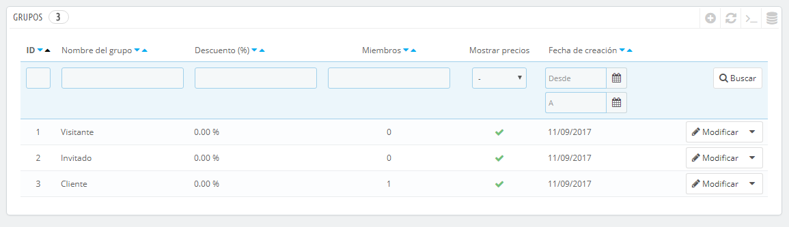
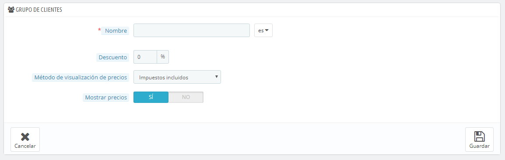
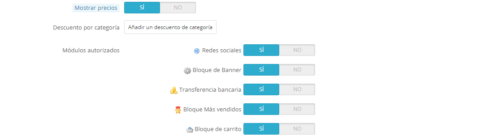
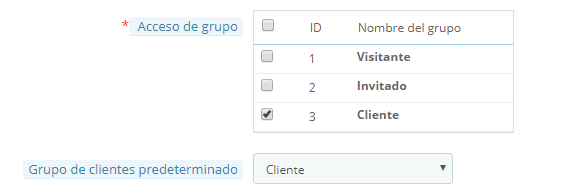

# Grupos de clientes

PrestaShop te permite otorgar a tus clientes ciertos privilegios, asignándolos a grupos. Puedes crear tantos grupos de clientes como sea necesario, y asignar un usuario a tantos grupos como desees.

Todo esto se realiza desde la página "Grupos", bajo el menú "Clientes".

De manera predeterminada, tres grupos especiales están disponibles:

* **Visitante**. Todas las personas que no tienen una cuenta de cliente o no se han autenticado.
* **Invitados**. Todas las personas que realizaron un pedido express con una cuenta de invitado – esta opción debe estar activada.
* **Clientes**. Todas las personas que han creado una cuenta en tu tienda, y se han autenticado.

Estos tres grupos no se pueden eliminar.

Para crear más grupos, haz clic en el botón "Añadir nuevo", tras realizar esta acción aparecerá el formulario de creación.

* **Nombre**. Establece un nombre corto y descriptivo.
* **Descuento (%)**. El descuento que se establece a los miembros de este grupo se aplica a todos los productos de tu tienda.\
  &#x20;Es posible que prefieras no establecer ningún valor de descuento, y crear reglas del carrito. Aprenderás más sobre las reglas del carrito en el siguiente capítulo de esta guía, "Crear Reglas de Precios y Cupones de descuento".
* **Método de visualización de precios**. PrestaShop se utiliza con frecuencia en el sector Business to Business (B2B). Puedes crear un grupo de clientes que pueden comprar productos sin tener que pagar el impuesto. La lista desplegable te permite elegir entre "impuestos incluidos" e "impuestos excluidos".
* **Mostrar precios**. De manera predeterminada, todos los usuarios de tu tienda pueden ver los precios. Quizás prefieras que algunos no tengan acceso a los precios de tus productos. Por ejemplo, podrías hacer que los usuarios sólo puedan ver los precios si tienen una cuenta: en el listado de grupos, haz clic en la marca de verificación de color verde en la columna "Mostrar precios" para el grupo de "Visitantes (Visitor)" para convertirla en una cruz roja.

Una vez que estos ajustes han sido configurados, puedes guardar el grupo tal como está, o añadir configuraciones por categoría y / o por módulo. En ese segundo caso, después de guardar el grupo, abre éste de nuevo: el formulario se cargará con dos opciones más:

* **Descuento por categoría**. Haz clic en "Añadir un descuento de categoría" para abrir una nueva ventana modal, que contiene un listado de todas tus categorías. Puedes seleccionar una de ellas, y aplicar un descuento específico que se aplicará solamente a ese grupo de clientes, y a esa categoría.\
  Ten en cuenta que:
  * Sólo los productos que tienen esta categoría como su categoría por defecto se verán afectados por el descuento. Los productos que tienen esta categoría como una categoría secundaria no se verán afectados.
  * Este descuento de categoría reemplazará cualquier otro descuento por categoría que tengan los miembros de este grupo.
  * Puedes añadir tantos descuentos de categoría para este grupo de clientes como necesites – permitiendo aplicar a este grupo todo un conjunto de diferentes descuentos, si es necesario.
* **Módulos autorizados**. Esta sección te permite bloquear miembros de este grupo a acceder y utilizar algunos de los módulos de tu tienda. Por ejemplo, es posible que prefieras que algunos clientes no puedan ver cuáles son tus productos más vendidos o tus productos en oferta.

\
Puedes añadir un cliente a un grupo de tu elección editando los detalles de un cliente: desde el listado de clientes (en la página "Clientes" bajo el menú "Clientes"), haz clic en el icono Modificar situado en la línea del cliente deseado. A continuación, en la tabla "Acceso de grupo", selecciona el grupo(s) al que pertenecerá el cliente. Si tienes asignado al cliente a más de un grupo, recuerda establecer su grupo principal, utilizando la opción "Grupo de clientes predeterminado".

