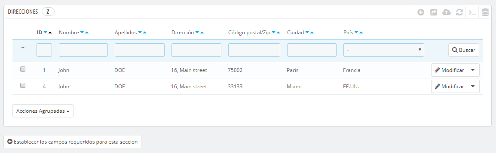
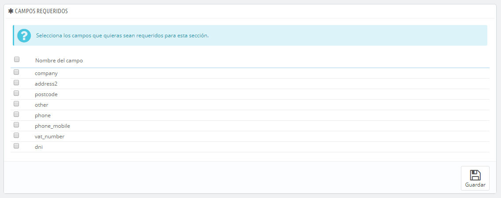
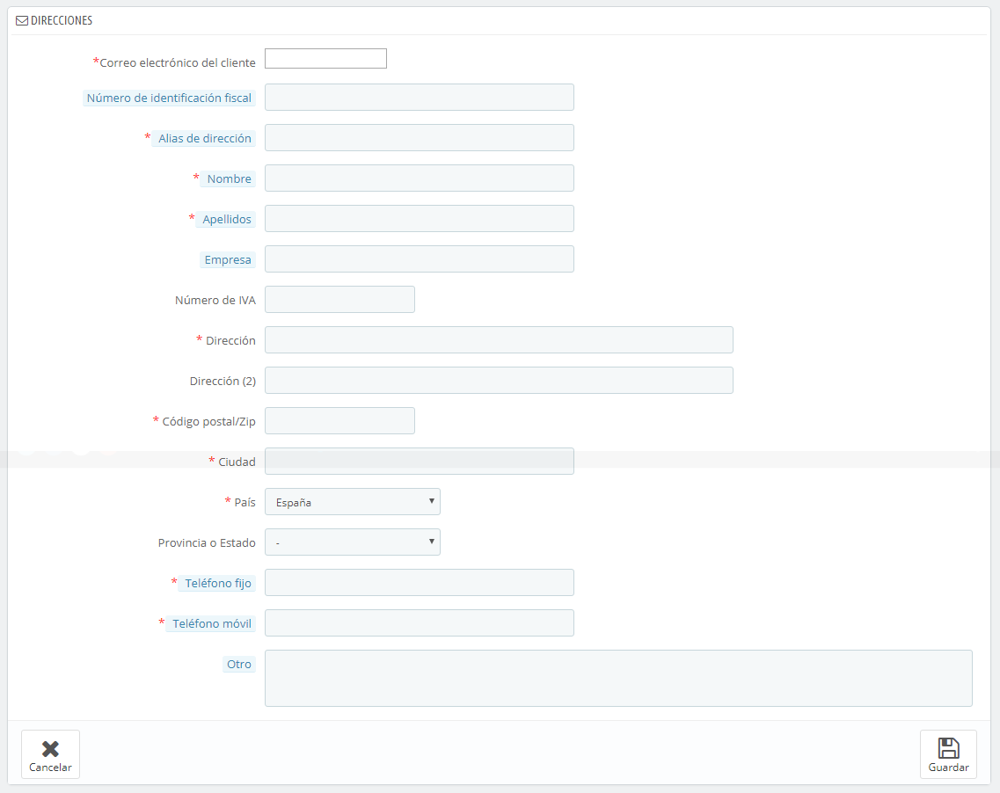

# PrestaShop 1.6 : Direcciones de clientes

Al hacer clic en la página "Direcciones", tendrás acceso al listado de domicilios de tus clientes (casa, trabajo, etc.). Puedes editar estas direcciones, utilizando el botón "Modificar", o eliminarlas definitivamente.

Bajo la tabla de direcciones se encuentra el botón "Establecer los campos requeridos para esta sección". Este botón abre un formulario desde el que puedes indicar si un campo de registro es requerido o no marcando las casillas adecuadas: de esta manera, puedes hacer que los campos "empresa" o "número de teléfono" sean obligatorios cumplimentarlos cuando un cliente esté registrando una nueva dirección en tu tienda.

## Añadir una nueva dirección 

Tienes la posibilidad de crear nuevas direcciones para un cliente utilizando el botón "Añadir nuevo". Al hacer clic en este botón se abre un nuevo formulario en pantalla.

Algunos campos, requieren un cuidado especial:

* **Correo electrónico del cliente**. Este campo es esencial: si estás añadiendo una dirección para un cliente existente, DEBES identificar a este cliente utilizando su dirección de correo electrónico. De lo contrario, PrestaShop no sabrá a quién asignar esta dirección.&#x20;
* **Número de identificación fiscal**. El documento nacional de identidad de esta persona, o número de identificación fiscal. Este campo es opcional.\
  Nota: el título del campo le da un toque singular: "DNI / NIF / NIE". Estos son acrónimos españoles: DNI representa las siglas de "Documento Nacional de Identidad", NIF representa las siglas "Número de Identificación Fiscal" y NIE representa las siglas "Número de Identidad/Identificación de Extranjero".
* **Alias de dirección**. Una descripción corta, con el fin de ayudar al cliente a elegir la dirección correcta: "Inicio", "oficina", "Tía Beth", etc.
* **Empresa**. El nombre de la empresa del cliente, si es necesario.
* **Número de IVA**. El número de identificación del IVA para el cliente (o la empresa del cliente).
* **Otro**. Alguna información adicional que pueda ser de utilidad para el envío.
