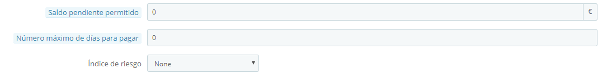
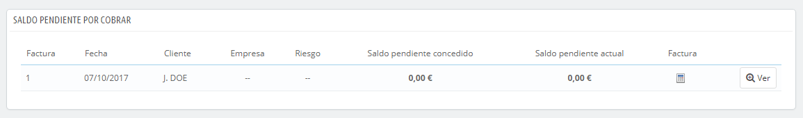

# Saldo pendiente por cobrar (B2B)

Esta página sólo está disponible cuando se habilita la funcionalidad B2B. Para hacer esto, dirígete a la página "Clientes" del menú "Preferencias", y selecciona "Sí" para la opción "Habilitar modo B2B".

Esta página muestra el saldo pendiente actual para algunos de tus clientes, es decir, la cantidad de dinero que permites gastar a un cliente para que compre productos en tu tienda, antes de que tenga que pagarte.

## Habilitar la funcionalidad de Saldo pendiente 

Cuando el modo de B2B está habilitado (Preferencias > página Clientes), tres campos son añadidos al formulario de creación de cliente:

* **Cantidad (Monto) máxima pendiente permitida**. La cantidad de dinero que esta empresa o cliente puede utilizar antes de pagarte.
* **Número máximo de días para pagar**. El número máximo de días que el cliente tiene para pagar su saldo pendiente.
* **índice (Calificación) de riesgo**. Tu calificación de riesgo para esta empresa o cliente: Ninguna (None), Baja (Low), Media (Medium) o Alta (High). Depende de ti decidir si un cliente es un benefactor arriesgado o si va a pagarte con seguridad a tiempo.

Debes rellenar estos campos para todos los clientes profesionales.

## Pantalla actual de saldos pendientes por cobrar 

Una vez que un cliente cuenta con saldo positivo para comprar en tu tienda, éste aparece en la página Clientes > Saldo pendiente por cobrar. Esta página te permite obtener una visión general de tus facturas actuales pendientes.

