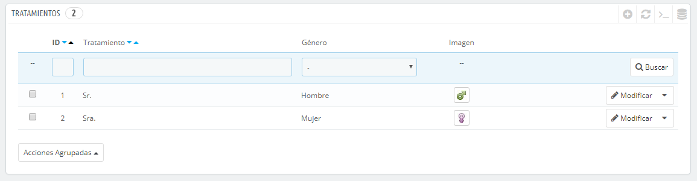
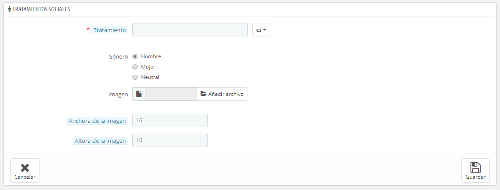

# Tratamientos (Títulos sociales)

El tratamiento o título social ayuda a definir mejor a tus clientes: en el listado de clientes, puedes optar por mostrar sólo los clientes que tengan un título social específico. Los módulos también pueden usar esta información del título social para proporcionar alguna funcionalidad determinada.

Haz clic en el botón "Añadir nuevo", esta acción te muestra el formulario de creación:

* **Tratamiento**. Puedes elegir cualquier cosa que se te ocurra, desde los más comunes como ("Caballero", "Dama", "Monseñor", etc.) a otros más inusuales como ("Maestro Jedi", "The Special One", "Cabeza de familia"...). Lo importante al apartarse de los títulos comúnmente aceptados es reflejar la verdadera identidad de tu tienda.
* **Género**. Algunos títulos sociales pueden aplicarse tanto a los clientes masculinos como a los femeninos. Asegúrate de ajustar esta opción a "Neutral" en ese caso.
* **Imagen**. Un archivo de imagen de tamaño 16\*16 que represente al título. Los símbolos de género habituales utilizados son los de Marte y Venus (♂ y ♀), pero hay muchas otras posibilidades. PrestaShop te permite caracterizar tu creación con una única imagen.
* **Anchura de la imagen** y **Altura de la imagen**. PrestaShop funciona mejor con imágenes de tamaño 16\*16, y redimensionará el tamaño detu imagen si es más grande. Sin embargo, puedes necesitar el uso de imágenes más grandes, y estas dos opciones te permiten configurar el tamaño exacto requerido para tu imagen. Si introduces "0", PrestaShop simplemente utilizará el tamaño original de la imagen.
