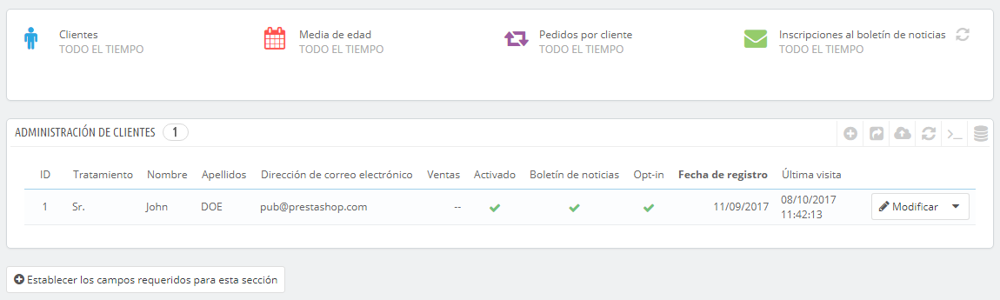
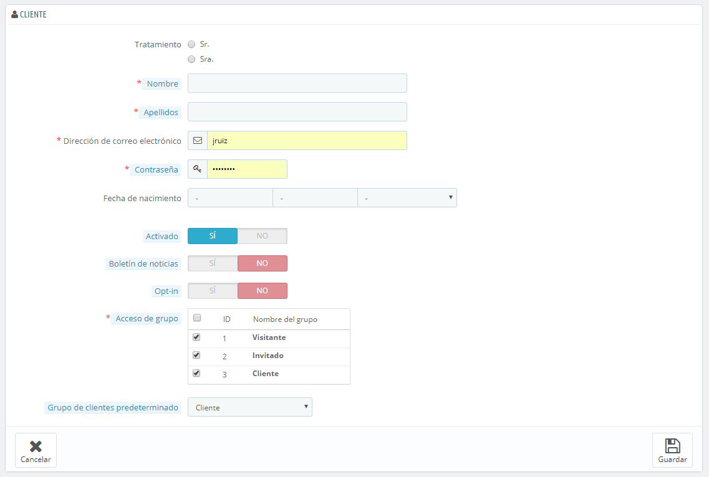
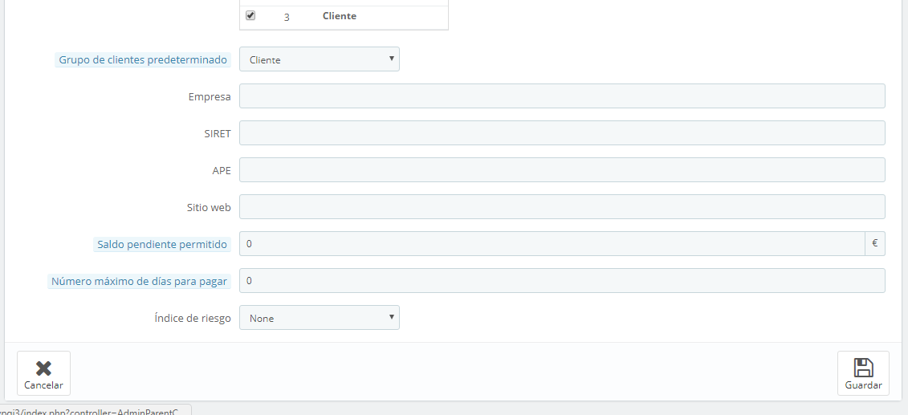
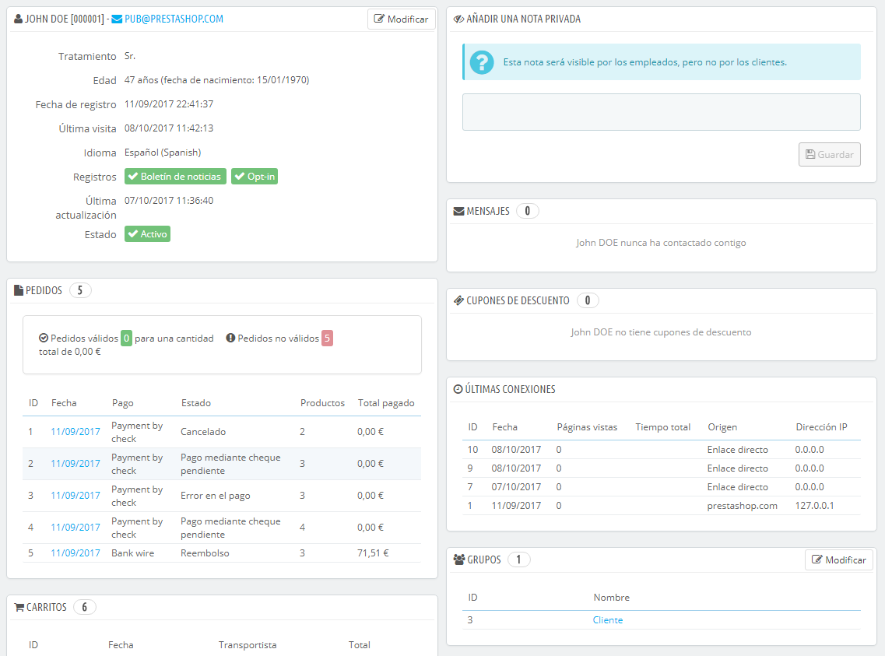
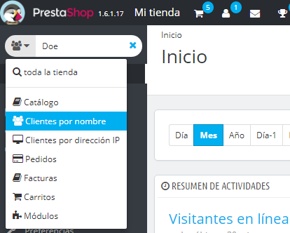
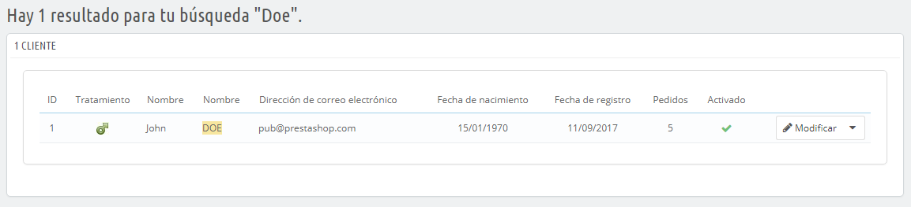
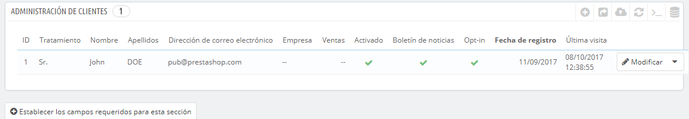

# Tus clientes

La primera página bajo el menú "Clientes" te ofrece un listado de todos los usuarios registrados en tu tienda.



Esta página te proporciona a vista de pájaro una visión general de todos tus clientes, con algunos datos que puedes utilizar para ordenar y buscar cuentas de cliente:

* **Tratamiento (Títulos Sociales)**. Los clientes pueden declarar su título social, que se corresponden a un género y que puede servirte de ayuda para darle una experiencia más personalizada a tus clientes. Hay dos títulos sociales predeterminados (Sr., y Sra.), pero puedes crear más en la página "Tratamiento (Títulos)" bajo el menú "Clientes".
* **Edad**. Para conocer y entender mejor a tus clientes, puedes controlar la edad media de los registrados en tu tienda, y los productos que son más adecuados ofertar según estos apuntes demográficos.
* **Activado**. Indica si el cliente está activado o no. Puedes desactivar una cuenta haciendo clic en la marca de verificación de color verde "Sí".
* **Boletín de noticias**. Indica si el cliente está suscrito al boletín de noticias de la tienda o no. Puedes darle de baja, haciendo clic en la marca de verificación de color verde "Sí".
* **Opt-in.**. Indica si el cliente de esta cuenta ha aceptado recibir e-mails de tus socios o no. Puedes darles de baja, haciendo clic en la marca de verificación de color verde "Sí". **No suscribas a ningún usuario a recibir estos mensajes de correo electrónico sin su consentimiento, ya que esto se considera spam**.
* Las fechas de Registro y de Última visita siempre pueden serte útiles para ordenar las cuentas de usuario.
* **Acciones**. Puedes modificar la cuenta del usuario, o simplemente ver estas con detalle (sus mensajes, pedidos, direcciones, cupones, etc.), o eliminarla para siempre.

Cuando se instala PrestaShop con datos de ejemplo, observarás que tiene un usuario predeterminado, llamado John DOE.

Puedes utilizar este falso cliente para probar algunas de las características de tu tienda, y navegar a través de tu tienda para ver la forma en la que un cliente real lo haría.

Para iniciar sesión en tu tienda con esta cuenta pública, utiliza estas credenciales:

* Correo electrónico: [pub@prestashop.com](mailto:pub@prestashop.com)
* Contraseña: 123456789

**¡Antes de abrir tu tienda al público, asegúrate de eliminar este usuario creado por defecto, o por lo menos modifica sus credenciales!**. Si no realizas esto, algún visitante con malas intenciones puede utilizarlo para realizar compras falsas y provocar otros tipos de daños.

Bajo la tabla de los cliente se encuentra el botón "Establezca los campos obligatorios para esta sección". Esto abre un formulario en el que puedes especificar si un campo de la base de datos es obligatorio o no marcando las casillas correspondientes: de esta manera, puedes hacer que los campos como "boletín de noticias" u "Optin. (suscripción a recibir e-mails de sus socios)" sean obligatorios cumplimentarlos o no cuando un cliente nuevo esté registrándose para comprar en tu tienda.

Puedes exportar un listado de tus clientes haciendo clic en el botón "Exportar" situado en la parte superior.\
También puedes importar los clientes utilizando el botón "Importar". Necesitarás para ello un archivo CSV que siga este formato:

```
ID;Title;Last name;First Name;Email address;Age;Enabled;News.;Opt.;Registration;Last visit;
2;1;Gorred;Francis;francis@example.com;-;1;0;0;2013-07-04 15:20:02;2013-07-04 15:18:50;
1;1;DOE;John;pub@prestashop.com;43;1;1;1;2013-07-02 17:36:07;2013-07-03 16:04:15;
```

Más opciones de importación están disponibles en la página "Importar CSV" del menú "Parámetros Avanzados".

## Crear una nueva cuenta de cliente <a href="#tusclientes-crearunanuevacuentadecliente" id="tusclientes-crearunanuevacuentadecliente"></a>

Para crear manualmente una cuenta de cliente, haz clic en el botón "Añadir nuevo". Un formulario aparecerá en pantalla.



Rellena la información del cliente:

* **Tratamiento (Título social)**. Selecciona uno de entre los disponibles, o crea otro nuevo en la página "Tratamientos (Títulos sociales)" bajo el menú "Clientes".
* **Nombre, Apellidos, Dirección de correo electrónico**. Estos datos son esenciales: los nombres se utilizan en los mensajes de correo electrónico de confirmación que PrestaShop envía, y la dirección de correo electrónico se utiliza para acceder al sistema.
* **Contraseña**. Elige una contraseña, de al menos 5 caracteres de longitud.
* **Fecha de nacimiento**. Esta información puede ser utilizada para enviar felicitaciones de cumpleaños y realizar descuentos temporales.
* **Activado**. Es posible que desees crear una cuenta, pero no desees activarla todavía.
* **Boletín de noticias**. Puede ser utilizado por el módulo "Boletín", para enviar información periódica a los clientes que lo solicitaron.
* **Opt-in**. Puede ser utilizado por los módulos para enviar e-mails promocionales de tus socios a aquellos clientes que lo solicitaron. **No suscribas a un usuario a recibir estos mensaje de correo electrónico sin su consentimiento, ya que esto se considera spam**.
* **Acceso de grupo**. Tener grupos de clientes te permite crear descuentos por grupos. Muchas otras características de PrestaShop también pueden ser restringidas por grupo. Aprenderás más sobre los grupos en la sección "Grupos" de este capítulo de la guía del usuario PrestaShop.
* **Grupo de clientes predeterminado**. Aunque no importa el número de grupos a los que pertenece el cliente, éste siempre debe pertenecer a un grupo principal.

Si tus clientes son mayoritariamente empresas, debes activar el modo B2B con el fin de obtener opciones adicionales: dirígete a la página "Clientes" bajo elmenú "Preferencias", y selecciona "Sí" para la opción "Activar modo B2B".



El modo de B2B añade algunos campos específicos para empresas:

* **Empresa**. El nombre de la empresa.
* **SIRET**. El número SIRET de la empresa (solamente para Francia).
* **APE**. El código principal de actividad _Actividad principal ejercida_ -  solamente para Francia).
* **Sitio Web**. El sitio web.
* **Saldo pendiente permitido**. La cantidad de dinero que permites utilizar a la empresa gastar antes de pagarte.
* **Número máximo de días para pagar**. El número de días que permites a la empresa para pagar el préstamo de productos.
* **índice (Calificación) de riesgo**. Tu calificación de riesgo para esta empresa: Ninguna (None), Baja (Low), Media (Medium) o Alta (High).

## Visualizar la información de un cliente <a href="#tusclientes-visualizarlainformaciondeuncliente" id="tusclientes-visualizarlainformaciondeuncliente"></a>

En caso de que desees obtener más información sobre un cliente determinado, puedes hacer clic en el botón "Ver", situado en el extremo de cada fila en la lista de clientes. Una nueva página aparecerá en pantalla.



Las diversas secciones te  proporcionan datos importantes sobre el cliente:

* Información sobre el cliente, su nombre y apellidos, dirección de correo electrónico, título social, fecha de registro, fecha de la última visita.
* Información relativa a la suscripción al boletín de noticias de la tienda y la suscripción a recibir información sobre empresas asociadas, la edad, la fecha de la última actualización, y si la cuenta está activa.
* Notas privadas de los empleados de la tienda (es decir, tuya o de tu equipo).
* Mensajes enviados por el cliente al equipo de la tienda (a través del servicio de atención al cliente).
* Los grupos a los que pertenece el cliente.
* Resumen de las compras anteriores del cliente. Cantidad gastada, el método de pago utilizado, estado del pedido. Para obtener más información acerca de cada pedido, haz clic en la fecha de compra.
* Resumen de los productos que fueron pedidos por un cliente. Entre otras cosas, esto te permite saber cuándo a un cliente le gusta un determinado producto, y tal vez crear un descuento especial para su décima compra. Al hacer clic sobre un producto serás redirigido al pedido al que ese producto está ligado.
* Direcciones registradas.
* Cupones de descuento /Reglas del carrito disponibles.
* Carritos que los clientes han creado (pero no necesariamente han sido validados) desde que se registraron en nuestra tienda. Cuando un cliente se encuentra visitando su tienda, puedes visualizar lo que está añadiendo a su carrito en tiempo real.
* Últimas conexiones a la tienda.

## Búsqueda de clientes <a href="#tusclientes-busquedadeclientes" id="tusclientes-busquedadeclientes"></a>

La búsqueda de un cliente en tu tienda PrestaShop puede hacerse de dos maneras diferentes.

**El primer método** consiste en introducir la información que tiene del cliente en la barra de búsqueda de PrestaShop, que se encuentra en la parte superior central del back-office. Selecciona "todo", "por nombre" o "por dirección IP", para realizar una búsqueda en base a:

* ID. Los números que se han asignado a los clientes en la base de datos.
* Nombre o apellido. Ten en cuenta que no puedes buscar por ambos: selecciona entre buscar "john" o "doe", ya que buscando por "john doe" no vas a encontrar resultados.
* Dirección de correo electrónico.
* Dirección IP. Puedes buscar utilizando la IP de la última conexión a tu tienda.



Los resultados, si los hay, serán presentados: el listado que se te presenta contiene la ID del cliente, su título social, dirección de correo electrónico, cumpleaños (fecha de nacimiento), fecha de registro en la tienda, la cantidad de pedidos realizados y si la cuenta del usuario está activa. Desde aquí, puedes acceder a la información completa de los clientes, o editar sus datos.



**El segundo método** consiste en ir a la página "Clientes", y utilizar el listado de clientes.



En esta página, puedes completar los campos situados en la parte superior de la lista, con el fin de realizar un filtrado de acuerdo a los siguientes criterios: ID, título social, nombre, apellido, dirección de correo electrónico, edad, estado de la cuenta (activado o desactivado), suscripción al boletín de noticias, suscripción a recibir publicidad de tus asociados, fecha de registro en la tienda, y fecha de la última conexión realizada. Introduce los criterios que consideres necesarios y haz clic en el botón "Filtrar" en la esquina superior derecha de la tabla. A continuación, puedes ordenar la lista en función de cada columna.

Haz clic en el botón "Eliminar filtro" para regresar al listado completo de clientes.
