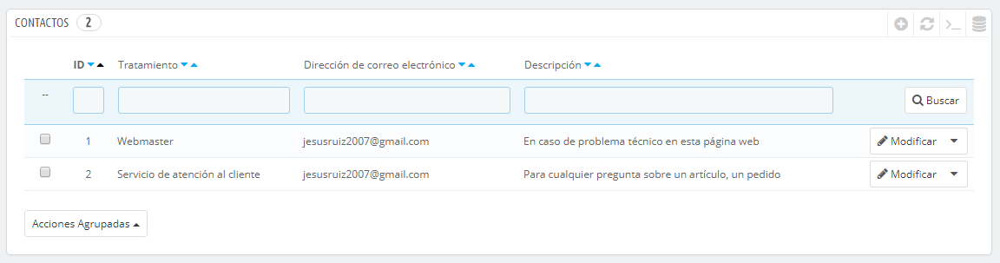
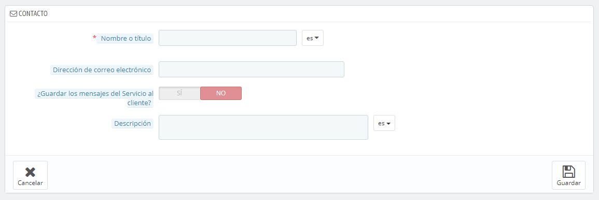
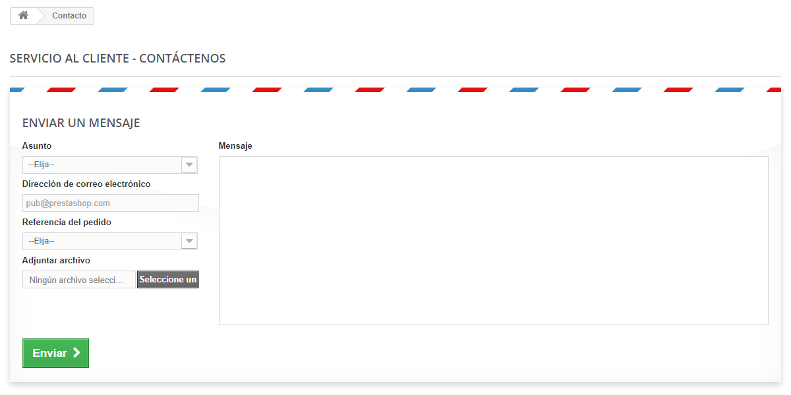

# Tus Contactos

Para facilitar la comunicación con tus clientes, puedes crear múltiples cuentas de contacto. Por ejemplo: servicio al cliente, soporte técnico, departamento de ventas, etc. Esta característica permite a los clientes ponerse en contacto directamente con la persona adecuada en función de sus necesidades.

## Crear un nuevo contacto 

Con el fin de que los mensajes se envíen correctamente al destinatario correcto, debes configurar los contactos en tu tienda.

Haciendo clic en la página "Contactos" bajo el menú "Clientes", puedes acceder al listado de contactos existentes.

Haz clic en el botón "Añadir nuevo" para acceder al formulario de creación de contactos:

* **Nombre o título**. El nombre del empleado, o el nombre del servicio en sí. También puedes optar por utilizar una frase, del tipo "Tengo un problema con mi pedido", "Quiero devolver un producto" o "Quiero convertirme en asociado".
* **Dirección de correo electrónico**. La dirección puede ser la misma que la de otro contacto. De hecho, todos los contactos pueden compartir la misma dirección si realmente no tienes un equipo de personas trabajando en tu tienda – los clientes nunca lo sabrán, pero tener muchos contactos ayuda a que ellos confíen en tu tienda, ya que significará que hay muchas personas trabajando en ella.
* **¿Guardar mensajes del Servicio al cliente?**. Indica si los mensajes de correo se van a guardar en la herramienta "Servicio al Cliente", o simplemente serán enviados a la dirección de correo electrónico. Si se desactiva, PrestaShop no te ayudará a gestionar el servicio al cliente para este contacto. Esto puede ser útil para contactos tipo "Asociados", ya que es posible que prefieras que estos mensajes lleguen directamente a tu bandeja de entrada sin que sean leídos por los otros miembros de tu equipo.
* **Descripción**. Establece una descripción corta, no más de una línea, ya que ésta se muestra al cliente en el formulario de contacto.

## Cómo puede el cliente ponerse en contacto contigo 

Para contactar con el equipo de empleados desde el front-office de tu tienda, el cliente puede hacer clic en los enlacee "Contáctenos" situados en la parte inferior y superior de la página principal. El formulario de contacto aparecerá en pantalla.

El cliente deberá seleccionar la persona con la que desea contactar, introducir su dirección de correo electrónico y a continuación escribir el mensaje. Un menú desplegable permite elegir la referencia del pedido e incluso seleccionar el producto para el que se está realizando la consulta.
