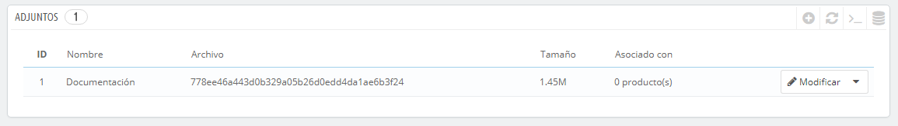
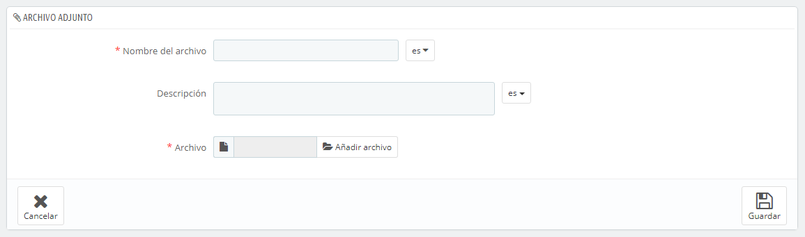

# Gestionar Archivos adjuntos

PrestaShop te permite adjuntar archivos para ponerlos a disposición de tus clientes antes de que realicen una compra.

Por ejemplo, supongamos que vendes artículos electrónicos, y te gustaría instar a tus clientes a leer un documento sobre el funcionamiento de un producto. Puedes adjuntar un documento para este propósito.\
&#x20;También puedes simplemente poner el manual del producto en formato PDF para que el cliente lo descargue en la página del producto.

Cada producto puede tener adjuntos, que puedes establecer de forma individual en bajo la pestaña "Adjuntos" a la izquierda, como se explica en el capítulo anterior de esta guía, "Añadir productos y categorías de productos". Esta página te da acceso a todos los archivos adjuntos de la tienda: si necesitas poner a disposición del cliente este mismo archivo adjunto para otros productos, sólo tienes que subirlo una vez.

También puedes subir archivos adjuntos por tu cuenta, antes de asociarlos a los productos. Esto se realiza desde la página "Adjuntos", bajo el menú "Catálogo".

El proceso para registrar un nuevo adjunto a tu tienda es muy sencillo:

1. Haz clic en "Añadir nuevo". Un formulario aparecerá en pantalla.
2. **Nombre del archivo**. Proporciona un nombre a tu adjunto, en todos los idiomas necesarios.
3. **Descripción**. Proporciona una descripción breve, en todos los idiomas necesarios.
4. Haz clic en "Añadir archivo" para seleccionar un archivo en tu ordenador para cargar.
5. Haz clic en "Guardar".

\
A continuación, serás redireccionado al listado de adjuntos, donde aparecerá tu archivo. Este archivo estará disponible para todos los productos, a través de la pestaña "Adjuntos".

Ahora la pestaña "Descargas" aparecerá en la página del producto (si el tema lo soporta), y tus clientes pueden descargar el archivo(s) que acabas de subir.
