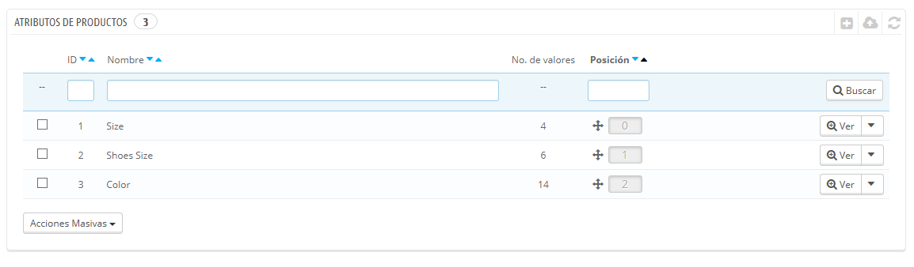
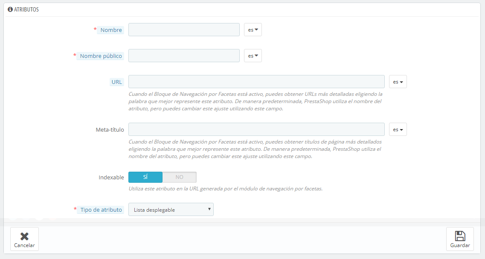
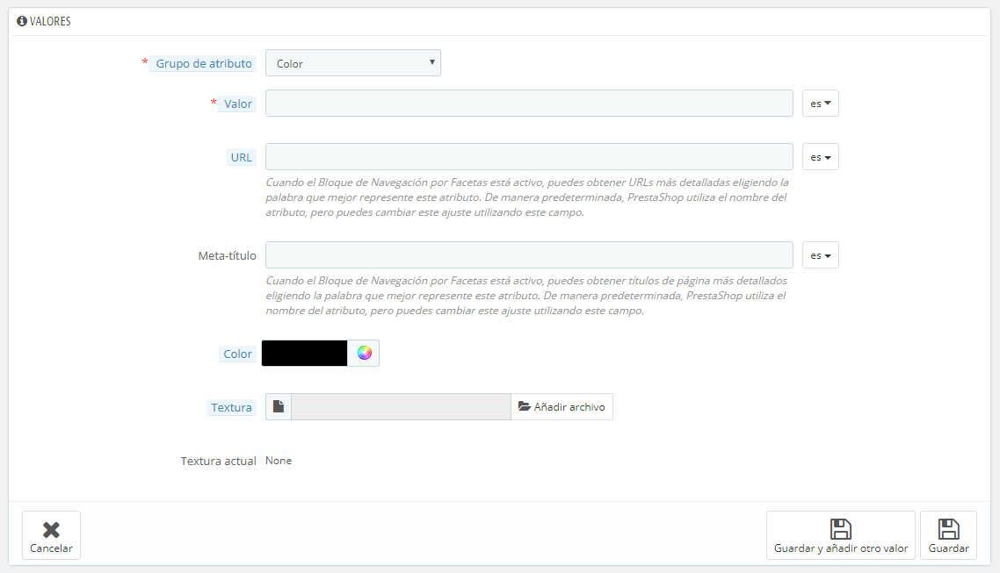

# Gestionar Atributos del Producto

Los atributos son la base de las variaciones (o "combinaciones" en la interfaz de PrestaShop) de un producto: puedes crear variaciones de un producto, si al menos uno de sus atributos cambia.\
Debes pensar en los atributos como propiedades de un producto que pueden cambiar entre cada variación, aunque el nombre del producto se mantenga: color, capacidad, tamaño, peso, etc. Puedes utilizar cualquier cosa que varíe entre las versiones de un mismo producto, excepto el precio.

La diferencia entre un atributo y una característica depende del propio producto en sí. Algunos productos pueden compartir la misma propiedad, siendo la primera utilizada para la construcción de variantes de productos, y la otra como característica invariable.

Por ejemplo, un cliente puede comprar una variación del iPod basada en los atributos (color, capacidad del disco), pero no en las características (peso, tamaño).

Del mismo modo, otra tienda podría vender variaciones de camisetas basadas en los atributos (color, tamaño, género), pero no en las características (peso).

Los atributos son configurados sobre la base de un producto, desde la página "Productos" bajo el menú "Catálogo". Pero primero debes registrarlos en tu tienda utilizando la página "Atributos y Valores" bajo el menú "Catálogo".

Esta página presenta una lista de todos los atributos registrados actualmente. Puedes editar o eliminar cada uno de ellos utilizando los botones de acción disponibles a la derecha de la tabla, o mostrar sus valores haciendo clic en la opción "Ver" que abrirá una nueva tabla para presentarlos en pantalla.

También puedes establecer el orden de presentación de los atributos en el front-office haciendo clic en los iconos de flecha, o arrastrando y soltando cada fila una vez se encuentre posicionado el cursor del ratón sobre la columna "Posición".

## Crear un nuevo atributo 

Para añadir un atributo, o en otras palabras, añadir un grupo de posibles variaciones (colores, capacidad, material, etc.), haz clic sobre el botón "Añadir nuevo atributo". Una nueva página aparecerá en pantalla.

Rellena el formulario:

* **Nombre**. La descripción exacta del atributo. Asegúrate de que este sea corto pero conciso, para que no se confunda con otro atributo.
* **Nombre público**. El nombre del atributo, que se mostrará al cliente en la página del producto. Debido a que algunos atributos pueden tener el mismo nombre para diversos contenidos, este campo te permite presentar este dato correctamente dependiendo del contexto del producto, además de servirte para ayudarte a distinguir fácilmente un atributo de otro con un nombre similar, pero con diferente significado.
* **Tipo de atributo**. Permite elegir si la página del producto debe mostrar los valores de este atributo como una lista desplegable, una lista de botones de radio, o un selector de color.

Tres opciones más están disponibles cuando se habilita el módulo Bloque navegación por facetas. Estas opciones no están estrictamente vinculadas a la navegación por facetas: proporcionan una URL directa a cada una de las variaciones de un producto. De esta manera, no solamente permite al cliente enviar un enlace específico a un amigo, sino que también te ayudará a mejorar su posicionamiento en los motores de búsqueda.

* **URL**. La palabra para utilizar en la URL. De forma predeterminada, PrestaShop utiliza el nombre público del atributo.
* **Meta título**. La palabra a utilizar en el título de la página. De forma predeterminada, PrestaShop utiliza el nombre público del atributo.
* **Indexable**. Permite establecer si  los motores de búsqueda deben indexar este atributo o no.

El cliente puede obtener la URL simplemente haciendo clic en un atributo de la ficha del producto: la URL cambiará añadiendo un detalle final, por ejemplo `#/color-metal` o `#/espacio_de_almacenamiento-16gb/color-verde`.

El generador de la navegación por facetas hace uso de estos también, de ahí la presencia de los textos de descripción "Formato específico para la generación de direcciones URL para la navegación facetas" y "Utilice este atributo en la URL generada por el módulo de navegación por facetas".

Guarda el nuevo atributo para retornar a la lista de atributos. Ahora debes añadir valores al atributo.

## Crear un nuevo valor 

Haz clic en "Añadir nuevo valor". Una nueva página aparecerá en pantalla.

Rellena el formulario:

* **Tipo (Grupo) de atributo**. De la lista desplegable, selecciona uno de los atributos disponibles.
* **Valor**. Establece un valor al atributo: "Rojo", "16 Gb", "1.21 gigawatts"...

Los siguientes campos sólo se muestran si el atributo es de tipo de color.

* **Color**. Si el atributo es un color, puedes introducir su valor en código de color HTML (por ejemplo, "#79ff52" o "lightblue"), o utilizar el selector de color para mostrar con precisión la tonalidad correcta.
* **Textura**. Si tu producto no utiliza un color sólido, sino una textura  (por ejemplo, rayas de tigre), puedes subir una pequeña imagen que se mostrará en la página del producto. Ten en cuenta que esto reemplazará el color HTML del campo de arriba. Haz clic sobre el botón "Guardar" con el fin de iniciar la subida.\
  Puedes utilizar esta opción para permitir que el cliente elija la variedad de colores de una imagen de su producto en lugar de un color. Como ésta sea mostrada en el front-end depende del tema que esté usando...
* **Textura actual**. Una vez que has subido un archivo de textura, ésta se muestra en esta sección a modo de recordatorio.

Puedes añadir más valores para el mismo tipo de atributo guardando los cambios con el botón "Guardar y añadir nuevo valor".

Dos opciones más están disponibles cuando se habilita el módulo de bloque de navegación por facetas. Estas opciones no están vinculadas o ligadas estrictamente a la navegación por facetas: proporcionan una URL directa a cada una de las variaciones de un producto. De esta manera, no solamente permite al cliente enviar un enlace específico a un amigo, sino que también te ayudará a mejorar tu posicionamiento en los motores de búsqueda.

* **URL**. La palabra para utilizar en la URL. De forma predeterminada, PrestaShop utiliza el nombre del valor.
* **Meta título**. La palabra a utilizar en el título de la página. De forma predeterminada, PrestaShop utiliza el nombre público del valor.

El cliente puede obtener la URL simplemente haciendo clic en un atributo de la ficha del producto: la URL cambiará añadiendo un detalle final, por ejemplo `#/color-metal` o `#/espacio_de_almacenamiento-16gb/color-verde`.

El generador de la navegación por facetas hace uso de estos también, esto explica la presencia del texto de descripción "Formato específico para la generación de direcciones URL para la navegación facetas".

Una vez que los atributos están posicionados en su lugar y sus valores han sido establecidos, puedes crear variaciones (o "combinaciones") de cada producto en la pestaña "Combinaciones", disponible dentro de la página "Productos" bajo el menú "Catálogo".
