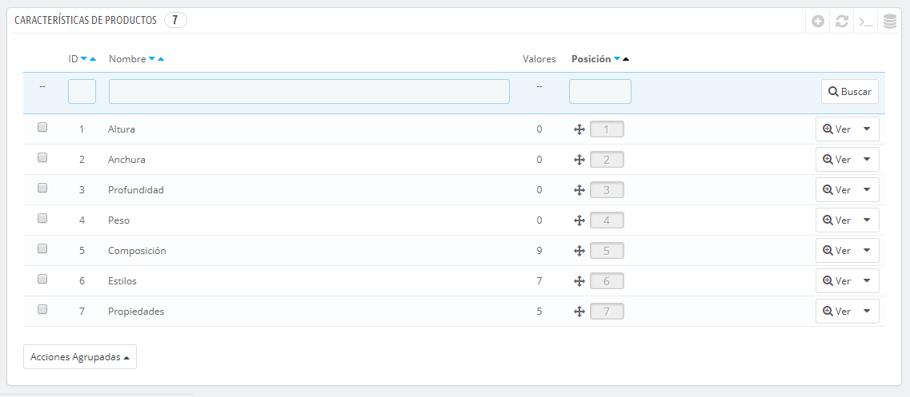
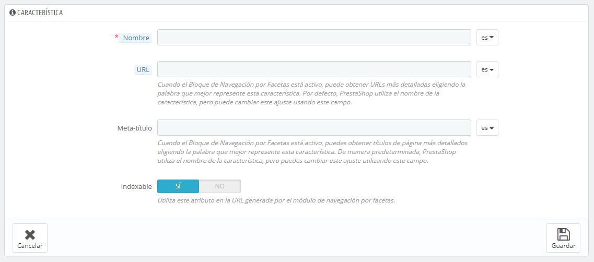
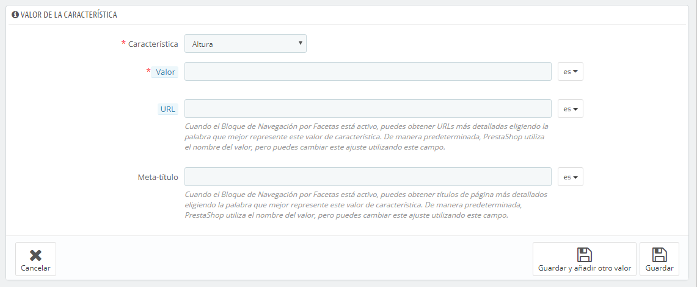

# Gestionar Características del Producto

Esta página te permite definir las características intrínsecas de un producto: que serán las mismas en todas las variaciones (o "combinaciones") del producto.\
Debes pensar en las características de la misma forma en cómo piensa en los atributos del producto (véase el capítulo anterior), con la notable diferencia de que no puedes crear variaciones de un producto basadas en las características.

La diferencia entre un atributo y una característica dependen del propio producto. Algunos productos pueden compartir la misma propiedad, el primero es utilizado para la construcción de variantes de productos, el otro es simplemente una característica invariable.

Por ejemplo, un cliente puede comprar una variación del iPod basada en los atributos (color, capacidad del disco), pero no en las características (peso, tamaño).

Del mismo modo, otra tienda podría vender variaciones de camisetas basadas en los atributos (color, tamaño, género), pero no en las características (peso).

Las características son configuradas sobre la base de un producto, desde la página "Productos" bajo el menú "Catálogo", pero primero deben estar registradas en tu tienda utilizando la página "Características" bajo el menú "Catálogo".

Puedes establecer el orden de los atributos utilizando las flechas de la columna "Posición".\
Los botones de acciones situados en la columna final de la tabla, te permite Modificar, Eliminar y Ver los valores disponibles para esta característica. Desde aquí, puedes ordenar, editar y eliminar valores si es necesario.

## Añadir una característica 

Haz clic sobre el botón "Añadir nuevo". Un formulario muy sencillo aparecerá en pantalla. Aquí es donde se nombra la característica en sí: por ejemplo, los tipos de auriculares proporcionados junto con el reproductor de música.

Otorgue un nombre a esta nueva característica, y guárdala para volver al listado de atributos.

Tres opciones más están disponibles cuando se habilita el módulo Bloque navegación por facetas. Estas opciones no están estrictamente vinculadas a la navegación por facetas: proporcionan una URL directa a cada una de las variaciones de un producto. De esta manera, no solamente permite al cliente enviar un enlace específico a un amigo, sino que también te ayudará a mejorar tu posicionamiento en los motores de búsqueda. El generador de navegación por facetas hace uso de estos.

* **URL**. La palabra para utilizar en la URL. De forma predeterminada, PrestaShop utiliza el nombre público del atributo.
* **Meta título**. La palabra a utilizar en el título de la página. De forma predeterminada, PrestaShop utiliza el nombre público del atributo.
* **Indexable**. Permite establecer si  los motores de búsqueda deben indexar este atributo o no.

El cliente puede obtener la URL simplemente haciendo clic en un atributo de la ficha del producto: la URL cambiará añadiendo un detalle final, por ejemplo `#/color-metal` o `#/espacio_de_almacenamiento-16gb/color-verde`.

## Añadir un nuevo valor a la característica 

Haz clic sobre el botón "Añadir un nuevo valor de característica". Un nuevo formulario aparecerá en pantalla.

Rellena el formulario:

* **Característica**. En la lista desplegable, selecciona una de las características disponibles.
* **Valor**. Otorga un valor a la característica: "5 lbs", "27 cm", ...

...y guarda su valor de característica. Puedes añadir más valores para el mismo tipo de característica guardando los cambios con el botón "Guardar y añadir otro valor".

Dos opciones más están disponibles cuando activa el módulo Bloque Navegación por facetas. Estas opciones no están estrictamente vinculadas a la navegación por facetas: proporcionan una URL directa a cada una de las variaciones de un producto. De esta manera, no solamente permite al cliente enviar un enlace específico a un amigo, sino que también te ayudará a mejorar tu posicionamiento en los motores de búsqueda. El generador de navegación por facetas hace uso de estos.

* **URL**. La palabra para utilizar en la URL. De forma predeterminada, PrestaShop utiliza el nombre público del atributo.
* **Meta título**. La palabra a utilizar en el título de la página. De forma predeterminada, PrestaShop utiliza el nombre público del atributo.

El cliente puede obtener la URL simplemente haciendo clic en un atributo de la ficha del producto: la URL cambiará añadiendo un detalle final, por ejemplo `#/color-metal` o `#/espacio_de_almacenamiento-16gb/color-verde`.
