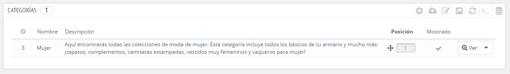
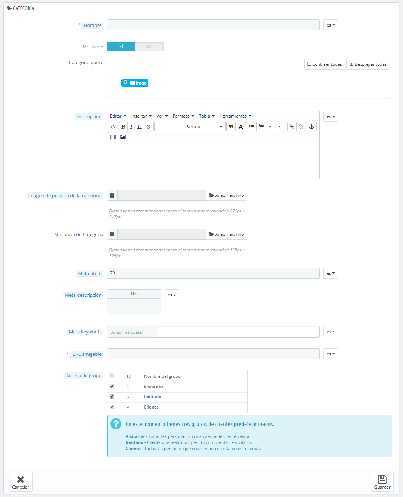

# Gestionar Categorías

Las categorías son esenciales, ya que te permite agrupar productos equivalentes. Esto ayuda a los clientes a navegar fácilmente a través de tu catálogo de productos, y restringir la búsqueda a un tipo específico de producto. Las categorías también facilitan a tus clientes el que puedan comparar los productos de tu catálogo (gracias a la función de comparación de productos de PrestaShop).

Debes crear una nueva categoría en el momento en que tenga al menos dos productos con atributos o características equivalentes. Los productos dentro de una misma categoría deben ser comparables, e incluso intercambiables. Mantén esta idea al añadir nuevos productos y al crear nuevas categorías.

Puedes optar por no crear ninguna categoría, y tener todos los productos agrupados dentro de una sola categoría global, denominada "Inicio". Pero entonces los clientes no tendrán la posibilidad de comparar productos.

También puedes establecer que no estás interesado en la función de comparación, y prefieres crear tus categorías libremente. En ese caso, debes desactivar la herramienta de comparación: dirígete a la página de preferencias de productos, y establece a 0 la opción "Comparación de productos".

Al crear una categoría de productos, debes cumplir y tener claro un requisito: **los productos de esta categoría deben ser comparables entre sí** a través de sus atributos (no por sus características). Esto no es sólo útil para tus clientes, sino que también es una necesidad para la funcionalidad que incorpora PrestaShop para comparar productos.

Las categorías son gestionadas en la página "Categorías" del menú "Catálogo". Esta página muestra una tabla con las categorías existentes en la actualidad, mostrando la información principal de cada una de ellas.\
Para visualizar las sub-categorías, haz clic en la categoría padre o selecciona "Ver" en el menú de acciones.



Utilizando el icono verde de verificación de la columna "Mostrado" de la tabla, puedes indicar que deseas ocultar la categoría correspondiente, convirtiéndose en este caso el icono en una "x" de color rojo.&#x20;

Todas las categorías son en realidad subcategorías de la categoría de "Inicio".\
Para editar la categoría "Inicio" (o cualquier categoría seleccionada), haz clic en el botón "Modificar" en la barra de botones.

Para crear una nueva categoría (o una subcategoría de una categoría existente), haz clic en el botón "Añadir nueva categoría" en cualquier nivel de categorías.



¡Traduzca sus categorías!

Asegúrate de traducir cada campo en todos los idiomas soportados por tu tienda. Para ello, haz clic en el botón que muestra la lista desplegable de códigos de idioma, y selecciona el idioma en el que deseas editar el texto.

En primer lugar, debes introducir la información general:

* **Nombre**. Establece un nombre a tu categoría. Asegúrate de que éste sea corto y descriptivo: tus clientes confiarán en dicho nombre para guiarse a través de tu tienda.
* **Mostrado**. Indica si esta categoría será "mostrada" (es decir, si estará o no estará disponible para tus clientes). Por ejemplo, podrías posponer el mostrar una categoría a tus clientes si consideras que ésta no cuenta todavía con suficientes productos introducidos.
* **Categoría padre**. _No aparece cuando se crea una categoría raíz._ Si deseas crear una subcategoría perteneciente a una categoría que no sea la página de inicio, selecciona la categoría bajo la cual aparecerá.\
  La forma en la que se crea una categoría raíz o una sub-categoría es la misma. La única diferencia es que cuando se hace clic en "Añadir nueva" desde un sub-nivel de categorías, PrestaShop entiende que deseas crear una subcategoría de esa categoría, y por lo tanto, determina la opción "Categoría padre" en consecuencia.
* **Descripción**. Debes rellenar este campo, no solamente porque será de utilidad tanto para ti como para tus empleados, sino porque también algunos temas hacen uso de ella, mostrando ésta a tus clientes.
* **Imagen de portada de categoría**. Haz clic en "Añadir archivo" para subir una imagen desde tu ordenador, que represente a esta categoría.
* **Miniatura de categoría**. Muestra una imagen pequeña en la página de categoría principal, si el tema lo permite.
* **Miniatura del Menú**. La miniatura de categoría aparece en el menú como una pequeña imagen que representa la categoría, si el tema lo permite.
* **Meta título**. El título que aparecerá en los motores de búsqueda cuando se realiza una solicitud por parte de un cliente.
* **Meta descripción**. Una presentación de tu categoría en unas pocas líneas, destinada a captar el interés de un cliente. Esta descripción aparecerá en los resultados de búsqueda.
* **Meta palabras clave**. Palabras clave que definan a esta categoría, con el fin de ser referenciadas por los motores de búsqueda. Puedes introducir varias palabras separadas por comas, así como expresiones que deben ser indicadas entre comillas.
* **URL amigable**. Te permite reescribir las direcciones de tus categorías como desees.\
  Por ejemplo, en lugar de tener una dirección como [http://www.ejemplo.com/categoria.php?id\_categoria=3](http://www.example.com/category.php?id\_category=3), puedes tener [http://www.ejemplo.com/123-nombre-de-la-categoria](http://www.example.com/123-name-of-the-category).\
  En este caso, todo lo que tendrías que hacer es indicar en el campo "URL amigable" las palabras que deseas que aparezcan en lugar de "nombre-de-la-categoría", separadas por guiones.
* **Acceso de grupo**. Restringe el acceso a la categoría y los productos que la forman a ciertos compradores. Para ver estas categorías, los compradores deben pertenecer a un grupo de usuarios. Echa un vistazo a la página "Grupos" en el menú "Clientes" para obtener más información.
*   **Categoría raíz**. Sólo aparece cuando se crea una categoría raíz. Es posible que desees utilizar esta nueva categoría como la nueva categoría raíz, en lugar de "Inicio". Si es así, marca esta opción para aplicar el cambio.

    La categoría raíz es muy útil en el modo multitienda. Imagina que tienes 3 tiendas con diferentes (o parcialmente diferentes) productos y categorías: es posible que desees utilizar una categoría raíz diferente para cada tienda.

    La categoría raíz refleja la categoría "inicio" de cada tienda, así que si no quieres tener los mismos productos en la categoría de la página principal de cada tienda, necesitas crear diferentes categorías raíz.\
    De esta forma es más fácil asignar categorías para cada tienda, y así poder tener diferentes productos en la categoría inicio de cada una de ellas.

Una vez que hayas terminado de configurar tu categoría, guardala, y ya estará preparada para llenarla de productos.

Una nueva categoría no aparecerá automáticamente en el menú de tu tienda. Para que salga en tu menú, debes configurar el menú con el módulo "Menú horizontal superior" (si utilizas el tema predeterminado) o cualquier módulo personalizado que utilizas para gestionar tu menú.

## Examinar y Editar Categorías <a href="#gestionarcategorias-examinaryeditarcategorias" id="gestionarcategorias-examinaryeditarcategorias"></a>

El botón "Modificar" en la barra de botones, te permite editar la categoría padre de las subcategorías actualmente mostradas. Esto significa que cuando estés viendo la subcategorías principales, al hacer clic en el botón "Modificar" podrás editar la categoría "Inicio".

Al hacer clic en cualquier categoría de la tabla, se abrirá, y mostrará todas tus subcategorías. Como consecuencia a esta acción, cambiarás el contexto de la interfaz: haciendo clic en el botón "Modificar" puedes editar la categoría padre actual, y haciendo clic en "Añadir nueva" se abrirá el formulario de creación de la categoría con la opción "Categoría padre" establecida a la categoría padre actual.

## Importar y exportar categorías <a href="#gestionarcategorias-importaryexportarcategorias" id="gestionarcategorias-importaryexportarcategorias"></a>

Además de los habituales botones "Añadir nueva" y "Modificar", la barra de botones también cuenta con otros tres botones:

* **Exportar.** Te permite descargar la lista de todas las categorías, en formato CSV.
*   **Importar.** Abre la página "Parámetros avanzados > Importar archivos CSV", con el tipo de datos que se espera establecido en "Categorías". Consulta la sección "Comprender los Parámetros avanzados" para obtener más información sobre la importación de archivos CSV.\
    Necesitarás que el archivo CSV siga este formato:

    ```
    ID;Name;Description;Position;Displayed;
    3;iPods;Now that you can buy movies from the iTunes Store and sync them to your iPod, the whole world is your theater.;1;1;
    4;Accessories;Wonderful accessories for your iPod;2;1;
    5;Laptops;The latest Intel processor, a bigger hard drive, plenty of memory, and even more new features all fit inside just one liberating inch. The new Mac laptops have the performance, power, and connectivity of a desktop computer. Without the desk part.;3;1;
    ```

    El identificador de la categoría es la ID, no el nombre de la categoría.
* **Actualizar lista**. Vuelve a recargar la lista de categorías mostrando todos los cambios realizados.

Encontrarás disponibles más opciones de importación en la página "Importar CSV" del menú "Parámetros avanzados".

## Añadir productos a una categoría <a href="#gestionarcategorias-anadirproductosaunacategoria" id="gestionarcategorias-anadirproductosaunacategoria"></a>

Para añadir un producto a una categoría, debes abrir la página de configuración del producto e ir a la pestaña "Asociaciones" situada a la izquierda del formulario. En esta opción es en donde puedes establecer las categorías a las que pertenece el producto.

La categoría "Inicio" es una categoría especial, donde puedes destacar/promocionar productos de cualquier otra categoría, haciendo que aparezcan en el bloque "Productos destacados". De forma predeterminada, sólo se pueden visualizar 8 productos destacados en la página principal.

El bloque "Productos destacados" está supeditado al módulo "Productos destacados en la página de inicio". Si deseas tener más (o menos) productos en la página principal, configura este módulo (desde la página de "Módulos y Servicios" en el menú "Módulos y Servicios").

Nota: No tienes que quitar un producto de su categoría original para que se visualice  en la página principal. Un producto puede tener tantas categorías, como sea necesario.
