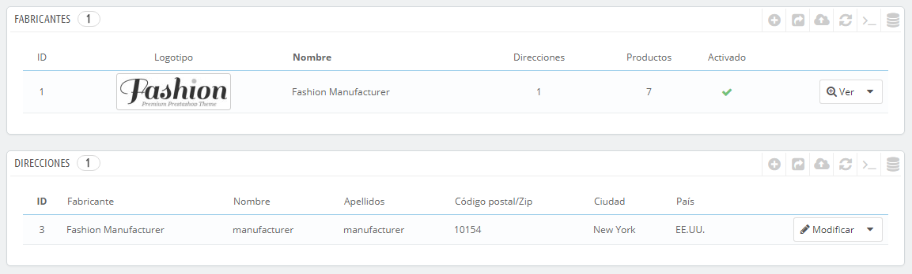
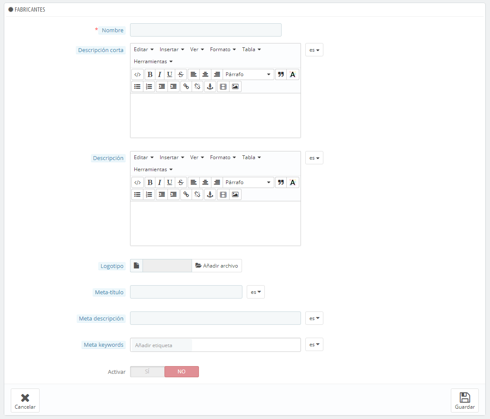
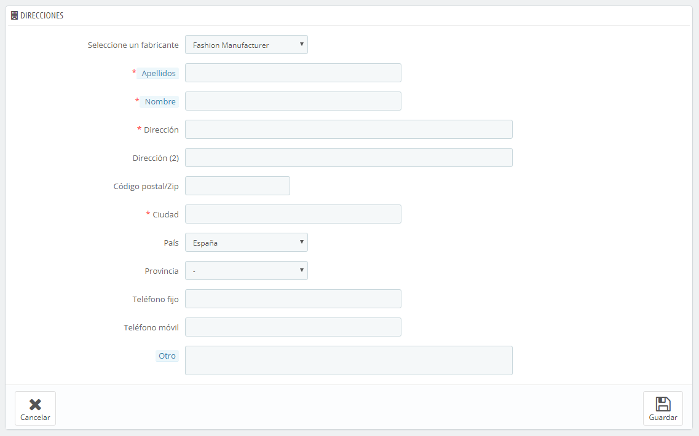

# Gestionar Fabricantes

A menos que tu seas el propio fabricante de los productos que vendes, deberás registrar los fabricantes de tus productos en PrestaShop.

En PrestaShop, un fabricante es la marca que está detrás de un producto. Si vendes productos propios fabricados por ti, debes crear por lo menos a tu empresa como fabricante: esto ayudará a tus clientes a encontrar rápidamente lo que están buscando, además de favorecerte en el posicionamiento en los motores de búsqueda.

En el front-end de tu tienda, los fabricantes son ordenados alfabéticamente. No puedes cambiar este orden establecido.

Los nuevos fabricantes se encuentran de menra predeterminada desactivados. Debes activarlos para que aparezcan disponibles en tu tienda – incluso si aunque estos no contengan un producto todavía.

Al introducir la información de los fabricantes, los visitantes de tu sitio puedan tener un acceso rápido a todos los productos de un fabricante determinado. Esto facilita a ellos la navegación a través de tu sitio. En términos de visibilidad, al rellenar estos campos mejorarás tu posicionamiento en los motores de búsqueda.

## Crear un fabricante 

Haz clic en el botón "Añadir nuevo". El formulario de creación aparecerá en pantalla.

Rellena todos los campos:

* **Nombre**. Indica el nombre del fabricante, con el fin de hacer más sencillas las búsquedas de tus visitantes.
* **Descripción corta**. La descripción que aparecerá en los motores de búsqueda cuando un usuario realiza una petición. Limitada a 100 caracteres.
* **Descripción**. Añadae una descripción más completa de tu fabricante, la actividad del mismo y productos que fabrica.\
  &#x20;Puedes detallar tus especialidades y resaltar la calidad de tus productos. La descripción del fabricante será mostrada en tu tienda.
* **Logotipo**. Tener un logotipo del fabricante es esencial: esto consigue el efecto de que los clientes confíen en tu tienda, casi tanto como ellos confían en el fabricante o en la marca.
* Los campos de SEO (Meta título, Meta descripción y Meta palabras clave): proporcionan la misma funcionalidad que la que ofrecen en las categorías.\

  * **Meta título**. El título que aparecerá en los motores de búsqueda cuando un cliente realice una solicitud.
  * **Meta descripción**. Una presentación en pocas líneas de tu sitio web, diseñada para captar el interés de un cliente. Aparecerá en los resultados de búsqueda.
  * **Meta palabras clave**. Palabras clave para que tu sitio aparezca referenciado en los buscadores. Puedes introducir varias de ellas, separadas por comas, así como expresiones, que deben ser indicadas entre comillas.
* **Activado**. Puedes desactivar un fabricante, temporalmente. Esto sólo lo eliminará de la lista de fabricantes del front-end de tu tienda.

Guarda los cambios realizados para volver al listado de fabricantes. Desde aquí, puedes:

* Hacer clic en el nombre o logotipo del fabricante, y obtener una lista de todos los productos asociados a éste. Si no hay ninguno, entonces debes asignar productos a este fabricante, trabajando sobre la base de un producto, desde la página "Productos" bajo el menú "Catálogo", utilizando la pestaña "Asociaciones".\
  &#x20;Puedes obtener el mismo resultado haciendo clic en el icono "Ver" situado en el lado derecho de la página actual.
* Desactivar el fabricante, haciendo clic en el icono de verificación de color verde. "Sí". Una vez desactivado, el icono de una cruz roja aparecerá en su lugar: si haces clic de nuevo sobre este icono volverás a habilitar el fabricante.
* Editar/eliminar los fabricantes haciendo clic en los botones correspondientes a la derecha de la fila.

## Añadir dirección del fabricante 

En la parte inferior de la página "Fabricantes" se encuentra la sección "Direcciones". Cada fabricante puede tener su propia dirección registrada en PrestaShop. Esto sirve principalmente como recordatorio: de esta manera, siempre tendrás la dirección de contacto de un fabricante directamente dentro de PrestaShop.

Haz clic en el botón "Añadir nuevo", para abrir el formulario de creación.\

Asegúrate de elegir el fabricante correcto, e intenta rellenar tantos campos como sea posible.
