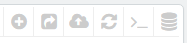
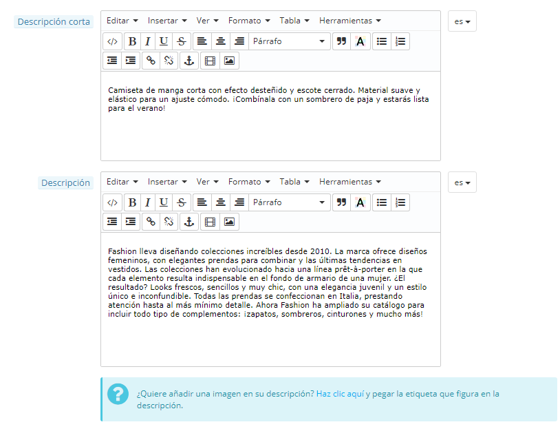

# Gestionar Productos

## Gestionar Productos 

Puedes gestionar / administrar los productos de tu tienda utilizando la página "Productos", en el menú "Catálogo".

Secciones que forman este capítulo:

* [Gestionar Productos](gestionar-productos.md#GestionarProductos-GestionarProductos)
  * [El listado de Productos](gestionar-productos.md#GestionarProductos-EllistadodeProductos)
  * [Los botones de la página de Creación de Productos](gestionar-productos.md#GestionarProductos-LosbotonesdelapáginadeCreacióndeProductos)
  * [Rellenar la información del producto](gestionar-productos.md#GestionarProductos-Rellenarlainformacióndelproducto)
  * [Establecer el precio de un producto](gestionar-productos.md#GestionarProductos-Establecerelpreciodeunproducto)
  * [Optimizando el posicionamiento de tu producto en los motores de búsqueda (SEO)](gestionar-productos.md#GestionarProductos-Optimizandoelposicionamientodetuproductoenlosmotoresdebúsqueda\(SEO\))
  * [Gestionar las asociaciones del producto](gestionar-productos.md#GestionarProductos-Gestionarlasasociacionesdelproducto)
  * [Evaluando los costes del envío: Tamaño, Peso, Transportista](gestionar-productos.md#GestionarProductos-Evaluandoloscostesdelenvío:Tamaño,Peso,Transportista)
  * [Añadir combinaciones de productos](gestionar-productos.md#GestionarProductos-Añadircombinacionesdeproductos)
  * [Gestionar las cantidades de los productos](gestionar-productos.md#GestionarProductos-Gestionarlascantidadesdelosproductos)
  * [Configurar las Imágenes del producto](gestionar-productos.md#GestionarProductos-ConfigurarlasImágenesdelproducto)
  * [Configurar las características del producto](gestionar-productos.md#GestionarProductos-Configurarlascaracterísticasdelproducto)
  * [Gestionar la personalización](gestionar-productos.md#GestionarProductos-Gestionarlapersonalización)
  * [Gestionar Archivos adjuntos](gestionar-productos.md#GestionarProductos-GestionarArchivosadjuntos)
  * [Establecer el proveedor del producto](gestionar-productos.md#GestionarProductos-Establecerelproveedordelproducto)
  * [Gestionar Almacenes (avanzado)](gestionar-productos.md#GestionarProductos-GestionarAlmacenes\(avanzado\))
* [Crear un pack de productos](gestionar-productos.md#GestionarProductos-Crearunpackdeproductos)
* [Crear un producto virtual](gestionar-productos.md#GestionarProductos-Crearunproductovirtual)

### El listado de Productos 

Al hacer clic en la página "Productos" del menú "Catálogo" el navegador redirecciona al listado de los productos actualmente disponibles en tu tienda, mostrados con sus detalles principales: ID, imagen, nombre, referencia, categoría, etc.

En la parte superior, esta página presenta cuatro estadísticas relacionadas con tu tienda:

* Porcentaje de artículos fuera de stock (artículos no disponibles),
* Porcentaje de margen bruto promedio,
* Porcentaje de ventas durante los últimos 30 días,
* Número de productos deshabilitados.

La opción "Filtrar por categoría" te permite mostrar tan sólo productos relacionados con tu búsqueda actual, así como reorganizar la posición de los productos dentro de una categoría.

Posición del producto

No puedes reorganizar toda la lista de productos. Los productos se muestran en el mismo orden en el que se introducen en la tienda (ordenados incrementalmente por su número identificativo, ID), y el cliente puede ordenar los productos utilizando los algoritmos de clasificación disponibles: los más baratos primero, los más caros primero, productos ordenados por su nombre alfabéticamente de A a Z, productos ordenados alfabéticamente de forma inversa por su nombre de Z a A, los productos en stock primero, los productos con referencia más baja primero, los productos con referencia más alta primero.

Puedes organizar los productos por categoría haciendo clic en la casilla de verificación "Filtrar por categoría". Se abrirá una pequeña interface listando todas tus categorías y subcategorías. Seleccionando una categoría se filtra automáticamente la lista de productos para mostrar tan sólo los productos de la categoría seleccionada. Esto también añade una columna "Posición" a la tabla, con la que puedes ordenar el producto en la página de la categoría. Para ello, puedes mover las filas de la tabla con el ratón, o hacer clic en las flechas (arriba - abajo) disponibles en dicha columna.

El orden de tus productos puede ser invalidado por el orden de clasificación seleccionado por el cliente.

Ten en cuenta que cuando se cambia el orden de visualización en la lista de productos en el back-office (haciendo clic en la flecha del nombre de la columna para ordenar los productos conforme a esa columna), la columna "Posición" ya no muestra las flechas y no puedes mover las filas de la tabla. En su lugar, la columna muestra el número de posición del producto. Para poder reorganizar los productos de nuevo, haz clic en el botón "Borrar filtro".

Por último, la parte superior de la lista de productos presenta seis botones:

* **Añadir nuevo**. Crea un nuevo producto.
* **Exportar**. Descarga un archivo CSV de todos los productos de tu catálogo.
* **Importar**. Redirecciona el navegador a la página de opciones de Importación CSV, desde donde puedes importar tus archivos CSV.
* **Actualizar lista**. Vuelve a recargar el listado de productos para mostrar los últimos cambios.
* **Mostrar consulta SQL**. Proporciona la consulta SQL para reproducir tu búsqueda de productos o filtrado en tu propio gestor SQL.
* **Exportar a SQL Manager**. Abre la herramienta PrestaShop SQL Manager (denominada Gestor SQL en el menú "Parámetros Avanzados"), desde donde puedes realizar consultas a la base de datos de PrestaShop utilizando sentencias SQL ("`SELECT ... FROM ... WHERE ...`").\
  Si tu lista de productos fue filtrada (por nombre, por ejemplo), la sentencia SQL predeterminada tendrá esto en cuenta (por ejemplo, "``WHERE 1  AND b.`name` LIKE '%blouse%'``").

Puedes añadir nuevos productos haciendo clic en "Añadir nuevo". Aparecerá un formulario, acompañado de varias pestañas en la columna izquierda y dos botones en la parte superior: "Módulos recomendados" y "Ayuda".

### Los botones de la página de Creación de Productos 

De manera predeterminada, la página de creación de producto presenta dos botones que se encuentran en la mayoría de las páginas de administración: "Módulos recomendados" y "Ayuda".

En la parte inferior de la página hay tres botones:

* **Guardar**. Este botón sirve para guardar cualquier cambio que hayas realizado en cualquiera de los datos del producto, y te lleva de regreso al listado de productos.
* **Guardar y permanecer**. Este botón sirve para guardar cualquier cambio que hayas realizado en cualquiera de los datos del producto, y te mantiene en la ficha actual. Esto es particularmente útil cuando se desea cambiar de pestaña sin perder los cambios realizados en la ficha actual, o para ver tus cambios aplicados inmediatamente.
* **Cancelar**. Este botón simplemente te lleva de vuelta al listado de productos, sin guardar ningún cambio que hayas realizado en cualquiera de las fichas de esta página.

Tan pronto como guardes el producto, utilizando los botones "Guardar" o "Guardar y permanecer", más botones adicionales aparecerán en la página del producto:

* **Vista previa**. Muestra la página del producto tal y como la verán tus clientes en el front-office de tu tienda. Esto es muy útil, ya que funciona incluso si el producto está deshabilitado (pestaña "Información").
*   **Duplicar**. Crea una copia exacta del producto actual. Esto es muy útil cuando prefieras utilizar los datos del producto actual como una plantilla para otro nuevo producto, y así no tienes que volver a escribir todos los datos del nuevo producto manualmente. Por ejemplo, dos productos pueden ser muy diferentes, pero pueden compartir las mismas combinaciones, los mismos transportistas o el mismo proveedor.

    ¡No sobre-dupliques!

    Si necesitas crear diferentes versiones de un mismo producto, a causa de su variedad de colores, capacidad, tamaño, etc., debes crear combinaciones para el producto actual en lugar de duplicarlo X veces. Revisa la pestaña "Combinaciones" en la columna izquierda del formulario, la cual se explica en la sección "Añadir combinaciones de productos" de este capítulo.
* **Ventas**. Te redirecciona a la página "Detalles del producto" del panel de control de estadísticas (menú "Estadísticas"), que muestra en una gráfica el número de visitas y ventas del producto.
* **Suprimir este producto**. Elimina todos los datos pertenecientes al producto actual, incluyendo sus imágenes, combinaciones, características, etc.
* **Módulos recomendados**. Abre una nueva ventana modal donde se te presentan algunos de los módulos más populares que puedes instalar desde el marketplace de PrestaShop. 

### Rellenar la información del producto 

La primera pestaña contiene la información básica sobre el producto.

La primera línea es un elemento esencial: indica si el producto es un pack (una combinación de al menos dos productos existentes), un producto virtual (archivo descargable, servicio, etc.), o simplemente un producto clásico que se envía por correo ordinario. Por ahora, sólo analizaremos el producto clásico, y trataremos los paquetes y productos virtuales en próximas secciones de este capítulo.

Hay muchas más opciones disponibles relacionadas con los productos, puedes acceder a ellas dirigiéndote a la página "Productos" del menú "Preferencias":

* Número de días en los que el producto es considerado "nuevo".
* Ordenamiento predeterminado del producto.
* Habilitar las opciones avanzadas de stock.
* etc.

Debes comprobar que estos ajustes globales se encuentran configurados como deseas.&#x20;

Se inicia con cuatro campos de texto:

*   **Nombre**. Lo primero que debes rellenar es el nombre del producto, el cual aparecerá en los resultados de los motores de búsqueda. Justo al lado derecho de este campo encontrarás un código de idioma, que te permite elegir el idioma en el que deseas editar o crear el nombre.

    **Debes** otorgar un nombre al producto en al menos el idioma predeterminado utilizado en tu tienda antes de poder guardarlo. Además, no tendrás acceso a algunas de las fichas que tienes que rellenar del producto hasta que no lo guardes.

    Asegúrate de traducir cada campo en todos los idiomas disponibles en tu tienda. Para ello, haz clic en el código de idioma situado al lado derecho del campo, y selecciona el idioma en el que deseas editar el texto.
* **Código de referencia**. Esta es tu propia referencia interna. Este código puede ser un número, o una referencia a la ubicación del producto en tu almacén, a tu proveedor, o a cualquier otra cosa que la haga única.
* **EAN-13 o código de barra JAN**. Estos son los números del código de barras de tu producto, que son utilizados en todo el mundo para identificarlos. Puedes utilizar un número EAN13 o JAN.
  * Un código EAN-13 es un número internacional constituido por 13 dígitos para identificar un artículo. Más información en la Wikipedia: [http://es.wikipedia.org/wiki/European\_Article\_Number](http://es.wikipedia.org/wiki/European\_Article\_Number).
  * Un código JAN es específico de Japón, pero es compatible con el internacional EAN. Más información en la Wikipedia: [http://en.wikipedia.org/wiki/Japanese\_Article\_Number](http://en.wikipedia.org/wiki/Japanese\_Article\_Number).
* **UPC**. Un código de barras de 12 dígitos, más ampliamente utilizado en América del Norte, Reino Unido, Australia y Nueva Zelanda. Más información en la Wikipedia: [http://en.wikipedia.org/wiki/Universal\_Product\_Code](http://en.wikipedia.org/wiki/Universal\_Product\_Code).

A continuación se presentan cuatro opciones:

* **Activado**. Si no deseas que el producto esté disponible de inmediato o visible para tus clientes, haz clic en la opción "No".
* **Visible en**. puedes hacer que el producto esté tan sólo disponible a través de diferentes canales:\

  * **Toda la tienda**. Los clientes pueden llegar al producto, navegando por el catálogo, buscando el nombre del producto, o directamente a través de su URL.
  * **El Catálogo**. Los clientes pueden acceder al producto, navegando por el catálogo o directamente a través de su URL.
  * **Los resultados de búsqueda**. Los clientes pueden llegar al producto mediante la búsqueda de su nombre o directamente a través de su URL.
  * **Oculto**. Los clientes sólo pueden llegar al producto usando su URL. No lo encontrarán navegando por el catálogo, ni mediante la búsqueda de su nombre. Esto es ideal para la creación de productos privados, al que sólo unos pocos visitantes de confianza pueden acceder, aunque sea temporalmente (puedes cambiar este ajuste en cualquier momento).
* **Opciones**. Un conjunto de opciones específicas.
  * **Disponible para su compra (disponible para pedidos)**. Si desmarcas esta casilla, los clientes no podrán añadir este producto a su carrito. Esto hace que solamente este producto se muestre más bien como en el modo Catálogo (en comparación con la preferencia "Modo catálogo").
  * **Mostrar el precio**. Si la opción anterior "disponible para su compra" está desmarcada, puedes optar por mostrar el precio del producto (aunque los visitantes no podrán comprarlo), o no mostrarle este a tus clientes.
  * **Sólo online (no se vende en ningún establecimiento físico)**. Esta opción será de gran valor cuando un producto, sólo se venda a través de internet, no en tiendas físicas – esto previene a nivel informativo a los clientes de que no vayan a tu tienda física con la esperanza de comprar el producto, para así evitar los gastos de envío.
* **Estado de uso (Condición)**. No todas las tiendas venden productos nuevos. Esta opción te permite indicar el estado de uso del producto:\

  * **Nuevo**. El producto es completamente nuevo, en su embalaje original sellado.
  * **Usado**. El producto ya se ha vendido al menos una vez, y probablemente fue utilizado por otra persona (de segunda mano). Este puede venir en su embalaje original, pero puede estar sellado con cinta adhesiva.
  * **Reacondicionado**. El producto ha sido devuelto por alguna razón ("rasguños, abolladuras u otros daños puramente estéticos que no afectan al funcionamiento del producto"). Más información en la Wikipedia: [http://en.wikipedia.org/wiki/Refurbishment\_%28electronics%29](http://en.wikipedia.org/wiki/Refurbishment\_\(electronics\)).

Ahora que estos detalles han sido establecidos, puedes comenzar a añadir una descripción para tu producto.\
Describir tu producto es esencial, tanto para el cliente (contra mayor información, mejor) como para los motores de búsqueda (esto ayudará a que tu tienda aparezca en más solicitudes de búsqueda).

En la parte inferior de la pantalla, se presentan dos campos de descripción que sirven para diferentes propósitos:

* El **campo "Descripción corta"** te permite escribir una breve descripción que aparecerá en los motores de búsqueda y en la categoría descripción para tu producto.\
  Este campo está limitado a 400 caracteres de manera predeterminada: si superas ese límite, PrestaShop te mostrará un mensaje de advertencia de color rojo. Puedes cambiar este límite en la página de preferencias de "Productos", desde la opción "Tamaño máximo para la descripción corta".
* El **campo "Descripción"** te permite escribir una descripción completa de tu producto, que aparecerá directamente en la página del producto. El editor de texto ofrece una amplia gama de opciones para la creación de descripciones visuales atractivas (fuente, tamaño, color de texto, etc.)\
  Aunque este segundo campo no está limitado, puedes pecar de poner demasiado contenido: esfuérzate en ofrecer la información esencial de manera convincente, para que tu producto salga fortalecido para la venta.

Bajo los campos de "Descripción", puedes encontrar una pequeña herramienta que te permite añadir imágenes adjuntas a la "Descripción" del producto (a través de la pestaña "Imágenes"), utilizando las etiquetas de imagen. Haz clic en "Haz clic aquí" para abrirla.\

Sólo tienes que seleccionar la imagen que deseas, elegir su posición de acuerdo con el texto y su tamaño, y PrestaShop generará una etiqueta de imagen que posteriormente puedes establecer a la derecha dentro de la descripción (preferiblemente entre dos párrafos, o al comienzo de un párrafo).

En el **campo "Etiquetas "**, añade algunos términos y palabras clave que ayuden a tus clientes a encontrar fácilmente lo que están buscando.

Éstas serán mostradas en la tienda dentro de un bloque "Etiquetas" (si está disponible). Si no quieres que el bloque de etiquetas aparezca, simplemente desactiva el módulo "Bloque de Etiquetas" (en la página "Módulos").

Diferencias con PrestaShop 1.4

PrestaShop 1.4 te permitía indicar el fabricante del producto a la derecha de esta página. Desde la version 1.5, este ajuste se encuentra en la pestaña "Asociaciones" a la izquierda del formulario. Lo mismo ocurre para el campo "Categoría predeterminada", las categorías asociadas, y el campo "Accesorios".

La versión 1.4 también te permitía indicar el tamaño y el peso del paquete final. Desde la versión 1.5, estos ajustes se encuentran en la pestaña "Transporte" a la izquierda del formulario.

El campo "Ubicación" de la versión 1.4 se puede encontrar en la pestaña opcional "Almacenes" a la izquierda del formulario, el cual sólo está disponible si se ha habilitado la Administración avanzada de stock (menú "Preferencias", página "Productos", sección "Stock de Productos").

Una vez que hayas rellenado toda esta información, guarda tu trabajo, tras lo cual será redireccionado a tu listado de productos. Si guardas tu trabajo haciendo clic en el botón "Guardar y permanecer", continuarás trabajando en la página de presentación de tu producto.

### Establecer el precio de un producto 

Todo esto se realiza en la pestaña "Precio" situada a la izquierda del formulario. La sección Precio puede ser intimidante y desalentadora al principio, con campos que se influyen entre ellos mutuamente, y con los impuestos fiscales que hay que tenerlos en cuenta – pero no te preocupes porque es bastante más fácil de lo que parece.

Establece el precio que aparecerá en tu tienda siguiendo las siguientes instrucciones:

* **Precio al por mayor antes de los impuestos (Precio mayorista impuestos excluidos)**. Este campo te permite saber al instante el precio como mayorista (precio de fábrica), y por tanto poder compararlo con el precio de venta para calcular fácilmente tu margen de beneficio.
* **Precio de venta impuestos excluidos**. El precio de venta sin IVA.
* **Regla de impuestos**. El impuesto aplicable al producto. Elige entre las diferentes tasas disponibles.\
  Si necesitas crear una nueva tasa de impuestos, haz clic en el botón "Crear un nuevo impuesto". La creación de tasas se realiza desde el menú "Localización", página "Reglas de impuestos"; esto se explicará con detalle en el capítulo "Entendiendo la configuración local" de esta guía.
* **Ecotasas (impuestos incluidos)**. El valor de la ecotasa para este producto. Este valor ya está incluido en el precio de venta. Debes declarar el impuesto a la agencia tributaria de tu país.\
  &#x20;_Ten en cuenta que este campo no se muestra de manera predeterminada_. Si tienes que incluir una ecotasa, primero debes activarlo: dirígete al menú "Localización", página "Impuestos", sección "Opciones de impuestos" (en la parte inferior de la página), y elige "Sí" para la opción "Utilizar ecotasa".
* **Precio de venta impuestos incluidos**. Muestra el precio del producto con impuestos incluidos. Puedes editar el valor, y automáticamente se actualizará el campo "Precio de venta sin IVA ", según la regla tributaria que hayas elegido.
* **Precio unitario**. Este campo te permite cumplir con las normativas locales que requieren que los productos se muestran con su precio unitario.\
  &#x20;Por ejemplo, si estás vendiendo un paquete de 6 latas de refresco, entonces debes rellenar este campo con el precio, por lata, e indicar "lata" en el segundo campo de texto. La descripción de la misma línea será actualizada en consecuencia.
* **Mostrar el icono y el texto "en rebajas" en la página del producto y en el catálogo de productos**. Marca esta casilla para mostrar que tu producto está en rebajas, tanto en la página del producto como en el catálogo de productos. Un icono que reza "En oferta" aparecerá bajo tu producto. Puedes modificar este icono sustituyendo el siguiente archivo: `themes/default/img/onsale_en.gif`
* **Precio de venta final**. Este precio, incluido el descuento realizado, se actualizará a medida que escribe.

Puedes rellenar el "Precio de venta impuestos incluidos" y seleccionar una regla tributaria a aplicar, y el "Precio al por menor impuestos excluidos" será calculado automáticamente. La operación inversa también es posible.

Una vez introducida esta información, habrá completado la información esencial de la página del producto. Puedes guardar los cambios realizados y ver inmediatamente como tu producto se encuentra a la venta en tu tienda.\
&#x20;Pero sigue leyendo, porque todavía hay muchos detalles que puedes, e incluso debes añadir a tu producto para lograr que tus productos sean más llamativos de cara a tus clientes.

#### Precios específicos: Gestionar descuentos por cantidades 

Puedes cambiar el precio total del producto en función de la cantidad de productos que compre tu cliente, el grupo de usuario al que pertenezca, el país, etc. Esto se hace usando la opción "Precios específicos" de la pestaña "Precios".

Esta es una manera muy fácil de crear un precio de descuento para este producto (y todas sus combinaciones).

Haz clic en "Añadir un precio específico", y un formulario con las siguientes opciones aparecerá.

* **Para**. Este campo te permite especificar detalladamente acerca de los diferentes grupos a los que se le aplica este precio, incluyendo el tipo de monedas, países e incluso grupos de clientes (del que hablaremos en otro posterior capítulo).
* **Cliente**. Puedes definir si el precio específico va dirigido a todos los clientes o a determinados clientes de forma específica. Comienza a escribir las primeras letras de los clientes 'nombre o apellido', y selecciona a los que quieras.
* **Combinación**. Puedes definir si el precio específico es aplicado a todas las combinaciones del producto, o tan sólo a una de ellas. Si deseas aplicarla a más de una combinación pero no a todas ellas, tendrás que crear un precio específico para cada combinación.
* **Disponible desde/a**. Aquí puedes definir un rango de fechas entre las cuales el precio de descuento estará disponible. Al hacer clic en cada selector se abrirá un calendario, lo que simplifica el proceso.
* **A partir de \[] unidad/es**. Contiene el valor del número de unidades desde el que el descuento será aplicado. De manera predeterminada, está establecido a "1", lo que significa que se aplicará a cualquier cantidad.
* **Precio del producto (impuestos excluidos)**. Aquí es donde se puede establecer un precio arbitrario, independientemente de los cálculos y los precios regulares. Mantén este campo en "0" para utilizar el precio predeterminado.\
  **Dejar precio base**. Marca esta casilla de verificación para restablecer el campo "Precio del producto (impuestos excluidos)" y evitar su edición.
* **Aplicar un descuento de**. El descuento que se aplicará una vez que el cliente ha elegido una cantidad de producto. Utiliza el selector para ajustar el tipo de descuento (ya sea un importe fijo, o un porcentaje del precio predeterminado).

Una vez que hayas elegido los valores, haz clic en "Guardar y permanecer": el resumen de la configuración de descuento aparecerá a continuación. El descuento será inmediatamente visible en la tienda.\
Si deseas eliminar un valor, haz clic en el icono de la papelera en la tabla.

Si quieres hacer descuentos más complejos, lee la sección "Regla de precios" en el capítulo "Crear reglas de precio y vales de descuento" de esta guía.

#### Gestionar prioridad de precios 

Un cliente podría estar relacionado y "afectado" por múltiples precios o por varias reglas de descuento, incluso aunque hayas creado reglas muy específicas, descuentos por cantidades, grupos personalizados de clientes y tiendas (en el caso que estemos hablando dentro de un contexto multitienda). PrestaShop utiliza un conjunto de prioridades con el fin de aplicar una sola regla de precios a dichos clientes. Es posible que, por ejemplo, quieras que el grupo usuarios sea más importante que la moneda utilizada.&#x20;

Puedes cambiar la configuración predeterminada por PrestaShop utilizando la sección "Establecer prioridades" que encontrarás dentro de pestaña “Precio” (al editar el producto).

El orden predeterminado por importancia es:

1. Tienda (cuando hablamos dentro de un contexto multitienda).
2. Moneda.
3. País.
4. Grupo.

Una casilla de verificación en la parte inferior te permite aplicar la configuración establecida a todos los productos. Si la casilla de verificación queda desmarcada, los cambios sólo se aplicarán al producto actual.

### Optimizando el posicionamiento de tu producto en los motores de búsqueda (SEO) 

Para optimizar tu lista de productos así como también aumentar la visibilidad de tu tienda, te sugerimos que rellenes cuidadosamente los diversos campos SEO: Meta títulos, meta descripciones, palabras clave y URLs amigables.

"SEO" significa "Search Engine Optimization", en español "Optimización en los Motores de búsqueda". Más información en la Wikipedia: [http://es.wikipedia.org/wiki/Posicionamiento\_en\_buscadores](http://es.wikipedia.org/wiki/Posicionamiento\_en\_buscadores)

¡Aprende las mejores técnicas SEO para el comercio electrónico!. Descarga y lee gratuitamente la "Guía SEO": [http://www.prestashop.com/es/white-paper-seo](http://www.prestashop.com/es/white-paper-seo)

Para acceder a la información SEO del producto, abre la pestaña "SEO" a la izquierda del formulario.

Los campos de esta página te permiten mejorar la visibilidad de tu catálogo en los buscadores.

* **Meta título**. Este es el campo más importante, ya que es el título que aparecerá en todos los buscadores. Debes ser muy factual: es decir, utilizar este campo para convencer al usuario que está utilizando el buscador que haga clic en tu enlace, y no en cualquier otro enlace de los resultados aparecidos. Asegúrate de que el título es únicamente utilizado por este producto dentro de tu tienda.\

  * Un buen ejemplo:: "Levi's 501® Original Jeans - Tidal Blue - Original Fit".
  * Un mal ejemplo: "Artículo #02769869B más vendido".
* **Meta descripción**. Una presentación de tu producto en unas pocas líneas (idealmente, menos de 155 caracteres), destinadas a captar el interés del cliente. Esta descripción aparecerá en los resultados de algunos buscadores, en función de la petición de búsqueda: algunos motores de búsqueda pueden optar por mostrar las palabras clave encontradas directamente en el contexto del contenido de la página. Asegúrate de que la descripción es exclusiva de este producto dentro de tu sitio.
* **URL amigable**. Este es otro campo extremadamente importante. Te permite reescribir las direcciones web de tus productos tal y como necesites. Por ejemplo, en lugar de tener una dirección como:\
  &#x20;[http://www.miprestashop.prestashop.com/index.php?id\_product=8\&controller=product](http://www.miprestashop.prestashop.com/index.php?id\_product=8\&controller=product)\
  &#x20;puedes tener:\
  &#x20;[http://www.miprestashop.prestashop.com/8-name-of-the-product.html](http://www.miprestashop.prestashop.com/8-name-of-the-product.html).\
  &#x20; Todo lo que necesitas hacer es indicar en el campo "URL Amigable" las palabras que quieras ver aparecer en lugar del nombre predeterminado, separadas por guiones.\
  &#x20; El botón "**Generar**" produce una URL amigable adecuada basada en el nombre del producto. Una vez generada, puedes editar la URL producida si es necesario.

Las URLs amigables sólo funcionarán si la reescritura URL está habilitada. Puedes hacer esto en la sección "Configuración de URLs" de la página de preferencias "SEO y URLs".

Encontrarás más información de la página de preferencias "SEO y URLs" en el capítulo "Comprender las preferencias" de esta guía.

### Gestionar las asociaciones del producto 

La creación de asociaciones para tu producto significa la vinculación de éste con otro contenido en tu base de datos:

* Categorías de productos.
* Otros productos (accesorios).
* Fabricantes.

#### Categorías de productos 

La sección "Categorías asociadas" te permite seleccionar en qué categoría debe aparecer el producto. Puedes seleccionar más de una, pero ten en cuenta que es mejor para los clientes si las categorías sólo contienen productos equivalentes y comparables. Por lo tanto, se debe evitar la selección de las categorías raíces, y dar prioridad a las categorías hijas.\
Por ejemplo, la categoría "teléfono" puede incluir una subcategoría de "marcas" (Apple, Samsung, Nokia, etc.) y al igual que ocurre con las "características" (teléfonos inteligentes, teléfonos plegables, etc.), debes establecer las categorías más útiles a tus clientes.\
Si crees que necesitas añadir una categoría, guarda el estado actual de tu producto antes de hacer clic en el botón "Crear nueva categoría". La creación de una categoría se explica al principio de este capítulo.

La sección "Categoría predeterminada" es útil cuando un artículo está incluido en varias categorías. Esta sección sirve principalmente para aclarar qué categoría usar en caso de que tu cliente llegue a tu tienda desde un buscador, ya que el nombre de la categoría aparecerá en la URL del producto.

Lista destacada de productos

Marcar la casilla de verificación "Inicio" te permite mostrar el producto en la página principal de tu tienda, siempre que tu tema sea compatible con esta característica. Para eliminar un producto de la lista destacada de productos, simplemente desmarca la casilla de verificación "Inicio".

#### Accesorios 

El campo "Accesorios" te da la opción de elegir los productos relevantes asociados con este producto, para sugerirselos a tus clientes cuando visiten la página del producto (si el tema es compatible con esta característica). Teclea las primeras letras del producto y selecciónalo. El producto se añadirá a continuación, en la parte inferior de este campo.

Puedes asociar un producto con tantos otros productos como consideres necesario. Haz clic en el icono de la cruz para eliminar la asociación del producto.\
Una asociación sólo tiene sentido único: el producto asociado no contará con una asociación del producto actual en su página de configuración.

¡Las acciones de añadir/eliminar accesorios, no son guardadas automáticamente! No te olvides de hacer clic en el botón "Guardar".

#### Fabricante 

Un producto sólo puede estar asociado a un único fabricante. Selecciónalo en el menú desplegable, o crea un nuevo fabricante en caso que sea necesario (guarda tu producto actual, antes de hacer clic en el enlace "Crear un nuevo fabricante").

### Evaluando los costes del envío: Tamaño, Peso, Transportista 

No debes olvidar el añadir el coste que te supondrá el envío de la compra a tu cliente: este gasto puede fácilmente duplicar el costo final de un pedido, y deben ser mostrados a tu cliente por adelantado antes de que complete el proceso de compra – los clientes odian las sorpresas desagradables.

La pestaña "Transporte" a la izquierda te permite especificar algunos detalles precisos sobre el empaquetado de tu producto:

*   **Anchura, altura, profundidad y peso del paquete**. Debes tratar de rellenar cada campo, porque saber el tamaño exacto y el peso de un paquete no sólo es útil para ti, sino también para PrestaShop que puede elegir automáticamente un transportista en base a estos valores. Una vez PrestaShop (o el cliente) haya seleccionado un transportista, el precio final del pedido será mostrado al cliente en pantalla.

    Estos valores utilizan por defecto las unidades de peso, volumen, distancia y medida, establecidas en la página "Localización" del menú "Localización".

    Estos valores no tienen por qué estar limitados a números enteros. Si tu producto pesa menos de 1 kg, sólo tienes que utilizar un punto (.) para indicar las fracciones:

    * 123 libras
    * 1.23 libras
    * 0.23 libras (equivalente a 3.68 onzas)
    * etc.
* **Gastos de envío adicionales**. Esto puede resultar muy útil para productos que son particularmente difíciles de empaquetar, o pesan demasiado.
* **Transportistas**. Puedes elegir que el producto actual solamente sea enviado por una selección de transportistas específicos. Si no se seleccionas ningún transportista, entonces todos los transportistas estarán disponibles para el envío del producto.

### Añadir combinaciones de productos 

A menudo se vende el mismo producto en diferentes versiones: el mismo nombre, pero estas versiones pueden diferir en su color, su capacidad, su tamaño de su pantalla, y otros atributos. La mayoría de las veces, estos atributos vienen en conjunto: podrías tener la versión roja del producto disponible con capacidad de 1 GB o 2 GB, o con una pantalla de 12'' o de 15". Esta es la razón por la que PrestaShop llama a estas versiones "combinaciones": formado por diversas variaciones de un producto, que en efecto son simplemente sus atributos combinados de diferentes maneras específicas.

No puedes crear combinaciones si aún no tienes los atributos del producto establecidos correctamente en PrestaShop.\
Por otra parte, no debes crear versiones para características que tus clientes no puedan elegir.

La creación de atributos se realiza desde la página "Atributos de productos" del menú "Catálogo", y será explicada en el capítulo del mismo nombre de esta guía.

Puedes crear tus propias combinaciones de atributos como quieras. PrestaShop te ofrece dos maneras de realizar este proceso:

#### Método manual 

Este método te ayuda a crear combinaciones una tras otra, por lo tanto, debe reservarse para productos con pocas combinaciones, o productos con combinaciones muy específicas que no se pueden crear con fiabilidad utilizando el método automático (véase la siguiente sección).

Añadir una nueva variante de tu producto te tomará tan sólo unos pasos. Haz clic en el botón "Nueva combinación", situado en la parte inferior de la página, justo al lado izquierdo del botón "Guardar". Aparecerá un formulario:

* **Par atributo-valor.**\

  1. En el menú desplegable, selecciona un grupo de atributos, como por ejemplo "Color". El contenido de la lista desplegable "Valor" se actualizará en consecuencia.
  2. Elige el valor del atributo que deseas incluir, por ejemplo, "Azul".
  3. Haz clic en el botón "Añadir" y éste aparecerá en el selector.\
     &#x20;Puedes añadir tantos pares atributo-valor como sea necesario en una combinación.\
     Sólo puedes agregar un par por atributo a una combinación: es imposible tener al mismo tiempo "Color: Azul" y "Color: Rojo" en sus pares; si fuese necesario, tendrás que crear nuevos atributos, por ejemplo, "Color principal" y "Color secundario".\
     &#x20;Puedes eliminar un par de atributo-valor seleccionándolo y haciendo clic en el botón "Eliminar".
* **Referencia, EAN13 y UPC**. Si es necesario, indica en cada campo los códigos EAN13 y/o UPC de la referencia de la combinación, tal y como si estuvieras creando un nuevo producto en PrestaShop. Estos números pueden ser utilizados por tu mayorista o tu empresa de transporte, así que asegúrate de rellenar estos campos, que son esenciales para tu negocio.
* **Precio al por mayor**. Este campo es útil si el precio original del producto cambia, simplemente porque se trata de una combinación.
* **Impacto sobre el producto original**. Si la combinación tiene un impacto sobre el precio/peso/precio unitario del producto, elige la lista desplegable correspondiente, a continuación, selecciona "Incrementar" o "Descuento" dependiendo del contexto en el que se encuentre, y rellena el campo que aparecerá con el valor de dicho impacto.
* **Ecotasa**. La ecotasa específica para esta combinación (si la opción ecotasa está habilitada).
* **Cantidad mínima**. Es posible que prefieras que esta variación sólo se venda a granel. Utiliza este campo para establecer el número mínimo de unidades que se venden a granel.
* **Fecha de disponibilidad**. Si este producto está fuera de stock, puedes indicar cuando el producto estará disponible de nuevo.
* **Imagen**. Las imágenes que están vinculadas con el producto original (cargadas utilizando el formulario de la "Images" pestaña "Imágenes" a la izquierda del formulario) que serán mostradas. Marca la casilla de verificación pertenecientes a las imágenes que mejor representen a esta combinación.
* **Predeterminada**. Marca esta casilla de verificación, si deseas que esta variación se convierta en la combinación predeterminada de tu producto.

Cuando hayas definido todos los detalles de tu combinación, guarda los cambios de tu producto utilizando el botón "Guardar y permanecer". Tu combinación aparecerá en el listado de atributos en la parte inferior de la pantalla.

#### Método automático 

Si tienes demasiadas versiones o variedades del producto, puedes utilizar el "Generador de combinaciones de productos". Esta herramienta te permite generar automáticamente todas las combinaciones y posibilidades.

Haz clic en "Generador de combinaciones" para abrir este nuevo formulario.

Una ventana de advertencia con el siguiente texto, podría aparecer: "Todas las modificaciones realizadas se perderán, ¿estás seguro de querer continuar?". Esto significa que el producto ya tendrá algunas combinaciones creadas. Si estás de acuerdo y deseas continuar con el proceso, se eliminarán las combinaciones que aún no hayan sido guardadas. ¡Ten cuidado, y guarda siempre tu trabajo antes de utilizar el generador automático de combinaciones!.

En el lado izquierdo de esta página están los grupos de atributos y sus valores. Selecciona las combinaciones haciendo clic sobre su nombre (si deseas seleccionar más de un valor, mantén presionada la tecla Ctrl mientras haces clic), a continuación, haz clic en el botón "Añadir".\
&#x20;Por ejemplo, puedes seleccionar los valores "Azul", "S, M, L".\
Para eliminar una selección de atributo existente, sólo tienes que seleccionar sus valores y hacer clic en el botón "Eliminar".

Una vez que las variedades han sido seleccionadas, puedes editar el impacto en el precio y el peso del producto para cada selección. No es obligatorio hacer esto: podrían mantener el mismo precio y peso.\
Introduce la cantidad de cada producto en el campo "Cantidad predeterminada" en la parte inferior de la página. **Ten cuidado, estas cantidades deben ser las mismas para cada combinación.** Por ejemplo, 200 productos en cada combinación = 2 colores \* 1 Tamaño del disco \* 200 = 400 productos en total.\
&#x20;Puedes añadir también una referencia si esto es de utilidad para tus necesidades administrativas.\
Haz clic en el botón "Generar estas combinaciones", PrestaShop redireccionará el navegador de nuevo a la pestaña "Combinaciones", mostrándote en una tabla cada combinación generada. Si lo necesitas, ahora puedes editarlas una por una.

Como puedes ver, el generador de combinaciones te ayuda a ahorrar un montón de tiempo cuando tienes la necesidad de ensamblar numerosos atributos, tales como tamaños y materiales. Éste crea automáticamente **todas las combinaciones posibles**, las cuales aparecerán bajo las pestaña "Combinaciones" del producto (si el tema lo soporta).\
&#x20;ISi no deseas mantener todas las combinaciones generadas, o si en realidad estas han variado y ya no son exactamente iguales a cuando las creó (diferentes referencias, precios, fechas de disponibilidad...), puedes eliminarlas (icono papelera) o modificarlas (icono lápiz) desde el listado de combinaciones del producto.\
Todo producto que tenga una combinación debes tener una combinación predeterminada. La línea azul indica la combinación predeterminada.

### Gestionar las cantidades de los productos 

Las cantidades de productos se gestionan desde una sóla pestaña. El funcionamiento es muy sencillo: la página presenta una tabla con todas las combinaciones del producto actual (si no hay ninguna combinación creada, la tabla solamente tiene una fila). Es tu responsabilidad indicar el stock inicial de todas las combinaciones. PrestaShop utilizará esta cantidad para determinar cuándo un producto está a punto de quedarse sin stock o ya no se encuentra disponible.

#### Opciones de gestión de stock 

La pestaña "Cantidades" permite gestionar las cantidades disponibles a la venta, y además activar la administración avanzada de stock. Si se activa esta última funcionalidad, las combinaciones del producto actual se distribuyen entre varios almacenes, PrestaShop será capaz de manejar la cantidad exacta existente de cada combinación, incluso dentro de un almacén determinado.

De manera predeterminada, tienes que gestionar las cantidades del producto actual a mano, para cada combinación, a partir de esta página. Una vez activada la gestión avanzada de stock, puedes confiar en esta funcionalidad de PrestaShop para que se encargue de realizar esta tarea.

Para utilizar la gestión avanzada de existencias para el producto actual, marca la casilla de verificación "Quiero utilizar el sistema de administración avanzada de stock para este producto". Una vez realizada esta acción, la opción "Las cantidades disponibles para el producto actual y sus combinaciones están basadas en el stock de tu almacén" pasará a estar seleccionable. Al hacer clic en ésta, no podrás editar las cantidades del producto actual desde la página "Cantidades": éstas habrán pasado a depender del sistema de administración avanzada de stock.

#### Cuando no haya existencias 

La opción "Cuando se encuentre fuera de stock" te permite configurar el comportamiento de PrestaShop cuando el producto se encuentra fuera de stock (sin existencias): denegar pedidos (el producto no está a la venta) o permitir pedidos (en esencia, está haciendo una pre-venta). La tercera opción por defecto, simplemente utiliza la configuración predeterminada global (menú "Preferencias", página "Productos", sección "Stock de productos", opción "Permitir ventas de productos que están fuera de stock").

#### Opciones de Disponibilidad 

En la parte inferior de la página, puedes establecer el comportamiento exacto de PrestaShop en función de la disponibilidad del producto actual.

Las opciones son:

* **Etiqueta mostrada cuando se encuentra en stock**. Te permite mostrar un mensaje a tus visitantes cuando el producto se encuentra en stock, por ejemplo "Artículo disponible". Esto les asegura a tus clientes que tu tienda puede enviar el producto inmediatamente.
* **Etiqueta mostrada cuando no se encuentra en stock y se permiten pedidos**. Te permite mostrar un mensaje a tus visitantes cuando tu producto está fuera de stock, pero va a estar disponible próximamente para poder comprarlo (según lo establecido en el selector "Cuando no se encuentra en stock"), por ejemplo "¡Reserválo, ahora!". Esto les asegura a tus clientes que tu tienda les enviará el producto de inmediato una vez que el producto se encuentre de nuevo en stock.

También puedes configurar que la opción generales sea aplicada a todos tus productos: la opción predeterminada es denegar pedidos, pero esta puede ser modificada desde la página de preferencias de "Productos" (opción "Permitir ventas de productos que están fuera de stock"), que se explica en detalle en el capítulo de esta guía "Comprendiendo las preferencias".

### Configurar las Imágenes del producto 

La pestaña "Imágenes" en la izquierda te permite incluir imágenes en la página de tu producto. Debes subir todas las imágenes de tu producto, incluyendo la de todas las combinaciones existentes de éste (color, tamaño, forma, etc.)

Para añadir una o varias imágenes a tu producto:

1. Haz clic en el botón "Añadir una nueva imagen para este producto", y a continuación, selecciona al menos un archivo de imagen desde tu ordenador para subir. Puedes seleccionar tantas imágenes como sea necesario, manteniendo la presionada tecla Ctrl  mientras seleccionas los archivos. PrestaShop mostrará las imágenes seleccionadas en una lista, con su tamaño y un botón para eliminar alguna.\
   El tamaño máximo permitido para una imagen es establecido por PrestaShop según la configuración PHP de tu servidor. Este tamaño puede disminuirse desde la página de preferencias de "Imágenes", sección "Imágenes del producto".
2. Establece un título para la imágen. Este título se mostrará en caso que la imagen no pueda ser mostrada – además este título puede ser determinante para la optimización de tu web en los motores de búsqueda.
3. Haz clic en el botón de subir archivos para iniciar la subida de tu archivo .
4. Las imágenes subidas aparecen en una tabla debajo del botón de subida. Si tienes más de una imagen, puedes elegir la imagen que vas a utilizar como imagen de portada haciendo clic en la casilla de verificación correspondiente. La imagen de portada también aparecerá automáticamente en la página de productos de tu tienda.\
   Puedes hacer clic en una miniatura para mostrar la imagen en tamaño completo.

Una vez que hayas subido todas las imágenes de tu producto, puedes modificar el orden de las imágenes arrastrando y soltando cada fila de la tabla cuando el cursor del ratón se transforme en un cursor "móvil".

### Configurar las características del producto 

En la pestaña llamada "Características" es en donde especificará las características de los productos (por ejemplo: peso, material, país de origen, etc.)

Cuando creas características y valores (por ejemplo: materiales de punto de lana y microfibra), puedes asignarselos a los productos, cuando estas características sean apropiadas para estos. Lo que significa que no tienes que rellenar todos los campos de las características para cada uno de tus productos, sino que solamente tienes que rellenar los valores necesarios y aplicarlos posteriormente.

El motor de comparación de PrestaShop depende completamente de las características del producto: son éstas las que se comparan.

Además, dado que la comparación de productos funciona en base a su categoría, debes asegurarte que todos los productos de una categoría tienen las mismas características, con varios valores disponibles para comparar con otros productos.

Ten en cuenta que **a diferencia de las combinaciones, estos valores no cambian, y son válidos para los productos en general** (lo que significa, que todas las combinaciones compartirán estas mismas características).

#### Crear una característica 

Antes de añadir una característica a un producto, debes crear ésta para su uso general en la tienda. Para ello, puedes dirigirte a la página "Características" del menú "Catálogo", o hacer clic directamente sobre el enlace "Añadir una nueva característica". Aparecerá una advertencia, "Todas las modificaciones realizadas se perderán. ¿Está seguro de continuar?" – asegúrate de guardar todos los cambios antes de aceptar.

Las características y la creación de sus valores se explicarán con detalle en esta guía.

#### Asignar un valor y una característica a un producto 

Vamos a asumir que ya has establecido todas las características y los valores de estas características.

En la pestaña "Características" del producto actual, a la izquierda, se muestra una tabla que lista todas las características de tu tienda. No todas ellas pertenecen a este producto: PrestaShop sólo tomará como relevantes las características donde establezcas realmente un valor.

Puedes establecer un valor de forma manual, en el campo de la fila de características más extremo a la derecha, o puedes usar uno de los valores predefinidos (que se habrán definido durante la creación de la característica) si hay alguno disponible.\
Si no hay ningún valor disponible para una característica, la mención "N/A" aparece (abreviatura de "no disponible" o "no aplicable"), seguido por un enlace "Añadir un valor predefinido".

Si eliges utilizar un valor personalizado, no te olvides de establecerlo para cada idioma que tu tienda soporte. Utiliza el selector de código de idioma para cambiar de idioma.

Si hay valores predefinidos disponibles, aparecerán en una lista desplegable. Simplemente haz clic en ella y seleccione el valor correcto.

Una vez que hayas establecido todas las características apropiadas y relevantes, guarda los cambios para verlos aplicados inmediatamente en la página principal.

Recuerda: Si una característica no tiene ningún valor establecido a ésta, no será tomada en cuenta para este producto, y no será visible en tu tienda.

### Gestionar la personalización 

PrestaShop permite a tus clientes personalizar el producto que van a comprar.

Ejemplo: Si eres un minorista de joyería, tus clientes podrán tener la posibilidad de grabar sus joyas con un texto o una imagen. Tus clientes pueden enviar el texto y/o la imagen cuando realicen sus pedidos.

La ventaja de esta función es que ofreces a tus clientes un servicio personalizado, que sin ningún género de dudas ellos apreciarán.

Echemos un vistazo a cómo configurar esta funcionalidad. En la pestaña "Personalización" de la izquierda, puedes indicar qué tipo de contexto (archivo y/o texto) puede ser personalizado.

* **Campos de archivo**. Coloca un botón de subida de archivos en la página de pedido. Cada botón sólo acepta un archivo, así que pon tantos botones como archivos quiera permitir subir a tus clientes.
* **Campos de texto**. Coloca un campo de texto en la página de pedido. Puedes añadir tantos campos de texto como sea necesario.\
  Ejemplo: Si permites un texto de 5 líneas, cada línea limitada a 14 caracteres, puedes añadir 5 campos, e indicar el número de caracteres permitidos en la etiqueta del campo. No se puede limitar el número de caracteres de la cadena.

Una vez que hayas agregado el número necesario para cada campo, haz clic en "Guardar y permanecer". La página se actualizará y mostrará todos los campos de texto como sea necesario. Rellena cada uno de ellos con una etiqueta pública apropiada: ésta será un indicador para el cliente, por lo que debes ser muy específico sobre lo que esperas recibir.

Por ejemplo, si esperas recibir imágenes para un libro, puedes utilizar las siguientes:

* "Portada (20.95 x 27.31 cm, color)".
* "Contraportada (20.95 x 27.31 cm, blanco y negro)".
* "Lomo (20.95 x 1.716 cm, color)".

De la misma forma para texto: si los clientes pueden grabar palabras a un producto, puedes utilizar las siguientes:

* "Primera línea (24 caracteres)".
* "Segunda línea (24 caracteres)".
* "Última línea, firma (16 caracteres)".

**Eliminación de campos**. Si al final has agregado demasiados campos, simplemente bastará con cambiar el número de campos necesarios para cada uno de los tipos y hacer clic en el botón "Guardar y permanecer". La página se actualizará mostrando el número correcto de campos, conservando los primeros.

Una vez que todos los campos para las etiquetas han sido rellenados, no te olvides de guardar los cambios.

#### Del lado del cliente 

Una vez que el producto tiene las propiedades personalizables establecidas, la página del producto mostrará una nueva pestaña, junto a la de "Más info" denominada: "Personalización del producto".

El cliente debe seleccionar el archivo(s) y/o añadir algún texto y guardarlo antes de añadir el producto al carrito.

La imagen personalizada(s) y el texto(s) aparecerán en el carrito final de la compra.

El resto del proceso de compra es el mismo, no varía y es el habitual.

#### Del lado del comerciante 

Una vez que el pedido ha sido validado por el cliente, el comerciante recibe una notificación del pedido en el back-office.

El cliente puede a continuación comprobar el pedido, el cual mostrará la imagen(s) y el texto(s) en la lista de productos, para cada producto. El comerciante entonces simplemente tiene que descargar la imagen(s) (haciendo clic en la imagen del pedido) o copiar/pegar el texto y utilizar esta en su herramienta de personalización.

El resto del proceso de pedido y entrega no varía y es el habitual.

### Gestionar Archivos adjuntos 

PrestaShop permite poner a disposición del cliente algunos archivos adjuntos antes de la compra. Esto se realiza en la pestaña "Adjuntos" de la izquierda.

Por ejemplo, supongamos que vendes artículos electrónicos, y te gustaría instar a tus clientes a leer un documento sobre el funcionamiento de un producto. Puedes adjuntar un documento para este propósito. También puedes simplemente poner el manual del producto en formato PDF para que el cliente lo descargue en la página del producto.

Añadir un archivo adjunto es realmente rápido:

1. Rellena el nombre de tu archivo adjunto (este no tiene porque ser el mismo que el del archivo original).
2. Otórgale una descripción. Esto ayudará a distinguirlo con certeza entre los archivos subidos.
3. Haz clic en el botón "Añadir archivo" para seleccionar el archivo de tu ordenador que deseas cargar.
4. El archivo adjunto aparece en el listado "Archivos adjuntos disponibles": tienes que seleccionar éste, y a continuación, hacer clic en "Añadir" para moverlo al listado de "Archivos adjuntos para este producto".
5. Guarda tu producto, ya sea utilizando el botón "Guardar" o el botón de "Guardar y permanecer".

Ahora la pestaña "Descargar" aparecerá en la página del producto (si el tema lo soporta), y tus clientes pueden descargar el archivo(s) que acabas de subir.

Si necesitas eliminar un archivo adjunto, selecciona este en el selector "Archivos adjuntos para este producto" y haz clic en el botón "<- Eliminar". El archivo será trasladado al selector "Archivos adjuntos disponibles" por si necesitaras recuperarlo posteriormente para ponerlo de nuevo en línea.

Puedes consultar todos los archivos adjuntos de tu tienda, añadir alguno más y eliminar algún otro, dirigiéndote a la página "Adjuntos" bajo el menú "Catálogo". Esto también hace posible utilizar los archivos adjuntos que ya se subieron anteriormente para otros productos: si necesitas poner a disposición del cliente este mismo archivo adjunto para otros productos, sólo tienes que subirlo una vez.

### Establecer el proveedor del producto 

Indicar el proveedor del producto no es realmente importante para tus clientes (o desde luego es un dato que para ellos es mucho menos importante que el del fabricante del producto), sin embargo, éste puede llegar a ser una esencial para tu propia gestión interna, y no menos importante para gestionar tu stock de existencias: sólo necesitas saber a qué proveedor compraste el producto. El proveedor del producto actual se establece desde la pestaña "Proveedores" de la izquierda.

No puedes utilizar esta característica si no tienes al menos un proveedor registrado en tu tienda. Los proveedores se crean desde la página "Proveedores", bajo el menú "Catálogo".

El proceso de registro de un proveedor se explica con detalle en este capítulo de esta guía.\
Puedes acceder directamente a la página de creación de proveedores, haciendo clic en el enlace "Crear nuevo proveedor".

Asociar el producto actual con uno o más proveedores es realmente fácil: simplemente haz clic en la casilla correspondiente al proveedor y guarda los cambios.

Si el producto está asociado a más de un proveedor, puedes elegir cuál de ellos debería ser el predeterminado utilizando el botón de radio situado a la derecha.\
Nota: los botones de radio "por defecto" no están disponibles de forma predeterminada. Para poder seleccionarlos, debes hacer clic primero en el botón "Guardar y permanecer" con el fin de seleccionar otro proveedor por defecto.

#### Referencia(s) del producto 

La página Proveedores, también cuenta con una tabla que permite establecer la referencia exacta y el precio unitario/moneda para cada combinación de producto. Si el producto tiene más de un proveedor, la tabla sólo abre la combinación vinculada al primer proveedor, permaneciendo las otras cerradas por defecto. Haz clic en el nombre de un proveedor con el fin de abrir tu tabla de referencias, y cerrar las otras.

### Gestionar Almacenes (avanzado) 

Una vez que hayas activado la opción avanzada de gestión de existencias (en la página preferencias de "Productos"), esta nueva pestaña estará disponible para todos los productos, y te permitirá indicar en qué almacén es almacenado el producto actual.

No puedes utilizar esta funcionalidad si no tienes al menos un almacén registrado en tu tienda. Los almacenes son creados desde la página "Almacenes", bajo el menú "Stock".

El proceso de registro de un almacén se explica en detalle en otro capítulo de esta guía, "Gestionar Existencias (Stock)".\
Puedes acceder al formulario de creación, haciendo clic en el botón "Crear nuevo almacén".

La pestaña "Almacenes" te presenta una tabla que permite establecer la ubicación exacta de cada combinación de un producto (si existe alguna) en cada almacén. Si has registrado más de un almacén, la tabla sólo muestra el primero de forma predeterminada, los otros están cerrados por defecto. Haz clic en el nombre de un almacén para abrir su sub-tabla, y cerrar las tablas pertenecientes a otros almacenes.

Para cada almacén, puedes establecer que combinación del producto actual es almacenada, y un campo de texto que te permite indicar con precisión donde se almacena en ese almacén. Puedes escribir cualquier cosa en ese campo: "Pasillo 5", "Junto a los álbumes de Radiohead", "A07 E08 H14", o cualquier cosa que te ayude a ti o a su equipo encontrar el producto con la mayor precisión posible.

## Crear un pack de productos 

Es posible que desees vender un pack de productos compuesto por varios artículos. Por ejemplo: Un paquete informático compuesto por una computadora, un monitor, y una impresora. PrestaShop hace fácil crear un producto "pack", y añadir otros productos de tu catálogo a dicho pack.

Los packs permiten simplificar la preparación de pedidos. También permiten a los clientes beneficiarse de ofertas y promociones especiales.

No se puede añadir actualmente combinaciones o productos virtuales a un pack.\
Si necesitas tener packs con combinaciones, tendrás que crear productos únicos para cada combinación. Esta es una limitación conocida que será corregida en una próxima versión de PrestaShop.

No puedes añadir un pack existente a otro nuevo pack, o importar el contenido de un pack existente a otro nuevo pack.

El proceso para crear un pack es similar al utilizado para la creación de un producto normal:

1. Dirígete a la página "Producto", bajo el menú "Catálogo".
2. Haz clic en el botón "Añadir nuevo".
3. En la pestaña "Información" a la izquierda, cambia el tipo de producto a "Pack de productos existentes".

Nuevos campos aparecerán en el formulario:

* El primer campo se utiliza para buscar los productos que ya están registrados en tu tienda.
* El segundo campo se utiliza para indicar qué cantidad del producto seleccionado debe ser añadido al pack.
* El botón añade el producto al pack.

Tras realizar el proceso de añadir un producto al pack y guardar los cambios, aparecerá una nueva pestaña a la izquierda, titulada "Pack"

Puedes añadir tantos productos como desees al pack.

Puedes eliminar un producto del pack simplemente haciendo clic en el icono de la papelera situado al lado de este.

Una vez que hayas finalizado con la pestaña "Pack", puedes editar el contenido de todas las otras pestañas disponibles como si se tratara de un producto normal.

## Crear un producto virtual 

Tu tienda puede presentar (en parte o exclusivamente) productos virtuales – es decir, los productos que no serán enviados, sino descargados: entradas de conciertos, libros electrónicos, servicios de la vida real...\
PrestaShop hace que sea fácil crear un producto virtual.

El proceso es similar al de crear un producto simple:

* Dirígete a la página "Productos", bajo el menú "Catálogo".
* Haz clic en el botón "Añadir un nuevo producto".
* En la pestaña "Información" a la izquierda, cambia el tipo de producto a "Producto virtual".

El menú de pestañas de la izquierda del formulario cambia:

* Aparecerá la pestaña "Producto virtual", que te redirecciona a una nueva página de opciones para este producto.
* La pestaña "Transporte" desaparece.

La página que aparece al hacer clic en la nueva pestaña, sólo cuenta con una opción al principio: ésta pregunta si el producto virtual que estás creando tiene un archivo adjunto (por ejemplo, si tu cliente va a pagar para descargar algo).

* Si no es así, deja esto así: estarás vendiendo un servicio, que no necesita ser descargado.
* Si es así, haz clic en el botón de radio "Sí"

Cuando hagas clic en "Sí", PrestaShop te presenta un nuevo formulario dentro de la pestaña, desde donde puedes cargar el archivo que deseas vender:

* **Archivo**. Haz clic en el botón "Examinar" para buscar el archivo en tu disco duro. Tan pronto como hayas seleccionado un archivo, se iniciará la carga del mismo.
*   **Nombre del archivo**. El nombre del archivo. Este campo se rellena automáticamente después de que el archivo a cargar haya sido seleccionado. No se recomienda cambiar a otro valor.

    El tamaño máximo para los carga de archivos depende de la configuración de tu servidor, y no puede ser incrementado desde PrestaShop.

    Si tienes acceso al archivo `php.ini` de tu servidor, estos son los valores que debes cambiar:

    * `upload_max_filesize = 20M`
    * `post_max_size = 20M`

    Si no tienes acceso al archivo `php.ini` ponte en contacto con el soporte técnico de tu hosting.

    Debes comprimir tu archivo en formato zip, con el fin de evitar la mala interpretación de los navegadores con archivos `.exe` o `.jpg.` Los navegadores descargan automáticamente los archivos zip, sin realizar ninguna pregunta al cliente.

    Si vendes imágenes de alta resolución, la utilización de esta forma no te exime de subir una versión de la imagen en miniatura a través de la pestaña "Imágenes" de la izquierda.
* **Número de descargas permitidas**. Puedes establecer el número de veces que el archivo se puede descargar una vez que el cliente lo haya comprado. Es posible que prefieras limitar esto a 1 ó 5. Si deseas mantenerlo ilimitado, establece el campo de texto a 0.
* **Fecha de expiración**. Los productos virtuales pueden ser de carácter promocional, o perder su valor de venta después de cierta fecha. Si es así, puedes establecer la fecha de caducidad a partir de la cual  el producto no estará disponible en tu tienda. Déjalo en blanco si no hay fecha de expiración.
* **Número de días**. Puedes establecer el número de días a partir del cual el enlace de la descarga dejará de estar accesible. Si no hay límite, establece el campo de texto a 0.

Una vez que hayas terminado con la pestaña "Producto virtual", puedes editar el resto de pestañas disponibles como si se tratara de un producto normal.
