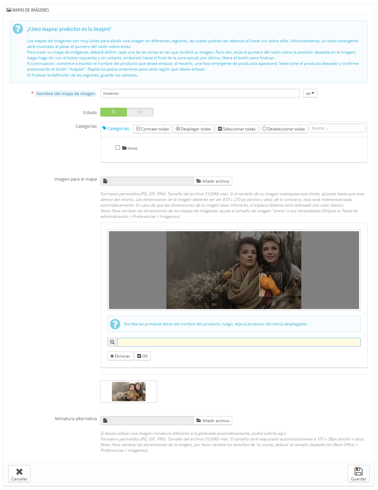

# Mapeo de imágenes

El mapeo de imágenes era una funcionalidad introducida en la versión 1.1 de PrestaShop, y que estuvo disponible hasta la versión 1.5 inclusive.\
**La nueva instalación de PrestaShop 1.6 no cuenta con esta funcionalidad habilitada de forma predeterminada, aunque las tiendas que han sido actualizadas a esta versión 1.6 pueden todavía utilizarla.**\
****

Si has realizado una nueva instalación de PrestaShop 1.6 y quieres seguir utilizando el mapeo de imágenes sigue las siguientes instrucciones:

1. Abre la página Administración > Menús.
2. Haz clic en "Añadir nuevo"
3. En el formulario, otorgue un nombre a la página (a priori, mapa de imágenes), y teclea "AdminScenes" en el campo "Clase". Deja el campo "Módulo" vacío, y selecciona "Catálogo" en la lista desplegable Padre (Pestaña).
4. Guarda el formulario. El mapa de imágenes aparecerá tras este proceso como página dentro del menú Catálogo.

**Ten en cuenta que esta función está obsoleta, y no tendrás ningún tipo de soporte por parte del equipo de PrestaShop.**

Los mapas de imágenes son muy útiles para dividir una imagen en diferentes regiones, las cuales podrán ser abiertas al hacer clic sobre ellas. Con esto puedes lograr que diferentes páginas de productos puedan abrirse haciendo clic sobre esta única imagen. Esta característica hace que tu sitio sea muy atractivo y facilita la navegación a tus clientes.

Antes de crear un mapa de imagen, debes tener una imagen que cuente con variaciones de un producto, o diferentes productos en conjunto.

Al hacer clic en la opción del menú "Mapas de imágenes", el navegador redirecciona a una nueva página, la cual muestra una lista de los mapas de imágenes registrados actualmente, si hubiese alguno creado.

Para crear un nuevo mapa, haz clic en el botón "Añadir nuevo". A continuación, aparecerá la pantalla de creación.

* **Nombre del mapa de imagen**. Introduce un nombre para el mapa de imagen.
* **Estado**. Si el mapa de imagen está disponible o no. Puedes optar por aplazar su disponibilidad hasta que hayas terminado la configuración a todos los enlaces.
* **Imagen para el mapa**. Selecciona la imagen que deseas que represente al mapa de imagen, a continuación, haz clic en "Guardar y permanecer". La página actual será recargada, con la imagen que ha subido, y muchas más opciones.

Ahora vamos a aprender a crear un mapa de imagen. Haz clic en cualquier parte de la imagen y arrastra el ratón sobre uno de los productos presentados, con el fin de resaltar/cortar la parte de la imagen que quiera que sea clicable por el usuario.

Tu selección pasará a ser clara y luminosa, mientras que el resto de la imagen se oscurecerá. Presta atención y alinea cuidadosamente el marco de la selección con la zona en la que el cliente podrá hacer clic.

Una vez realizado esto:

1. En el campo justo debajo de la imagen, escribe las primeras letras del producto asociado con la zona seleccionada.\
   En nuestro ejemplo, podríamos escribir "vestido" y nos aparecerían varias opciones. A continuación, podríamos seleccionar el producto "Vestido estampado".
2. Confirma tu selección haciendo clic en "Aceptar". Tu mapa de imagen habrá sido creado.

Repite este proceso para todos los productos de esta imagen que deseas que sean accesibles con un clic.

Las zonas clicables son visibles gracias al icono "+". Al pasar el cursor del ratón por encima de la imagen, se puede ver una pequeña ventana que muestra el nombre de la imagen, la imagen predeterminada, la descripción corta y el precio.

Si has cometido un error en tu área seleccionable, puedes redimensionarla arrastrando sus lados o esquinas.

Si deseas eliminar un área seleccionable, sólo tienes que seleccionar la zona y hacer clic en el botón "Eliminar" que aparece dentro de la imagen.

Por último, debes asignar el mapa de imagen a una categoría. Esto se hace marcando las casillas de la tabla de "Categorías".

Una vez realizadas todas las modificaciones, guarda todos tus cambios.

Tu mapa de imagen estará ahora disponible en tu tienda, en las categorías seleccionadas.
