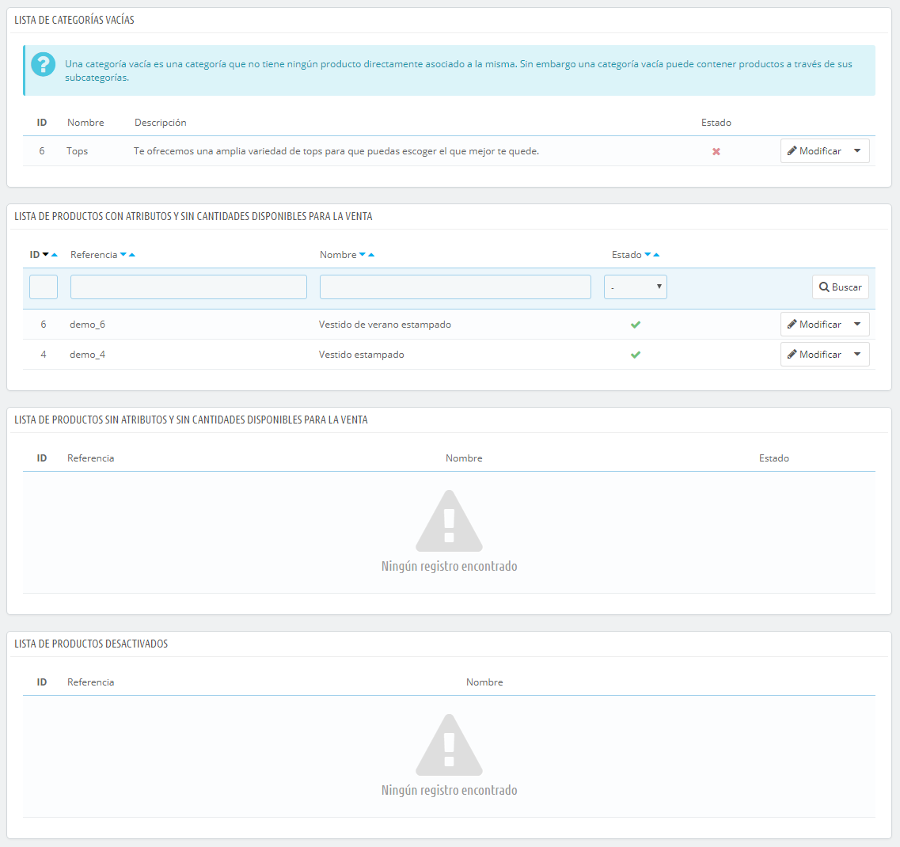

# Monitorear tu Catálogo

La página "Monitoreo" lista las secciones de tu tienda a la que debes prestar mayor atención con el fin de gestionar mejor tu catálogo, y asegurarte de que nada está fuera de control.

Cuatro secciones son mostradas:

* **Lista de categorías vacías**. Muestra las categorías que no tienen ningún producto. Debes eliminar estas categorías vacías, o llenarlas con al menos un producto. Esto evita que los clientes encuentren en una categoría vacía en tu tienda.
* **Lista de productos con atributos y sin cantidades disponibles para la venta**. Muestra los productos que ya no están a la venta. Adopta las medidas necesarias para reponerlos.
* **Lista de productos sin atributos y sin cantidades disponibles para la venta**. Al igual que en la opción anterior, también muestra productos que ya no están a la venta. Adopta las medidas necesarias para reponerlos.
* **Lista de productos desactivados**. Muestra los productos que han sido desactivados en la tienda y que no son visibles portus clientes. Considera la posibilidad de habilitarlos (quizás después de una reposición de stock) o eliminarlos de tu catálogo.

La página "Monitoreo" debe ser revisada regularmente con el fin de mejorar la gestión de tu catálogo.
