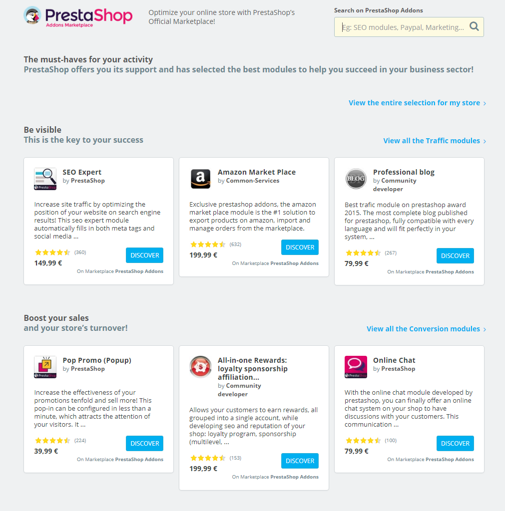
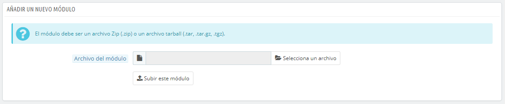
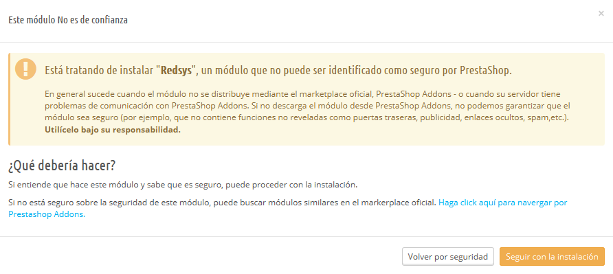
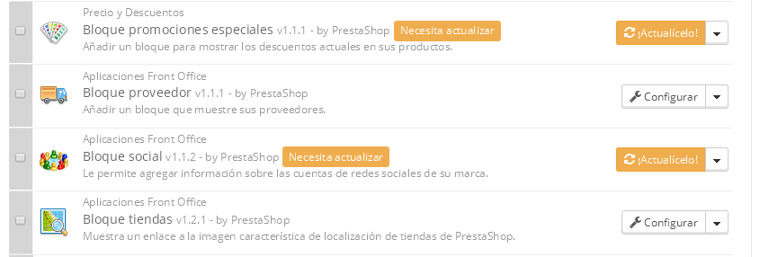
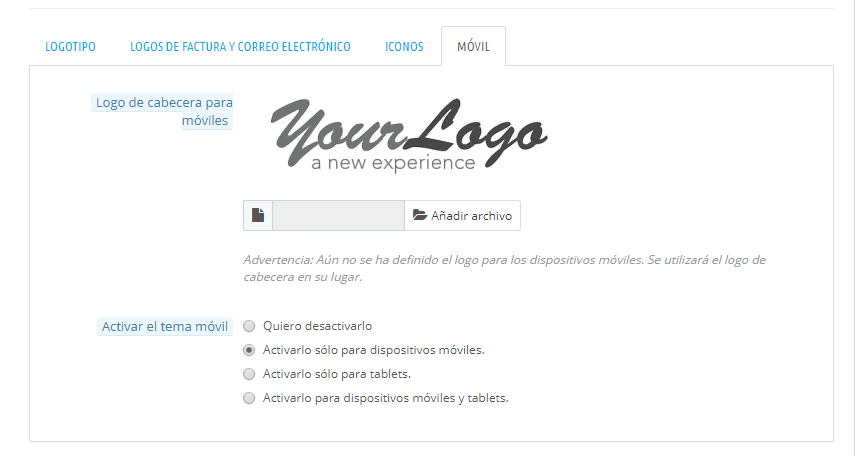

# Catálogo de Módulos y Temas

**Tabla de contenidos**

* [Catálogo de Módulos y Temas](catalogo-de-modulos-y-temas.md#CatálogodeMódulosyTemas-CatálogodeMódulosyTemas)
  * [Instalar un módulo](catalogo-de-modulos-y-temas.md#CatálogodeMódulosyTemas-Instalarunmódulo)
    * [Instalación mediante el formulario específico](catalogo-de-modulos-y-temas.md#CatálogodeMódulosyTemas-Instalaciónmedianteelformularioespecífico)
    * [Instalación mediante un cliente FTP](catalogo-de-modulos-y-temas.md#CatálogodeMódulosyTemas-InstalaciónmedianteunclienteFTP)
  * [Actualizar un módulo](catalogo-de-modulos-y-temas.md#CatálogodeMódulosyTemas-Actualizarunmódulo)
  * [Desinstalar un módulo](catalogo-de-modulos-y-temas.md#CatálogodeMódulosyTemas-Desinstalarunmódulo)
  * [Instalar un tema](catalogo-de-modulos-y-temas.md#CatálogodeMódulosyTemas-Instalaruntema)
    * [Instalación mediante el módulo de importación/exportación de temas](catalogo-de-modulos-y-temas.md#CatálogodeMódulosyTemas-Instalaciónmedianteelmódulodeimportación/exportacióndetemas)
    * [Instalación mediante un cliente FTP](catalogo-de-modulos-y-temas.md#CatálogodeMódulosyTemas-InstalaciónmedianteunclienteFTP.1)
  * [Exportar un tema](catalogo-de-modulos-y-temas.md#CatálogodeMódulosyTemas-Exportaruntema)
  * [Plantilla móvil de PrestaShop](catalogo-de-modulos-y-temas.md#CatálogodeMódulosyTemas-PlantillamóvildePrestaShop)
    * [Instalar una plantilla móvil para tu tienda](catalogo-de-modulos-y-temas.md#CatálogodeMódulosyTemas-Instalarunaplantillamóvilparatutienda)
    * [Personalizar la plantilla móvil](catalogo-de-modulos-y-temas.md#CatálogodeMódulosyTemas-Personalizarlaplantillamóvil)
    * [Utilizar la plantilla móvil con otro tema](catalogo-de-modulos-y-temas.md#CatálogodeMódulosyTemas-Utilizarlaplantillamóvilconotrotema)

## Catálogo de Módulos y Temas 

PrestaShop viene acompañado con más de 100 módulos, Sin embargo, puedes añadir más módulos si encuentras alguna limitación que no puedes resolver con ninguno de los módulos incluidos, o si deseas explorar e incluir otras posibilidades.

Hay un gran número de módulos disponibles en el sitio web PrestaShop Addons ([http://addons.prestashop.com/](http://addons.prestashop.com/)). Algunos son gratuitos, otros de pago, pero ¡seguro que encuentras alguno que se adapte a tus necesidades!. Si eres un experto desarrollador de módulos o diseñador de temas, ¡puedes incluso publicar tus propias creaciones, y venderlas en PrestaShop Addons!.

La página "Catálogo de Módulos y Temas" te ofrece un rápido y sencillo acceso a la base de datos de módulos y temas de PrestaShop Addons. Su interfaz incluye:

* Un campo de búsqueda, desde el que puedes buscar lo que necesites en todo el contenido de PrestaShop Addons.
* Una lista de 8 módulos que puedes comprar directamente.
* Una lista de 12 temas que puedes comprar directamente.

Al realizar una búsqueda en el campo de búsqueda, serás redireccionado al sitio web Prestashop Addons, donde puedes buscar lo que necesites en el contenido completo de módulos y temas.

Al hacer clic sobre un elemento se abrirá su página de información disponible en Addons, en una nueva pestaña del navegador.

Addons es el marketplace oficial de Módulos y Temas de PrestaShop. Aquí es donde los propietarios de tiendas pueden obtener todos los complementos necesarios para personalizar su tienda, y donde los autores pueden compartir sus creaciones con la comunidad.

Los módulos y temas pueden ser gratuitos o de pago: el precio es establecido por el autor. Tómate el tiempo necesario para estudiar con detalle los módulos y temas disponibles, ya que porque algo sea más caro, no significa que tenga que ser mejor.

Debes estar logueado para poder descargar o calificar un complemento. Crear una cuenta es gratis.

### Instalar un módulo 

Una vez que hayas descargado un módulo desde el sitio web PrestaShop Addons, te corresponde a ti instalarlo en tu tienda PrestaShop.

Hay dos formas de instalar un módulo: mediante el formulario específico, o utilizando un cliente FTP.

#### Instalación mediante el formulario específico 

Para instalar un nuevo módulo de PrestaShop automáticamente, haz clic sobre el botón "Añadir nuevo módulo" situado en la parte superior del listado de módulos, en la página "Módulos y Servicios". Una nueva sección aparecerá:

El formulario de esta sección te permite subir el archivo del módulo, descargado desde Addons. Puedes subir un archivo `zip`, o `tar.gz` (tarball) mediante este formulario, para ello simplemente busca el archivo del módulo que has descargado, y haz clic en el botón "Subir este módulo". ¡No selecciones como ubicación la carpeta donde tengas descomprimido el módulo o alguno de tus archivos!.

Una vez que hayas hecho clic en el botón, PrestaShop subirá el módulo desde tu ordenador a tu servidor, lo descomprimirá, colocará los archivos en la ubicación correcta, y actualizará la página, todo esto en pocos segundos. PrestaShop mostrará entonces el mensaje "El Módulo ha sido subido correctamente".

Los módulos no se instalan por defecto: así que tendrás que hacer clic en el botón "Instalar" del módulo, y posiblemente configurar algunos de sus ajustes.

Una vez finalizada la configuración, asegúrate de probar el módulo inmediatamente para confirmar que funciona según lo previsto.

#### Instalación mediante un cliente FTP 

Para instalar un nuevo módulo de PrestaShop manualmente:

1. Descomprime el archivo del módulo (`.zip` o `tar.gz`). Tras este proceso deberás obtener una nueva carpeta.
2. Utilizando un cliente FTP, transfiere la carpeta del módulo descomprimido, dentro de la carpeta `/modules` de PrestaShop.\
   &#x20;Presta atención y NO subas esa carpeta, en la carpeta de otro módulo (cosa que puede ocurrir si arrastras y sueltas archivos utilizando el ratón). Sube tanto la carpeta como los archivos que ésta contiene, no solamente los archivos.
3. Dirígete en el back-office, al menú "Módulos".
4. Busca el nuevo módulo en el listado de módulos. Es posible que tengas que desplazar la página hacía abajo; aunque también puedes utilizar el buscador, que te ofrecerá una lista actualizada dinámicamente de los módulos cuyos nombres coincidan con lo que vayas escribiendo en el campo de búsqueda.
5. En la fila correspondiente al nuevo módulo, haz clic en el botón "Instalar".
6. Tu módulo estará ahora instalado, pero deberás activarlo si así lo deseas. Si es necesario, haz clic en el enlace de "Configuración" del módulo. También, presta atención a cualquier mensaje de advertencia que pueda presentarte PrestaShop en pantalla.

Una vez finalizada la configuración, asegúrate de probar el módulo inmediatamente para confirmar que funciona según lo previsto.

Los módulos pueden provenir de muchas fuentes, y no todos ellos son confiables. Esta es la razón por la que PrestaShop 1.6.0.7 introdujo una ventana de advertencia para los módulos "no verificados" – estos son módulos que no han sido verificadas por PrestaShop a través del marketplace  Addons. Esta ventana te permite elegir si deseas continuar con la instalación sin recibir más notificaciones, o detener el proceso de instalación.

La instalación de un módulo nativo o un módulo obtenido a través de Prestashop Addons no producirá la aparición de esta ventana de advertencia.

### Actualizar un módulo 

PrestaShop comprueba periódicamente si hay alguna actualización disponible para tus módulos, en el servidor de PrestaShop Addons. Si es así, PrestaShop mostrará un enlace "¡Actualízalo!" en los módulos correspondientes. Simplemente haz clic en dicho botón, y PrestaShop se encargará de descargar y actualizar el módulo.

### Desinstalar un módulo 

**¡Nunca elimines un módulo eliminando su carpeta directamente desde tu cliente FTP!** Deja a PrestaShop hacerse cargo de esto.

Si quieres dejar de utilizar un módulo, pero deseas conservar su configuración, puedes simplemente desactivarlo: haciendo clic en el enlace: "Desactivar". Tras realizar esto, las acciones disponibles para el módulo se convertirán en "Activar" y "Eliminar", además el botón "Desinstalar" continuará estando disponible.

Si no te preocupa perder la configuración del módulo, haz clic en el botón "Desinstalar": la carpeta de tu módulo continuará existiendo en la carpeta `/modules` de Prestashop, pero el módulo no tendrá ningún impacto en tu tienda.\
&#x20;Si deseas eliminar por completo el módulo de tu servidor, haz clic en el enlace "Eliminar": PrestaShop eliminará la carpeta y todos los archivos que lo componen.

Asegúrate que tras desactivar o eliminar el módulo, el tema de tu tienda continúa mostrándose correctamente.

### Instalar un tema 

Una vez que hayas descargado un tema desde el sitio web PrestaShop Addons, te corresponde a ti instalarlo en tu tienda PrestaShop.

#### Instalación mediante el módulo de importación/exportación de temas 

Este es el método recomendado, ya que preserva todas las posiciones de los bloques en sus respectivos ganchos (hooks).

PrestaShop tiene un importador nativo de temas, al que puedes acceder desde la página "Temas", bajo el menú "Preferencias". Haz clic en el botón "Añadir nuevo tema", situado en la parte superior de la pantalla. Esta pantalla presenta 3 métodos para instalar (o "importar") un nuevo tema: desde tu ordenador, desde un sitio web público, o desde tu propio servidor FTP. También dispones de un método para crear un tema nuevo desde cero.

**Importar un tema**

Sea cual sea el método que elijas, el proceso es siempre el mismo: indicar la ubicación del archivo Zip del tema, y a continuación, hacer clic en el botón "Siguiente".

**Importar desde tu ordenador**: utiliza el explorador de archivos para encontrar el archivo.\
&#x20;**Importar desde la web**: indica la dirección URL del archivo.\
&#x20;**Importar desde un cliente FTP**: utiliza tu cliente FTP y transfiere el archivo a la siguiente carpeta:: `/modules/themeinstallator/import/` .

La siguiente página mostrará un resumen rápido de lo que el importador está a punto de hacer.

Haz clic de nuevo en "Siguiente" para validar tu elección. Una vez instalado el tema, PrestaShop te preguntará si deseas instalar los módulos que fueron importados junto con el tema, qué prefieres hacer con la configuración actual de los módulos, y si deseas que la configuración de las imágenes sea tomada en cuenta.

Haz clic en "Siguiente" por última vez. Una página final de confirmación te presenta todos los cambios aplicados a tu sitio PrestaShop. Haz clic en "Finalizar" para terminar el proceso.

#### Instalación mediante un cliente FTP 

Este método no se recomienda utilizarlo, aunque continúe disponible. Utilízalo con precaución: tus bloques podrían perder la posición que ocupan actualmente en los respectivos ganchos (hooks).

Para instalar un nuevo tema PrestaShop vía FTP:

1. Descomprime el archivo del módulo (`.zip`). Tras este proceso deberás obtener una nueva carpeta, `/themes`, cuyo interior contiene la carpeta(s) de tu tema.
2. Utilizando un cliente FTP, transfiere la carpeta del tema descomprimido, dentro de la carpeta `/themes` de PrestaShop. Presta atención y NO subas esa carpeta, en la carpeta de otro tema (cosa que puede ocurrir si arrastras y sueltas los archivos utilizando el ratón). Sube tanto la carpeta como los archivos que ésta contiene, no solamente los archivos.
3. (opcional) Si el tema del archivo contiene una segunda carpeta `/modules` , significará que este tema se acompaña de una serie de módulos que son necesarios para que el tema funcione correctamente. Utilizando tu cliente FTP, transfiere la carpeta(s) local(es) `/modules` incluida(s) en el tema que deseas instalar, en la carpeta `/modules` de PrestaShop. Si el cliente FTP te advierte que ya cuentas con un módulo que tiene el mismo nombre, trata de mantener tan sólo la versión más reciente. Si no conoces cuál es la versión más reciente de los módulos, mantén la versión incluida con el tema, ya que es probable que funcione mejor y no te dé problemas de compatibilidad.
4. Dirígete en el back-office de tu tienda, a la página "Temas" bajo el menú "Preferencias".
5. Selecciona el nuevo tema en lugar del tema actual, haciendo clic en el botón de radio y luego haz clic en "Guardar".
6. Tu tema estará ahora instalado.
7. (opcional) Si el tema viene con módulos, actívalos en la página "Módulos y Servicios" del back-office, a continuación, configúralos si es necesario.

Algunos temas vienen con un archivo adjunto llamado `Install.txt`, que te ofrece instrucciones sobre cómo instalar y configurar el tema. Asegúrate de seguir los pasos detallados de ese archivo.

Una vez finalizada la configuración, asegúrate de probar el tema inmediatamente para confirmar que funciona según lo previsto. Prueba a realizar una compra, desde A a Z – para asegurarte que los clientes pueden completar sus compras, y comprobar que el tema instalado no está incompleto.

### Exportar un tema 

La exportación de un tema puede ser útil cuando quieras realizar una copia de seguridad del mismo, cuando quieras compartir el tema con un amigo, o para vender el tema en el sitio web PrestaShop Addons ([http://addons.prestashop.com/](http://addons.prestashop.com/)). El exportador no sólo genera un archivo zip del tema, sino que también añade una gran cantidad de información en archivos XML, lo que te resultará muy útil cuando lo subas al sitio web PrestaShop Addons, y cuando lo importes en otra tienda PrestaShop.

Al igual que para importar un tema, hay dos maneras de poder exportar un tema: utilizando el propio exportador de PrestaShop, o utilizando el módulo Template Installer:

* Para hacerlo con el exportador de Prestashop: haz clic en el botón "Exportar tema" situado en la parte superior del menú "Temas" (en el menú "Preferencias").
* Para hacerlo con el módulo Template Installer: abre la página de configuración del módulo, y a continuación, dirígete a la sección "Exportar un tema".

Selecciona un tema y haz clic en "Exportar este tema". Un formulario de configuración aparecerá en pantalla, donde puedes configurar los parámetros del tema a exportar:  autor, nombre del tema, versión de compatibilidad, módulos adjuntos (si tuviese), etc.

Una vez que todos los parámetros hayan sido establecidos correctamente, haz clic sobre "Generar el archivo". Tras unos segundos, obtendrás un archivo para descargar desde el navegador. Guárdalo en el disco duro de tu equipo, a continuación, proporciona al archivo un nombre apropiado para guardarlo. A partir de este instante, podrás compartir fácilmente este tema y si tu eres su creador, podrías venderlo en el marketplace oficial de PrestaShop: [http://addons.prestashop.com/](http://addons.prestashop.com/).

### Plantilla móvil de PrestaShop 

La plantilla móvil permite a cualquier comerciante PrestaShop que su tienda sea accesible desde dispositivos móviles: desde la página inicial a la del proceso de pago, pasando por las páginas de productos y la del embudo de conversión.

#### Instalar una plantilla móvil para tu tienda 

Instalar una plantilla móvil en PrestaShop es fácil:

1. Conéctate al panel de administración de tu tienda.
2. Dirígete a la página "Temas" bajo el menú "Preferencias".
3. En la sección "Dispositivos Móviles", dirígete a la opción "Activar el tema móvil" y elige una opción de las tres disponibles que no sea "Quiero desactivarlo.

De manera predeterminada, la plantilla móvil es sólo utilizada por teléfonos móviles, las tabletas recibirán el mismo tema que los dispositivos convencionales. Con esta opción, puedes elegir que la plantilla móvil sea utilizada por las tabletas (opción "Activarlo para dispositivos móviles y tablets"), o incluso elegir que sólo se utilice para las tabletas (los teléfonos móviles recibirán el mismo tema que los dispositivos convencionales).

#### Personalizar la plantilla móvil 

Los archivos de la plantilla móvil se encuentran en la subcarpeta /mobile de la carpeta del tema actual. De esta manera, si el tema actual es el tema predeterminado de PrestaShop, los archivos de la plantilla móvil estarán en la carpeta `/themes/default/mobile` de PrestaShop.

El tema está realizado con archivos HTML, CSS y JavaScript: por lo tanto, su estructura es la misma que la de cualquier tema por defecto, pero su diseño es radicalmente diferente, ya que ésta fue creada para adaptarse a las pequeñas pantallas de los dispositivos móviles.

Por lo tanto, si quieres cambiar los colores o el diseño de las páginas de la plantilla móvil, debes editar los archivos CSS y/o HTML con el fin de adaptarlos a tus gustos. Deberás tener un buen conocimiento de  lenguajes de programación web, o pedir ayuda a un desarrollador web.

#### Utilizar la plantilla móvil con otro tema 

La plantilla móvil sólo está disponible si el tema actual tiene una subcarpeta `/mobile` en su propia carpeta. De ahí que numerosos temas de PrestaShop no tienen un tema móvil adecuado, y los propietarios de las tiendas que utilizan estos temas, no pueden ofrecer de forma automática una versión móvil a sus visitantes.

Mientras que el tema que estés utilizando no sea actualizado con un tema móvil, puedes utilizar la plantilla predeterminada, gracias a una rápida manipulación de archivos: sólo tiene que copiar la subcarpeta `/mobile` de la carpeta `/themes/default` y pegar esta subcarpeta (y todos sus archivos) en la carpeta de tu tema actual.

Al realizar esta acción, tu tienda utilizará la plantilla predeterminada para la versión móvil, en lugar de una plantilla acorde con tu tema principal, pero nada te impide que puedas editar los archivos HTML, CSS y JavaScript de la plantilla móvil para obtener un resultado más parecido al diseño de tu propio tema.
