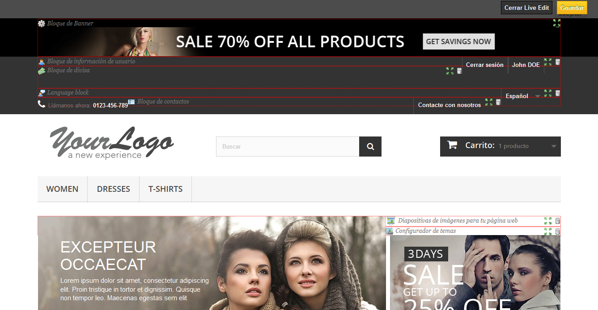

# Posiciones de los módulos en el Front-Office

* [Posiciones de los módulos en el Front-Office](posiciones-de-los-modulos-en-el-front-office.md#PosicionesdelosmódulosenelFront-Office-PosicionesdelosmódulosenelFront-Office)
  * [Mover un módulo dentro de un hook](posiciones-de-los-modulos-en-el-front-office.md#PosicionesdelosmódulosenelFront-Office-Moverunmódulodentrodeunhook)
  * [Insertar un módulo en un hook: Trasplantar](posiciones-de-los-modulos-en-el-front-office.md#PosicionesdelosmódulosenelFront-Office-Insertarunmóduloenunhook:Trasplantar)
  * [Editar un módulo trasplantado](posiciones-de-los-modulos-en-el-front-office.md#PosicionesdelosmódulosenelFront-Office-Editarunmódulotrasplantado)
  * [Eliminar un módulo de un hook](posiciones-de-los-modulos-en-el-front-office.md#PosicionesdelosmódulosenelFront-Office-Eliminarunmódulodeunhook)
  * [Trasplantar un módulo visualmente: Live Edit](posiciones-de-los-modulos-en-el-front-office.md#PosicionesdelosmódulosenelFront-Office-Trasplantarunmódulovisualmente:LiveEdit)
    * [¿A dónde mover los módulos?](posiciones-de-los-modulos-en-el-front-office.md#PosicionesdelosmódulosenelFront-Office-¿Adóndemoverlosmódulos?)
  * [Trasplantar un módulo modificando su código](posiciones-de-los-modulos-en-el-front-office.md#PosicionesdelosmódulosenelFront-Office-Trasplantarunmódulomodificandosucódigo)

Un módulo puede tener dos aspectos: uno en el back-office (sus opciones, o incluso su pantalla de configuración), y el otro en el front-office. La parte front-office corresponde a cómo y dónde se mostrará el módulo en el tema utilizado por tu tienda.

La posición de un módulo en el tema de tu tienda tema puede ser cambiada, debido a que es posible que desees que el bloque de un módulo esté posicionado más arriba (o más abajo) en la página que otros. En la jerga PrestaShop, a esta acción se la denomina "trasplante", y se realiza mediante la herramienta disponible en la página "Posiciones de los módulos", bajo el menú "Módulos y Servicios". En realidad, ésta te permite conectar un módulo a uno de los muchos hooks (también denominados ganchos)) disponibles en el tema actual, sin necesidad de escribir ningún código.

La página "Posiciones de los módulos" te muestra todos los hooks o ganchos disponibles, así como los módulos correspondientes que están enganchados a ellos. Muchos están vacíos por defecto, pero la mayoría utilizan  fácilmente una docena de módulos (el hook Header, perteneciente a la cabecera de la tienda, tiene 33 módulos de forma predeterminada).


En la parte superior de la página, un menú desplegable te permite mostrar sólo el hook en el que estés interesado.\
&#x20;De forma predeterminada, la lista sólo muestra los hooks en los cuales puedes posicionar módulos. Al marcar la casilla "Mostrar hooks invisibles" se mostrarán todos los hooks, incluso aquellos en donde no puedes colocar nada.

La cabecera de la tabla para cada hook muestra el nombre del hook, su nombre técnico (para algunos de ellos, una rápida descripción), y su número de módulos conectados. La tabla muestra los módulos que están conectados a ese hook.

Los módulos son mostrados en el orden en el que aparecen en el hook.

## Mover un módulo dentro de un hook <a href="#posicionesdelosmodulosenelfront-office-moverunmodulodentrodeunhook" id="posicionesdelosmodulosenelfront-office-moverunmodulodentrodeunhook"></a>

Tienes dos maneras de cambiar la posición de un módulo dentro de un hook:

* Haciendo clic en las flechas arriba o abajo. La página se actualizará y mostrará el nuevo orden.
* Arrastrando y soltando el módulo a la posición deseada:\

  1. Coloca el cursor del ratón entre las flechas de movimiento y el nombre del módulo para que este cambie a un cursor de "movimiento de elementos". Lo reconocerás porque el cursor se convierte en una cruz.
  2. Haz clic con el botón derecho del ratón y mantenlo presionado, mientras mueves el cursor del ratón a la fila / posición deseada: el módulo pasará a ocupar la fila / posición correspondiente.
  3. Suelta el botón derecho del ratón: para guardar la nueva posición del módulo.

Para la mayoría de los módulos, el trasplante se puede hacer fácilmente a través del back-office. Algunos módulos requieren una modificación en su código para poder trasplantarlos.

## Insertar un módulo en un hook: Trasplantar <a href="#posicionesdelosmodulosenelfront-office-insertarunmoduloenunhook-trasplantar" id="posicionesdelosmodulosenelfront-office-insertarunmoduloenunhook-trasplantar"></a>

En PrestaShop, "trasplantar" es la acción de insertar un módulo en un hook. Puedes añadir un módulo a más de un hook.

Hay dos cosas que debes conocer antes de trasplantar un módulo:

* Algunos módulos están escritos para sólo poder conectarlos a un conjunto de hooks específicos.
* Algunos hooks han sido desarrollados para no aceptar ciertos tipos de módulos.

Por lo tanto, debes ser consciente de que no siempre puedes trasplantar cualquier módulo a cualquier hook.

Asegúrate de desactivar la caché cuando añadas un nuevo módulo a un hook, o lo cambies de posición , ya que no podrás ver el cambio producido en el front-office. Puedes hacer esto en la página "Rendimiento", bajo el menú "Parámetros avanzados".

El proceso de trasplante tiene su propia interfaz:

1. Dirígete a la página "Posiciones de los módulos", disponible en el menú "Módulos".
2. Haz clic en el botón "Insertar un módulo" situado en la parte superior derecha. La interfaz de trasplante de módulos, aparecerá en pantalla.
3. En la lista desplegable "Módulo", selecciona el módulo que deseas trasplantar.
4. En la lista desplegable "Mover a", selecciona el lugar donde quieres trasplantar el módulo. Hay muchos hooks disponibles. Puedes cambiar tu decisión más tarde si es necesario.
5. En el campo "Excepciones", escribe el nombre del archivo(s) correspondiente(s) a las páginas en las que no deseas que el módulo aparezca.\
   Puedes realizar una selección múltiple, haciendo clic en los nombres de archivo mientras mantienes pulsada la tecla Ctrl. Puedes anular la selección de los archivos de la misma manera: Ctrl + clic.
6. No olvides guardar los cambios realizados.


El menú desplegable "Insertar hook en" te ofrece información sobre dónde puedes colocar el módulo.

A pesar de que en la lista desplegable "Mover a" te ofrece una vista global de los hooks disponibles, no siempre puedes ser del todo esclarecedora, sobre cuando se trata de encontrar un punto en particular donde insertar el módulo. No dudes en probar con otro hook, si el resultado de tu elección no es el que esperabas.\
La lista te da algunos detalles más: algunos hooks tienen tras su nombre una breve descripción de lo que hacen, por ejemplo " Add fields to the form 'attribute value'" para displayAttributeForm. Examínalos a todos con detenimiento con el fin de elegir el hook correcto.

## Editar un módulo trasplantado <a href="#posicionesdelosmodulosenelfront-office-editarunmodulotrasplantado" id="posicionesdelosmodulosenelfront-office-editarunmodulotrasplantado"></a>

Cada módulo tiene dos iconos en el lado derecho de su fila: uno para editar su configuración, el otro para eliminar el módulo.

Para editar la configuración de un módulo se utiliza la misma interfaz que para el trasplante de módulos. La principal diferencia es que no puedes cambiar la configuración de "Módulo" e "Insertar hook en", ya que están deshabilitados, y por tanto aparecerán en color gris. Tan solamente puedes cambiar la configuración de las excepciones, que funciona como se ha descrito en la sección anterior "Insertar un módulo a un hook: Trasplantar".\
&#x20;Aunque no puedas editar la configuración de "Módulo" y de "Mover a", estos pueden servirte para que recuerdes la posición actual del módulo, en caso de que más tarde desees volver a posicionarlo en su sitio originario.


Si quieres mover un módulo a otro hook, debes utilizar la interfaz de trasplante:

1. Haz clic en el botón "Insertar un hook" situado en la parte superior derecha. La interfaz de trasplante de módulos, aparecerá en pantalla.
2. En la lista desplegable "Módulo", selecciona el módulo que deseas mover a otro hook.
3. En la lista desplegable "Mover a", selecciona el lugar donde quieres trasplantar el módulo.
4. En el campo "Excepciones", escribe el nombre del archivo(s) correspondiente(s) a las páginas en las que no deseas que el módulo aparezca.
5. Guarda tus cambios. El hook aparece en la lista.
6. Dirígete al hook en el que has trasplantado el módulo: éste debe aparecer aquí. Cambia su posición si es necesario.
7. Dirígete al hook donde estaba el módulo originariamente, y haz clic en el icono de la papelera para eliminarlo de este hook. Esto evita que el mismo módulo aparezca dos veces.

Siempre debes comprobar el front-office de tu tienda, para asegurarte de que el módulo aparece en donde deseas.

## Eliminar un módulo de un hook <a href="#posicionesdelosmodulosenelfront-office-eliminarunmodulodeunhook" id="posicionesdelosmodulosenelfront-office-eliminarunmodulodeunhook"></a>

Hay dos maneras de eliminar un módulo(s) de un hook:

* Eliminar un sólo módulo: haz clic en el icono del bote de basura la papelera situado a la derecha de la fila del módulo.
* Eliminar un lote de módulos: selecciona los módulos marcando las casillas situadas a la derecha de la fila, y a continuación, haz clic en el botón "Eliminar hooks seleccionados", que encontrarás tanto en la parte superior como en la parte inferior del listado de hooks.

## Trasplantar un módulo visualmente: Live Edit <a href="#posicionesdelosmodulosenelfront-office-trasplantarunmodulovisualmente-liveedit" id="posicionesdelosmodulosenelfront-office-trasplantarunmodulovisualmente-liveedit"></a>

Otra forma de posicionar los módulos en la página principal de la tienda es mediante el modo LiveEdit, que incrusta en dicha página de inicio una herramienta que permite decidir visualmente dónde colocar los módulos. Puedes acceder a este modo desde la página "Posiciones de los módulos", haciendo clic en el botón "Inicie LiveEdit".


Al hacer clic en este botón, PrestaShop abre la página principal de la tienda en una nueva ventana / pestaña de tu navegador, mostrando el Live Edit script en la parte superior de la pantalla:

* Todos los bloques de módulos tienen un borde de puntos rojos, que te permite observar los bloques que puedes mover.
* En la parte superior izquierda de cada bloque, aparece unos iconos específicos, junto con el nombre del bloque, que te permite encontrar fácilmente los diferentes bloques.
* La parte superior derecha de cada bloque, muestra dos iconos:\

  1. Un icono "mover": haz clic sobre éste para empezar a mover el módulo por la página.
  2. Un icono "papelera": haz clic sobre éste para eliminar el bloque de la página principal.



En la parte superior del modo Live Edit, una barra de herramientas te presenta dos botones: "Cerrar Live Edit" y "Guardar".

El primer botón guarda los cambios realizados; el segundo botón cancela todos los cambios que hayas realizado en las posiciones de tus módulos durante esta sesión.

Una vez que hayas eliminado un módulo, si quieres recuperarlo y que vuelva a estar disponible en tu tienda, debes dirigirte a la página "Posiciones de los módulos" y utilizar el formulario "Trasplantar un módulo".

### ¿A dónde mover los módulos? <a href="#posicionesdelosmodulosenelfront-office-adondemoverlosmodulos" id="posicionesdelosmodulosenelfront-office-adondemoverlosmodulos"></a>

Los módulos no se pueden mover a cualquier lugar: esto depende tanto de los hooks disponibles en el tema, como del código fuente del módulo que puede permitir o no conectarlo a ciertos hooks (como se explicó en la sección anterior). Por lo tanto, sólo puedes mover los módulos dentro del contexto para el que fueron diseñados y programados: los módulos diseñados para trabajar en columnas pueden ser posicionados dentro de una columna, así como trasplantarlos de una columna a otra (por ejemplo, de izquierda a derecha), mientras que los módulos comunes (los que está en el centro) sólo pueden ser posicionados dentro de su columna específica.

Para que tengas una ayuda visual sobre donde puedes mover un módulo, PrestaShop te mostrará un bloque vacío con un borde punteado de color verde: si la ubicación es permitida, y un bloque vacío con un borde punteado de color rojo: si no puedes moverlo a esa ubicación.

## Trasplantar un módulo modificando su código <a href="#posicionesdelosmodulosenelfront-office-trasplantarunmodulomodificandosucodigo" id="posicionesdelosmodulosenelfront-office-trasplantarunmodulomodificandosucodigo"></a>

Esta opción es indicada tan sólo para usuarios expertos: debes tener un amplio conocimiento de PHP y HTML antes de realizar cualquier modificación a un módulo.

Algunos módulos no pueden ser trasplantados en otras secciones del front-office, porque carecen del código necesario.

Por ejemplo, el bloque "Búsqueda rápida" (`/blocksearch`) contiene archivos de plantilla para mostrarse tanto en las columnas como en la cabecera, mientras que el bloque "Monedas" (`/blockcurrencies`) sólo tiene un archivo de plantilla para hacerlo funcionar en la sección cabecera de la página. Del mismo modo, el bloque "Productos destacados" (`/homefeatured`) sólo puede ser posicionado en la sección central de la página principal.

Si quieres mostrar los módulos, como el bloque "Monedas" a una posición para la cual no fue programado, debes editar los archivos de su plantilla.\
Los módulos más complejos, como el bloque "Productos Destacados", también pueden ser modificados para aparecer en otras secciones de la página, pero puede ser que tengan que ser reprogramados parcialmente para que su diseño sea funcional en la nueva ubicación.

Para personalizar la posibilidad de trasplantar un módulo, debes otorgar a éste la función PHP exacta para el hook de destino. Por ejemplo, el bloque "Moneda" tiene esta función:

```
function hookTop($params)
  {
  ...
  }
```

Para trasplantar el bloque "Monedas" en la columna derecha, por ejemplo, necesitas añadir la función `hookRightColumn()`:

```
function hookRightColumn($params)
  {
  ...
  }
```

Una vez hecho esto, debes escribir el código que mostrará el contenido de la página principal. En el mejor de los casos, esto significa copiar/pegar el contenido de la función `hookTop()`; en el peor de los casos, necesitas reescribir el contenido de la función `hookTop()` para que funcione en la nueva ubicación.
