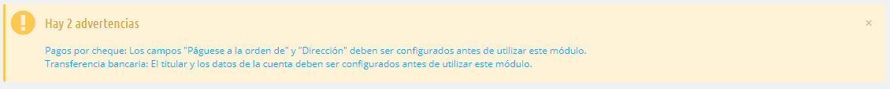
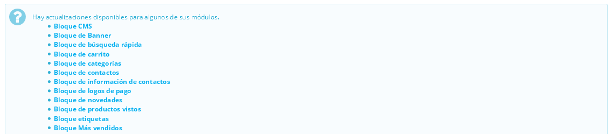
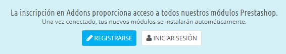
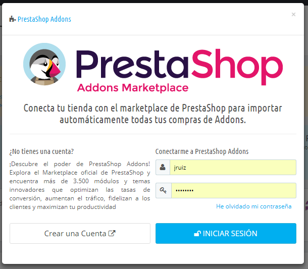
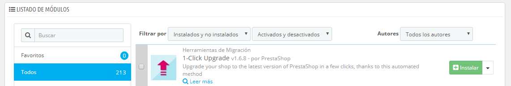
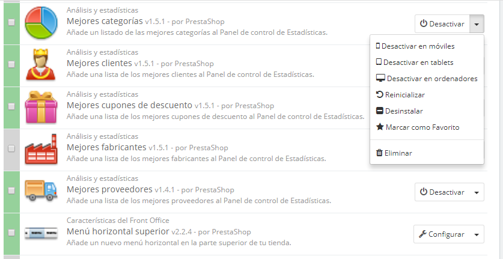

# Tus Módulos

La página "Módulos y Servicios" bajo el menú "Módulos y Servicios" te da acceso al listado de módulos. En esta página puedes instalar, desinstalar y configurar cada módulo. Todos los módulos nativos son explicados en profundidad en el capítulo "Trabajar con los módulos nativos". En este capítulo tan sólo se explica cómo funciona la página Módulos y Servicios.

## Notificaciones de los módulos 

Bajo la página del título, encontrarás en algunas ocasiones notificaciones de los módulos instalados. La mayoría de las veces, la notificación te ayudará a completar la configuración de los módulos que están instalados, pero que aún no están listos para ser utilizados: al actualizar su configuración la notificación desaparecerá... y el módulo funcionará correctamente a partir de ese instante, por lo que podrás utilizarlo desde ese mismo instante en tu tienda.

Cuando algunos de tus módulos tiene una actualización disponible en el marketplace oficial de PrestaShop (Addons), se te informará de ello, y un botón "Actualizar todo" aparecerá en la parte superior de la página. Haz clic en este botón para actualizar todos los módulos que tengas actualizaciones disponibles.

Por encima de la tabla de módulos hay dos botones, titulados "Vista normal" y "Vista favoritos". Estos dos botones cambian radicalmente la forma en que los módulos son listados.

## Conexión a Addons 

¡Los usuarios de PrestaShop Addons son ciudadanos de primera clase cuando se trata de gestionar módulos! En efecto, una vez que tu instalación de PrestaShop esté vinculada a tu cuenta en Addons, ¡los módulos que adquieras en Addons se instalarán y actualizarán automáticamente!

PrestaShop Addons es el marketplace oficial de PrestaShop donde puedes adquirir nuevos módulos y temas para tu tienda. Crear una cuenta en Addons es gratis, tan solamente tienes que hacer clic en el botón "Registrarse", el cual te dirigirá hasta el siguiente enlace: [https://addons.prestashop.com/es/login#createnow](https://addons.prestashop.com/en/login#createnow)

Si ya tienes una cuenta creada en Addons, haz clic en el botón "Iniciar sesión" para abrir la ventana de inicio de sesión.

Introduce tus credenciales, y a continuación, haz clic en el botón "Iniciar sesión": tu instalación de PrestaShop está ahora ligada a tu cuenta en Addons, y comenzará a buscar diferencias entre los módulos en local con los que obtuvo desde Addons, asegurándose de mantener cada uno disponible y actualizado!

## El listado de módulos 

Este listado te permite encontrar rápidamente el módulo que deseas instalar, así como cambiar los ajustes de configuración del mismo.

En la primera sección, puedes buscar un módulo específico, o filtrar los módulos hasta encontrar el que deseas.

* **Campo de búsqueda**. Los módulos coincidentes se muestran a medida que escribes en este campo, lo que hace que esta búsqueda sea más intuitiva y rápida.
* **Filtrar por selectores**. El listado de módulos se recargará automáticamente mostrando tan sólo los módulos que cumplan el criterio seleccionado.\

  * **Instalados y no instalados**. La mayoría de las veces, tendrás que realizar una acción sobre un módulo instalado, o instalar uno nuevo. Este filtro es el más comúnmente utilizado.
  * **Activados y desactivados**. Los módulos instalados son los únicos que pueden ser configurados, de ahí la importancia de este selector.
  * **Autores**. Puedes filtrar los módulos por autor. De manera predeterminada, sólo "PrestaShop" está disponible, pero como es posible que añadas más módulos, este selector te será de gran utilidad.

A la izquierda se encuentra el listado de  las categorías de los módulos, con el número de módulos disponibles en cada una de ellas entre paréntesis. Haz clic en una categoría para visualizar los módulos de esa categoría.\
&#x20;Una de las categorías disponibles es llamada "Favoritos" y está vacía de manera predeterminada. Esta categoría te permite reunir los módulos que más utilices, para acceder a ellos más rápidamente. Puedes establecer tus módulos favoritos utilizando la "Vista favoritos".

Los módulos pueden tener 4 estados:

* No instalado.
* Instalado pero desactivado.
* Instalado y activado.
* Instalado y activado, pero con advertencias.

Algunos módulos presentan un distintivo en forma de medalla con el texto de "Populares". Estos módulos se encuentran en realidad en el marketplace de PrestasShop (Addons). Estos módulos no son gratuitos: como comprobarás los módulos Populares, no cuentan con el botón "Instalar" sino con otro de "Añadir al carrito" al que le acompaña el precio de dicho módulo. Al hacer clic en dicho botón se abre la página del módulo en el marketplace de PrestaShop (Addons), donde puedes adquirirlo.

Diferencia entre desactivar y desinstalar

Si no deseas utilizar un módulo, puedes optar por desactivarlo o desinstalarlo. El resultado de ambas acciones es aparentemente la misma: el módulo deja de estar disponible, sus opciones ya no aparecen en el back-office de tu tienda, y cualquier elemento que éste hubiera añadido al front-end ya no se muestra.

La diferencia es que al desactivar un módulo mantienes su configuración de seguridad para una posterior re-activación, mientras que la desinstalación elimina todos sus datos de configuración.

Por lo tanto, sólo debes desinstalar un módulo si no te preocupa sus datos de configuración establecidos, o si estás seguro de que no lo necesitarás nunca más. En caso de que no quieras tener el módulo en tu tienda, puedes hacer clic en el enlace "Eliminar".

## Acciones que podemos realizar sobre los módulos 

Estas son las acciones disponibles, dependiendo del estado del módulo:

* Módulos desinstalados:
  * **Instalar**. Esta acción desencadenará la instalación del módulo en tu tienda PrestaShop. El módulo será activado automáticamente. Este podría añadir nuevas opciones al back office.
  * **Marcar como favorito**. Esta acción añade el módulo marcado como favorito a tu lista de Favoritos.
* Módulos instalados
  * **Configurar**. Algunos módulos tienen una página de configuración. En ese caso, ofrecen un enlace "Configurar" para acceder a una nueva interfaz donde el usuario puede ajustar su configuración.
  * **Desactivar**. Una vez instalado, el módulo está activado por defecto. Puedes desactivarlo, lo que eliminará sus opciones en el back office, pero conservarás su configuración para una posterior reactivación.\

    * **Desactivar/mostrar en móviles**. Esta opción desactivará que el módulo se muestre en el front-office de tu tienda solamente en los dispositivos móviles (teléfonos inteligentes, etc.).
    * **Desactivar/mostrar en tablets**. Esta opción desactivará que el módulo se muestre en el front-office de tu tienda solamente en tablets.
    * **Desactivar/mostrar en ordenadores**. Esta opción desactivará que el módulo se muestre en el front-office de tu tienda solamente en computadoras de escritorio.
  * **Reiniciar**. Esta acción restaurará la configuración del módulo a sus valores predeterminados.
  * **Desinstalar**. Esta acción desactivará el módulo y borrará sus datos.
  * **Marcar como favorito**. Esta acción añade el módulo a tu lista de Favoritos.
  * **Eliminar**. Esta acción eliminará el módulo de la lista de módulos, y borrará los archivos y carpetas de tu servidor.

Los módulos más destacados y recomendados por PrestaShop Addons pueden aparecer promocionados en tu listado de módulos, dependiendo de la configuración de tu país. Estos módulos pueden aparecer entre los módulos convencionales, y se distinguen porque sus botones de acción no muestran el botón de "Instalar", sino que en su lugar aparecerá el icono de un carrito de compra y el precio del módulo: "30 €", por poner un ejemplo. Al hacer clic en el botón serás redirigido a la página del módulo en PrestaShop Addons, desde la cual puedes comprar y descargar el módulo. Posteriormente, puedes instalarlo en tu tienda.

## Conectar a Addons (Marketplace oficial de Prestashop) 

En la configuración básica, la página de los módulos y servicios sólo te permitirá actualizar los módulos predeterminados, estos son los que vienen incluidos juntos con PrestaShop en su instalación. Si has comprado algún módulo en Addons, el marketplace oficial de PrestaShop, y deseas que éstos también se actualicen automáticamente, tienes que conectar tu tienda PrestaShop a Addons.

Haz clic en el enlace "Addons" situado en la parte superior de la pantalla: esta acción abrirá una ventana modal con un formulario para loguearte. Solamente tienes que rellenar el formulario con tus datos de acceso a Addons, y PrestaShop sabrá (y actualizará) los módulos que compraste. Haz clic de nuevo sobre el enlace "Addons", para mostrar la cuenta con la que iniciaste sesión.

Si los módulos que has comprado en Addons no se actualizan, ¡comprueba que realmente estás conectado a través de este formulario!.
