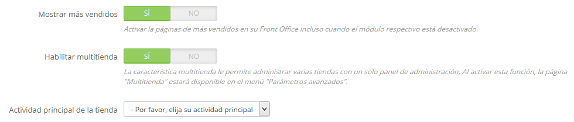

# Gestionar múltiples tiendas

Una de las principales funcionalidades de PrestaShop 1.5 es la llamada "multitienda", es decir, la capacidad de gestionar múltiples tiendas desde una misma interfaz back-office.

Gracias a esta funcionalidad, puedes gestionar varias tiendas que compartan elementos comunes. Para mejorar la eficiencia, puedes incluso crear grupos de tiendas.

## ¿Cómo saber si necesitas activar y utilizar la funcionalidad multitienda? 

En algunas ocasiones creemos necesaria la activación de la funcionalidad multitienda, cuando en realidad ésta no es necesaria. Por ejemplo, no es necesaria si quieres una tienda multi-idioma, si necesitas utilizar más de una moneda, o si te gustaría tener una plantilla gráfica diferente para cada categoría.

Hay dos preguntas que deberías de hacerte antes de decantarte por activar la función multitienda:

1. ¿Quieres que tus tiendas tengan diferentes precios para un mismo producto? (además de descuentos especiales para un cliente determinado o un grupo de clientes).\
   &#x20;**Si la respuesta es 'sí', entonces necesitas utilizar la funcionalidad multitienda.**
2. Cuando un cliente compra en una de tus tiendas, ¿te gustaría que no pudiera tener acceso al historial de pedidos y facturas de otra de tus tiendas? (incluso si el cliente tiene el mismo identificador y contraseña de acceso en ambas tiendas).\
   &#x20;**Si la respuesta es 'sí', entonces necesitas utilizar la funcionalidad multitienda**: las tiendas no compartirán sus carritos y pedidos, y los clientes que añadan artículos en su carrito de la tienda 1 no verán estos artículos en su carrito de la tienda 2.

Si la respuesta para ambas preguntas es 'no', entonces no necesitas activar la funcionalidad multitienda.

## Activar la funcionalidad multitienda 

Transformar tu tienda PrestaShop en una multitienda es muy sencillo:

1. Inicia sesión en el panel de administración de tu tienda.
2. Dirígete al menú "Preferencias" y selecciona la página "Configuración".
3. Encuentra la opción "Activar multitienda", selecciona "Sí".
4. Guarda el cambio que acabas de realizar.

Eso es todo: el modo multitienda está ahora en funcionamiento, comenzando con la adición de la página "Multitienda" bajo el menú "Parámetros avanzados". Esta es la página que permite gestionar las diferentes tiendas creadas en PrestaShop.

## Utilizar la funcionalidad multitienda - Modo multitienda 

* [La interfaz multitienda](la-interfaz-multitienda.md)
* [Crear un nuevo grupo de tiendas](crear-un-nuevo-grupo-de-tiendas.md)
* [Crear una nueva tienda](crear-una-nueva-tienda.md)
* [Configurar la URL de una tienda](configurar-la-url-de-una-tienda.md)
* [Ejemplos de usos del modo multitienda](ejemplos-de-usos-del-modo-multitienda.md)
