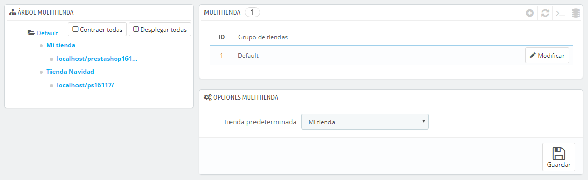
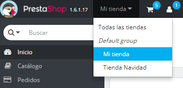
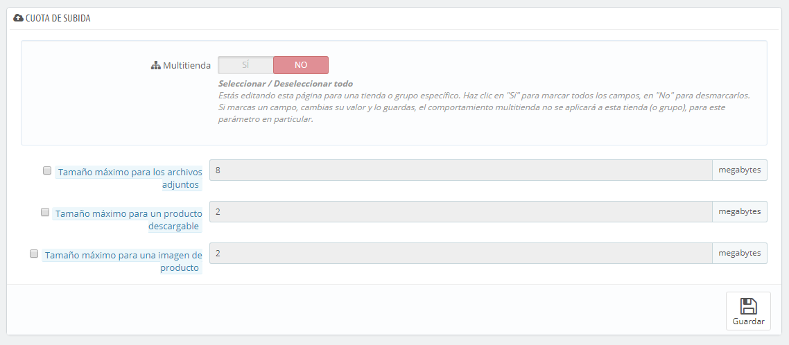

# La interfaz multitienda

## Gestionar tus tiendas 

La página "Multitienda" consta de tres secciones principales:

* **Árbol multitienda**. Te ofrece una visión global de tu grupo de tiendas, de cada una de tus tiendas por separado, e incluso de las distintas URLs relacionadas con cada tienda.\
  &#x20;De manera predeterminada, tan sólo hay una tienda disponible, en el grupo predeterminado: la tienda principal.
* **Grupo de tiendas**. Enumera los grupos de tiendas disponibles. Puedes editarlos haciendo clic en el botón de acción 'Modificar' situado a la derecha.
*   **Opciones multitienda**. Enumera las opciones disponibles para las tiendas existentes.\

    * **Tienda predeterminada**. La tienda predeterminada es la única que servirá como eje central para todas las demás, compartiendo sus detalles con otras tiendas (productos, transportistas, etc.), y es la única que aparece al iniciar sesión en el área de administración.

    

## Un único back-office para gobernarlas a todas 

Cuando la funcionalidad multitienda está activada en PrestaShop, muchos aspectos de PrestaShop pueden ser personalizados para cada tienda o grupo de tiendas.

Para ayudarte a establecer a cuál/es tiendas se aplican los cambios que realices , PrestaShop añade un selector desplegable en la parte superior de cada pantalla, donde puedes elegir el ámbito en los que quieres aplicar los cambios:

* Aplicar a todas tus tiendas en esta instalación de PrestaShop.
* Aplicar sólo a las tiendas del grupo de tiendas seleccionado.
* Aplicar sólo a la tienda seleccionada.&#x20;

Este selector de tiendas te ayuda a saber en qué tienda(s) está(s) trabajando actualmente.

Dicho esto, una vez que el modo multitienda está establecido correctamente, muchos de los ajustes más comunes sólo se pueden cambiar a nivel global (todas las tiendas), más concretamente los ajustes de configuración de las páginas: localización, preferencias, parámetros avanzados, administración, presentándose las opciones desactivadas en cualquier otra selección de tienda. Sin embargo, puedes optar por editar los ajustes de las configuraciones a un nivel más local (por grupos de tienda o incluso por cada tienda individual) si es necesario.

De hecho, las páginas de configuración presentan el look habitual cuando el selector de tienda está establecido en "Todas las tiendas", cosa que no ocurre en cualquier otra selección (grupo de tiendas o tienda individual) presentando estas opciones adicionales:

* Una opción "Sí / No" en la parte superior de cada sección de la página de configuración.
* Una casilla de verificación junto a cada opción.

Ambas tienen el mismo propósito: permitirte habilitar opciones que de otro modo estarían desactivadas en el contexto de la tienda actual. Puedes escoger las opciones que desees habilitar, o habilitar todas las opciones presentadas en una sección mediante el interruptor "Sí" de la opción Multitienda. Una vez habilitadas, tendrás que establecer el valor de cada opción haciendo clic en su casilla de verificación o utilizando el interruptor "Sí / No" de cada una de ellas, lo que te permite cambiar el valor en ese contexto.&#x20;

No obstante, como podrás comprobar algunas de estas opciones no pueden editarse en un contexto local: se te indicará esta situación mediante un mensaje textual en pantalla: "No se puede cambiar el valor de este campo de configuración para esta tienda".

La siguiente tabla, indica si el elemento puede ser personalizado para una sola tienda individual, para un grupo de tiendas o para todas las tiendas al mismo tiempo.

| Elemento                                                                                                                                                                                                                                                                          | Para cada tienda | Para un grupo de tiendas | Para todas las tiendas |
| --------------------------------------------------------------------------------------------------------------------------------------------------------------------------------------------------------------------------------------------------------------------------------- | ---------------- | ------------------------ | ---------------------- |
| Empleados                                                                                                                                                                                                                                                                         | X                | X                        | X                      |
| Grupos de clientes                                                                                                                                                                                                                                                                | X                | X                        | X                      |
| Productos                                                                                                                                                                                                                                                                         | X                | X                        | X                      |
| — Precios                                                                                                                                                                                                                                                                         | X                | X                        | X                      |
| — Combinaciones y precios                                                                                                                                                                                                                                                         | X                | X                        | X                      |
| — Idiomas                                                                                                                                                                                                                                                                         | X                | X                        | X                      |
| — Múltiples imágenes (**excepto para la imagen principal**)                                                                                                                                                                                                                       | X                | X                        | X                      |
| 
— Cantidades disponibles para la venta, siempre que:
<ul><li>La opción "Compartir cantidades disponibles para la venta" se encuentre marcada para el grupo,</li><li>El grupo no comparta sus cantidades disponibles para la venta con una tienda fuera del grupo.</li></ul> | X                | X                        |                        |
| — Toda otra información (descripción, etiquetas, URL amigable, etc.)                                                                                                                                                                                                              | X                | X                        | X                      |
| Atributos y valores del catálogo                                                                                                                                                                                                                                                  | X                | X                        | X                      |
| Descuentos: reglas de carrito                                                                                                                                                                                                                                                     | X                |                          |                        |
| Descuentos: reglas del catálogo                                                                                                                                                                                                                                                   | X                |                          |                        |
| Impuestos: Reglas de impuestos fiscales                                                                                                                                                                                                                                           | X                | X                        | X                      |
| Categorías (**excepto para la imagen principal**)                                                                                                                                                                                                                                 | X                | X                        | X                      |
| Transportistas                                                                                                                                                                                                                                                                    | X                | X                        | X                      |
| Almacenes                                                                                                                                                                                                                                                                         | X                | X                        | X                      |
| Gestión avanzada de existencias                                                                                                                                                                                                                                                   | X                |                          |                        |
| Proveedores                                                                                                                                                                                                                                                                       | X                | X                        | X                      |
| Fabricantes/Marcas                                                                                                                                                                                                                                                                | X                | X                        | X                      |
| Páginas CMS                                                                                                                                                                                                                                                                       | X                | X                        | X                      |
| Contactos                                                                                                                                                                                                                                                                         | X                | X                        | X                      |
| 
Países  El estado de un país (activado o desactivado) es común a todas las tiendas a los que está asociado.
                                                                                                                                                             | X                | X                        | X                      |
| Monedas                                                                                                                                                                                                                                                                           | X                | X                        | X                      |
| Idiomas                                                                                                                                                                                                                                                                           | X                | X                        | X                      |
| Módulos                                                                                                                                                                                                                                                                           | X                | X                        | X                      |
| — Ganchos (Hooks) y excepciones                                                                                                                                                                                                                                                   | X                | X                        | X                      |
| — Activación / Desactivación                                                                                                                                                                                                                                                      | X                | X                        | X                      |
| — Configuración (por ejemplo, credenciales de acceso a Paypal)                                                                                                                                                                                                                    | X                |                          |                        |
| Módulos de pago                                                                                                                                                                                                                                                                   | X                | X                        | X                      |
| — Restricciones por país                                                                                                                                                                                                                                                          | X                |                          |                        |
| — Restricciones por moneda                                                                                                                                                                                                                                                        | X                |                          |                        |
| — Restricciones por grupo de clientes                                                                                                                                                                                                                                             | X                |                          |                        |
| URLs amigables                                                                                                                                                                                                                                                                    | X                |                          |                        |
| Escenarios                                                                                                                                                                                                                                                                        | X                | X                        | X                      |
| Cuenta webservice                                                                                                                                                                                                                                                                 | X                | X                        | X                      |
| Carrusel de imágenes de la página principal                                                                                                                                                                                                                                       | X                |                          |                        |

Notes

**Categorías**: Un producto sólo puede aparecer en una determinada categoría de una tienda, si éste ha sido asociado a esta categoría en el contexto de la tienda. En otras palabras: si tienda A y tienda B tienen a la categoría C en común, podemos asociar el producto P a la categoría C para el contexto de la tienda A, y P no aparecerá en la categoría C de la tienda B.

**Transportistas**: Puedes asociar transportistas para cada tienda, grupo de tiendas o para todas las tiendas; pero no personalizar un transportista para una tienda. Debes duplicar el transportista, si deseas utilizar el mismo transportista con diferentes rangos de precios en dos tiendas.

**Almacenes**: Aunque la gestión avanzada de existencias sólo puede ser utilizada por una sola tienda al mismo tiempo, los almacenes pueden ser utilizados por grupos de tiendas, por lo que sólo tienes que gestionar los almacenes para llevar un control avanzado de las existencias.

Para cada tienda, puedes fijar el precio específico para cada producto, compartir un parte o la totalidad del catálogo, cambiar las imágenes de los productos, etc.

Puedes optar por compartir las cuentas de los clientes entre tus tiendas, permitiendo a tus clientes utilizar sus credenciales para todas las tiendas, e incluso conectarse a cada una de tus tiendas de manera transparente.

A través del gestor avanzado de existencias, puedes gestionar con mayor precisión las asociaciones entre tus tiendas y tus almacenes.
