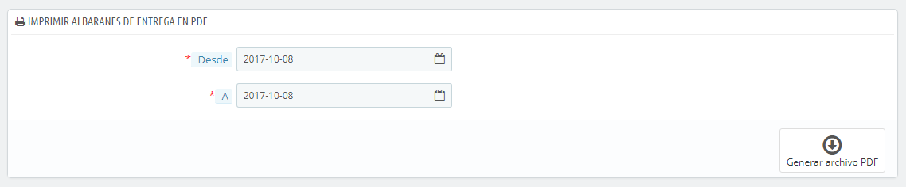
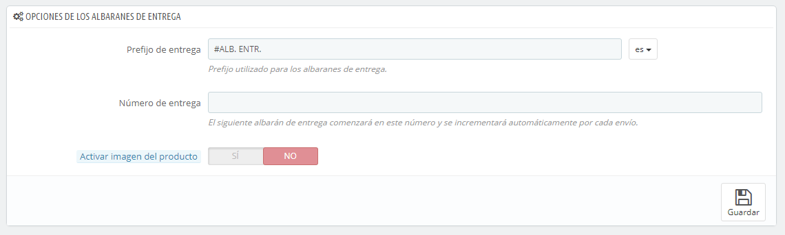

# Albaránes de entrega

Un albarán de entrega es una notificación de entrega. También puede ser llamado "comprobante de entrega", "bono de entrega"  o "nota de entrega".\
Debes incluirlo en el paquete, junto con los productos del pedido. Este albarán contará con el logotipo de tu tienda, e indicará el contenido del paquete. Al recibir el paquete, el cliente podrá utilizar el albarán de entrega para comprobar el contenido del mismo, y así comprobar que no falta nada en el pedido.

El proceso para obtener un albarán de entrega es exactamente igual al proceso de obtener una factura. Selecciona las fechas, así como las opciones que deseas, a continuación, confirma estos datos para crear los documentos.

Puedes obtener un archivo PDF de varios albaranes por fecha, lo cual es muy útil cuando necesites imprimir todos los albaranes de entrega de un día determinado o un trimestre determinado. Selecciona la fecha de inicio y fin, y haz clic en el botón "Generar archivo PDF".

## Opciones de los albaranes de entrega 

Las tres opciones disponibles son las mismas que para las opciones de facturación:

* **Prefijo de entrega**. De manera predeterminada, PrestaShop utiliza prefijos adaptados a los idiomas para tus albaranes de entrega: "DE" en Inglés, "LI" en francés (por "livraison"), "EN" en español (por "entrega"), etc. Es posible que prefieras utilizar prefijos para cada idioma: "EN", "FR", "SP", etc. Por supuesto, también puedes optar por tener un prefijo único para cada idioma, o no utilizar ningún prefijo.
* **Número de entrega**. Si tu empresa ya tiene albaranes de entrega antes de empezar a utilizar PrestaShop, puedes utilizar esta opción para iniciar tu sistema de notificación de entregas en un determinado número.
* **Activar imagen del producto**. Al activar esta opción, se mostrará la imagen del producto antes de su nombre.

PrestaShop generará entonces los números de los albaranes de entrega de acuerdo con tus ajustes establecidos: "# EN000001", "# FR000002", etc.

No olvides guardar los cambios que has realizado.
