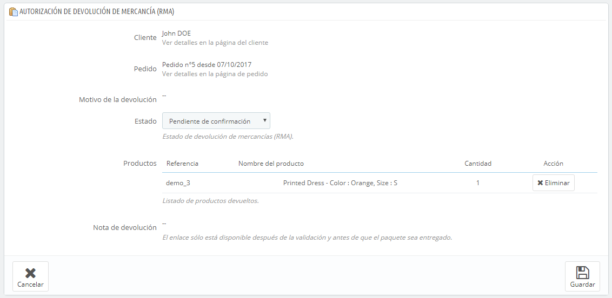

# Devoluciones de mercancía

La página "Devoluciones" ofrece una lista de todos los procesos que se encuentran en proceso RMA. La sigla RMA proviene del inglés Return Merchandise Authorization (autorización de devolución de mercancía).

En la parte inferior de la página, tienes la posibilidad de permitir a tus clientes que te devuelvan los productos adquiridos en tu tienda (opción "Permitir devoluciones"). Selecciona si deseas o no permitirlo, e indica el número de días a partir de la fecha de compra, que tiene el cliente para devolver un producto. Recuerda guardar los cambios: los clientes tendrán ahora la posibilidad de solicitar una autorización de devolución. También puedes editar o dejar en blanco el prefijo utilizado para las devoluciones.

## Proceso de devolución: desde el punto de vista del cliente 

Una vez activada la opción RMA en el back-office de tu tienda, el cliente puede optar por devolver un artículo (siempre que el pedido se encuentre todavía dentro del periodo de validez permitido). Para hacer esto, el cliente debe hacer lo siguiente:

1. Acceder a la sección de "Historial y detalles de mis pedidos" de su cuenta.
2. Seleccionar el pedido del que quiere devolver un artículo.
3. Seleccionar el producto(s) que desea devolver marcando la casilla junto a su nombre(s).
4. (opcional) Añadir una explicación, para que el equipo de la tienda pueda entender mejor por qué el cliente desea devolver este producto.

\
Una vez que el formulario sea completado, el cliente hará clic en el botón "Hacer una nota de autorización de devolución de mercancía", y la petición será enviada al propietario de la tienda. La solicitud aparecerá en la página del cliente "Autorización de devolución de mercancía (RMA)", accesible desde la página de su cuenta.

## Proceso de devolución: desde el punto de vista del comerciante 

La solicitud de devolución aparecerá en el back-office de la tienda. Al principio, la RMA tiene el estado "Esperando confirmación".

El proceso de reembolso puede tomar varios pasos, que se indican por el estado RMA. Mediante estos pocos estados se puede seguir todo el proceso RMA:

* Pendiente de confirmación.
* Esperando paquete.
* Paquete recibido.
* Devolución denegada.
* Devolución completada.

Ahora te tocará a ti aceptarla o denegarla:

1. Haz clic en el nombre de la solicitud de devolución para ver más detalles.
2. Cambia el estado para continuar con el proceso de devolución o detenerlo.\

   * Si deseas detener el proceso de devolución (y denegar al cliente un reembolso), simplemente selecciona el estado "Devolución denegada".
   * Si estás de acuerdo con que el producto sea devuelto por el cliente y sea reembolsado, sigue cada paso con precisión:
     1. Selecciona el siguiente paso en el proceso: "Esperando paquete". Con este paso se le enviará un e-mail al cliente indicándole que el producto puede ser devuelto.
     2. Una vez que hayas recibido el paquete, cambia el estado RMA a "Paquete recibido".
     3. Por último, una vez que todo el proceso haya terminado (bien mediante el reembolsado el dinero al cliente o mediante la emisión de una nota de crédito), cambia el estado RMA a "Devolución completada".
3. Valídala.

## Reembolsado del importe del pedido al cliente 

Un producto puede ser reembolsado, ya sea parcial o totalmente. Este proceso se realiza utilizando los dos botones de acción situados en la barra superior de la propia página de pedidos y no en la página RMA**.**

Los botones de acción cambian dependiendo del estado del pedido. Por ejemplo, una vez que el pedido está en el estado "Entregado", las opciones "Añadir producto" y "Eliminar productos" se convierten en dos nuevos botones: "Devolver productos" y "Reembolso parcial".

La devolución del producto no está activada de forma predeterminada. Para activar esta característica, dirígete a la página "Devoluciones" bajo el menú "Pedidos", y activa la opción en la sección de opciones en la parte inferior de la página. Esto se aplicará a todos los productos y a todos los pedidos.

* **Devolver productos**. Para ser utilizado sólo cuando el cliente ha devuelto productos: una vez que el paquete ha sido recibido, debes marcar los productos como retornados en el formulario de pedido. Haz clic en el botón "Devolver productos" y una nueva columna denominada "Devolver" aparecerá en el listado de productos. Marca la casilla de los productos afectados, indica la cantidad de artículos que fueron devueltos y haz clic en el botón "Devolver productos" que aparece en la parte inferior de la tabla.
* **Reembolso parcial**. Para ser utilizado cuando necesites reembolsar sólo una parte del pedido y no todo el pedido completo, ya sea porque el cliente devuelve el producto solicitado, o simplemente como una señal de buena voluntad por un producto dañado que el cliente optó por quedarse de todos modos. Indica el monto y la cantidad para cada uno de los productos afectados, selecciona una de la opciones en la parte inferior de la lista (véase más abajo), y haz clic en el botón "Reembolso parcial" en la parte inferior de la tabla.

Cuando establezcas un producto como devuelto o reembolsado, cuatro opciones están disponibles bajo la lista de productos:

* **Reingresar productos al inventario**. Cuando se activa, PrestaShop considerará que el producto devuelto pasará a estar disponible para la venta de nuevo, y por lo tanto incrementará el número de unidades disponibles de este producto. No se debe hacer clic en esta opción cuando el producto ha sido devuelto porque está roto o no funciona como debería hacerlo...
* **Crear una factura por abono por devolucion de mercancia**. Cuando se activa, una factura de abono (también conocida como nota de crédito), será creada para los elementos seleccionados. Una factura de abono o nota de crédito, es un reconocimiento de su tienda de que la mercancía ha sido retornada y la devolución ha sido aceptada. El cliente puede utilizar esta factura por abono como un cupón de descuento en su próxima compra.
* **Crear un cupón de descuento**. Cuando se activa, un cupón será creado por el importe de los elementos seleccionados. Un cupón de descuento es realmente un código de descuento que el cliente puede introducir durante el proceso de compra.\
  Puedes editar los cupones existentes visualizando la página del cliente: desde la página actual del pedido, haz clic en el enlace bajo el nombre del cliente en la sección "Información del cliente"; una vez en la página del cliente, dirígete a la sección "Cupones". Puedes editar cada uno de los cupones haciendo clic en el icono "Modificar".
* **Reembolsar gastos de envío**. También puedes optar por reembolsar al cliente los gastos de envío, lo cual es un gesto que los clientes siempre agradecen.

Si el cliente pagó el pedido utilizando una tarjeta de crédito, el sistema de pago reembolsará la compra automáticamente. Si el pedido fue pagado utilizando un cheque o una transferencia bancaria, tendrás que realizar el reembolso manualmente por tí mismo, a continuación, marca de forma manual que el pedido ha sido reembolsado en el back-office (en la página de pedidos).
