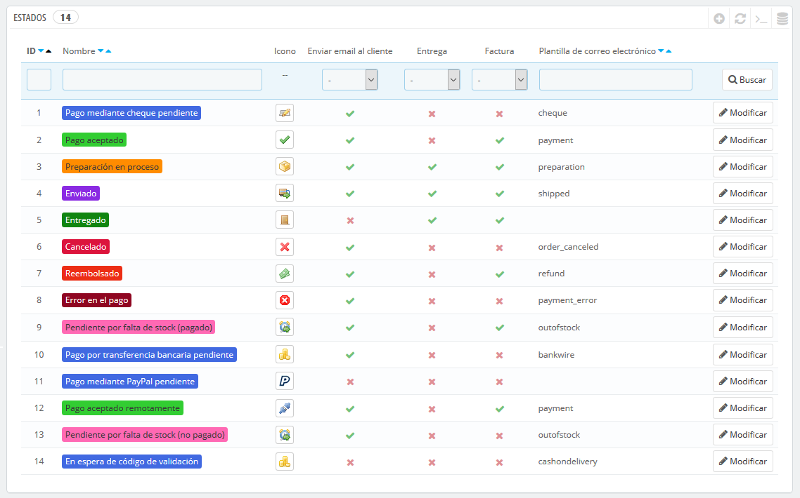
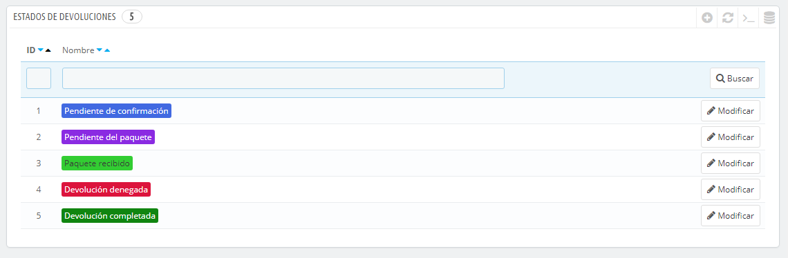
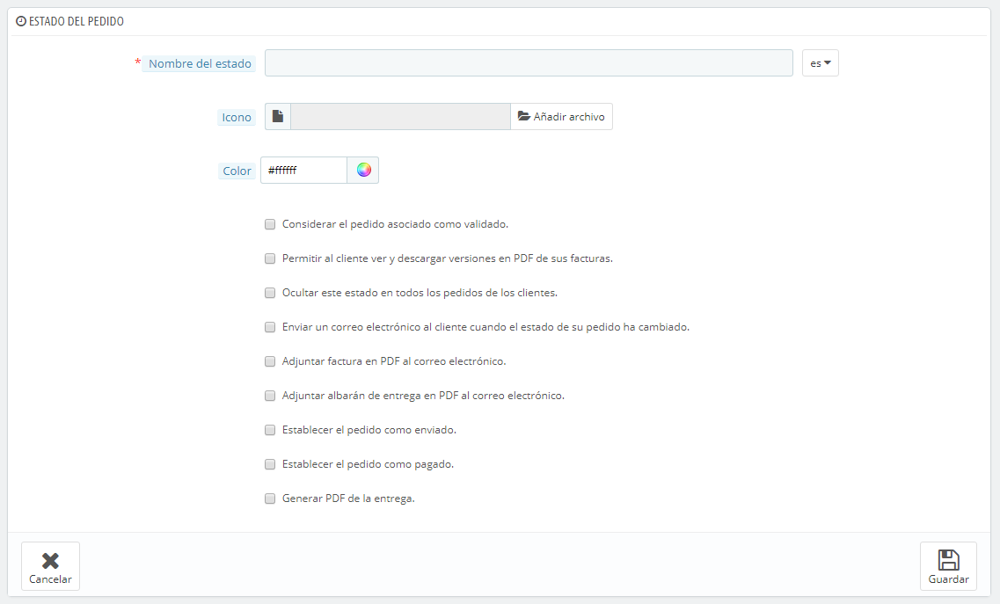
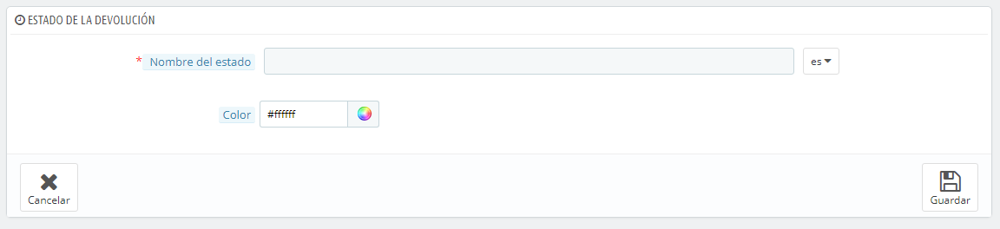

# Estados de Pedidos

Tener diferentes estados de pedidos o de devoluciones de pedidos te permite gestionar fácilmente tus pedidos y devoluciones, y mantener informados a tus clientes sobre la evolución de sus compras.

Los distintos estados disponibles son visibles y editables en la página "Estados", bajo el menú "Pedidos".

La página muestra un listado de los estados de los pedidos registrados actualmente, junto con:

* Sus colores distintivos: los estados existentes tienen colores que te ayudan a determinar rápidamente si hay un problema con el pedido o si todo va bien.
* Sus iconos.
* Sus vinculaciones con tres comportamientos PrestaShop (hay más disponibles):\

  * ¿Debe el cliente recibir un e-mail cuando el pedido reciba este estado?
  * ¿Es este un estado de entrega?
  * ¿Permite este estado al cliente descargar y ver una versión en PDF de la factura del pedido?
* El nombre de tu plantilla de e-mail: puedes editar estas plantillas, idioma por idioma, en la página "Traducciones" bajo el menú "Localización". En la sección "Modificar traducciones" de esta página, selecciona "Traducciones de las plantillas de E-mail" en el menú desplegable, y a continuación, selecciona en la lista desplegable el código del idioma en el que deseas editar estas plantillas.
* Sus iconos de acción: "modificar" y "eliminar".

La lista de estados de las devoluciones cuenta con menos información, porque los estados no son más que etiquetas que no tienen ningún tipo de efecto sobre el pedido.

\
Crear un nuevo estado de pedido 
--------------------------------------------------------------------------------------------------------------------------------------------

Puedes crear un nuevo estado haciendo clic en el botón "Añadir nuevo estado de pedido" situado en la parte superior. El formulario de creación se mostrará en pantalla.

Rellena el formulario:

* **Nombre del estado**. Este nombre debe ser corto y conciso.
* **Icono**. Puedes utilizar cualquier icono de 16\*16; por ejemplo, el excelente y gratuito pack de iconos FamFamFam Silk: [http://www.famfamfam.com/lab/icons/silk/](http://www.famfamfam.com/lab/icons/silk/).
* **Color**. Debes tratar de darle a tu estado un color que coincida con los colores existentes (si este es relevante). El uso de colores predeterminado es:\

  * Rojo/Naranja: pedidos cancelados o reembolsados,
  * Rojo carmesí: error de pago,
  * Azul: pedidos que están pendientes de pago,
  * Verde claro: pedidos pagados,
  * Verde oscuro: pedidos entregados,
  * Púrpura: pedidos enviados,
  * Rosa: pedidos pendientes de entrega.
* Opciones:\

  * **Considerar el pedido asociado como validado**. Si está habilitado, este estado marcas todos los pedidos asociados como "pagados", y los pone en este mismo estado.
  * **Permitir a los clientes descargar y visualizar sus facturas en formato PDF**. Si está desactivada, tendrás que enviarle tu mismo las facturas a los clientes.
  * **Ocultar este estado en todos los pedidos de los clientes**. Esta opción te permite crear estados internos, para ti y tu equipo. Los clientes no verán esto en su página de estado del pedido.
  * **Enviar un correo electronico al cliente cuando su pedido cambie de estado**. Cuando está activado, un menú desplegable aparecerá para que puedas elegir la plantilla de correo electrónico a utilizar.
  * **Establecer el pedido como enviado**. Ten cuidado: una vez que el pedido se establece como "enviado", no puede volver a su estado anterior.
  * **Establecer el pedido como pagado**. Al igual que en la opción anterior: una vez que el pedido se establece como "pagado", no puede volver a su estado anterior.
  * **Generar PDF de la entrega**. Generar el PDF de la entrega.

## Crear un nuevo estado de devolución 

Puedes crear un estado de devolución utilizando el botón "Añadir nuevo estado de devolución de pedido" situado en la parte superior. El formulario de creación se mostrará en pantalla.

Este formulario sólo cuenta con dos campos:

* **Nombre del estado**. Establece el nombre del estado que deseas crear.
* **Color**. Establece su color.

Finalmente, recuerda guardarlo.
