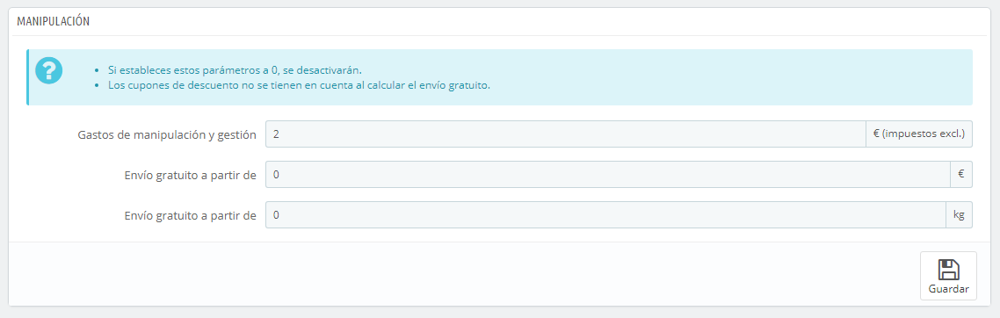
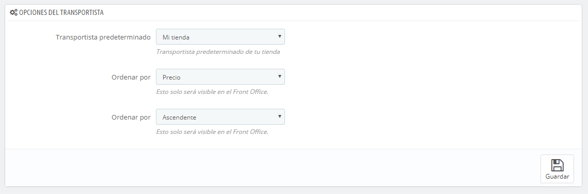

# Preferencias de Transporte

Los ajustes más generales de la configuración de transporte de tu tienda se encuentran en la página "Preferencias", bajo el menú "Transporte".

Esta página presenta la configuración global:

* **Gastos de manipulación y gestión**. Introduce el precio de los gastos de manipulación y gestión del pedido, los cuales serán añadidos al final de la compra. Estos gastos son independientes de los gastos de envío: éste es realmente el coste que aplica el equipo de tu tienda para la preparación del producto, su embalaje y su tramitación antes del envío por parte de la agencia de trasporte. Si no hay ningún costo, déjalo en 0.
* **Envío gratuito a partir de (precio)** y **Envío gratuito a partir de (peso)**. Introduce el precio o el peso para que tus clientes reciban el envío gratuitamente. Por ejemplo, puedes optar por ofrecer el envío gratuito cuando el pedido supere los 250 euros. Un mensaje aparecerá a tus clientes indicando la cantidad de dinero que les falta para poder recibir el envío gratis.\
  &#x20;Si no quieres ofrecer el envío gratuito y no deseas que aparezca este mensaje, deja estos valores en 0.La sección "Opciones del transportista", te da acceso a tres ajustes, que repercuten en el front-office de tu tienda con el fin de ayudar al cliente a tomar una decisión:

* **Transportista predeterminado**. Si tienes más de un transportista creado en PrestaShop, es posible que desees promocionar uno de ellos a tus clientes. Además de los propios transportistas, la lista desplegable tiene dos opciones contextuales:
  * **Mejor precio**. Dependiendo de la cantidad del pedido, de su peso y de su zona de entrega, PrestaShop elegirá el transportista más barato para el cliente.
  * **Mayor velocidad**. Esta opción permite identificar fácilmente al transportista más rápido. PrestaShop mostrará el transportista que, en el contexto del pedido, tenga la demora del envío más corta.
* **Clasificación por defecto para los transportistas**. Cuando a los clientes se les muestra una selección de los transportistas, puedes elegir si ordenar esta lista por precio del envío o por su posición, según fue establecida en la página "Transportistas".
* **Orden por defecto para los transportistas**. Esta opción te permite establecer el orden en el que se clasifican los transportistas:\

  * Si son ordenados por los gastos de envío y en orden ascendente, entonces los transportistas serán mostrados desde el más económico al más caro.
  * Si son ordenados por su posición y en orden descendente, entonces los transportistas serán mostrados desde la posición superior de la lista, a la posición inferior.
