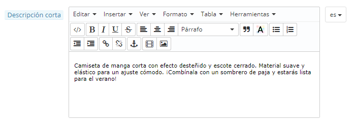

# Primeros pasos con PrestaShop 1.6

**Tabla de contenidos**\
****

/\*\<!\[CDATA\[\*/\
div.rbtoc1597066506745 {padding: 0px;}\
div.rbtoc1597066506745 ul {list-style: disc;margin-left: 0px;}\
div.rbtoc1597066506745 li {margin-left: 0px;padding-left: 0px;}\
\
/\*]]>\*/

* [Primeros pasos con PrestaShop 1.6](primeros-pasos-con-prestashop-1.6.md#PrimerospasosconPrestaShop1.6-PrimerospasosconPrestaShop1.6)
  * [Desactivar tu tienda](primeros-pasos-con-prestashop-1.6.md#PrimerospasosconPrestaShop1.6-Desactivartutienda)
  * [Eliminar el contenido predeterminado de la tienda](primeros-pasos-con-prestashop-1.6.md#PrimerospasosconPrestaShop1.6-Eliminarelcontenidopredeterminadodelatienda)
  * [Configurar la información de tu tienda](primeros-pasos-con-prestashop-1.6.md#PrimerospasosconPrestaShop1.6-Configurarlainformacióndetutienda)
    * [Ajustes básicos de la tienda](primeros-pasos-con-prestashop-1.6.md#PrimerospasosconPrestaShop1.6-Ajustesbásicosdelatienda)
    * [Idiomas de la tienda](primeros-pasos-con-prestashop-1.6.md#PrimerospasosconPrestaShop1.6-Idiomasdelatienda)
    * [Información de los empleados](primeros-pasos-con-prestashop-1.6.md#PrimerospasosconPrestaShop1.6-Informacióndelosempleados)
  * [Configurar tus métodos de pago](primeros-pasos-con-prestashop-1.6.md#PrimerospasosconPrestaShop1.6-Configurartusmétodosdepago)
  * [Configuración de transportistas y envío](primeros-pasos-con-prestashop-1.6.md#PrimerospasosconPrestaShop1.6-Configuracióndetransportistasyenvío)
  * [Elige tu tema](primeros-pasos-con-prestashop-1.6.md#PrimerospasosconPrestaShop1.6-Eligetutema)
  * [Elige tus módulos](primeros-pasos-con-prestashop-1.6.md#PrimerospasosconPrestaShop1.6-Eligetusmódulos)
  * [Crear tus productos y categorías de productos](primeros-pasos-con-prestashop-1.6.md#PrimerospasosconPrestaShop1.6-Creartusproductosycategoríasdeproductos)
  * [Crear tu contenido estático](primeros-pasos-con-prestashop-1.6.md#PrimerospasosconPrestaShop1.6-Creartucontenidoestático)
  * [Construir el menú superior de tu tienda](primeros-pasos-con-prestashop-1.6.md#PrimerospasosconPrestaShop1.6-Construirelmenúsuperiordetutienda)
  * [Activar tu tienda](primeros-pasos-con-prestashop-1.6.md#PrimerospasosconPrestaShop1.6-Activartutienda)

## Primeros pasos con PrestaShop 1.6 

Debes invertir gran parte de tu tiempo en asegurarte de que cada apartado de tu futura tienda en línea se encuentra correctamente configurado, asegurado, validado y preparado antes de iniciar la apertura de tu negocio a través de Internet.

Aunque PrestaShop facilita en gran medida la instalación y creación de tu tienda en línea, no es posible que puedas empezar a vender productos a los 5 segundos de haber completado la instalación: debes ser consciente de que vas a tratar con productos, clientes, y (lo más importante) con dinero real que fluirá desde tus clientes a tu cuenta bancaria. Por todo ello,te pedimos que te asegures de que nada falle en el proceso de validación de un pedido, teniendo en todo momento localizados los productos en tu almacén, y que siempre compruebes que el pedido ha sido enviado y entregado a tu cliente sin que se haya producido ningún error, e incluso que ningún imprevisto haya sucedido sin tu conocimiento.

PrestaShop es una herramienta muy completa, y el abanico de posibilidades que tiene puede parecer abrumador. Este capítulo te muestra algunas acciones básicas que debes realizar en tu tienda antes del gran lanzamiento. Muchas otras acciones pueden efectuarse antes de la apertura de tu tienda, pero los pasos descritos aquí son esenciales.

### Desactivar tu tienda 

Consideraremos que todavía te encuentras dentro de la primera hora transcurrida después de la instalación de PrestaShop, y que planeas utilizarlo en el modo de una tienda individual.

Desactivar tu tienda significa asegurarte de que nadie puede acceder a ella mientras te encuentres realizando modificaciones, creando productos, estableciendo precios e impuestos, instalando módulos de pago y un nuevo tema, estableciendo transportistas.... Esta acción es denominada "poner tu tienda en modo mantenimiento".

En el back-office de tu tienda, diríjete a la página "Preferencias / Mantenimiento". Esta página tiene dos opciones:

* **Activar la tienda**. Simplemente establece esta opción a "No", y el front-end de tu tienda mostrará la página de mantenimiento a tus visitantes, la cual se limita a informarles que tu tienda estará pronto de nuevo en línea.
* **IP de mantenimiento**. Aquí es donde debes poner tu propia dirección IP, para que puedas acceder a la página principal de tu tienda y navegar por ella como si estuviera accesible para todos. Esto es algo que debes hacer cada vez que pongas tu tienda en modo mantenimiento, ya que siempre necesitarás comprobar los cambios realizados en el front-end para asegurarte de que todo está en el lugar previsto.\
  Simplemente haz clic en el botón "Añadir mi IP". Puedes añadir más direcciones IP separándolas con comas.

Si ya has configurado tu tema y añadidos tus productos, puedes establecer tu tienda en modo Catálogo. Esto significa que los clientes podrán navegar por las páginas de tu tienda, pero no se les mostrará ningún precio, y no podrán añadir ninguno de tus productos a sus carritos hasta que no desactives el modo Catálogo.

Puedes activar el modo Catálogo en la primera opción de configuración disponible en la página "Preferencias / Productos".

### Eliminar el contenido predeterminado de la tienda 

La instalación predeterminada incluye un puñado de productos – principalmente ropa de mujer. Su único uso es ayudarte a explorar la organización que tiene una tienda real. Después de haber aprendido los entresijos de las relaciones entre productos, categorías, pedidos y clientes, debes eliminar todos estos elementos para inicializar tu tienda desde cero.

Por lo tanto, debes eliminar todos los datos predeterminados de la instalación de PrestaShop, lo que incluye:

* productos y sus...
  * categorías
  * atributos
  * características
  * fabricantes
  * proveedores
  * imágenes
  * etiquetas
* pedidos
  * mensajes de pedidos
* clientes
  * carritos de compra de los clientes
* transportistas\

  * rango de precios
  * rango de pesos
* contacto y tiendas (eliminándolas o adaptándolas a las necesidades de tu negocio)
* páginas CMS (eliminándolas o adaptándolas a las necesidades de tu negocio)

Esto significaría el tener que navegar a través de varias pantallas del back-office y eliminar el contenido de una página tras otra, pero hay una manera mucho más sencilla de realizar este proceso:

1. Dirígete a la página "Módulos y Servicios" bajo el menú "Módulos y Servicios".
2. Utiliza el buscador para encontrar el módulo "pscleaner" y haz clic sobre el botón "Instalar".
3. El navegador será redireccionado automáticamente a tu página de configuración (si no es así, haz clic en el botón "Configuración").
4. Lee y acepta las advertencias que se indican, a continuación haz clic sobre el botón "Eliminar catálogo": se eliminarán todos tus productos y sus atributos, fabricantes, etc.
5. Lee y acepta las advertencias que se indican, a continuación haz clic sobre el botón "Eliminar pedidos y clientes": se eliminarán todos tus clientes y sus pedidos, carritos, etc.
6. Haz clic en el botón "Comprobar y corregir" para afinar las restricciones de integridad de la base de datos de tu tienda.
7. Haz clic en el botón "Limpiar y optimizar" para reorganizar el almacenamiento físico de los datos de la tabla y los índices de datos asociados, para reducir el espacio almacenado y mejorar la eficiencia de E/S cuando se accede a las tablas.

NO HAY VUELTA ATRÁS. Asegúrate de sólo hacer clic en estos botones tan sólo si tienes la intención de limpiar la base de datos de tu tienda a partir de su contenido predeterminado.

### Configurar la información de tu tienda 

Ahora que tienes una tienda limpia gracias a la reinicialización de datos realizada anteriormente, puedes comenzar a configurar todo a tu gusto, comenzando por tu información personal y tus preferencias.

#### Ajustes básicos de la tienda 

Debes prestar atención a los siguientes ajustes, la mayoría de los cuales son importantes, ya que se muestran en el front-office, y por tanto también, a la vista de tus clientes.

Algunos de estos ajustes requieren la configuración de un módulo, en lugar de realizar cambios en las preferencias de PrestaShop

Configurar un módulo es fácil:

1. Dirígete a la página "Módulos y Servicios" bajo el menú "Módulos y Servicios".
2. Teclea el nombre del módulo (o parte de éste) en el cuadro de búsqueda de módulos. A medida que escriba, se le mostrarán los resultados encontrados.
3. Cuando encuentres el módulo, haz clic en el botón "Configurar" y sigue las instrucciones.

Debes leer la documentación de cada uno de los módulos aquí presentados, para obtener mayor información.

| Ajustes                                                 | Descripción                                                                                                                                                                                                                                                                                                                                                                                                                                            | Dónde encontrar esto                                                                                                                                                                                                                                                                                                                                                                                                                                                                                                                                                                                                                                                                                                                          |
| ------------------------------------------------------- | ------------------------------------------------------------------------------------------------------------------------------------------------------------------------------------------------------------------------------------------------------------------------------------------------------------------------------------------------------------------------------------------------------------------------------------------------------ | --------------------------------------------------------------------------------------------------------------------------------------------------------------------------------------------------------------------------------------------------------------------------------------------------------------------------------------------------------------------------------------------------------------------------------------------------------------------------------------------------------------------------------------------------------------------------------------------------------------------------------------------------------------------------------------------------------------------------------------------- |
| Nombre de la tienda                                     | Define tu marca, principalmente en los motores de búsqueda (Google, Yahoo!, Bing...).                                                                                                                                                                                                                                                                                                                                                                  | Menú "Preferencias", página "Contactos de la tienda". A continuación, en la sección "Datos de contacto", haz clic en el campo nombre de la tienda.                                                                                                                                                                                                                                                                                                                                                                                                                                                                                                                                                                                            |
| Logo de la tienda                                       | 
Define tu marca visual. El logotipo predeterminado reza como "YourLogoHere" (en español, "TuLogoAquí") como un estimulante para que utilices el tuyo. Se muestra en la parte superior izquierda de cada página de tu tienda, así como en tus facturas y mensaje de correo electrónico.
                                                                                                                                                       | Menú "Preferencias", página "Temas", sección "Tu tema actual", a continuación, sustituye las diversas imágenes predeterminadas por tu logotipo.                                                                                                                                                                                                                                                                                                                                                                                                                                                                                                                                                                                               |
| Moneda predeterminada de la tienda                      | La moneda predeterminada que deseas establecer para el coste de tus productos.                                                                                                                                                                                                                                                                                                                                                                         | 
Menú "Localización", página "Localización", sección "Configuración". Si la moneda no está disponible, debes importar el paquete de localización perteneciente al país de la misma: utiliza la herramienta "Importar un paquete de localización" que encontrarás disponible en la misma página.
                                                                                                                                                                                                                                                                                                                                                                                                                                      |
| Información de Atención al cliente                      | 
Un bloque que indica el número de teléfono de atención al cliente, y un botón para enviar un e-mail. Se muestra en la columna derecha del front-office.
                                                                                                                                                                                                                                                                                      | Módulo "Bloque de contacto".                                                                                                                                                                                                                                                                                                                                                                                                                                                                                                                                                                                                                                                                                                                  |
| 
Información de la empresa / Datos de contacto
 | 
Un bloque que muestra tu dirección de contacto, el número de teléfono del servicio de Atención al cliente, y un enlace para enviar un correo electrónico. Se muestra en el pie del front-office.
                                                                                                                                                                                                                                             | Módulo "Bloque de Información de contacto".                                                                                                                                                                                                                                                                                                                                                                                                                                                                                                                                                                                                                                                                                                   |
| Publicidad                                              | 
Un bloque que presenta una imagen con un enlace a otro sitio. Se muestra en la columna izquierda del front-office.
                                                                                                                                                                                                                                                                                                                           | Módulo "Bloque de Publicidad".                                                                                                                                                                                                                                                                                                                                                                                                                                                                                                                                                                                                                                                                                                                |
| Carrusel de imágenes                                    | 
El carrusel de imágenes presenta varias imágenes, que se desplazan una tras otra. Es una fuerte firma visual para tu tienda y tus productos. Por lo general, se coloca en la parte central de la página principal.
                                                                                                                                                                                                                           | Módulo "Carrusel de productos".                                                                                                                                                                                                                                                                                                                                                                                                                                                                                                                                                                                                                                                                                                               |
| Páginas CMS                                             | 
El contenido de las páginas estáticas, tales como "Acerca de", "Entrega", "Aviso Legal", "Términos y Condiciones de Uso", y "Pago seguro". Algunos de ellos tienen un contenido predeterminado, el cual debes adaptar a tu negocio. Algunos otros están vacíos, y debes introducir tu propio texto personalizado. Se muestra en el bloque de "Información" en la columna de la izquierda, y en la sección "Información" en el pie de página.
 | Menú "Preferencias", página "CMS". Posteriormente, crea y edita cada página según las condiciones de tu tienda.                                                                                                                                                                                                                                                                                                                                                                                                                                                                                                                                                                                                                               |
| Redes sociales                                          | 
Un bloque que presenta tres enlaces: página Facebook de tu empresa, cuenta Twitter de tu compañía, y el RSS feed para el blog de tu empresa (o sitio "eventos actuales"). De manera predeterminada, todos estos enlaces dirigen a la empresa PrestaShop. Es importante que los cambies para que dirijan hacia tus cuentas. Se muestra en la sección "Síganos" del pie de página.
                                                          | Módulo "Bloque de redes sociales".                                                                                                                                                                                                                                                                                                                                                                                                                                                                                                                                                                                                                                                                                                            |
| Menú superior                                           | La parte superior del tema predeterminado utiliza un menú superior para indicar las categorías existentes de la tienda a las que los visitante pueden dirigirse, así como enlaces a otros lugares – por ejemplo, la instalación predeterminada tiene un enlace "Blog" que dirige al usuario al blog oficial de PrestaShop.                                                                                                                             | Módulo "Menú horizontal superior".                                                                                                                                                                                                                                                                                                                                                                                                                                                                                                                                                                                                                                                                                                            |
| Contenido de la página de inicio                        | El tema predeterminado contiene una gran cantidad de contenido de demostración: textos, imágenes, enlaces, etc. Si tienes la intención de utilizar este tema para tu tienda en lugar de comprar otro tema, debes asegurarte en primer lugar de eliminar todo este contenido predeterminado.                                                                                                                                                            | 
Módulo "Configurador del tema": este módulo es el encargado de gestionar muchos de los ajustes del tema de tu tienda. Principalmente, éste te permite activar o desactivar algunas funcionalidades (botones para compartir en redes sociales, banner superior, logotipos de métodos de pago disponibles, etc.), y quizás lo más importante, éste también te permite fácilmente añadir/cambiar las imagenes de la página de inicio de tu tienda. Módulo "Bloque de información CMS personalizado": este módulo te ayuda a personalizar los dos últimos bloques presentes en la parte inferior de la página de inicio de tu tienda, justo antes del pie de página: el bloque de "Envío gratuito etc." y el de "Bloque personalizado".
 |

Estos son los ajustes más visibles en el front-end de tu tienda que deberás configurar y establecer – al menos en lo que respecta al tema predeterminado.\
La columna "Dónde encontrar esto" te permite saber en qué interfaz se encuentra ese aspecto de tu tienda que deseas modificar. Esta guía de usuario te mostrará detalladamente cada interfaz.

#### Idiomas de la tienda 

PrestaShop es capaz de trabajar con varios idiomas, tanto en el front-office como en el back-office. Tan pronto como habilites más de un idioma en el back-office de tu tienda, cada campo de texto del back-office es acompañado por el icono de una bandera que indica el idioma actual, y en el que se puede hacer clic para introducir el contenido de ese campo en otro idioma.

De forma predeterminada, PrestaShop es instalado en dos idiomas: el utilizado durante la instalación del software y el francés. Para gestionar los idiomas instalados actualmente, dirígete a la página "Localización / Idiomas". Esta página presenta una tabla con los idiomas disponibles.

El idioma o idiomas actualmente habilitado(s) tiene(n) una marca de verificación de color verde, mientras que los otros presentan una "X" de color rojo. Haz clic en una marca de verificación de color verde para desactivar el idioma seleccionado, haz clic en una "X" roja para volver a activarlo.

Puedes instalar y habilitar todos los idiomas disponibles si consideras que tu tienda los necesita, pero ten en cuenta que deberías traducir todo tu contenido para todos los idiomas disponibles: nombre del producto, descripción, etiquetas; nombre de la categoría; contenido estático (páginas CMS), módulos; etc.

Puedes importar fácilmente muchos más idiomas desde la página "Localización / Localización", y posteriormente habilitarlos en la página "Localización / Idiomas".

#### Información de los empleados 

En caso de que haya gente que te ayude con tu tienda, ya sea tu cónyuge, amigos o empleados remunerados, debes asegurarte de crear una cuenta de empleado para cada una de ellos, aunque sólo sea para saber quién es el responsable de cada acción que se realice. La otra ventaja es que se les puede dar perfiles y derechos de acceso específicos a las páginas de administración: Por ejemplo, puede que no desees que todos los empleados tengan acceso a tus estadísticas, tus facturas o tus pagos.\
Puedes crear tantos perfiles como consideres necesario.

Para crear una nueva cuenta de empleado, dirígete al menú "Administración", selecciona "Empleados", y haz clic en el botón "Añadir nuevo empleado". Escribe un nombre, como por ejemplo "Martin Doe" o "Responsable de envíos", y haz clic en Guardar.\
Aunque una cuenta puede ser utilizada por tantas personas como sea necesario – te aconsejamos que crees una para cada persona que te esté ayudando.

Ahora que tienes una cuenta adecuada para este empleado, debes darle permisos específicos, adaptados a la actividad o tarea que se realizará en dicha cuenta. De manera predeterminada, un nuevo perfil no puede hacer demasiado. Debes ser tu mismo quien establezcas las partes exactas de tu tienda a las que ese perfil debe tener acceso. Esta puede ser una tarea tediosa, pero es muy importante que se realice correctamente.\
Para asignar permisos a una cuenta de empleado, debes utilizar la opción "Permisos del Perfil" en la página de creación de la cuenta: este menú te permite seleccionar el perfil de la cuenta (SuperAdmin, translator (traductor), etc.)

Puedes editar estos permisos de la siguiente manera: dirígete al menú "Administración", selecciona "Permisos", y a continuación, selecciona el perfil que deseas cambiar. Un gran listado de permisos aparecerá en pantalla: edítalos tal y como deseas. Los cambios que realices serán guardados automáticamente.

### Configurar tus métodos de pago 

Tu tienda está destinada a ganar dinero, y esto sólo puede hacerse realidad si se utiliza al menos un módulo de pago. Varios módulos ya están disponibles en la instalación predeterminada, los cuales puedes instalar y configurar (desde la página "Módulos y Servicios" bajo el menú "Módulos y Servicios", en la categoría "Plataformas y Pasarelas de pago"), y crear restricciones para estos (en la página "Pago" bajo el menú "Módulos y Servicios"). Algunos módulos de pago requieren la creación de una cuenta en el servicio para el que fueron diseñados.

Revisa la sección "Pago" del capítulo "Trabajando con los módulos nativos" de esta guía, donde se explica todo lo que debes conocer sobre estos módulos de la sección "Pago".

También puedes instalar otros módulos de pago, descargándolos desde el marketplace de PrestaShop: [http://addons.prestashop.com/es/4-pagos-prestashop-modulos](http://addons.prestashop.com/es/4-pagos-prestashop-modulos)

Cheque y transferencia bancaria son los dos únicos métodos de pago que están habilitados de manera predeterminada. Si optas por mantenerlos, será **necesario** configurarlos con tu información: orden del cheque y dirección, propietario de la cuenta, datos bancarios (IBAN, BIC, etc.).

Estos métodos de pago se configuran a través de los módulos "Transferencia bancaria" y "Pagos por cheque", que puedes encontrar en la categoría "Plataformas y Pasarelas de pago" del listado de módulos.

### Configuración de transportistas y envío 

Los productos vendidos en tu tienda deben ser enviados a tus clientes – a no ser que sólo vendas productos descargables, en cuyo caso el menú "Envío" te será de poca utilidad.

Puedes enviar tus propios productos por correo, o realizar un contrato con una empresa de transporte, sea cual sea el método que elijas utilizar, debes establecer esta información dentro de PrestaShop.

Revisa el capítulo "Gestionar envíos" de esta guía, para aprender todo lo que hay que saber acerca de este menú.

**El retorno de mercancía no está habilitado de manera predeterminada**. Si quieres dar a tus clientes la posibilidad de devolver productos a cambio de ofrecerles el reembolso o un cupón de descuento de lo que ellos han pagado, puedes hacerlo desde el apartado "Opciones de devolución de mercancías (RMA)" de la página "Devoluciones de mercancía", bajo el menú "Pedidos".\
&#x20;Las devoluciones de mercancía se explican en el capítulo "Gestionar Pedidos" de esta guía.

### Elige tu tema 

Tu tienda debe tener un tema propio con el fin de tener un estilo distintivo, que la distinga de las demás tiendas en línea y la haga más reconocible.

Hay muchos temas disponibles para comprar en el marketplace de PrestaShop: [http://addons.prestashop.com/es/3-temas-prestashop](http://addons.prestashop.com/es/3-temas-prestashop).

También puedes optar por crear tu propio tema, o adquirir un tema creado por un desarrollador. Consulta la Guía en línea del Diseñador (Designer Guide en inglés).

Una vez instalado el tema, debes explorar éste con detenimiento y aprendértelo de memoria para que puedas ser capaz de ayudar a los clientes en caso de que sea necesario. Lee cuidadosamente su documentación.

Puede que incluso tengas que personalizar algunos aspectos del tema, empezando por el logotipo en sus diferentes variantes (encabezado, correo electrónico, facturas, etc.). Para ello, visita la página "Temas" en el menú "Preferencias".

### Elige tus módulos 

La instalación predeterminada de PrestaShop incluye más de un centenar de módulos. Estos son muy variados: análisis y estadísticas, aplicaciones front-office, envíos y logística, plataformas de pago... Debes explorar en su totalidad todos los módulos disponibles, con el fin de saber cuáles deseas habilitar, y cuáles prefieres mantener desactivados.

Consulta la sección "Administración de Módulos" y "Trabajando con los módulos nativos" de los capítulos de esta guía con el fin de aprender todo sobre ellos.

También puedes encontrar muchos otros módulos en el marketplace de PrestaShop: [http://addons.prestashop.com/es/2-modulos](http://addons.prestashop.com/es/2-modulos)

Cada vez que actives y configures un módulo, debes asegurarte de que éste funciona correctamente con el tema que has elegido, en caso de que estos tengan funcionalidades que afecten al front-end de tu tienda.

### Crear tus productos y categorías de productos 

Esto se describe en detalle en el próximo capítulo, "Añadiendo productos y categorías de productos".

### Crear tu contenido estático 

Si no lo has hecho todavía, tómate el tiempo necesario para escribir el contenido de algunas de las páginas CMS, que ya están disponibles en la instalación predeterminada de PrestaShop, o crea una nueva que consideres que necesitas.

Debes revisar y comprobar algunas de las páginas ya existentes, ya que estas páginas pueden tener un fuerte impacto en el cumplimiento normativo legal de tu tienda, entre otras cosas.

Las páginas predeterminadas son "Acerca de", "Entrega", "Aviso Legal", "Términos y Condiciones de uso", y "Pago seguro". Algunas de estas tienen un contenido predeterminado que debes actualizar; algunas otras están vacías, y debes introducir en ellas tu propio texto.\
Para editar estas páginas, dirígete al menú "Preferencias", haz clic en la página "CMS", y a continuación, selecciona la página que quieras editar, o añade una nueva.

Puedes crear tantas páginas como sean necesarias.

### Construir el menú superior de tu tienda 

Ahora que ya tienes las categorías de productos y páginas CMS, debes organizarlas de una manera lógica y convincente en el menú superior.

Esto se realiza mediante el módulo "Menú horizontal superior": dirígete a la página "Módulos y Servicios", escribe "Menu" en el cuadro de búsqueda de módulos, y deberías encontrar el módulo. Habilítalo si éste se encuentra desactivado y configúralo: elimina las páginas o categorías que consideres innecesarias, añade otras páginas, y desplaza el contenido hasta que te encuentres satisfecho con la jerarquía de tu menú.

### Activar tu tienda 

Ahora que todo está listo y preparado, puedes abrir tu tienda al público.

Dirígete a la página "Preferencias / Mantenimiento", y cambia las dos opciones siguientes:

* **Activar la tienda**: Vuelve a establecer esta opción a "Sí".
* **IP de mantenimiento**: Elimina tu dirección IP de la lista. Esto es opcional: tu tienda seguirá funcionando si dejas este campo tal y como está.

¡Tu tienda estará ahora completamente lista para recibir a tus primeros visitantes... y tus primeros pedidos!
