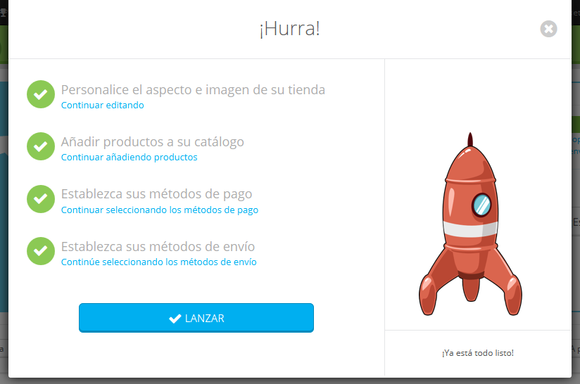

# Súbete a bordo de Prestashop - Haz un recorrido guiado

Desde la versión 1.6.0.11 de PrestaShop, toda nueva instalación de este software cuenta con el módulo "Primeros pasos" activado de manera predeterminada. Dicho módulo se ha construido desde cero para ayudar a los nuevos usuarios a comprender rápidamente la forma en que el back-office funciona, guíandoles desde la personalización básica hasta el lanzamiento de su tienda, mediante pasos que cubren la adición de un producto al catálogo, configurar los métodos de pago de la tienda, y seleccionar las opciones de envío por defecto. Todo esto se realiza desde una interfaz lúdica.

Si ya estás habituado y conoces cómo funciona el panel de administración de PrestaShop, probablemente deberías deshabilitar este módulo:

1. Dirígete a la página Módulos y Servicios.
2. Busca el módulo "Primeros pasos".
3. Deshabilítalo.

## ¿Cómo funciona el módulo? 

La interfaz del módulo no puede ser ignorada: ésta será la primera cosa que verás en la parte superior de cada página del back-office, antes incluso que el contenido en sí de la propia página.

A primera vista, entenderás como funciona el módulo: en un puñado de sencillos pasos, éste tomará a los principiantes de la mano y les ayudará a establecer las opciones de configuración de su tienda.

Al hacer clic en el botón "¡Vamos a empezar!" se inicia todo el proceso – que puedes interrumpir en cualquier momento, para finalizarlo más adelante. Ese proceso se comparte entre una ventana que aparece en la parte superior de la interfaz de back-office, que te dará las instrucciones a seguir, y la propia interfaz principal, donde se espera que sigas dichas instrucciones.

## Paso 1: Personaliza el aspecto e imagen de tu tienda 

El primer paso te ayuda a personalizar tu tienda, con el fin de adecuarla a tu gusto. Esto se realiza mediante la instalación de un nuevo tema y la subida del logo de tu marca.

Si te fijas en el fondo, observarás que el módulo ya ha cambiado de la página actual de inicio por la página de Preferencias de Temas. Haz clic en "OK, vamos a mi tema" para ocultar la ventana modal del módulo y poder trabajar en el tema de tu tienda: puedes cambiar el tema predeterminado por otro que tengas, o puedes obtener un nuevo tema desde el marketplace de PrestaShop: [http://addons.prestashop.com/](http://addons.prestashop.com/)

Una vez que hayas instalado y activado tu nuevo tema, deberás pasar algún tiempo más en la página de Preferencias de Temas, para comprobar todos los ajustes disponibles, y asegurarte de que se encuentran establececidos de la forma en que deseas.

Cuando hayas terminado con la personalización de tu tienda, haz clic en el botón del módulo "He terminado, llévame al siguiente paso".

## Paso 2: Añadir productos a tu catálogo 

El segundo paso te dirige al corazón de tu tienda: los productos que vendes.

Haz clic en el botón "OK, ir a mi catálogo" para hacer que la ventana del módulo desaparezca. La página de back-office será ahora la del formulario de creación de productos. Comprueba los distintos campos y fichas disponibles a la izquierda, y no dudes en hacer clic en el botón "Ayuda" para obtener más información sobre todas las posibilidades que PrestaShop ofrece.

Crea varios productos, aunque sean falsos, con el fin de hacerte una idea de cómo funciona la interfaz. Luego, una vez que estés convencido de que has comprendido como funciona esta sección, crea tus productos reales.

Cuando hayas terminado con la creación de productos, haz clic en el módulo "He terminado, llevame al siguiente paso".

## Paso 3: Establecer tus métodos de pago 

El tercer paso es esencial: si no estableces los métodos de pago, ¡no podrás recibir el dinero por tus productos vendidos!

Haz clic en el botón "Mostrarme los métodos de pago" para hacer que la ventana del módulo desaparezca. La página del back-office es ahora la página de elección y configuración de los módulos de métodos de pago. En ella se presentan varios métodos de pago.

Los que están disponibles de forma predeterminada no requieren una cuenta, pero esto significa que el envío será retrasado hasta que hayas verificado que se ha efectuado el pago por parte del cliente: los pagos por transferencia bancaria y por cheque, requieren la comprobación manual del pago con el fin de validar el pedido.

PrestaShop te recomienda varios métodos de pago en esta pantalla, los cuales son en efecto módulos que puedes instalar. Estos módulos que se presentan son seguros, muy conocidos y apoyados por PrestaShop. Los módulos que aparecen dependen de donde esté instalada tu tienda: un vendedor estadounidense no obtendrá los mismos métodos de pago que uno polaco. Selecciona algún módulo con el que deseas trabajar, y configúralo con la información de tu cuenta. Puede tener tantos métodos de pago, como consideres sea necesario.

Más abajo en esta misma pantalla, puedes establecer restricciones de pago basándose en la moneda, el grupo y país de los clientes. ¡Ten cuidado al realizar esta acción, ya que las restricciones pueden impedir que los clientes utilicen un método de pago determinado, o incluso poder comprar en toda tu tienda!

Cuando hayas terminado con la configuración de los métodos de pago, haz clic en el botón del módulo "He terminado, llevame al siguiente paso".

Paso 4: Establecer tus métodos de envío\
 
-------------------------------------------------------------------------------------------------------------------------------------------------------------------------------------

Este cuarto paso es también esencial: si no estableces los métodos de envío, ¡los clientes no podrán elegir cómo quieren recibir sus compras, ni tampoco pagarte por el envío!. Si sólo estás vendiendo productos digitales (PDF, etc.), entonces tiene sentido que no tengas empresa de transporte para realizar envíos, pero si lo que haces es vender productos reales físicos, tendrás que indicar con qué empresas de transporte   quieres enviar el envío de tus productos.

Haz clic en el botón "Vamos a ver sobre los envíos" para hacer que la ventana del módulo desaparezca. La página de back-office es ahora la página de configuración de Transportistas. Se te presentan dos opciones: añadir un nuevo transportista personalizado, o utilizar un módulo recomendado por PrestaShop.

Si sólo estás vendiendo productos digitales, haz clic en "Omitir el tutorial".

Añadir un nuevo transportista personalizado se realiza a través de un sencillo asistente, que te ayudará a configurar todo: el nombre del transportista, el tiempo de tránsito, los lugares a los que envías y los costos, limitaciones de tamaño / peso, etc.

Es posible que prefieras utilizar un módulo de transporte recomendado, que es una forma más rápida de hacer todo el proceso detallado anteriormente. Algunos de estos módulos son listados de forma predeterminada en la página principal, pero puedes encontrar más en la página "Módulos". Instala alguno con el que haya firmado un contrato, y configura el módulo con la información indicada en dicho contrato.

Cuando hayas terminado con la configuración de los métodos de envío, haz clic en el botón del módulo "He terminado, llevame al siguiente paso".

## ¡Proceso completado! 

¡Has completado (prácticamente casi) el proceso!

Ahora ya has pasado por todos los pasos esenciales para la configuración de tu tienda. Hay muchas otros pasos, pero estos son realmente necesarios para la venta en Internet.

Si lo crees conveniente, haz clic en el botón del módulo "Lanzar" para poner fin a las instrucciones del módulo, ¡y observar la animación del cohete despegando hacia el cielo.!

Antes de establecer tu tienda fuera del modo de mantenimiento y ponerla a disposición de todos las personas que navegan a través de Internet, es posible que desees esperar un poco y comprobar antes que nada todas las otras páginas de preferencias disponibles en el back-office, con el fin de asegurarte que todas ellas están establecidas de la forma en que deseas. Si es así, no hagas clic en el botón "Lanzar", sino en el botón de la cruz de la ventana del módulo para cerrarlo.

Una vez que lo tengas todo establecido a tu gusto, dirígete a la página "Mantenimiento" bajo el menú "Preferencias", y activa tu tienda. ¡Hecho, que tengas buena suerte con tu emprendimiento en línea!. Un buen comienzo que debería de realizar es promocionar tu tienda: así que comparte tu lanzamiento en las redes sociales, utilizando la ventana final del módulo.

Una vez que hayas terminado, el módulo dejará de aparecer en el back-office de tu tienda.
