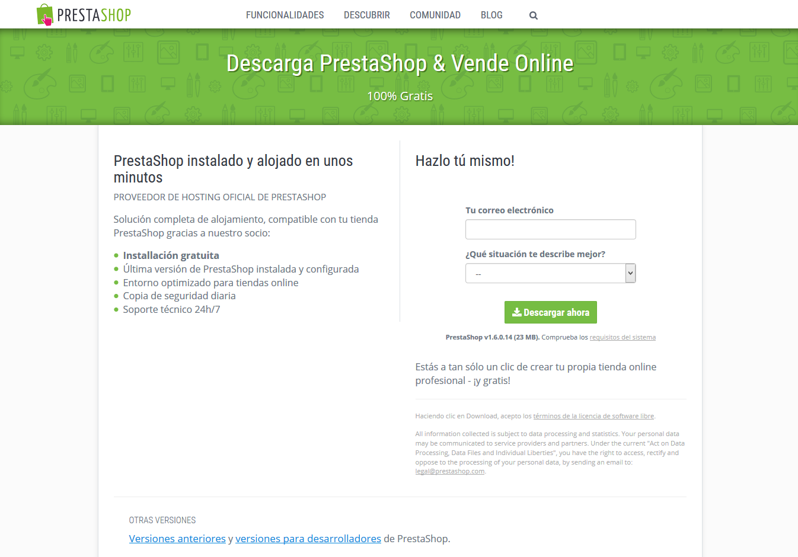
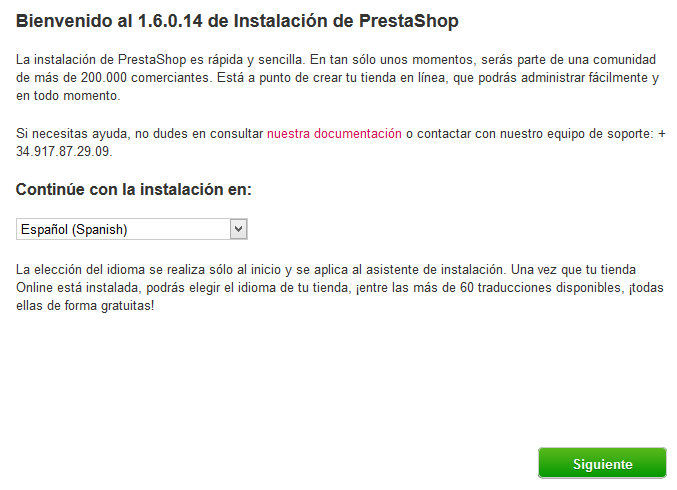
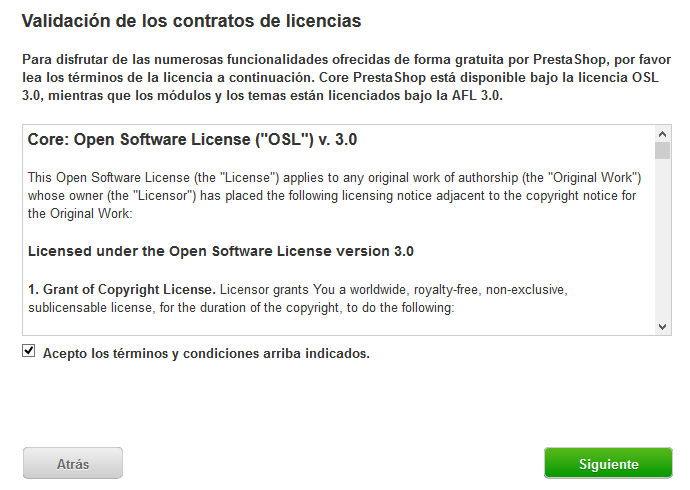
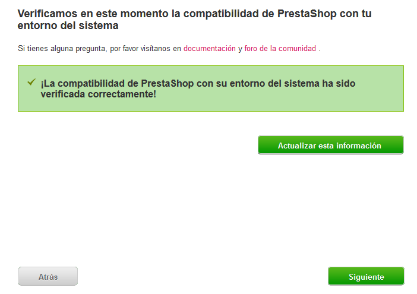
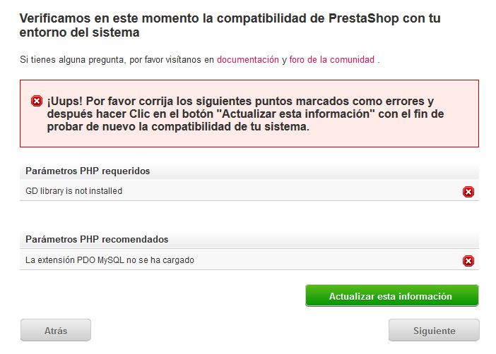
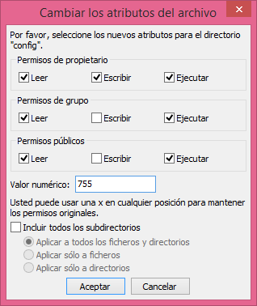
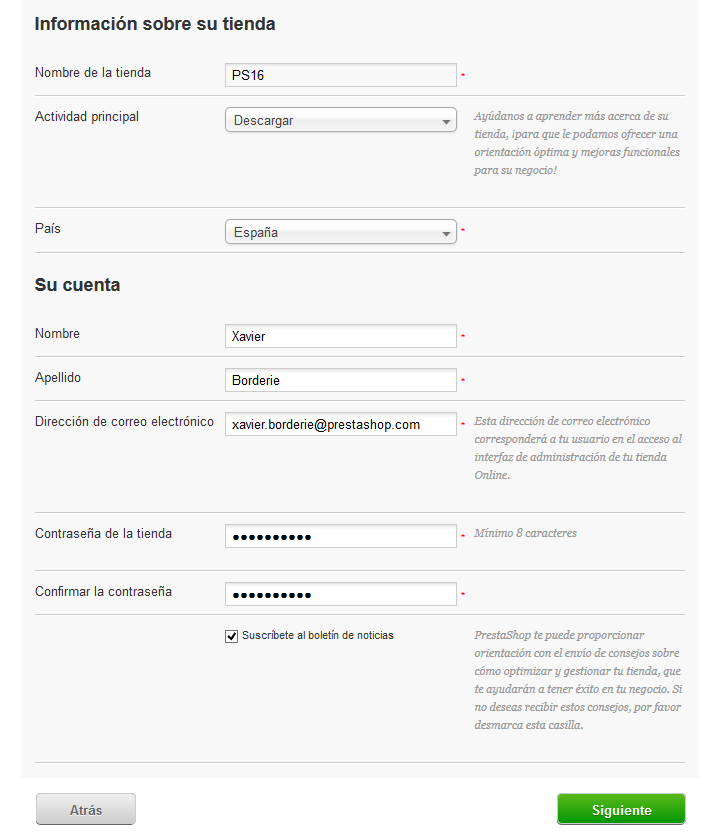
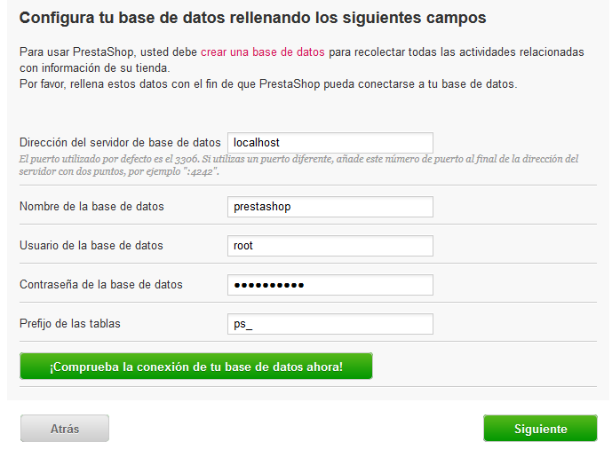
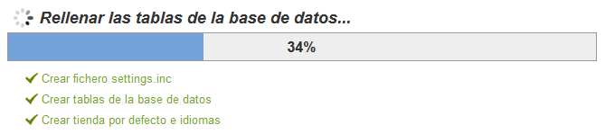
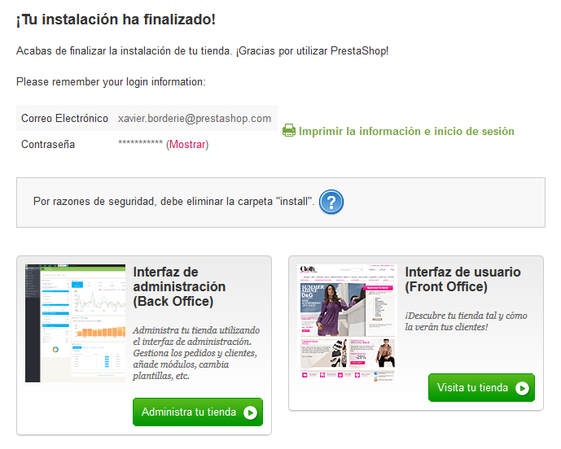

# Instalación de PrestaShop

**Tabla de contenidos**\
****

/\*\<!\[CDATA\[\*/\
div.rbtoc1597066504153 {padding: 0px;}\
div.rbtoc1597066504153 ul {list-style: disc;margin-left: 0px;}\
div.rbtoc1597066504153 li {margin-left: 0px;padding-left: 0px;}\
\
/\*]]>\*/

* [Instalación de PrestaShop en 10 minutos](instalacion-de-prestashop.md#InstalacióndePrestaShop-InstalacióndePrestaShopen10minutos)
  * [Instrucciones rápidas de instalación](instalacion-de-prestashop.md#InstalacióndePrestaShop-Instruccionesrápidasdeinstalación)
  * [Instrucciones detalladas](instalacion-de-prestashop.md#InstalacióndePrestaShop-Instruccionesdetalladas)
    * [Descargar y descomprimir el archivo PrestaShop](instalacion-de-prestashop.md#InstalacióndePrestaShop-DescargarydescomprimirelarchivoPrestaShop)
    * [Subir/Cargar PrestaShop utilizando un cliente FTP](instalacion-de-prestashop.md#InstalacióndePrestaShop-Subir/CargarPrestaShoputilizandounclienteFTP)
    * [Crear una base de datos para su tienda](instalacion-de-prestashop.md#InstalacióndePrestaShop-Crearunabasededatosparasutienda)
    * [Lanzar el auto-instalador](instalacion-de-prestashop.md#InstalacióndePrestaShop-Lanzarelauto-instalador)
    * [Finalización de la instalación](instalacion-de-prestashop.md#InstalacióndePrestaShop-Finalizacióndelainstalación)

Este capítulo ha sido escrito para todos aquellos que tengan la intención de instalar PrestaShop en su servidor web online.\
Si desea instalar PrestaShop en su propio ordenador, deberá primero seguir las instrucciones de esta página: [Instalación de PrestaShop en su ordenador](instalacion-de-prestashop-en-su-ordenador.md).

Si ya ha leído las instrucciones de esa página, vaya directamente a la sección "Creación de una base de datos para su tienda" que encontrará en esta misma página.

## Instalación de PrestaShop en 10 minutos 

PrestaShop es muy fácil de instalar. Una vez que todos los archivos estén subidos a su servidor web, debería poder empezar a configurar su tienda en menos de 5 minutos: el proceso de instalación es muy sencillo, ya que el instalador se encarga prácticamente de todo el trabajo sin usted apenas tenga que intervenir. Los usuarios menos experimentados podrían necesitar entre 10 y 20 minutos para completar todo el proceso.

Antes de empezar, asegúrese de tener con todos los requisitos necesarios: webhost o espacio de alojamiento en un proveedor de hosting, nombre de dominio, cliente FTP, editor de texto. Asegúrese primeramente, de seguir las instrucciones de la página "Lo que necesita para empezar": [http://doc.prestashop.com/display/PS16/Lo+que+necesita+para+empezar](http://doc.prestashop.com/display/PS16/Lo+que+necesita+para+empezar).

Algunos proveedores de hosting ofrecen la opción de instalar una aplicación de Prestashop autoinstalable con tan sólo un clic de ratón, ahorrándole tiempo para que pueda empezar a trabajar aún más rápido. El uso de este servicio puede reducir drásticamente el tiempo de instalación para los usuarios sin experiencia.

* A2 Hosting: [https://partners.a2hosting.com/solutions.php?id=3682\&url=317](https://partners.a2hosting.com/solutions.php?id=3682\&url=317)
* 1&1 Hosting: [https://www.1and1.com/prestashop-hosting](http://web.epartner.es/click.asp?ref=676625\&site=5327\&type=text\&tnb=50)

Estos proveedores de hosting utilizan principalmente las siguientes bibliotecas de scripts:

* SimpleScripts: [https://www.simplescripts.com/script\_details/install:PrestaShop](https://www.simplescripts.com/script\_details/install:PrestaShop),
* Installatron: [http://installatron.com/apps?locale=en#cmd=browser\&display=prestashop](http://installatron.com/apps?locale=en#cmd=browser\&display=prestashop),
* Softaculous: [http://www.softaculous.com/apps/ecommerce/PrestaShop](http://www.softaculous.com/apps/ecommerce/PrestaShop).

Algunos de estos scripts incluso soportan la actualización en un 1-clic, lo que tiene un valor incalculable.

Otros proveedores de alojamiento, tienen sus propios scripts de instalación. Consulte con su proveedor de hosting para obtener más información.

### Instrucciones rápidas de instalación 

Aquí se presenta un conjunto de instrucciones destinadas a aquellos usuarios, que ya tienen experiencia en la instalación de aplicaciones PHP/MySQL en un servidor web. Si la falta de detalles le supone un problema , encontrará instrucciones detalladas en la siguiente sección de este capítulo.

1. Descargue y descomprima el paquete PrestaShop si todavía no lo ha hecho.
2. Cree una base de datos para su tienda PrestaShop  en su servidor web, si es posible. En caso de que no tenga definido ningún usuario MySQL con todos los privilegios para acceder y modificar esta base de datos, cree a éste también.
3. Suba los archivos y carpetas de PrestaShop a la ubicación elegida en su servidor web. No suba la carpeta raíz `/prestashop` directamente: tan sólo los archivos y carpetas que contiene.
4. Ejecute el script de instalación de PrestaShop accediendo a la dirección URL pública de la ubicación elegida en un navegador web. Esta debe ser la URL donde ha subido los archivos de PrestaShop.
5. Siga las instrucciones indicadas por cada uno de los pasos del instalador.
6. Una vez que la instalación haya sido completada, elimine la carpeta `/install` y anote el nombre de la nueva carpeta `/admin`, renombrada a un nombre identificador único para su tienda, por razones de seguridad.

¡PrestaShop debe ahora estar instalado y preparado para ser configurado a sus necesidades!. Continúe con el capítulo [Primeros pasos con PrestaShop 1.6](../guia-del-usuario/primeros-pasos-con-prestashop-1.6.md) de la Guía del usuario.

### Instrucciones detalladas 

#### Descargar y descomprimir el archivo PrestaShop 

Puede descargar la última versión de PrestaShop desde el siguiente enlace: [https://www.prestashop.com/es/descarga](https://www.prestashop.com/es/descarga).

Tan sólo tiene una opción de descarga: la última versión estable, preparada para toda clase de tiendas online.

Si necesita descargar cualquier versión anterior o previa, diríjase a esta dirección: [https://www.prestashop.com/es/developers-versions](https://www.prestashop.com/es/developers-versions). Desplácese hacia abajo de esta página, hasta encontrar la sección denominada: "Versiones publicadas anteriormente".

Nota: Tenga en cuenta que no se recomienda el uso de otra versión que no sea la versión actual estable. Le recomendamos encarecidamente utilizar la última versión de PrestaShop para crear una tienda online.\

Haga clic en el botón "Descargar ahora", y guarde el archivo en cualquier ubicación de su ordenador (como por ejemplo en el escritorio). Debería obtener un archivo llamado "prestashop\_1.6.0.14.zip" (o un equivalente similar, que dependerá del número de versión).

El archivo descargado es un archivo Zip, lo que significa que ahora tiene un archivo que contiene todos los archivos que forman PrestaShop de forma comprimida. Con el fin de continuar con el proceso, **debe** **descomprimir** **el archivo**.

Si su sistema operativo no soporta de forma nativa archivos Zip, puede descargar e instalar una herramienta específica, como por ejemplo:

* Windows:
  * 7-zip: [http://www.7-zip.org/](http://www.7-zip.org/)
  * WinZip: [http://www.winzip.com/win/es/index.htm](http://www.winzip.com/win/es/index.htm)
  * WinRAR: [http://www.rarlab.com/](http://www.rarlab.com/)
* Mac OS X:
  * iZip: [http://www.izip.com/](http://www.izip.com/)
  * WinZip Mac: [http://www.winzip.com/mac/](http://www.winzip.com/mac/)
  * Zipeg: [http://www.zipeg.com/](http://www.zipeg.com/)

Utilizando una herramienta Zip, extraiga el contenido del archivo en una ubicación de su disco duro (como por ejemplo en el escritorio). **No cargue/suba el archivo Zip directamente a su** **servidor web**.

El archivo Zip tiene dos elementos en su raíz:

* La carpeta "prestashop", que contiene todos los archivos de PrestaShop que pronto va a subir en su servidor web.
* El archivo "Install\_PrestaShop.html", que se abre en el navegador predeterminado.

El archivo "Install\_PrestaShop.html" no debe ser cargado/subido a su servidor web.

#### Subir/Cargar PrestaShop utilizando un cliente FTP 

En este punto, debería tener un espacio de alojamiento a su disposición (si no lo tiene, lea el capítulo "Lo que necesita para empezar" de esta guía), y una carpeta en su disco duro con el  archivo PrestaShop descomprimido.

Al realizar este paso subirá/cargará  los archivos de PrestaShop en su espacio de alojamiento. Este proceso se realiza mediante la conexión de su computadora a su servidor utilizando una herramienta conocida como "cliente de FTP", que ya debió de haber instalado durante la lectura del capítulo  "Lo que necesita para empezar". Nosotros en esta guía vamos a utilizar un cliente FTP gratuito denominado FileZilla ([http://filezilla-project.org/](http://filezilla-project.org/)).

Conéctese a su espacio de alojamiento utilizando su cliente FTP, utilizando los datos de conexión proporcionados por su proveedor de alojamiento web (si no los conoce, póngase en contacto con su proveedor de alojamiento). Una vez conectado, deberá transferir los archivos PrestaShop desde su ordenador a su servidor.

En FileZilla (o cualquier otro cliente FTP), navegue a través de sus carpetas locales hasta que encuentre la que contiene los archivos de PrestaShop. Manténgala abierta en el panel "Sitio local" de la columna izquierda.

.png>)

En el panel "Sitio remoto" (a la derecha), diríjase a la ubicación en la que desea que PrestaShop esté disponible públicamente (raíz del dominio, sub-carpeta, sub-dominio...). Esto puede variar mucho, dependiendo tanto de su proveedor de alojamiento como de sus necesidades:

* Su proveedor de alojamiento:\

  * Algunos proveedores de alojamiento pueden requerir que usted coloque sus archivos en una carpeta específica, tales como `/htdocs`, `/public_html`, `/web`, `/www`, `/`[`sunombrededominio.com`](http://sunombrededominio.com), etc.
  * Otros proveedores de alojamiento, simplemente le piden que ingrese directamente dentro del apropiado espacio de carga.
* Sus requisitos y necesidades:
  * Si quiere que su tienda sea la página web principal de su nombre de dominio (es decir, [http://www.ejemplo.com](http://www.ejemplo.com)), cargue/suba PrestaShop en la carpeta raíz del espacio de carga/subida (que puede depender del proveedor de alojamiento).
  * Si quiere que su tienda se encuentre disponible en una subcarpeta de su nombre de dominio ([http://www.ejemplo.com/tienda](http://www.ejemplo.com/tienda)), deberá primero crear dicha carpeta a través de FileZilla (haga clic con el botón derecho del ratón y seleccione "Crear directorio"), a continuación cargue/suba PrestaShop dentro de esa carpeta.
  * Si quiere que su tienda esté disponible en un subdominio perteneciente a su nombre de dominio ([http://tienda.ejemplo.com](http://tienda.ejemplo.com)), deberá primero crear dicho subdominio. De nuevo este punto depende de su proveedor de alojamiento: puede que tenga que hacerlo añadiendo simplemente una nueva carpeta utilizando su cliente FTP, o puede que tenga que crear el subdominio a través del panel de administración de su proveedor de hosting. Lea primero la documentación de soporte proporcionada por su proveedor. Una vez creado, diríjase a la carpeta del subdominio, y cargue/suba PrestaShop allí mismo.

En la parte izquierda de FileZilla, debe ahora tener la carpeta local donde almacena los archivos PrestaShop procedente del archivo Zip, y en la parte derecha, la ubicación de destino. Si no ha hecho esto todavía, el proceso de carga/subida es sencillo: seleccione todos los archivos y directorios de la carpeta local (use Ctrl-A), y, o bien arrástrelos y suéltelos en la carpeta remota, o haga clic con el botón derecho del ratón en la selección realizada y seleccione la opción "Subir" en el menú contextual.

.png>)

La carga/subida puede tardar varios minutos, ya que PrestaShop está formado por más de 7500 archivos y casi 1.000 carpetas. Tras este espacio de tiempo, todos los archivos y carpetas del PrestaShop deberían estar en línea. ¡Gran trabajo!

#### Crear una base de datos para su tienda 

Antes de que realmente puede instalar PrestaShop, necesita asegurarse de que su servidor MySQL tiene una base de datos preparada para almacenar los datos de PrestaShop. Si no la tiene, debe crear una.

Puede crear una base de datos utilizando cualquier herramienta de administración de base de datos. En esta guía, nosotros vamos a utilizar la herramienta gratuita phpMyAdmin ([http://www.phpmyadmin.net/](http://www.phpmyadmin.net/)), que ya viene preinstalada en el panel de control de la mayoría de los proveedores de alojamiento web.

Algunos proveedores de alojamiento web prefieren que sus clientes utilicen un panel de control gráfico, tales como cPanel, Plesk o incluso algún otro desarrollado a medida. Asegúrese de leer la documentación de soporte proporcionada por su proveedor sobre el manejo de bases de datos MySQL, y cree una base de datos para su tienda siguiendo dichas explicaciones específicas.

Conéctese a phpMyAdmin utilizando sus credenciales de autenticación proporcionados por su proveedor. Ésta debe ser accesible a través de una URL estándar, ligada a su nombre de dominio o nombre de dominio del proveedor.&#x20;

.png>)

En la columna izquierda, puede ver las bases de datos disponibles en la actualidad en el servidor MySQL. Algunas de ellas deben ser dejadas tal cual y no ser modificadas ni eliminadas, ya que son utilizadas por phpMyAdmin o por el proveedor de alojamiento: `phpmyadmin`, `mysql`, `information_schema`, `performance_schema` y otras. Consúlte la documentación de soporte técnico proporcionada por su proveedor de hosting, para saber si alguna de éstas puede ser utilizada como  base de datos predeterminada.

De todas formas, puede crear una nueva base de datos haciendo clic en el menú "Base de datos" y haciendo uso del formulario central que aparece en pantalla denominado "Crear base de datos". El proceso es tan simple como el de introducir un nombre único para la base de datos, y a continuación hacer clic en el botón "Crear". El nombre de la base de datos será añadido al listado de la izquierda. Ahora puede utilizarla para almacenar los datos de PrestaShop.

#### Lanzar el auto-instalador 

Ahora viene la parte donde todo confluye: la instalación de PrestaShop.

El proceso de instalación es bastante sencillo, ya que será guiado y ayudado en todo momento por el auto-instalador de PrestaShop. Debería de estar navegando a través de su tienda en pocos minutos. Lea  detenidamente cada pantalla del instalador para no omitir ninguna información.

Para iniciar el proceso de instalación, simplemente acceda a la URL pública de PrestaShop en su servidor web: el script detectará automáticamente que PrestaShop todavía no ha sido instalado, y el auto-instalador tomará el control.\
También puede escribir directamente la dirección de la carpeta `/install`: [`http://www.ejemplo.com/carpeta_prestashop/install`](http://www.ejemplo.com/carpeta\_prestashop/install).

Si va a realizar una instalación en su propio ordenador, ésta deberá realizarse desde la carpeta PrestaShop de su servidor web local, la cual debería estar disponible en la dirección [`http://127.0.0.1/prestashop`](http://127.0.0.1/prestashop).

A partir de aquí, tan sólo tendrá que leer, realizar algunos clics de ratón, y rellenar algunos formularios.

Hay 6 pasos. En la parte superior de la página, el asistente de instalación le muestra en que paso del proceso se encuentra actualmente: las caras grises se convierten en caras sonrientes tras completar un paso.&#x20;

**Paso 1: Página de bienvenida**

Esta página es una rápida introducción al proceso de instalación. Puede elegir el idioma en el que el programa de instalación mostrará sus instrucciones.

En esta pantalla, también se le muestra un enlace que le dirige al sitio oficial de la documentación ([http://doc.prestashop.com/](http://doc.prestashop.com/)), y el número de teléfono de atención al cliente de PrestaShop. Puede aprender más acerca de nuestro servicio de soporte dirigiéndose a [https://www.prestashop.com/es/support](https://www.prestashop.com/es/support).

Seleccione el idioma en el que desee que se le muestra el proceso de instalación, a continuación haga clic en el botón "Siguiente". Este proceso también establece el idioma predeterminado para la instalación de PrestaShop – aunque otros idiomas también estarán disponibles para que usted los pueda activar si los necesita.

**Paso 2: Licencias de PrestaShop**

Esta segunda página es un simple requerimiento: PrestaShop es gratuito y se distribuye bajo un determinado conjunto de licencias de código abierto. No puede utilizar este software si no está de acuerdo con los términos de las licencias, y este paso requiere que usted las conozca explícitamente.

Lea las licencias bajo las que se distribuye PrestaShop:

* _Open Software License 3.0_ para el propio PrestaShop, que puede leer también en la dirección web [http://www.opensource.org/licenses/OSL-3.0](http://www.opensource.org/licenses/OSL-3.0).&#x20;
* _Academic Free License 3.0_ para los módulos y temas, que puede leer también en la dirección web [http://opensource.org/licenses/AFL-3.0](http://opensource.org/licenses/AFL-3.0).

Debe aceptar ambas licencias para instalar PrestaShop.

Para acceder al siguiente paso, debe marcar la casilla "Acepto los términos y condiciones arriba indicados", a continuación haga clic en el botón "Siguiente". Si no está de acuerdo de manera explícita con estas licencias, no puede instalar PrestaShop: ni siquiera podrá hacer clic en el botón "Siguiente".

**Pasos 3 y 4: Compatibilidad del sistema e información sobre su tienda**

La tercera página hace una comprobación rápida de todos los parámetros del servidor de su proveedor de alojamiento. En la mayoría de los casos, usted no verá esta página, porque si no se encuentra nada erróneo, será redirigido directamente a la cuarta página, "Información sobre su tienda". Si así fuese, todavía puede volver a la tercera página haciendo clic en el enlace "Compatibilidad del sistema" en la barra lateral izquierda.

Si algo sale mal durante la comprobación de servidor que sucede en la tercera etapa, el instalador mostrará la página "Compatibilidad del sistema", donde podrá ver todas las comprobaciones que fallaron.

**Compatibilidad del sistema**

Esta página verifica que todas las configuraciones del servidor están correctamente realizadas: la configuración de PHP, los permisos de archivos y carpetas, las herramientas de terceros, etc.

Si algo sale mal, el instalador detendrá el proceso de instalación aquí, permitiéndole ver los detalles técnicos que tendrá que corregir, ya sea cambiando la configuración de PHP o actualizando los permisos de archivo.

A continuación, le presentamos el listado de las comprobaciones que se realizan durante este tercer paso:

| Comprobación                                                    | ¿Cómo/dónde solucionarlo?                                                                                         |
| --------------------------------------------------------------- | ----------------------------------------------------------------------------------------------------------------- |
| ¿Se encuentra PHP 5.1.2 o superior instalado?                   | Servidor web                                                                                                      |
| ¿Puede PrestaShop cargar/subir archivos?                        | Archivo php.ini (`file_uploads`)                                                                                  |
| ¿Puede PrestaShop crear nuevos archivos y carpetas?             | Explorador de archivos / cliente FTP / línea de comando                                                           |
| ¿Se encuentra instalada la biblioteca GD?                       | Archivo php.ini (`extension=`[`php_gd2.so`](http://php\_gd2.so))                                                  |
| ¿Se encuentra el soporte de MySQL activo?                       | Archivo php.ini (`extension=`[`php_pdo_mysql.so`](http://php\_pdo\_mysql.so))                                     |
| Permisos recursivos de escritura en \~/config/                  | Explorador de archivos / cliente FTP / línea de comando                                                           |
| Permisos recursivos de escritura en \~/cache/                   | Explorador de archivos / cliente FTP / línea de comando                                                           |
| Permisos recursivos de escritura en \~/log/                     | Explorador de archivos / cliente FTP / línea de comando                                                           |
| Permisos recursivos de escritura en \~/img/                     | Explorador de archivos / cliente FTP / línea de comando                                                           |
| Permisos recursivos de escritura en \~/mails/                   | Explorador de archivos / cliente FTP / línea de comando                                                           |
| Permisos recursivos de escritura en \~/modules/                 | Explorador de archivos / cliente FTP / línea de comando                                                           |
| Permisos recursivos de escritura en \~/override/                | Explorador de archivos / cliente FTP / línea de comando                                                           |
| Permisos recursivos de escritura en \~/themes/default/lang/     | Explorador de archivos / cliente FTP / línea de comando                                                           |
| Permisos recursivos de escritura en \~/themes/default/pdf/lang/ | Explorador de archivos / cliente FTP / línea de comando                                                           |
| Permisos recursivos de escritura en \~/themes/default/cache/    | Explorador de archivos / cliente FTP / línea de comando                                                           |
| Permisos recursivos de escritura en \~/translations/            | Explorador de archivos / cliente FTP / línea de comando                                                           |
| Permisos recursivos de escritura en \~/upload/                  | Explorador de archivos / cliente FTP / línea de comando                                                           |
| Permisos recursivos de escritura en \~/download/                | Explorador de archivos / cliente FTP / línea de comando                                                           |
| Permisos recursivos de escritura en \~/sitemap.xml              | Explorador de archivos / cliente FTP / línea de comando                                                           |
| ¿Puede PrestaShop abrir URL's externas?                         | Archivo php.ini (`allow_url_fopen`)                                                                               |
| ¿Se encuentra la opción PHP "register global" desactivada?      | Archivo php.ini (`register_globals`)                                                                              |
| ¿Se encuentra activada la compresión GZIP?                      | Archivo .htaccess                                                                                                 |
| ¿Se encuentra la extensión Mcrypt disponible?                   | Archivo php.ini (consulte [http://php.net/manual/es/mcrypt.setup.php](http://php.net/manual/es/mcrypt.setup.php)) |
| ¿Se encuentra la opción PHP "magic quotes" desactivada?         | Archivo php.ini (`magic_quotes_gpc`)                                                                              |
| ¿Se encuentra cargada la extensión Dom?                         | Opción `--enable-dom`  al momento de compilar                                                                     |
| ¿Se encuentra cargada la extensión PDO MySQL?                   | Archivo php.ini (`extension=`[`php_pdo_mysql.so`](http://php\_pdo\_mysql.so))                                     |

Mientras que los cambios de configuración de PHP no pueden ser explicados completamente en generalidades aplicables a todas las situaciones ya que en muchas situaciones dependen de su nivel de acceso a su servidor, la manipulación y actualización de los permisos de archivos sí es más concreta y sencilla de explicar.

Los permisos son la forma en que un sistema de archivos otorga derechos de acceso a usuarios o grupos de usuarios específicos, controlando su capacidad de ver o realizar cambios en los archivos y carpetas. El instalador tiene que hacer varios cambios en los archivos que usted ha subido, y si el sistema de archivos no permite estos cambios a través de los permisos adecuados, entonces el instalador no puede completar su proceso.

Por lo tanto, si el instalador muestra que algunos archivos o carpetas no tienen el permiso adecuado, tiene que cambiador estos permisos usted mismo. Para ello será necesario que pueda acceder a sus archivos en su servidor web, y utilizar su cliente FTP (como FileZilla) o la línea de comandos.

Ingrese a su cuenta de servidor usando su cliente FTP, vaya a la carpeta de PrestaShop, y encuentre las carpetas que están señaladas por el instalador como con necesidad de un cambio de permiso.

CHMOD

Al proceso de cambiar los permisos de los archivo o directorios en un sistema Unix / Linux se denomina "CHMOD", y se realiza ejecutando un comando que utiliza ese mismo nombre (consulte: [http://es.wikipedia.org/wiki/Chmod](http://es.wikipedia.org/wiki/Chmod) – puede encontrar una explicación de los permisos de archivos en la siguiente dirección: [http://www.elated.com/articles/understanding-permissions/](http://www.elated.com/articles/understanding-permissions/)).\
&#x20;Al proceso de otorgar a los archivos o directorios de un "permiso de escritura" se le denomina "hacer un CHMOD 755" o "un CHMOD 775", dependiendo del host.

Algunos hosts pueden requerir que utilice CHMOD 777, aunque esto no se recomienda para nada más que una necesidad puntual.\
Si tiene que utilizar CHMOD 777 para instalar PrestaShop, asegúrese de cambiar este entorno a uno más seguro (por ejemplo, 775 para los directorios y 664 para los archivos) una vez que haya terminado el proceso de instalación.\
Consulte la documentación de soporte técnico proporcionada por su proveedor con detenimiento.

Gracias a FileZilla (y la mayoría de los clientes FTP), no tiene que utilizar ningún comando de Unix. La mayoría de los clientes FTP permiten cambiar los permisos con facilidad y de forma gráfica: una vez que haya encontrado un archivo o directorio que necesita un cambio de este tipo, haga clic con el botón derecho del ratón sobre éste, y en el menú contextual, seleccione "Permisos de archivo...". Se abrirá una pequeña ventana como la que se muestra a continuación.

Dependiendo de la configuración del servidor (que no siempre se tiene a mano), necesitará marcar las casillas "Leer" y "Ejecutar" de las columnas, y al menos la casilla "Escribir" en "Permisos de propietario" y "Permisos de Grupo". Algunos hosts podrían requerir que tenga la casilla "Escribir" de los "Permisos públicos" marcada, pero tenga cuidado con esto último: rara vez se necesita que  cualquier persona en su servidor tenga permisos para editar el contenido de la instalación de PrestaShop.

Algunos directorios que contengan subcarpetas y archivos en su interior, necesitarán aplicar recursivamente cambios a los permisos de todo el contenido. En ese caso, marque la casilla "Incluir todos los subdirectorios".

Mientras realiza los cambios de permisos en su cliente FTP, debe comprobar con regularidad que está realizando los cambios requeridos ejecutando en el instalador de PrestaShop la comprobación de compatibilidad: para ello haga clic en el botón del instalador "Actualizar esta información" con la frecuencia necesaria.\
Una vez que todos los indicadores se presentan de color verde, haga clic en el botón "Siguiente". Si no puede conseguir que todos los indicadores sean de color verde, al menos asegúrese de que el instalador muestre el mensaje de "¡La compatibilidad de PrestaShop con el entorno del sistema ha sido verificada correctamente!" en la parte superior de la página.

**Información de la tienda**\
****

Aquí es donde usted puede comenzar a personalizar su tienda: establezca para ella un nombre y un logotipo, indique su actividad principal, e indique los datos personales del propietario de la tienda (que puede tener implicaciones legales en algunos países)...

No utilice dos puntos en el nombre de su tienda, ya que podría impedir que alguna funcionalidad trabaje correctamente (por ejemplo, esto podría provocar fallos en el envío de correos electrónicos).

Puede reemplazar los dos puntos por un guion si usted necesita tener dos partes diferenciadas en el título. Por ejemplo, utilice "Mi Tienda - El mejor sitio  para comprar artículos" en lugar de "Mi Tienda: El mejor sitio para comprar artículos".

En cuanto al logotipo, debe tener en cuenta que aparecerá:

* En todas las páginas de su tienda (dependiendo del tema utilizado).
* En su back-office.
* En todos los correos electrónicos enviados a sus clientes.
* En todos los documentos contractuales (facturas, autorizaciones de devolución, etc.).

Por lo tanto, no mantenga el logotipo predeterminado de PrestaShop, por razones obvias.

Haga clic en "Siguiente" para continuar.

**Paso 5: Configuración del sistema**

Esta página contiene un formulario que le permite informar a PrestaShop donde se encuentra el servidor de la base de datos, y que base de datos desea utilizar, junto con algunos otros detalles. Toda esta información debería haber sido proporcionado por su proveedor de alojamiento web.

Rellene todos los campos con la información de conexión de base de datos proporcionada por su proveedor de alojamiento web:

* **Dirección del servidor de base de datos**. El hostname de su servidor MySQL. Éste puede estar ligado a su nombre de dominio (es decir. [http://sql.ejemplo.com](http://sql.ejemplo.com)), ligado a su web host (es decir. [http://mysql2.alwaysdata.com](http://mysql2.alwaysdata.com)), o simplemente ser una dirección IP (es decir, 46.105.78.185).
* **Nombre de la base de datos**. El nombre de la base de datos que desea utilizar para que PrestaShop almacene sus datos. Ésta puede ser  una base de datos existente en el servidor MySQL, o una que usted creara usando phpMyAdmin (o cualquier otra herramienta SQL) en la sección "Creación de una base de datos para su tienda" de esta guía.
* **Usuario de la base de datos**. El nombre de usuario MySQL que tiene acceso a su base de datos.
* **Contraseña de la base de datos**. La contraseña del usuario MySQL.
* **Motor de la base de datos**. El motor de base de datos es el corazón del servidor de base de datos. InnoDB es el motor por defecto y que debería usar por defecto, pero los usuarios más técnicos pueden preferir otro motor. En general, no hay necesidad de cambiar la configuración predeterminada.
* **Prefijo de las tablas**. El prefijo predeterminado para las tablas de su bases de datos es "`ps_`", lo que da como resultado tablas SQLcon nombre como "`ps_cart`" o "`ps_wishlist`"; pero si necesita instalar más de una instancia de PrestaShop en la misma base de datos, entonces deberá utilizar un prefijo diferente para cada instalación que realice. Sin embargo, le recomendamos que cree una base de datos para cada instalación de PrestaShop, si su proveedor de alojamiento web lo permite. Mejor aún: haga una instalación de PrestaShop, y habilite la función multitienda para gestionar varias tiendas desde el mismo back-end de PrestaShop .
* **Eliminar tablas existentes**. Esta opción sólo se encuentra disponible en "modo Dev". Cuando reinstale PrestaShop, puede optar por eliminar las tablas de la base de datos  existentes con el fin de comenzar desde cero.

Haga clic en el botón "¡Comprueba la conexión de tu base de datos ahora!" para comprobar que introdujo correctamente la información del servidor.

Haga clic en "Siguiente": la instalación comenzará  la configuración de su tienda, creará y rellenará las tablas de la bases de datos, etc. Este proceso puede prolongarse unos minutos: ¡por favor, sea paciente y no toque su navegador.!

El programa de instalación hace lo siguiente:

* Crear el archivo `settings.inc.php`, y rellenarlo con sus ajustes.
* Crear las tablas de la bases de datos.
* Crear la tienda por defecto con sus idiomas predeterminados.
* Rellenar las tablas de la bases de datos.
* Configurar la información de la tienda.
* Instalar los módulos por defecto.
* Instalar los datos de demostración (productos, categorías, usuario, páginas CMS, etc.).
* Instalar el tema.

Una vez realizado el proceso, ¡su tienda está instalada y preparada para ser configurada!

#### Finalización de la instalación 

Como puede leer a la derecha en la página final del proceso de instalación, tendrá que realizar algunas acciones últimas antes de poder salir del instalador.

Una manera fácil de mejorar la seguridad de su instalación es borrar algunos archivos y carpetas importantes. Esto se realiza directamente en el servidor, utilizando su cliente FTP. Los elementos a eliminar son:

* La carpeta "/install" (imprescindible).
* La carpeta "/docs" (opcional), a menos que necesite probar la herramienta de importación con los archivos de muestra que esta carpeta contiene.
* El archivo "[README.md](http://readme.md)" (opcional).

Haga clic en el botón "Administra tu tienda" para ingresar a su área de administración.

Otra manera de otorgar mayor seguridad a su instalación es utilizar un nombre personalizado para la carpeta de administración: cambie el nombre de la carpeta "admin" por algún otro que tenga sentido para usted, tales como "4dmin-1537" o "MiSecReT4dm1n".\
**¡Apunte por escrito el nuevo nombre otorgado a la carpeta "admin"**, ya que a partir de ahora accederá a sus páginas de administración haciendo uso de éste en la dirección web del panel de control de su tienda!

Por último, para cerrar todas las puertas potencialmente maliciosas, use su cliente FTP para actualizar los permisos de archivos y directorios a 664 o 666 si su host lo requiere. Si observa que al realizar esta modificación de permisos de acceso algunos módulos dejan de trabajar correctamente, establezca los permisos de nuevo a 755.

**¡Enhorabuena! La instalación ha finalizado.**

Inicie sesión en el back-office de PrestaShop a través de la dirección web de su tienda y de   la nueva carpeta "admin" recién renombrada-, y comience a rellenar su catálogo con los productos, añadiendo los transportistas y los gastos de envío, añadiendo fabricantes y proveedores, cambiando el tema, y la configuración general de los diferentes ajustes para adaptarla a sus gustos y necesidades. Consulte el capítulo "Primeros pasos con PrestaShop 1.6" de la guía del usuario para obtener mayor información: [http://doc.prestashop.com/display/PS16/Primeros+pasos+con+PrestaShop+1.6](http://doc.prestashop.com/display/PS16/Primeros+pasos+con+PrestaShop+1.6).

Es aconsejable que haga una copia de seguridad de su base de datos y archivos, a ser posible en más de un ordenador, para prevenir posibles problemas relacionados con el hardware o la seguridad que puedan producirse.
