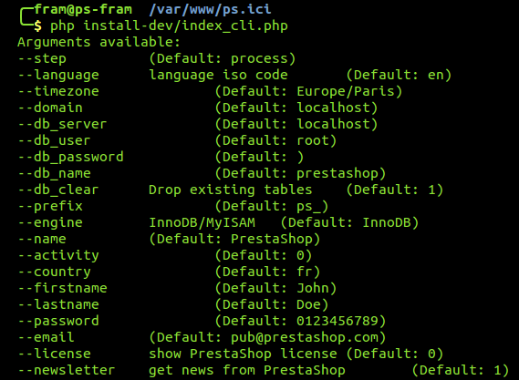

# Installer PrestaShop en ligne de commande

Depuis la version 1.5.4, PrestaShop comporte un installeur en ligne de commande.

## De quoi il s'agit <a href="#installerprestashopenlignedecommande-dequoiilsagit" id="installerprestashopenlignedecommande-dequoiilsagit"></a>

Cet installateur spécial permet d'installer PrestaShop sans devoir passer par le navigateur : il suffit de place le contenu de l'archive zip sur votre serveur web, et vous pouvez installer PrestaShop en passant par la ligne de commande (CLI, pour _command-line interface_). Vous pouvez utiliser n'importe quel logiciel de CLI tant qu'il vous permet d'interagir avec les commandes de votre serveur : Bash, Windows PowerShell, OS X Terminal, PuTTY, etc.

Le fait de proposer un installateur CLI en plus de l'installation classique (via le navigateur) permet de répondre à une attente de certains utilisateurs avancés, qui préfèrent souvent les interfaces en ligne de commande car elles ont tendance à être plus rapide à utiliser tout en offrant plus de puissance lors de l'utilisation d'un programme ou d'un système d'exploitation.

## Comment l'utiliser <a href="#installerprestashopenlignedecommande-commentlutiliser" id="installerprestashopenlignedecommande-commentlutiliser"></a>

Pour l’utiliser, il suffit d’invoquer interpréteur PHP sur le fichier `index_cli.php` présent dans le dossier d’installation de PrestaShop (`/install` ou `/install-dev`).

```
$ php index_cli.php 
```

Les différentes options disponibles sont alors présentées.



Toutes les options de l'installateur classique sont disponibles, avec leurs valeurs par défaut clairement indiquées. Presque toutes les valeurs peuvent être laissées telles quelles, car vous pourrez les modifier ensuite dans le back-office de PrestaShop une fois que l'installation sera terminée. Notez que l'e-mail et le mot de passe (`--password`) sont ceux utilisés pour créer le compte de l'administrateur.

Pour lancer l'installation, il suffit de donner un argument. Dans les faits, vous devez en donner plus :

* **domain**. Là où votre boutique devra apparaître.
* **db\_server**. L'adresse du serveur de base de données.
* **db\_name**. Le nom de la base de données que vous voulez utiliser.
* **db\_user**. L'identifiant utilisateur pour la base de données que vous souhaitez utiliser.
* **db\_password**. Le mot de passe de l'identifiant utilisateur ci-dessus.

Par exemple :

```
$ php install_cli.php --domain=example.com --db_server=sql.example.com --db_name=prestashop --db_user=root --db_password=123456789
```


Si vous avez choisi une adresse e-mail différente de celle par défaut, un mail de récapitulatif de l’installation vous y est envoyé à la fin de l'installation.
