# Installer PrestaShop

## Installer PrestaShop 

**Contenu**

/\*\<!\[CDATA\[\*/\
div.rbtoc1597053582163 {padding: 0px;}\
div.rbtoc1597053582163 ul {list-style: disc;margin-left: 0px;}\
div.rbtoc1597053582163 li {margin-left: 0px;padding-left: 0px;}\
\
/\*]]>\*/

* [Installer PrestaShop](installer-prestashop.md#InstallerPrestaShop-InstallerPrestaShop)
* [Installer PrestaShop en 10 minutes](installer-prestashop.md#InstallerPrestaShop-InstallerPrestaShopen10minutes)
  * [Instructions d'installation rapides](installer-prestashop.md#InstallerPrestaShop-Instructionsd%27installationrapides)
  * [Instructions d'installation détaillées](installer-prestashop.md#InstallerPrestaShop-Instructionsd%27installationdétaillées)
    * [Télécharger et décompresser l'archive de PrestaShop](installer-prestashop.md#InstallerPrestaShop-Téléchargeretdécompresserl%27archivedePrestaShop)
    * [Mettre PrestaShop en ligne](installer-prestashop.md#InstallerPrestaShop-MettrePrestaShopenligne)
    * [Créer une base de données pour votre boutique](installer-prestashop.md#InstallerPrestaShop-Créerunebasededonnéespourvotreboutique)
    * [Lancer l'installeur automatique](installer-prestashop.md#InstallerPrestaShop-Lancerl%27installeurautomatique)
    * [Terminer l'installation](installer-prestashop.md#InstallerPrestaShop-Terminerl%27installation)

Ce chapitre est à destination de ceux qui souhaitent installer PrestaShop sur un hébergement en ligne.\
Si vous souhaitez installer PrestaShop sur votre ordinateur, vous devriez d'abord suivre les instructions situées ici : [Installer PrestaShop sur votre propre ordinateur](installer-prestashop-sur-votre-propre-ordinateur.md).

Si vous avez déjà lu les instructions de cette autre page, allez directement à la section "Créer une base de données pour votre boutique" de la présente page.

## Installer PrestaShop en 10 minutes 

Il est très facile d'installer PrestaShop. Dans la majorité des cas, une fois que ses fichiers sont sur votre serveur web, vous devriez pouvoir commencer à configurer votre boutique en moins de 5 minutes : le processus d'installation est très simple, car l'installateur se charge de tout. Les utilisateurs moins expérimentés auront probablement besoin de 10 à 20 minutes pour mener le processus à terme.

Avant de vous lancer, assurez-vous de disposer des prérequis : de l'espace chez un hébergeur web, un nom de domaine, un client FTP, un éditeur de texte. Faites en sorte de suivre les instructions du chapitre "Ce dont vous avez besoin" : [http://doc.prestashop.com/display/PS16/Ce+dont+vous+avez+besoin](http://doc.prestashop.com/display/PS16/Ce+dont+vous+avez+besoin)

Notre partenaire hébergeur 1&1 propose d’installer PrestaShop en 1 clic afin de vous permettre de démarrer plus rapidement. L'utilisation de ces applications peut réduire considérablement le temps d'installation pour les utilisateurs inexpérimentés.

* [1&1 Hosting](http://clic.reussissonsensemble.fr/click.asp?ref=701368\&site=4320\&type=text\&tnb=125\&subid=documentation)

Ces hébergeurs utilisent généralement ces bibliothèques de scripts :

* SimpleScripts : [https://www.simplescripts.com/script\_details/install:PrestaShop](https://www.simplescripts.com/script\_details/install:PrestaShop),
* Installatron : [http://installatron.com/apps?locale=en#cmd=browser\&display=prestashop](http://installatron.com/apps?locale=en#cmd=browser\&display=prestashop),
* Softaculous : [http://www.softaculous.com/apps/ecommerce/PrestaShop](http://www.softaculous.com/apps/ecommerce/PrestaShop).

Certains de ces scripts permettent même de faire une mise à jour en 1 clic, ce qui inestimable en terme de temps gagné.

D'autres hébergeurs ont leur propre script d'installation. Demandez plus d'information à votre propre hébergeur.

### Instructions d'installation rapides 

Voici des rapides indications pour ceux qui sont déjà habitués à l'installation d'applications PHP/MySQL sur un serveur web. Si le manque de détail vous gêne, vous trouverez des instructions détaillées dans la section suivante.

Les étapes de l'installation de PrestaShop :

1. Téléchargez l'archive de PrestaShop et décompressez-la sur votre ordinateur si ce n'est pas déjà fait.
2. Créez une base de données pour votre boutique PrestaShop sur votre serveur web, si c'est possible. Dans le cas où il n'y a pas d'utilisateur MySQL avec les droits pour accéder à cette base de données et la modifier, créez-en un.
3. Mettez les fichiers en ligne à partir de l'archive décompressée, à l'emplacement désiré sur votre serveur web. Ne mettez pas directement en ligne le dossier "prestashop" : uniquement les dossiers et fichiers qu'il contient.
4. Lancez le script d'installation de PrestaShop en vous rendant à l'adresse publique de son emplacement sur le serveur, à l'aide d'un navigateur web. Ce devrait être la même URL que celle où vous avez mis les fichiers en ligne.
5. Suivez les instructions données par les écrans d'installation.
6. Une fois installé, supprimez le dossier `/install` et notez le nouveau nom du dossier `/admin`, qui a été généré afin de vous être unique, pour des raisons de sécurité.

PrestaShop devrait maintenant être installé et prêt à être configuré ! Vous pouvez vous rendre sur la chapitre [Premiers pas avec PrestaShop 1.6](../guide-de-lutilisateur/premiers-pas-avec-prestashop-1.6.md) du Guide de l'Utilisateur.

### Instructions d'installation détaillées 

#### Télécharger et décompresser l'archive de PrestaShop 

Vous pouvez télécharger la dernière version stable de PrestaShop à l'adresse [http://www.prestashop.com/fr/telechargement](http://www.prestashop.com/fr/telechargement).

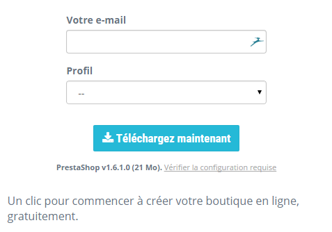

Vous n'avez qu'une option de téléchargement : la version stable, qui est prête à être utilisée pour tout type de boutique.

Si vous avez besoin de télécharger n'importe quelle autre version précédente, rendez-vous à cette adresse : [http://www.prestashop.com/fr/versions-developpeurs](http://www.prestashop.com/fr/versions-developpeurs). Faites défiler la page jusqu'à la section "Versions publiées précédemment".

Notez qu'il n'est jamais recommandé d'utiliser une version autre que la version stable actuelle.

Cliquez sur le bouton de téléchargement, et enregistrez l'archive sur votre ordinateur (par exemple sur le bureau). Vous devriez obtenir un fichier nommé "prestashop\_1.5.4.zip" (ou un équivalent, en fonction du numéro de version).

Le fichier téléchargé est une archive Zip, ce qui signifie qu'il contient tous les fichiers de PrestaShop compressés en un seul fichier. Avant de pouvoir installer PrestaShop, **vous devez décompresser ce fichier** à l'aide d'un outil adéquat.

Si votre système d'exploitation ne reconnaît pas les fichiers Zip, vous pouvez télécharger et installer un outil dédié, comme par exemple :

* Windows :
  * 7-zip : [http://www.7-zip.org/](http://www.7-zip.org/)
  * WinZip : [http://www.winzip.com/win/en/index.htm](http://www.winzip.com/win/en/index.htm)
  * WinRAR : [http://www.rarlab.com/](http://www.rarlab.com/)
* Mac OS X :
  * iZip : [http://www.izip.com/](http://www.izip.com/)
  * WinZip Mac : [http://www.winzip.com/mac/](http://www.winzip.com/mac/)
  * Zipeg : [http://www.zipeg.com/](http://www.zipeg.com/)

À l'aide de votre outil de gestion Zip, décompressez l'archive vers un emplacement connu de votre disque dur (par exemple, le bureau). **Ne mettez pas directement le fichier zip en ligne sur votre serveur**.

L'archive Zip présente deux éléments à sa racine :

* Le dossier "prestashop", qui contient les fichiers de PrestaShop que vous allez bientôt mettre en ligne sur votre serveur web ;
* Le fichier "Install\_PrestaShop.html", qui ouvre la version anglaise de la présente page, "Installing PrestaShop", dans votre navigateur web par défaut.

Le fichier "Install\_PrestaShop.html" ne doit pas être mis en ligne sur votre serveur web.

#### Mettre PrestaShop en ligne 

Vous devriez maintenant disposer d'un espace d'hébergement (si ce n'est pas le cas, lisez le chapitre "Ce dont vous avez besoin" de ce guide), et d'un dossier sur votre disque-dur contenant les fichiers décompressés à partir de l'archive de PrestaShop.

Il vous faut maintenant transférer ces fichiers depuis votre disque dur vers votre espace d'hébergement. Pour ce faire, vous devez relier votre ordinateur à votre serveur web à l'aide d'un outil de type "client FTP", que vous devriez avoir installé en lisant le chapitre "Ce dont vous avez besoin" de ce livre. Nous utiliserons FileZilla ([http://filezilla-project.org/](http://filezilla-project.org/)).

Connectez-vous à votre hébergement à l'aide de votre client FTP et des identifiants, fournis par votre hébergeur (si ce n'est pas le cas, demandez-les lui). Une fois connecté, il est temps de transférer les fichiers de PrestaShop depuis votre ordinateur vers votre serveur.

Depuis FileZilla (ou n'importe quel autre client FTP de votre choix), naviguer dans les dossiers locaux jusqu'à parvenir à celui de vos fichiers PrestaShop décompressés. Gardez le dossier ouvert dans la section "Site local" de FileZilla, à gauche.

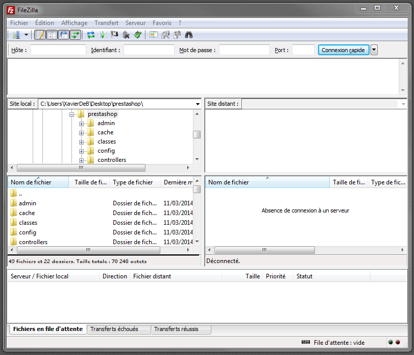

Dans la partie "Site distant" (à droite), naviguez jusqu'à l'emplacement de votre serveur d'où vous souhaitez que PrestaShop soit accessible au public (racine du domaine, sous-domaine ou dossier que vous avez créé...). Cela peut changer du tout au tout, en fonction de votre hébergeur et de vos besoins :

* Votre hébergeur :
  * Certains hébergeurs peuvent vous demander de placer vos fichiers dans un dossier spécifique, comme `/htdocs`, `/public_html`, `/web`, `/www`, `/example.fr`, etc.
  * D'autres hébergeurs peuvent avoir configuré leur serveur FTP pour vous placer directement à la connexion dans le dossier racine.
* Vos besoins :
  * Si vous souhaitez que votre boutique soit le site principal de votre nom de domaine (ex. : [http://www.example.com](http://www.example.com)), envoyez les fichiers de PrestaShop à la racine du serveur.
  * Si vous souhaitez que votre boutique apparaisse dans un sous-domaine (ex. : [http://www.example.com/boutique](http://www.example.com/boutique)), vous devez d'abord créer le dossier en question à l'aide de FileZilla (clic-droit et choisissez "Créer un dossier"), puis mettez les fichiers en ligne dans ce dossier.
  * Si vous souhaitez que votre boutique apparaisse dans un sous-domaine (ex. : [http://shop.example.com](http://shop.example.com)), vous devez tout d'abord créer le sous-domaine en question. Tout dépend alors de votre hébergeur : vous pouvez soit y parvenir simplement en créant un dossier sur le serveur via votre client FTP, ou vous pourriez devoir créer ce sous-domaine en passant par l'interface d'administration de votre hébergeur. Lisez la documentation proposée par votre hébergeur. Une fois créé, ouvrez le sous-domaine dans FileZilla.

Dans la fenêtre locale de votre client FTP (à gauche), vous devriez maintenant avoir le dossier où se trouvent les fichiers de PrestaShop tiré de l'archive Zip, et dans la fenêtre distante (à droite), le dossier de destination sur votre serveur. Si vous ne l'avez jamais fait auparavant, mettre des fichiers en ligne est très simple : sélectionnez tous les fichiers du dossier local (utilisez Ctrl-A), puis au choix, glissez-les sur la fenêtre de droite, ou faites un clic droit et dans le menu contextuel choisissez "Envoyer".

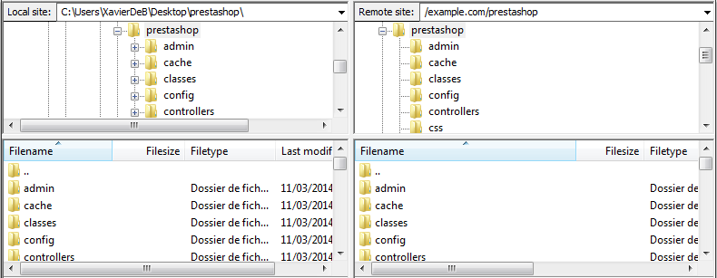

La mise en ligne peut prendre plusieurs minutes, car PrestaShop utilise plus de 7500 fichiers dans presque 1000 dossiers. Au bout de quelques instants, tous les fichiers de PrestaShop auront été mis en ligne. Parfait !

#### Créer une base de données pour votre boutique 

Avant de pouvoir lancer l'installation de PrestaShop, vous devez vous assurez de disposer d'une base de données prête à recevoir les données de PrestaShop, et le cas échéant, en créer une.

La création d'une base de donnée peut se faire avec n'importer quel outil de gestion de votre base de données. Nous utiliserons l'outil gratuit phpMyAdmin ([http://www.phpmyadmin.net/](http://www.phpmyadmin.net/)), qui devrait déjà être installé chez la plupart des hébergeurs.

Certains hébergeurs préfèrent que leurs clients passent un outil d'administration graphique, tel que cPanel, Plesk, ou le leur propre. Assurez-vous de lire la documentation de votre hébergeur à propos de la gestion de données MySQL, et créez une base de données pour votre boutique en suivant leurs explications.

Connectez-vous à phpMyAdmin avec vos identifiants, fournis par votre hébergeur. Vous devriez pouvoir vous y connecter via une adresse standard attachée à votre domaine ou votre hébergeur.

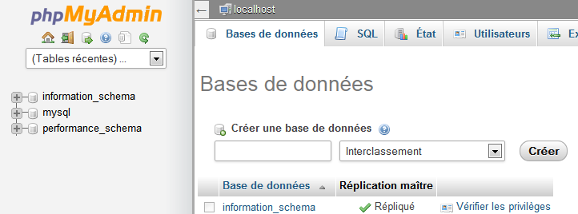

Dans la colonne de gauche, vous pouvez voir les différentes bases de données existantes sur votre serveur MySQL. Certains ne doivent pas être modifiées, car elles sont utilisées soit pas phpMyAdmin, soit par votre hébergeur : `phpmyadmin`, `mysql`, `information_schema`, `performance_schema` et possiblement d'autres. Lisez la documentation de votre hébergeur pour savoir si l'une d'elles doit être utilisée comme base de données par défaut.

Dans tous les cas, vous pouvez créer une nouvelle base de données à l'aide du formulaire qui se trouve dans l'onglet "Bases de données", au centre de la page, nommé "Créer une base de données". Saisissez simplement un nom unique, et cliquez sur "Créer". Le nom de la base de données sera ajouté à la liste à gauche. Vous pouvez l'utiliser pour stocker les données de PrestaShop.

#### Lancer l'installeur automatique 

Nous arrivons enfin à la partie où tout se combine : l'installation de PrestaShop.

Le processus d'installation est simple, car il est pris en charge par l'auto-installeur de PrestaShop. Vous devriez pouvoir parcourir ses pages en une poignée de minutes. Faites en sorte de bien lire chaque page, afin de ne manquer aucune information.

Pour démarrer l'installeur, lancez votre navigateur web et ouvrez simplement l'emplacement de PrestaShop sur votre serveur web : le script détectera automatiquement que le logiciel n'est pas encore installé, et vous amènera à l'adresse de l'installeur.\
Vous pouvez également directement saisir l'adresse du dossier `/install` : [`http://www.example.com/dossier_prestashop/install`](http://www.example.com/dossier\_prestashop/install).

Si vous faites une installation sur votre propre ordinateur, cette installation doit être faite dans le dossier PrestaShop de votre serveur web local, qui devrait se trouver à l'adresse [`http://127.0.0.1/prestashop`](http://127.0.0.1/prestashop).

À partir de là, vous n'avez qu'à lire, cliquer, et remplir quelques formulaires.

Il y a 6 étapes. En haut de la page, l'installeur vous donne un aperçu visuel de votre position dans le processus : les ronds gris deviennent vert à chaque fois qu'une étape est passée.

**Première étape : la page d'accueil**

Cette première page est une simple introduction au processus d'installation. Vous pouvez y sélectionner la langue dans laquelle vous voulez utiliser l'installeur.

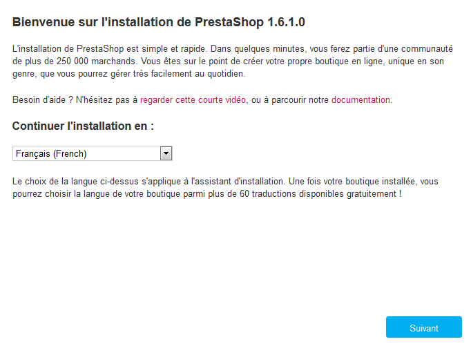

Elle vous donne également un lien vers le site de documentation ([http://doc.prestashop.com/](http://doc.prestashop.com/)), et le numéro de téléphone du support. Vous pouvez en apprendre plus sur nos offres de support en vous rendant sur [http://support.prestashop.com/fr/](http://support.prestashop.com/fr/).

Sélectionnez la langue dans laquelle vous voulez utiliser l'installeur, puis cliquez sur "Suivant". La langue choisie sera également la langue par défaut de votre installation de PrestaShop – mais vous pourrez toujours ajouter d'autres langues.

**Deuxième étape : licences d'utilisation de PrestaShop**

Cette deuxième page présente un simple prérequis : accepter les licences d'utilisation. PrestaShop est un logiciel gratuit distribué sous un jeu de licences open-source, et vous ne pouvez tout simplement pas utiliser le logiciel si vous n'acceptez pas celui-ci. Cette étape vous demande de les accepter explicitement.

Lisez les licences de PrestaShop :

* la _Open Software License 3.0_. pour PrestaShop lui-même, que vous pouvez également la lire sur [http://www.opensource.org/licenses/OSL-3.0](http://www.opensource.org/licenses/OSL-3.0).&#x20;
* la _Academic Free License 3.0_ pour les modules et thèmes, que vous pouvez également la lire sur [http://opensource.org/licenses/AFL-3.0](http://opensource.org/licenses/AFL-3.0).

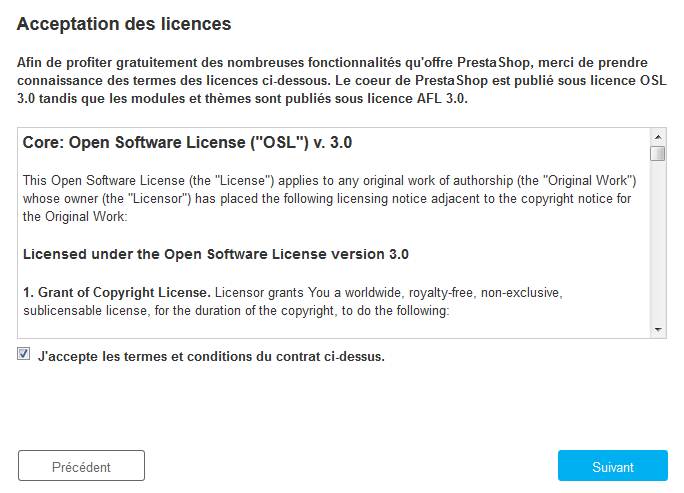

Vous devez accepter les deux licences pour passer à l'étape suivante.

Pour passer à l'étape suivante, vous devez cochez la case "J'approuve les termes et conditions du contrat ci-dessus.", puis cliquez sur "Suivant". Si vous n'acceptez pas explicitement la licence, vous ne pourrez pas installer PrestaShop : le bouton "Suivant" ne sera même pas cliquable.

**Troisième et quatrième étape : compatibilité système et informations de la boutique**

La troisième étape fait un rapide test des paramètres de votre serveur. Dans la plupart des cas, vous ne la verrez pas, car si tout est correct, l'installeur vous emmène directement à la quatrième étape, "Informations de la boutique". Si c'est le cas, vous pouvez toujours aller voir la troisième page en cliquant sur le lien "Compatibilité système" dans la colonne de gauche.

En revanche, si quelque chose d'anormal est découvert lors des tests du serveur de la troisième étape, l'installeur affiche la page "Compatibilité système", où vous pourrez découvrir les tests ayant échoués.

**Compatibilité système**

Cette page vérifie que votre configuration serveur est correcte : réglages PHP, permissions des fichiers et dossiers, outils tiers, etc.

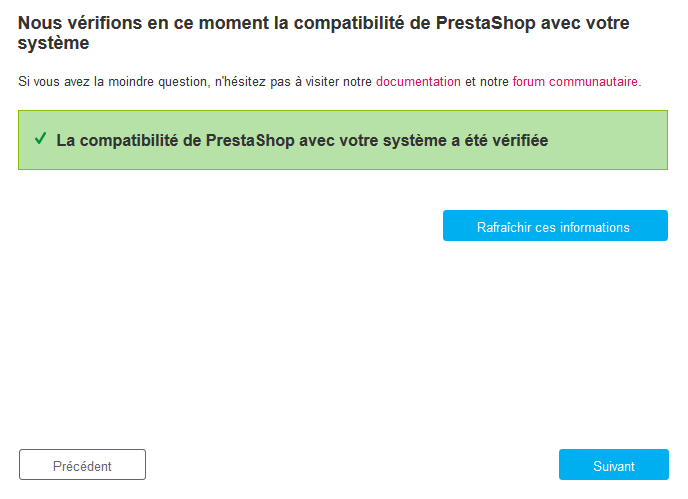

Au moindre problème, l'installeur vous arrête ici, vous permettant de voir les quelques détails techniques qui ont besoin d'être corrigés, que cela soit la configuration de PHP ou la mise à jour des permissions de fichiers.

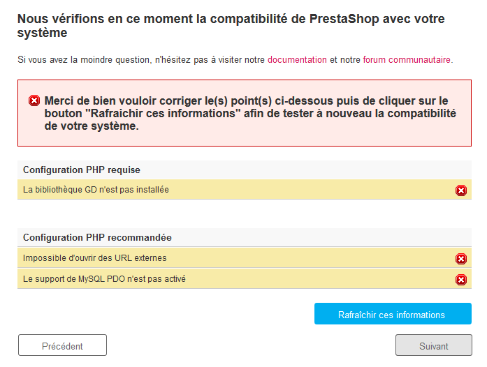

Voici une liste des tests réalisés durant la troisième étape :

| Test                                                        | Comment / où régler le problème ?                                                                                                                                   |
| ----------------------------------------------------------- | ------------------------------------------------------------------------------------------------------------------------------------------------------------------- |
| PHP 5.1.2 (ou plus) est-il installé ?                       | Serveur web                                                                                                                                                         |
| PrestaShop peut-il mettre des fichiers en ligne ?           | Fichier php.ini (`file_uploads`)                                                                                                                                    |
| PrestaShop peut-il créer de nouveaux fichiers et dossiers ? | Explorateur de fichiers / client FTP / ligne de commande                                                                                                            |
| La bibliothèque GD est-elle installée ?                     | Fichier php.ini (`extension=php_gd2.so`)                                                                                                                            |
| Le support de MySQL est-il en place ?                       | Fichier php.ini (`extension=php_pdo_mysql.so`)                                                                                                                      |
| Permission d'écriture sur tout \~/config/                   | Explorateur de fichiers / client FTP / ligne de commande                                                                                                            |
| Permission d'écriture sur tout \~/cache/                    | Explorateur de fichiers / client FTP / ligne de commande                                                                                                            |
| Permission d'écriture sur tout \~/log/                      | Explorateur de fichiers / client FTP / ligne de commande                                                                                                            |
| Permission d'écriture sur tout \~/img/                      | Explorateur de fichiers / client FTP / ligne de commande                                                                                                            |
| Permission d'écriture sur tout \~/mails/                    | Explorateur de fichiers / client FTP / ligne de commande                                                                                                            |
| Permission d'écriture sur tout \~/modules/                  | Explorateur de fichiers / client FTP / ligne de commande                                                                                                            |
| Permission d'écriture sur tout \~/override/                 | Explorateur de fichiers / client FTP / ligne de commande                                                                                                            |
| Permission d'écriture sur tout \~/themes/default/lang/      | Explorateur de fichiers / client FTP / ligne de commande                                                                                                            |
| Permission d'écriture sur tout \~/themes/default/pdf/lang/  | Explorateur de fichiers / client FTP / ligne de commande                                                                                                            |
| Permission d'écriture sur tout \~/themes/default/cache/     | Explorateur de fichiers / client FTP / ligne de commande                                                                                                            |
| Permission d'écriture sur tout \~/translations/             | Explorateur de fichiers / client FTP / ligne de commande                                                                                                            |
| Permission d'écriture sur tout \~/upload/                   | Explorateur de fichiers / client FTP / ligne de commande                                                                                                            |
| Permission d'écriture sur tout \~/download/                 | Explorateur de fichiers / client FTP / ligne de commande                                                                                                            |
| Permission d'écriture sur tout \~/sitemap.xml               | Explorateur de fichiers / client FTP / ligne de commande                                                                                                            |
| PrestaShop peut-il ouvrir des URL externes ?                | Fichier php.ini (`allow_url_fopen`)                                                                                                                                 |
| L'option "register global" de PHP est-elle désactivée ?     | Fichier php.ini (`register_globals`)                                                                                                                                |
| La compression GZIP est-elle activée ?                      | Fichier .htaccess                                                                                                                                                   |
| L'extension Mcrypt est-elle activée ?                       | Fichier php.ini  (lire [http://www.php.net/manual/fr/mcrypt.setup.php](http://www.php.net/manual/fr/mcrypt.setup.php)[)](http://php.net/manual/en/mcrypt.setup.php) |
| L'option "magic quotes" est-elle désactivée ?               | Fichier php.ini (`magic_quotes_gpc`)                                                                                                                                |
| L'extension Dom est-elle chargée ?                          | Option de compilation `--enable-dom`                                                                                                                                |
| L'extension PDO MySQL est-elle chargée ?                    | Fichier php.ini (`extension=php_pdo_mysql.so`)                                                                                                                      |

Tandis que les modifications de la configuration de PHP ne peuvent être pleinement expliquées en généralités applicables à toutes les situations, il est plus facile d'expliquer la mise à jour des permissions. Le système de fichier du serveur web utilise les permissions pour donner certains droits d'accès à des utilisateurs précis ou des groupes d'utilisateurs, contrôlant ainsi leur capacité à ouvrir ou modifier certains fichiers ou dossiers. L'installeur a besoin de faire plusieurs modifications aux fichiers qui ont été mis en ligne, et si le système de fichier n'autorise pas ces modifications à cause de mauvaises permissions, alors l'installeur ne peut pas terminer son travail.

C'est pourquoi vous devez changer ces permissions vous-mêmes si l'installeur vous affiche que certains fichiers ou dossiers ne disposent pas des bonnes permissions. Cela nécessite d'avoir accès à un client FTP, tel que FileZilla ou la ligne de commande.

Connectez-vous à votre compte à l'aide du client FTP, naviguer jusqu'au dossier de PrestaShop, et trouvez les dossiers que l'installeur a marqué comme ayant besoin d'une modification de permission.

CHMOD

Modifier les permissions d'accès d'un fichier ou d'un dossier sur un système Unix/Linux se nomme "faire un CHMOD", d'après la commande du même nom (à lire : [http://fr.wikipedia.org/wiki/Chmod](http://fr.wikipedia.org/wiki/Chmod) – et vous trouverez une explication plus complète des permissions de fichiers ici : [http://www.math-linux.com/spip.php?article23](http://www.math-linux.com/spip.php?article23)).\
&#x20;Donner "un accès en écriture" à des fichiers ou dossiers se dit "faire un CHMOD 755" ou "un CHMOD 775", en fonction de l'hébergeur.

Certains hébergeurs peuvent vous demander d'utiliser CHMOD 777, bien que cela ne soit jamais recommandé pour autre chose qu'un besoin ponctuel.\
&#x20;Si vous devez faire un CHMOD 777 afin d'installer PrestaShop, faites en sorte de repasser à un réglage plus sûr (par exemple, 775 pour les dossiers et 644 pour les fichiers) une fois que vous aurez terminé l'installation.

Lisez attentivement la documentation de votre hébergeur.

Grâce à FileZilla (idem pour la plupart des clients FTP), vous n'avez pas à lancer de commande Unix. La plupart des clients FTP vous permet de changer les permissions facilement et avec une interface graphique : une fois que vous avez trouvé le fichier ou le dossier qui nécessite une modification, faites un clic-droit dessus, et dans le menu contextuel choisissez "Droits d'accès au fichier...". Cela ouvrira une petite fenêtre.

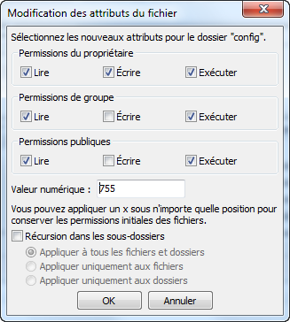

En fonction de la configuration de votre serveur (sur laquelle vous n'avez pas forcément la main), vous devrez avoir les deux colonnes "Lire" et "Exécuter" de cochées, et au moins les lignes "Propriétaire" et "Groupe" de cochées pour la colonne "Écrire". Certains hébergeurs peuvent vous demander d'avoir la case "Écrire" publique de cochée, mais soyez prudent : laisser n'importe quel utilisateur du serveur web écrire/modifier le contenu de votre dossier PrestaShop est rarement une bonne idée.

Certains dossiers nécessitent d'appliquer récursivement les changements de permissions à l'ensemble de leur contenu, fichiers comme dossiers. Pour ce faire, cocher la case "Récursion dans les sous-dossiers".

Tandis que vous modifiez les permissions d'accès de vos fichiers et dossiers, vérifiez régulièrement que les modifications que vous apportez correspondent bien à ce dont PrestaShop a besoin : cliquez sur le bouton "Rafraîchir ces informations" aussi souvent que nécessaire.

Une fois tous les indicateurs passés au vert, cliquez sur "Suivant". Si vous n'arrivez pas à tous les passer au vert, faites au moins en sorte d'avoir le message "La compatibilité de PrestaShop avec votre système a été vérifiée" en haut de la page.

**Informations de la boutique**

C'est ici que vous commencez à personnaliser votre boutique : donnez-lui un nom et un logo, indiquez son domaine d'activité, et donnez vos informations personnelles (qui peuvent avoir des implications légales dans certains pays)...

N'utilisez pas de signe deux-points dans le nom de votre boutique, car cela peut empêcher certaines fonctionnalités de fonctionner (par exemple, l'envoi d'e-mail ne fonctionnera pas).

Vous pouvez remplacer le deux-points par un tiret si vous souhaitez avoir deux sections dans votre titre. Par exemple, utilisez "MaBoutique - La meilleure boutique pour acheter" au lieu de "MaBoutique : La meilleure boutique pour acheter".

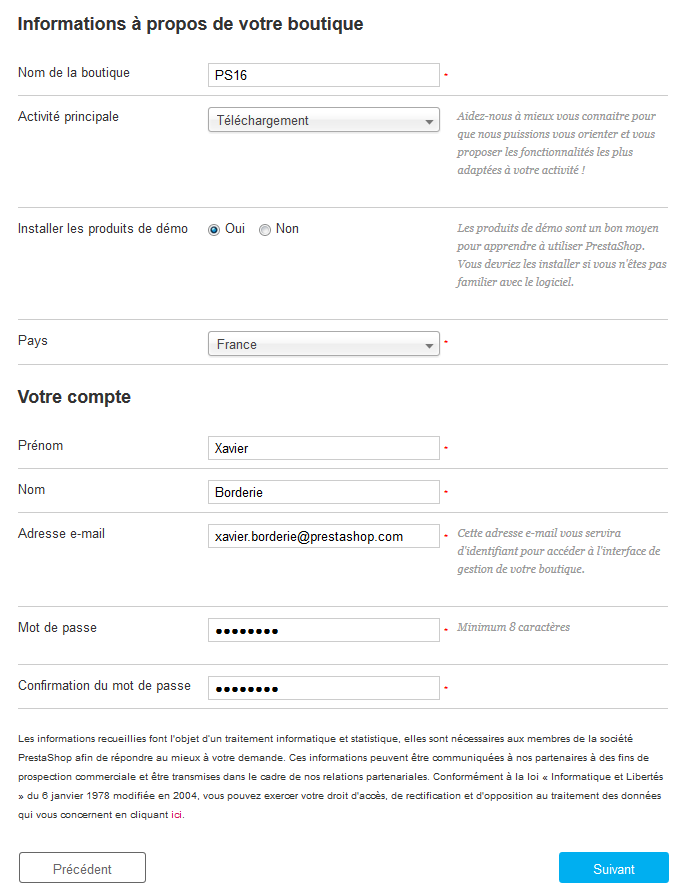

C'est également ici que vous renseignez le mot de passe pour accéder à l'interface d'administration de votre boutique. Choisissez-le avec soin !

Cliquez sur "Suivant pour continuer.

**Cinquième étape : configuration système**

Cette page contient un formulaire vous permettant d'indiquer à l'installeur où se trouve le serveur de base de données, et sur quelle base de données il doit utiliser, avec les identifiants nécessaires. Toutes ces informations doivent vous avoir été fournies par votre hébergeur.

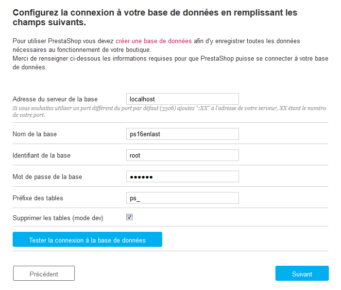

Remplissez tous les champs avec les informations de connexion à la base de données fournies par votre hébergeur :

* **Adresse du serveur de la base**. Le nom d'hôte (_hostname_) de votre serveur web. Il peut être lié à votre nom de domaine (comme [http://sql.example.com](http://sql.example.com)), lié à votre hébergeur (comme [http://mysql2.alwaysdata.com](http://mysql2.alwaysdata.com)), ou être simplement une adresse IP (comme 46.105.78.185).
* **Nom de la base**. Le nom de la base de données où vous souhaitez que PrestaShop stocke ses données. Il peut s'agir d'une base de données existante sur votre serveur MySQL, ou de la base que vous avez créé spécialement avec phpMyAdmin (ou tout autre outil SQL) dans la section "Créer une base de données pour votre boutique" de ce guide.
* **Identifiant de la base**. Le nom de l'utilisateur MySQL ayant accès à votre base de données.
* **Mot de passe de la bas**e. Le mot de passe de l'utilisateur MySQL.
* **Type de base**. Le moteur de base de données est le coeur du serveur de base de données. InnoDB est le moteur par défaut et vous devriez l'utiliser, mais les utilisateurs plus techniques peuvent lui préférer un autre moteur. En général, il n'est pas nécessaire de changer le réglage par défaut.
* **Préfixe des tables**. Le préfixe des tables de votre base de données. Le réglage par défaut est "`ps_`", ce qui donne des tables comme "`ps_cart`" ou "`ps_wishlist`" ; mais si vous avez besoin d'installer plusieurs instances de PrestaShop dans la même base de données, vous devez utiliser un préfixe différent pour chaque installation. Cependant, nous vous recommandons fortement de créer une base de données par installation de PrestaShop, si votre hébergeur le permet. Mieux : ne faites qu'une installation de PrestaShop, et activez la fonctionnalité multiboutique afin de gérer plusieurs boutiques depuis la même administration de PrestaShop.
* **Supprimer les tables**. Cette option n'est disponible qu'en mode développeur. Lorsque vous réinstallez PrestaShop, vous pouvez choisir de supprimer les tables déjà en place afin de faire table rase de l'installation précédente.

Cliquez sur le bouton "Tester la connexion à la base de données" afin de vous assurer que vous avez tout correctement saisi. Si c'est le cas, l'installeur affichera le message suivant : "La base de données est connectée".

Cliquez sur "Suivant", et l'installeur commencera à remplir la base de données avec ses tables et données, et mettre à jour les fichiers de configuration. Cela peut prendre quelques minutes sur un serveur lent : merci d'être patient de ne pas toucher votre navigateur !

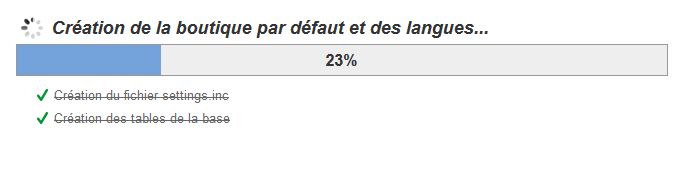

L'installeur fait les actions suivantes :

* Créer le fichier `settings.inc.php`, et y placer vos réglages.
* Créer les tables de la base de données.
* Créer la boutique par défaut avec les langues par défaut.
* Remplir les tables de la base de données.
* Configurer la boutique.
* Installer les modules par défaut.
* Installer les données de démos (produits, catégories, utilisateur, pages CMS, etc.)
* Installer le thème.

Une fois l'installation achevée, votre boutique est prête à être configurée !

#### Terminer l'installation 

Comme vous pouvez le lire sur la dernière page du processus d'installation, il reste une poignée d'action à faire avant de quitter l'installeur.

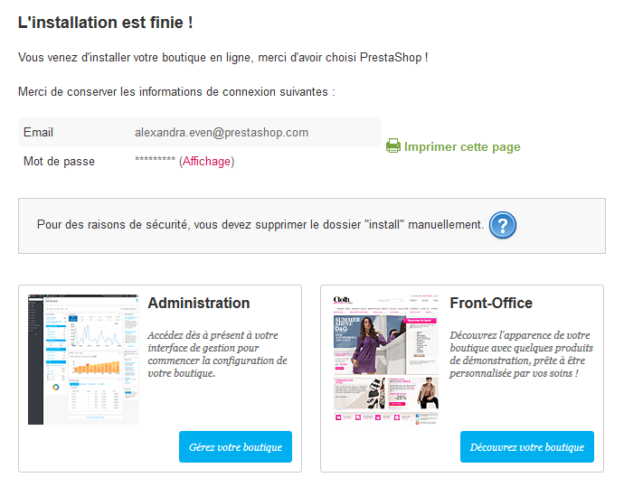

Une manière simple d'améliorer la sécurité de votre installation de PrestaShop consiste à effacer certains fichiers ou dossiers clés. Pour ce faire, utilisez votre client FTP et travaillez directement sur votre serveur. Les éléments à effacer sont :

* le dossier "/install" (obligatoire),
* le dossier "/docs" (facultatif), à moins que vous ne souhaitiez tester l'outil d'import avec les fichiers d'exemple que ce dossier contient.
* le fichier "README.md" (facultatif).

Cliquez sur le bouton "Gérez votre boutique" pour afficher votre interface d'administration.

Une autre manière de sécuriser votre installation consiste à utiliser un nom personnalisé pour votre dossier d'administration : changer le nom du dossier "admin" pour quelque chose qui vous est unique, par exemple "4dmin-1537" or "M0nAdm1nSecr3te".\
**Notez bien ce nouveau nom de votre dossier d'administration**, car vous l'utiliserez sans cesse pour accéder à vos pages d'administration.

Enfin, dans le but de sécuriser toujours plus votre installation, changer les options des dossiers et fichiers de PrestaShop pour les passer en 664, ou en 666 si votre hébergeur l'impose. S'il se trouve que ces droits d'accès plus stricts empêchent certains modules de fonctionner, remettez les permissions en 755.

**Félicitations ! Votre installation est maintenant terminée.**

Connectez-vous à votre back-office et commencez à ajouter des produits à votre catalogue et à configurer les nombreuses options afin d'avoir une boutique qui corresponde à vos attentes. Lisez le chapitre [Premiers pas avec PrestaShop 1.6](../guide-de-lutilisateur/premiers-pas-avec-prestashop-1.6.md) du Guide de l'utilisateur pour avoir plus d'informations.

Vous devriez régulièrement faire des sauvegardes de votre base de données et de vos fichiers, dans l'idéal sur plusieurs ordinateurs, afin de parer à toute perte de données suite à un problème matériel ou un piratage.
