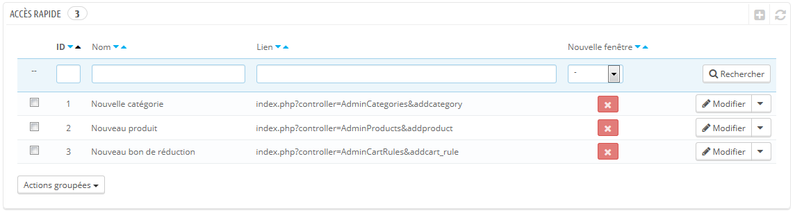
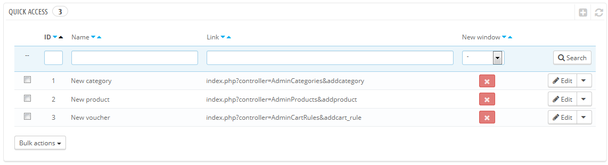

# Configuration de l'Accès rapide

PrestaShop dispose de raccourcis pratiques pour les pages les plus importantes, accessibles depuis le menu "Accès rapide" en haut à droite de chaque page de l'administration (à côté du nom de l'employé).

La page d'administration "Accès rapide" vous permet de créer des raccourcis personnalisés afin de rendre la navigation au sein de l'administration encore plus proche des besoins et habitudes de votre équipe.

La page affiche tous les raccourcis qui ont déjà été créés. Par défaut, vous avez :

* **Nouvelle catégorie**. Ce lien spécial vous amène directement au formulaire de création de catégories.
* **Nouveau produit**. Ce lien spécial vous amène directement au formulaire de création de produits.
* **Nouveau bon de réduction**. Ce lien spécial vous amène directement au formulaire de création de bons de réductions.

Les pages qui s'ouvrent dans un nouvel onglet ou une nouvelle fenêtre ont une coche verte dans la colonne "Nouvelle fenêtre".

Vous pouvez créer autant de raccourcis que nécessaire – mais faites en sorte de ne pas en mettre trop, bien entendu, au risque de rendre le menu "Accès rapide" trop long à parcourir.

## Ajouter un lien 

Créons un raccourci vers la page de création d'une commande, qui vous permet de créer des commandes à la demande, et même de créer un utilisateur à la volée en cas de besoin.

Comme d'habitude, cliquez sur le bouton "Ajouter" pour ouvrir le formulaire de création :

* **Nom**. Donnez-lui un nom unique. Faites en sorte qu'il soit court et descriptif.
* **URL**. Indiquez l'adresse de la page. Voici comment faire pour utiliser même les pages avec des liens complexes :
  1. Tout en gardant ouverte la page de création d'un lien, ouvrez un autre onglet du navigateur et rendez-vous sur la page "Commandes" du menu "Commandes.
  2. Prenez son adresse dans la barre d'adresse du navigateur. Par exemple, [`http://www.example.com/admin/index.php?controller=AdminOrders&token=f326b0419984706791c03f7e96599147`](http://www.example.com/admin/index.php?controller=AdminOrders\&token=f326b0419984706791c03f7e96599147)`.`
  3. Enlever toute la section `&token=xxx` et ne conservez que les parties importantes (ainsi, ne gardez pas le nom de domaine ou le dossier d'administration). Dans notre cas : `index.php?controller=AdminOrders`.
  4. Collez le résultat dans le champ "URL" du formulaire.
* **Ouvrir dans une nouvelle fenêtre**. Indiquez si vous préférez que ce raccourci s'ouvre dans une nouvelle fenêtre ou non. De manière générale, les liens vers le back-office devraient rester dans la même fenêtre, tandis que ceux sortant de l'administration (front-office, autres sites) devraient s'ouvrir dans une nouvelle fenêtre.

Remarquez que vous pouvez créer des liens vers d'autres sites, par exemple votre compte PayPal ou votre webmail. Copiez simplement l'URL dans le champ "URL", en incluant le préfixe `http://`.
