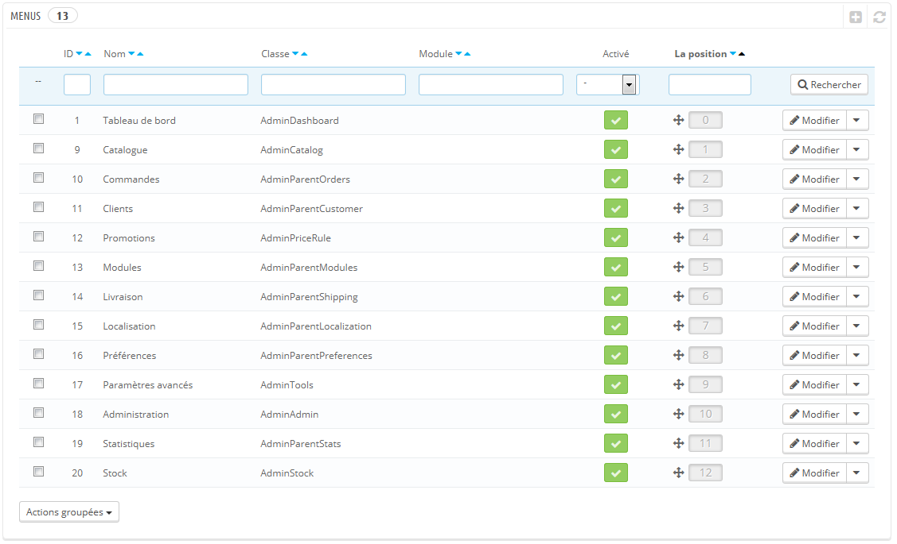
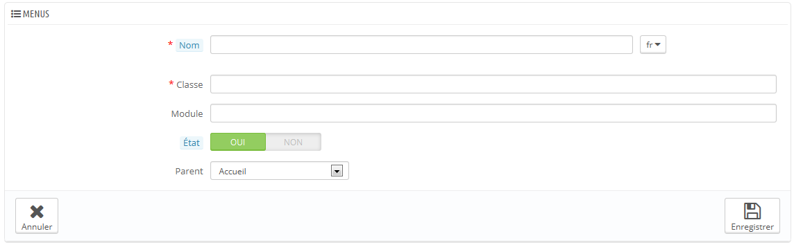

# Configuration des menus de l'administration

L'organisation des menus du back-office de PrestaShop n'est pas gravée dans le marbre : bien que l'organisation par défaut ait été conçue pour accéder au plus vite aux pages les plus utiles, vous pourriez avoir une opinion différente, et vouloir changer cette organisation, totalement ou en partie.

Cette page d'administration vous permet de déplacer, modifier, désactiver et même de créer des pages.

## Déplacer des menus 

Les menus peuvent directement être déplacés dans la liste. Vous pouvez soit cliquer sur les flèches de la colonne "Position", ou glisser la ligne elle-même pour la mettre dans la position que vous souhaitez lui donner. Aussitôt que vous avez déposé la ligne, PrestaShop enregistre automatiquement la position. Vous pouvez glisser la ligne quand le curseur survol la colonne "Position".

Vous pouvez désactiver un menu simplement en cliquant sur la coche verte de la colonne "Activé". Notez que cela désactivera le menu pour tous les utilisateurs du back-office. Si vous souhaitez cacher un menu à une sélection d'utilisateurs, modifiez les permissions de leur profil, dans la page d'administration "Permissions".

## Déplacer des pages 

Pour accéder aux pages d'un menu, cliquez sur l'action "Détails" à droite de la ligne. Une nouvelle liste apparaît avec les pages dans ce menu, avec les mêmes colonnes.

Les pages peuvent être déplacées au sein d'un menu directement depuis la liste. Vous pouvez soit cliquer sur les flèches de la colonne "Position", ou glisser la ligne elle-même pour la position dans la position que vous souhaitez lui donner. Aussitôt que vous avez déposé la ligne, PrestaShop enregistre automatiquement la position. Vous pouvez glisser la ligne quand le curseur survole la colonne "Position".

Vous pouvez également déplacer une page d'un menu à l'autre. Cela ne peut se faire directement depuis la liste ; vous devez ouvrir le formulaire de configuration de la page, où vous trouverez l'option "Parent". Modifiez cette option pour y mettre un autre nom de menu, enregistrez vos modifications, et revenez à la page "Menus", la page aura changé de menu.

Vous pouvez désactiver une page simplement en cliquant sur la coche verte de la colonne "Activé". Notez que cela désactivera la page pour tous les utilisateurs du back-office. Si vous souhaitez cacher une page à une sélection d'utilisateurs, modifiez les permissions de leur profil, dans la page d'administration "Permissions".

## Créer une nouvelle page ou menu 

Cliquez sur le bouton "Créer" pour ouvrir le formulaire de création.

Le formulaire dispose d'une poignée d'options, certaines pouvant se montrer compliquées :

* **Nom**. Donnez-lui un nom unique, car il servira d'identifiant interne.
* **Classe**. Pour résumer, une page du back-office de PrestaShop est basée sur des fichiers PHP internes spécifiques, appelés "contrôleur d'administration" ("admin controllers"), et qui sont le plus souvent stockés dans le dossier `/controllers/admin` de votre installation de PrestaShop. Lors de la création d'une nouvelle page, vous devez savoir quel contrôleur cibler, et surtout le nom de sa classe – qui est le nom de son fichier PHP.\
  &#x20;Par exemple, si vous voulez créer une page affichant l'administration des sauvegardes de PrestaShop, vous devez d'abord trouver le nom de son contrôleur (ici, `AdminBackupController`), et le copier dans le champ "Classe".
* **Module**. Dans certains cas, le contrôleur d'administration pour lequel vous voulez créer une page vient d'un module. Dans ce cas, vous devez également indiquer l'identifiant de ce module (dans la plupart des cas, le nom de son dossier) et le copier dans le champ "Module", en caractères minuscules. Ainsi, PrestaShop saura qu'il ne doit pas chercher le contrôleur dans le dossier `/controllers/admin`, mais plutôt dans le dossier `/modules/NOM-DU-MODULE/`.
* **État**. Vous pouvez désactiver la page à tout moment, mais notez bien que cela affecte tous les utilisateurs du back-office.
* **Parent**. Vous pouvez choisir n'importe quel menu, mais pour des questions de cohérence, faites en sorte d'en choisir un qui corresponde à la page que vous créez.

Si vous souhaitez créer un nouveau menu, choisissez le parent "Accueil".
