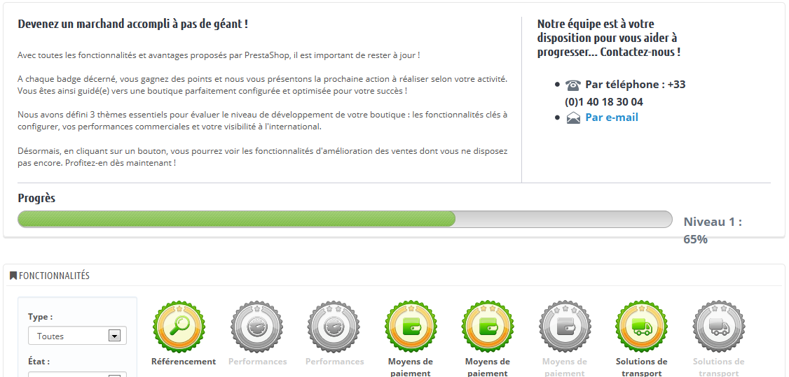

# Expertise PrestaShop (Merchant Expertise)

Cette page est générée par le module du même nom. Il a été conçu spécifiquement pour aider les utilisateurs de PrestaShop à suivre leur progression dans la configuration de votre boutique et dans la réussite de votre activité, et voir à quel point vous avez grandi et évolué en cours des jours, mois et années. Il est installé par défaut.

Ce module ajoute un système de badges et de points, divisés en trois niveaux, tous faisant partie intégrante du succès d'un site e-commerce :

* **Fonctionnalités**. Votre utilisation de certaines fonctionnalités clé de l'e-commerce, telles que la performance du site, la taille du catalogue, le nombre d'employés ou le SEO.
* **Succès**. Votre complétion de buts précis de l'e-commerce, tels que le nombre de clients, de commandes, ou votre revenu global.
* **International**. Traque votre placement sur les marchés internationaux comme les Amériques, l'Océanie, l'Asie, l'Europe, l'Afrique ou le Maghreb.

&#x20;Plus votre boutique progresse, plus vous gagnez de badges et de points. Il n'y a pas besoin d'envoyer des informations ou de remplir de formulaire. Nous vous savons suffisamment préoccupé par votre boutique, donc tout est fait automatiquement. Utilisez cet outil pour mieux apprécier votre évolution et vous fixer de nouveaux objectifs.
