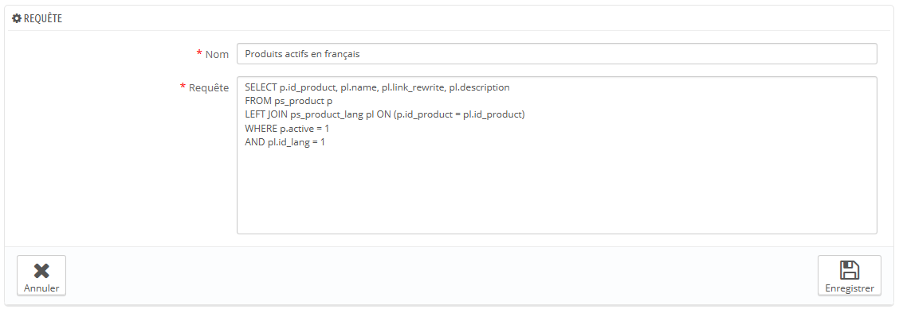
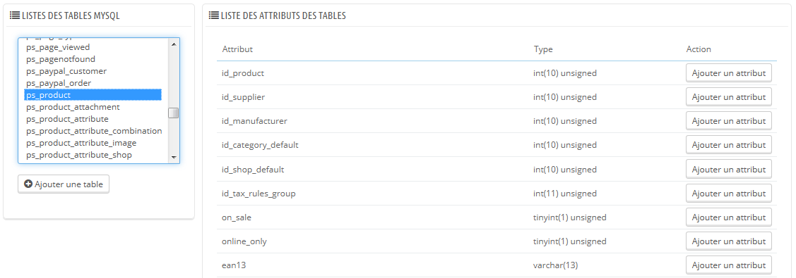

# Gestionnaire SQL

Le SQL Manager est une fonctionnalité complexe, destinée aux personnes techniques et qui savent comment parcourir une base de données avec le langage SQL. Cette complexité amène cependant un outil extrêmement puissant et pouvant être très utile à ceux qui peuvent le maîtriser.


Cet outil vous permet de lancer des requêtes SQL directement sur la base de données de PrestaShop, et les enregistrer pour les réutiliser quand vous le souhaitez. En effet, il donne accès au contenu de sa base de données de plusieurs manières, mais vous pourriez avoir besoin de plus de détail, ou plus simplement d'un rendu plus brut que ce que donne l'interface de PrestaShop. Grâce au SQL Manager, vous pouvez lancer des requêtes complexes qui utilisent les données de la manière dont VOUS le souhaitez.\
&#x20;Par exemple, à l'aide de cet outil et de votre connaissance de SQL, vous pouvez créer une requête réutilisable vous donnant une liste à jour des clients qui ont souscrit à votre newsletter, ou obtenir une liste de produits en format HTML ou CSV.

Pour des raisons de sécurité, certaines requêtes ne sont pas autorisées : UPDATE, DELETE, CREATE TABLE, DROP... Pour résumer, vous ne pouvez que lire les données (requête SELECT).

Par ailleurs, les clés sécurisées et mots de passe sont cachés (\*\*\*\*\*\*\*\*\*\*\*).

## Créer une nouvelle requête <a href="#gestionnairesql-creerunenouvellerequete" id="gestionnairesql-creerunenouvellerequete"></a>

Comme d'habitude, le bouton "Créer" vous mène au formulaire de création. Il dispose de deux champs :

* **Nom**. Utilisez un nom aussi long et descriptif que nécessaire.
* **Requête**. La requête SQL elle-même. Vous pouvez utiliser des JOIN ou d'autres sélections complexes.



Par ailleurs, la section "Liste des tables MySQL" vous aide à explorer la base de données, et vous facilite la construction de requêtes. Elle vous donne un sélecteur pratique et cliquable pour toutes les tables de la base de données disponibles. Sélectionnez une table pour que PrestaShop affiche ses attributs et types, puis cliquez sur "Ajouter un attribut" pour envoyer ce nom dans le champ "Requête".



En enregistrant ce formulaire, vous revenez à la page principale, avec la liste des requêtes.

## Lancer une requête <a href="#gestionnairesql-lancerunerequete" id="gestionnairesql-lancerunerequete"></a>

Chaque requête enregistrée dans le tableau dispose de quatre icônes à la fin de sa ligne :

* **Export**. Lance la requête, et vous donne le résultat sous forme de fichier CSV.
* **Voir**. Lance la requête, et l'affiche sous forme de tableau HTML, directement dans l'interface de PrestaShop.

**Modifier**. Vous pouvez modifier une requête aussi souvent que nécessaire, afin de l'affiner et d'obtenir de meilleurs résultats.

**Supprimer**. Une fois qu'une requête ne vous est plus utile (ou simplement si elle ne marche pas), vous pouvez l'effacer en cliquant sur cette icône et en confirmant votre choix.


## Paramètres <a href="#gestionnairesql-parametres" id="gestionnairesql-parametres"></a>

Il n'y a qu'un seul réglage à l'heure actuelle :

* **Sélectionner votre encodage de fichier par défaut**. Vous pouvez configurer l'encodage des caractères du fichier CSV. L'encodage par défaut, UTF-8, est recommandé, mais vous pouvez utiliser ISO-8859-1 si besoin est.


## Quelques exemples de requêtes. <a href="#gestionnairesql-quelquesexemplesderequetes." id="gestionnairesql-quelquesexemplesderequetes."></a>

Les possibilités sont infinies, mais voici quelques exemples pour vous aider à créer vos propres requêtes.

### Lister les adresses e-mail de tous les clients. <a href="#gestionnairesql-listerlesadressese-maildetouslesclients." id="gestionnairesql-listerlesadressese-maildetouslesclients."></a>

```
SELECT email FROM ps_customer
```

### Liste les adresses e-mail de tous les clients qui sont inscrits à votre newsletter <a href="#gestionnairesql-listelesadressese-maildetouslesclientsquisontinscritsavotrenewsletter" id="gestionnairesql-listelesadressese-maildetouslesclientsquisontinscritsavotrenewsletter"></a>

```
SELECT email
FROM ps_customer
WHERE newsletter = 1
```

### Lister tous les produits activés et ayant une description en français <a href="#gestionnairesql-listertouslesproduitsactivesetayantunedescriptionenfrancais" id="gestionnairesql-listertouslesproduitsactivesetayantunedescriptionenfrancais"></a>

```
SELECT p.id_product, pl.name, pl.link_rewrite, pl.description
FROM ps_product p
LEFT JOIN ps_product_lang pl ON (p.id_product = pl.id_product)
WHERE p.active = 1
AND pl.id_lang = 4
```

### Lister toutes les commandes, en donnant le transporteur, la devise, le paiement, le prix total et la date <a href="#gestionnairesql-listertouteslescommandes-endonnantletransporteur-ladevise-lepaiement-leprixtotaletla" id="gestionnairesql-listertouteslescommandes-endonnantletransporteur-ladevise-lepaiement-leprixtotaletla"></a>

```
SELECT o.`id_order` AS `id`,
	CONCAT(LEFT(c.`firstname`, 1), '. ', c.`lastname`) AS `Customer`,
	ca.`name` AS `Carrier`,
	cu.`name` AS `Currency`,
	o.`payment`, CONCAT(o.`total_paid_real`, ' ', cu.`sign`) AS `Total`,
	o.`date_add` AS `Date`
FROM `ps_orders` o
LEFT JOIN `ps_customer` c ON (o.`id_customer` = c.`id_customer`)
LEFT JOIN `ps_carrier` ca ON (o.id_carrier = ca.id_carrier)
LEFT JOIN `ps_currency` cu ON (o.`id_currency` = cu.`id_currency`)
```
