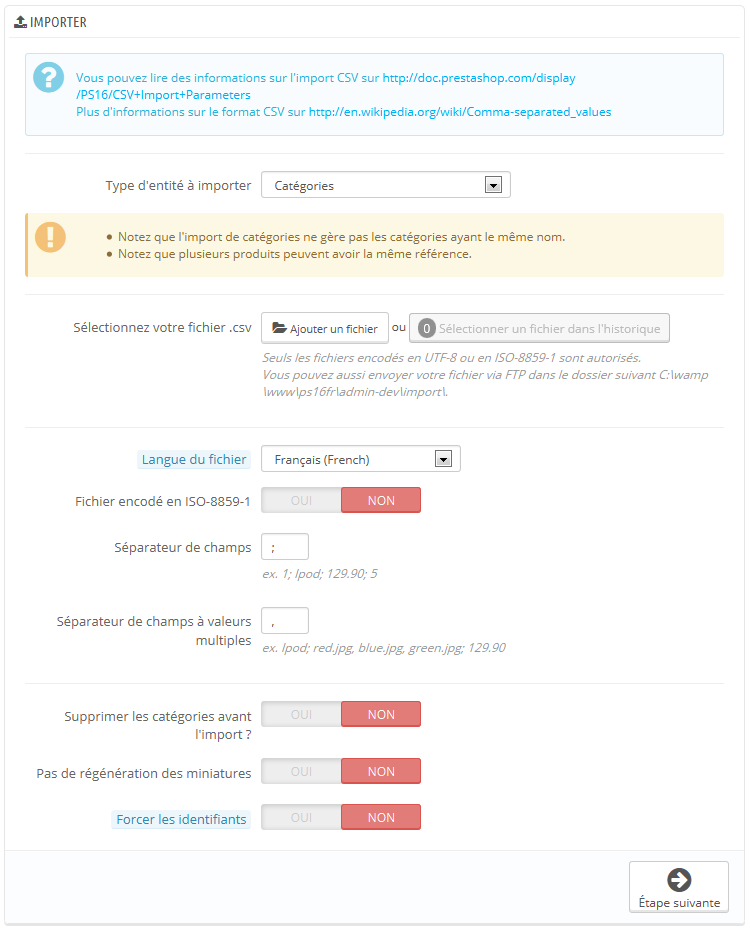
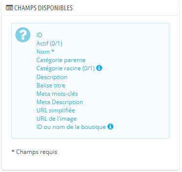
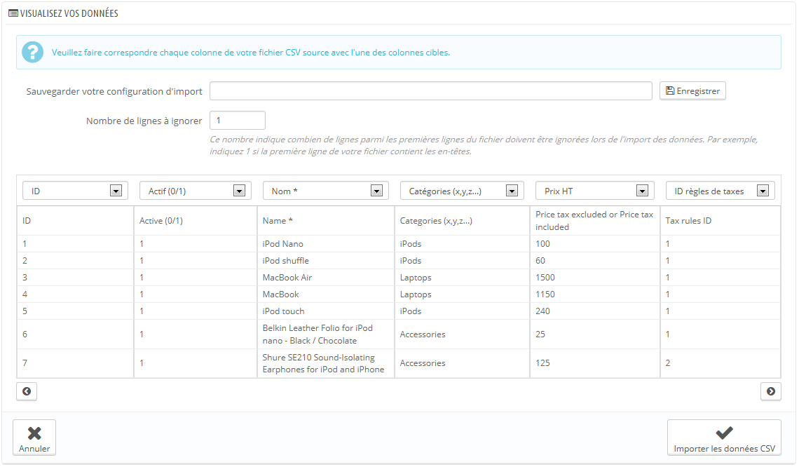

# Paramètres d'import CSV

Les fonctions d'import CSV vous permettent de rapidement remplir votre catalogue de produits quand vous disposez d'une grande quantité d'entrées à intégrer, ou d'importer les données que vous avez exportées et converties depuis un autre outil e-commerce, sous forme de fichiers CSV.

CSV est l'acronyme de "_Comma-separated values_" ("valeurs séparées par des virgules"). C'est un format de texte brut très populaire pour tout ce qui concerne l'import, l'export ou simplement le stockage de données dans un format non propriétaire. Quasiment tous les outils de manipulation de données reconnaissent le format CSV, sous ses différentes formes. Vous pouvez en apprendre plus sur le format CSV sur Wikipedia : [http://fr.wikipedia.org/wiki/Comma-separated\_values](http://fr.wikipedia.org/wiki/Comma-separated\_values).



Le processus d'import CSV demande de la préparation, et commence avec un formulaire fait des premiers réglages :

* **Quel type d'entités souhaitez-vous importer ?**. Les entités sont les types de données que vous pouvez importer. PrestaShop vous permet d'importer ces types de données:
  * Catégories ;
  * Produits ;
  * Déclinaisons (qui étaient appelées "versions" dans les versions précédentes de PrestaShop) ;
  * Clients ;
  * Adresses ;
  * Fabricants ;
  * Fournisseurs ;
  * Alias ;
  * Commandes aux fournisseurs (si la gestion des stocks avancées est activée) ;
  * Détails de commandes aux fournisseurs (si la gestion des stocks avancées est activée).
*   **Sélectionnez votre fichier .csv**. Vous pouvez importer plus d'un fichier à la fois, mais assurez qu'ils contiennent tous le même type de données.

    Vous trouvez des fichiers d'exemples dans la section "Téléchargez des fichiers .csv d'exemple" à droite. Ils peuvent vous aider à comparer vos fichiers avec ceux recommandés par PrestaShop, et donc à vérifier que les fichiers que vous importez sont bien prêts à être importés par PrestaShop. Dans les faits, ces fichiers se trouvent dans le dossier `/docs/csv_import` de votre installation de PrestaShop.
* **Langue du fichier**. Les données ne peuvent être importées que pour un fichier à la fois. Si vos données existent dans plus d'une langue, vous devriez les découper en autant de fichiers.
* **Fichier encodé en ISO-8859-1 ?**. Par défaut, les fichiers d'import devraient être encodés en UTF-8. Mais si vos fichiers utilisent l'encodage ISO-8859-1 et que vous préféreriez ne pas les convertir, cochez cette case.
* **Séparateur de champs**. Tous les fichiers CSV n'utilisent pas la virgule comme séparateur de données : certains utilisent des tabulations, d'autres des points-virgules, etc. Vous pouvez indiquer ce qu'utilisent vos fichiers dans ce champ.
* **Séparateur de champs à valeurs multiples**. Quand un attribut peut contenir plus d'une valeur, ces valeurs doivent être séparées par un séparateur spécifique. Après avoir vérifié la manière dont sont conçus vos fichiers, indiquez le bon séparateur dans ce champ.
* **Supprimer toutes les \_\_\_ avant l'import ?**. Cette option effacera toutes les entrées actuelles du type de données que vous importez. Cela vous aide à partir de zéro.
* **Forcer tous les identifiants lors de l'importation ?**. Uniquement pour l'import produit. Vous pouvez choisir de laisser PrestaShop déterminer l'identifiant d'un produit, ou utiliser sa référence comme identifiant. Dans ce cas, vérifiez bien que le fichier contient effectivement des références pour tous les produits importés.
* **Utiliser la référence du produit comme clé ?**. Uniquement pour l'import de produits. Vous pouvez choisir de laisser PrestaShop déterminer la clé du produit, ou d'utiliser la référence du produit comme ID. Dans ce cas, assurez que le fichier contient bien une référence pour tous les produits importés.
* **Pas de régénération des miniatures**. Import de catégories et de produits uniquement. Vous pouvez choisir de laisser PrestaShop regénérer les miniatures qui sont liées depuis votre fichier CSV (dans les champs "Image URL" ou "Image URLs").
* **Forcer les identifiants**. Vous pouvez soit utiliser les identifiants importés, ou laisser l'importateur faire l'auto-incrémentation.

Lorsque vous changez d'entité, la section à droite, intitulée "Champs disponibles", affiche les champs attendus. Bien que l'outil d'import soit conçu pour vous aider à faire correspondre les champs de vos fichiers à ceux de PrestaShop, vous devriez vous efforcer de rendre vos données aussi simples à importer que possible, notamment en suivant le format de nommage et l'ordre des champs présentés. Sans cela, l'importation sera laborieuse, mais pas impossible.\
&#x20;Certains de ces champs ont une petite icône d'information affichant une fenêtre pop-up au survol de la souris. Ils se rapportent pour la plupart au mode multiboutique de PrestaShop, ou à la gestion des stocks avancées. Lisez-les bien tous avant de construire ou modifier vos fichiers de données.



## Data format <a href="#parametresdimportcsv-dataformat" id="parametresdimportcsv-dataformat"></a>

Les données importées doivent l'être sous la forme d'un fichier texte, utilisant un format de données de type CSV (_Comma-Separated Values_), pour "valeurs séparées par des virgules", et l'extension de fichier liée .csv. Nous vous recommandons d'avoir recours au point-virgule ";" comme séparateur de champ. Si vos données textuelles (descriptions de produit et autres) contiennent des signes point-virgule, vous devriez soit les enlever, soit utiliser un autre caractère pour la séparation des champs.

Vous pouvez créer un tel fichier avec n'importe quel éditeur de texte (nous vous recommandons Notepad++ : [http://notepad-plus-plus.org/](http://notepad-plus-plus.org/)), mais il est préférable d'utiliser un tableur, puis d'enregistrer votre travail au format CSV. En comparaison avec un éditeur de texte, un tableur vous permet de travailler plus rapidement et de manière visuelle. Vous pouvez utiliser le logiciel payant Microsoft Excel ([http://office.microsoft.com/fr-fr/excel/](http://office.microsoft.com/fr-fr/excel/)) ou le logiciel gratuit OpenOffice.org Calc ([http://www.openoffice.org/fr/](http://www.openoffice.org/fr/)).

Voici un exemple de fichier prêt à l'import, ici pour une liste de produits :

```
"Enabled";"Name";"Categories";"Price";"Tax rule ID";"Buying price";"On sale";"Reference";"Weight";"Quantity";"Short desc.";"Long desc";"Images URL"
1;"Test";"1,2,3";130;1;75;0;"PROD-TEST";"0.500";10;"'Tis a short desc.";"This is a long description.";"http://www.myprestashop/images/product1.gif"
0;"Test 02";"1,5";110;1;65;0;"PROD-TEST2";"0.500";10;"'Tis also a short desc.";"This is a long description too.";"http://www.myprestashop/images/product2.gif"
1;"Test 03";"4,5";150;1;85;0;"PROD-TEST3";"0.500";10;"'Tis a short desc. again";"This is also a long description.";"http://www.myprestashop/images/product3.gif"
```

Notez bien qu'il s'agit ici d'un fichier d'exemple conçu pour cette démonstration ; il n'a volontairement pas été optimisé pour l'import PrestaShop. Si vous avez besoin de fichiers d'exemples sur lesquels baser vos propres fichiers d'import, vous pouvez en télécharger depuis la fenêtre qui s'affiche en cliquant sur le bouton "Mettre en ligne un fichier".

La première colonne doit être un nom descriptif pour la colonne de données (vous pourrez ne pas la prendre en compte lors du processus d'import). Il doit y avoir le même nombre de colonnes dans chaque ligne.

Notez bien que :

* La colonne de prix utilise la devise par défaut de votre boutique ;
* Les catégories sont indiquées à l'aide de leur identifiant existant (il vous faut donc les importer en premier), et séparées par des virgules ;
* L'adresse Web des images doit être un lien absolu. En d'autres termes, vous devez utiliser l'adresse que le navigateur doit appeler pour afficher l'image ; par exemple, [http://www.monprestashop/images/produitXXX.gif](http://www.monprestashop/images/produitXXX.gif) ;
* Préférez l'encodage de données UTF-8. Sinon, utilisez ISO-8859-1 et validez l'option "Fichier encodé en ISO-8859-1".
* Les dates utilisent le format ISO 8601, sans l'indicateur de fuseau horaire (le fuseau horaire étant celui de votre boutique) : `2013-06-21 15:07:27`.

## Mise en ligne du fichier <a href="#parametresdimportcsv-miseenlignedufichier" id="parametresdimportcsv-miseenlignedufichier"></a>

Une fois que toutes vos données sont au format CSV, vous pouvez les envoyer dans la base de données de votre boutique à l'aide du formulaire de cette page.

Vous avez deux manières d'ajouter des fichiers à importer :

* À l'aide de voter navigateur : cliquez sur le bouton "Ajouter un fichier", trouvez votre fichier puis validez. Répétez ce processus autant de fois que nécessaire pour lister tous vos fichiers d'import.
* À l'aide de votre client FTP : mettez le fichier en ligne dans le dossier `/admin-dev/import` de votre installation de PrestaShop. Rechargez la page d'import : le bouton "Sélectionnez un fichier dans l'historique" devrait maintenant afficher un nombre. Cliquez le bouton pour afficher la liste de fichiers disponibles (y compris ceux qui vous avez déjà mis en ligne à l'aide de votre navigateur), puis cliquez sur le bouton "Utiliser" pour le fichier que vous souhaitez importer

Une fois tous vos fichiers listés dans la section "Votre fichier CSV", vous pouvez continuer à remplir le formulaire :

1. **Sélectionnez le type de données que contient votre fichier**, à l'aide du menu déroulant "Quel type d'entités souhaitez-vous importer ?". Une fois que vous avez choisi le type de données, une liste des champs disponibles apparaît à droite, ce qui peut vous aider à affiner votre fichier CSV – au moins en ce qui concerne l'ordre des colonnes, ce qui va vous être utile très bientôt.
2. **Sélectionnez la langue des données importées**. Si la langue cible n'est pas disponible, vous devez en premier lieu l'installer, via la page "Traductions" du menu "Localisation".
3. **Sélectionnez l'encodage du fichier**. Indiquez simplement si le fichier est en iso-8859-1 ou non. Si ce n'est pas le cas, l'outil d'import partira du principe que l'encodage utilisé est UTF-8.
4. **Sélectionnez les séparateurs de champs**. Nous vous suggérons de laisser les valeurs par défaut ("Séparateur de champs" avec un point-virgule, "Séparateur de champs à valeurs multiples" avec une virgule). Bien entendu, si votre fichier CSV est conçu différemment, vous devriez changer ses valeurs en conséquence.
5. Si vous voulez enlever tous vos produits avant de lancer l'importation, cochez la case appropriée.
6. Une fois tous vos choix faits, cliquez sur "Étape suivante".

Tous les fichiers d'import sont envoyés directement dans le sous-dossier `/import` de votre dossier d'administration. Si le menu déroulant des fichiers CSV contient trop d'entrées, vous pouvez effacer les imports les plus anciens directement à l'aide de votre client FTP.

En cliquant sur le bouton "Étape suivante", la page se recharge avec l'outil de correspondance des données. Cette interface vous aide à faire correspondre les colonnes de données de votre fichier avec celles dont PrestaShop a besoin.



Par exemple, avec le fichier d'exemple pour des produits :

* **Première colonne**. Nous l'avions marquée comme "Enabled", PrestaShop utilise l'en-tête "ID". Cliquez sur le menu déroulant de l'en-tête, et sélectionnez "Actif (0/1)".
* **Deuxième colonne**. Marquée "Name", mais l'en-tête utilise "Actif (0/1)". Changeons cela pour "Nom".
* **Troisième colonne**. Et ainsi de suite...

L'écran ne peut contenir plus de c colonnes de données, aussi il vous faut cliquer sur les boutons ">" et "<" pour vous déplacer dans les colonnes, et toutes les faire correspondre aux bons en-têtes.

Dans notre exemple, nous avons utilisé la première ligne pour servir de noms de colonne. Étant donné que nous ne voulons importer cette ligne, saisissez "1" dans le champ "Sauter X lignes".

Une fois que toutes vos colonnes auront trouvé correspondance, cliquez sur le bouton "Importer les données" (en haut à droite de l'écran), et PrestaShop lancera le processus d'import. Quand ce processus est terminé, vous êtes renvoyé à l'écran principal, qui en fonction du résultat, soit vous confirmera que tout a bien été importé, soit vous notifiera des problèmes rencontrés. Dans le second cas, vous devrez relire vos fichiers CSV et faire en sorte de tout corriger.

### Configurations des correspondances <a href="#parametresdimportcsv-configurationsdescorrespondances" id="parametresdimportcsv-configurationsdescorrespondances"></a>

Le processus de configuration peut être une tâche laborieuse si vous ne pouvez pas choisir l'ordre des colonnes de votre fichier CSV en concordance avec celui utilisé par l'outil d'import de PrestaShop. C'est pourquoi PrestaShop comprend un petit outil permettant d'enregistrer l'ordre de correspondance que vous avez mis en place avec tous les sélecteurs déroulants des en-têtes de colonnes.


L'outil est un simple champ en haut de l'outil de correspondance. Vous avez trois fonctions de base (une seule si vous n'avez pas encore enregistré de configuration de correspondances) :

* **Enregistrer**. Saisissez un nom descriptif dans le champ, et cliquez sur "Sauvegarder". L'interface se met à jour pour afficher les configurations enregistrées dans sa liste déroulante.
* **Charger**. Choisissez une configuration de correspondances dans le menu déroulant, et cliquez sur "Charger".
* **Supprimer**\*. Choisissez une configuration de correspondances dans le menu déroulant, et cliquez sur "Supprimer".
