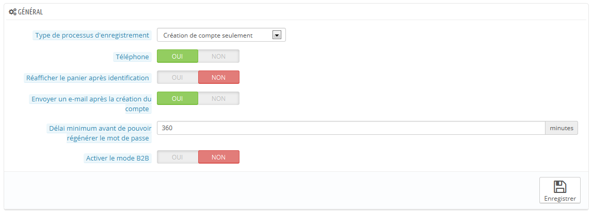

# Préférences des clients

La page "Clients" combine toutes les options liées aux clients, notamment le mode B2B.

* **Type de processus d'enregistrement**. Vous pouvez autoriser les visiteurs à créer un nouveau compte sans devoir immédiatement donner une adresse postale, ou les obliger à donner une telle adresse dès leur inscription.\
  &#x20;La première option permet au client de créer un compte plus rapidement, ce qui ne peut être que positif, mais cela ajoute un écran lors du processus de commande, ce qui peut les rebuter.\
  &#x20;D'un autre côté, la deuxième option rallonge le processus de création d'un compte, mais au moins auront-ils déjà une adresse enregistrée lorsque viendra le moment de passer commande.
* **Numéro de téléphone**. De la même manière, vous pouvez imposer à vos clients de donner leur numéro de téléphone. Disposer d'un numéro de téléphone peut se révéler extrêmement pratique, car il vous permet de contacter le client directement. Cependant, certains clients n'aiment pas donner ce type d'information. Si vous sélectionnez "Non", le champ "Numéro de téléphone" apparaîtra quand même dans le formulaire de création d'adresse, mais il ne sera plus obligatoire.
* **Réafficher le panier après identification**. Si le client a déjà créé un panier qu'il n'a pas validé, vous pouvez le lui afficher lors de sa prochaine connexion à la boutique.
* **Envoyer un e-mail après la création du compte**. Vous pouvez faire en sorte que PrestaShop envoie un e-mail à chaque création d'un compte utilisateur, avec un résumé de ses informations (e-mail, mot de passe) après son inscription.
* **Regénération du mot de passe**. Vous pouvez choisir de choisir la fréquence avec laquelle un client peut générer un nouveau mot de passe pour son compte. Par défaut, il est de 360 minutes – 6 heures.
* **Activer le mode B2B**. Le mode B2B ajoute une poignée de fonctionnalités à votre boutique. Les clients ne sont plus considérés comme des individus, mais comme des sociétés, et donc de nouvelles options apparaissent :
  * le profil client a de nouveaux champs liés aux informations professionnelles,
  * les prix peuvent être cachés à certains groupes,
  * les prix peuvent être personnalisés pour chaque utilisateur pour l'ensemble du catalogue ou pour certaines catégories,
  * les factures sont générées manuellement,
  * etc.
