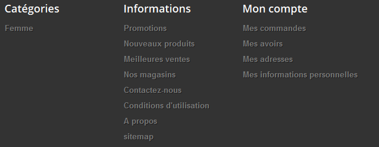
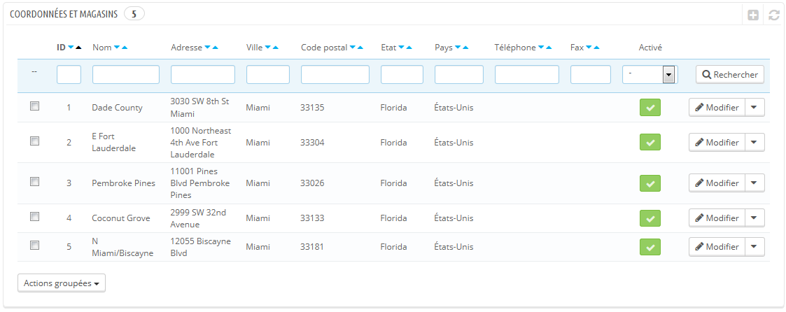
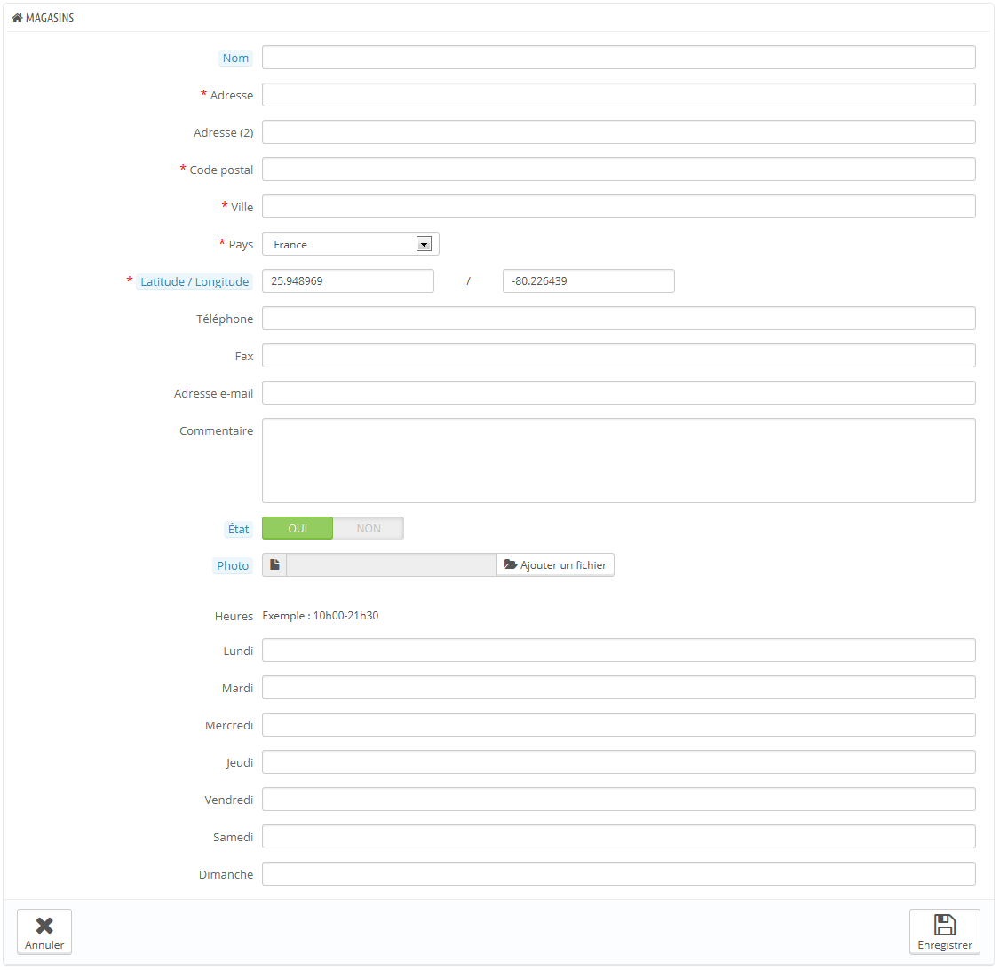
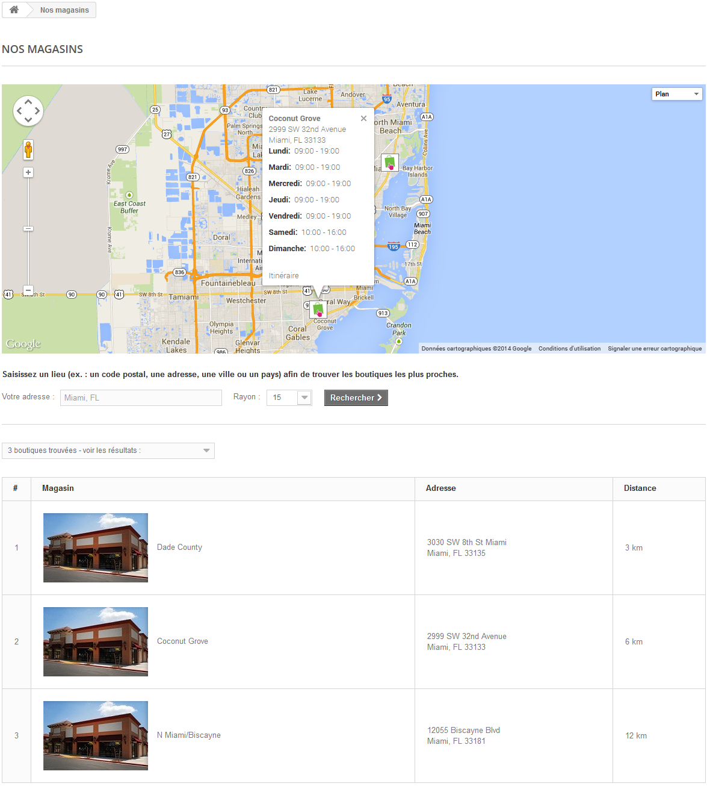
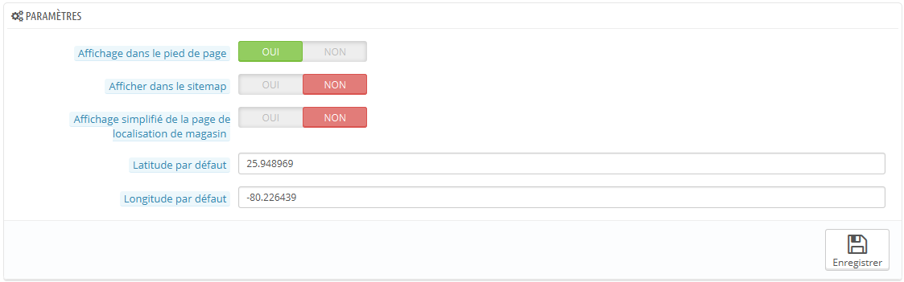
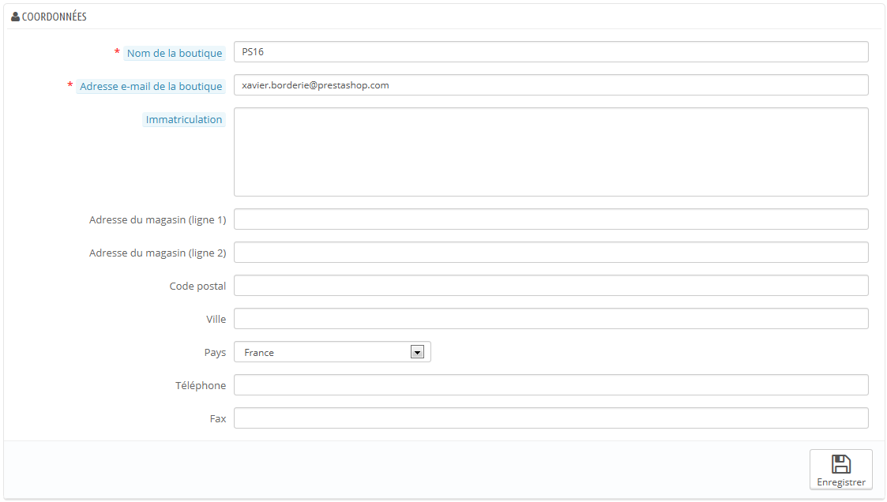

# Préférences des coordonnées & magasins

PrestaShop offre un outil complet de localisation de magasins physiques pour vos clients, avec des informations de contact détaillées.

Les clients peuvent chercher un magasin depuis l'outil "Découvrez nos magasins" sur le front-office.

De toute évidence, cette fonctionnalité n'est réellement utile que si vous avez des magasins physiques, où les clients peuvent acheter vos produits.

## Liste des magasins 

Vous pouvez choisir la manière dont ces magasins sont affichés. Les clients pourront y accéder par le biais du lien "Nos magasins" (en fonction du thème).

Tous les magasins sont listés dans une liste qui vous donne également leurs principales informations ainsi qu'un indicateur de l'activation du magasin – vous pourriez par exemple vouloir ne mettre en ligne un magasin qu'une fois que vous aurez réunis toutes les informations nécessaires.

### Ajouter un nouveau magasin. 

Comme d'habitude, cliquez sur le bouton "Créer" pour ouvrir le formulaire de création.

Remplissez autant de champs que possible, car ces informations seront affichées en ligne au sein d'une carte.

Le champ "Latitude / Longitude" est très important, car il indique à PrestaShop l'emplacement de votre magasin. Vous pouvez utiliser l'outil en ligne de Steve Morse pour obtenir la latitude et longitude d'une adresse : [http://stevemorse.org/jcal/latlon.php](http://stevemorse.org/jcal/latlon.php).

Faites en sorte d'ajouter une photo du magasin, car elle aidera vos clients à le trouver une fois dans la rue.

Enfin, les heures d'ouverture sont une information essentielle d'un magasin physique, et vous devriez être aussi précis que possible.

## Paramètres 

* **Affichage dans le pied de page**. Par défaut, PrestaShop affiche un lien vers le localisateur de magasin dans le pied de la page, intitulé "Nos magasins". Dans le thème par défaut, il apparaît dans le bloc "Information", sous les pages offrant des listes de produits générées (meilleures ventes, nouveaux produits, promotions, etc.). Vous pouvez choisir de ne pas faire apparaître ce lien dans ce bloc.
* **Afficher dans le sitemap**. Vous pouvez choisir d'ajouter un lien "Nos magasins" dans la page de sitemap de votre boutique, page qui liste toutes les pages de votre site (à ne pas confondre avec le fichier Google Sitemap, qui sert au référencement).
* **Affichage simplifié de la page de localisation de magasin**. L'outil de localisation de magasin se présente sous la forme d'une carte interactive avec un moteur de recherche. Vous pouvez choisir de simplifier cette interface en n'affichant qu'une liste de magasins.
* **Latitude par défaut** et **Longitude par défaut**. La position de départ de votre carte. Très utile si vous avez plusieurs magasins et que vous voulez avant tout envoyer vos clients sur une zone précise.

## Coordonnées 

Cette section vous permet de donner plus de détails sur votre société plutôt que sur un magasin en particulier. Vous devriez remplir tous les champs avec les informations sur votre siège social, car c'est très certainement l'adresse à laquelle les clients écriront, voire se rendront.

La plupart de ces informations sont évidentes, mais certains champs doivent être attentivement remplis :

* **Téléphone**. Utilisez le numéro de contact de votre boutique. Si vous préféreriez que les clients ne vous appellent pas, ne mettez rien dans ce champ.
* **Adresse e-mail de la boutique**. L'adresse officielle de votre société. Utilisez l'adresse générale de contact de votre société, celle qui envoie des e-mails à vos clients.
* **Immatriculation**. Donnez le numéro d'enregistrement légal de votre société, qui dépend du système légal de votre pays (SIRET en France, Duns number aux USA, CNPJ au Brésil, etc.).\
  Cela prouve que vous êtes une société officiellement déclarée, ce qui vous permet de gagner la confiance de vos clients.
* **Adresse du magasin**, **Code postal**, **Ville**, **État**, **Pays**. Utilisez l'adresse de contact officielle de votre société. L'option "État" n'apparaît que si le pays sélectionné a des états dans votre base de données (par le biais de la page "États" du menu "Localisation".
* **Téléphone**. Le numéro de contact officiel de votre société. Si vous préférez que les utilisateurs ne vous contactent pas, ne mettez rien ici.
* **Fax**. Le numéro de fax officiel de votre société.
