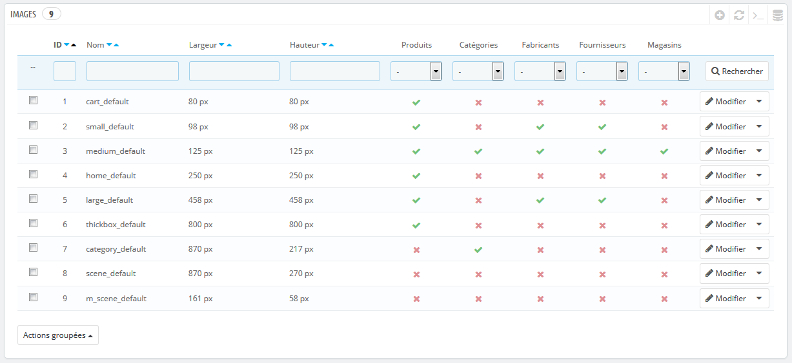
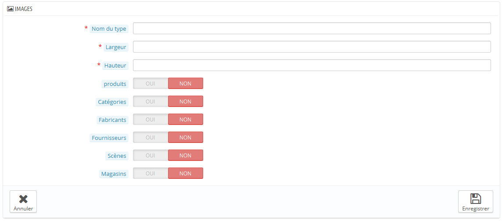
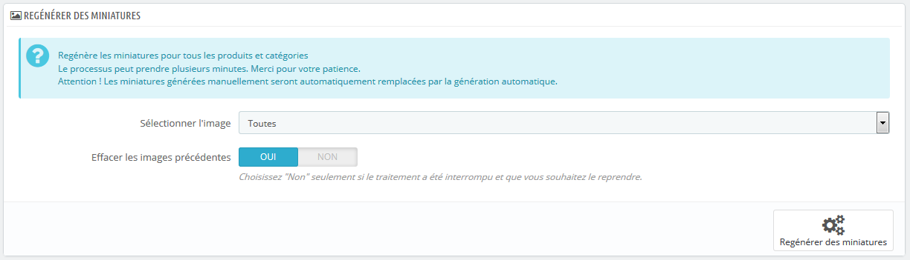

# Préférences des images

La page de préférences "Images" vous permet de configurer les diverses tailles d'images telles que vues par vos clients sur la boutique.

Quand vous mettez une image en ligne via PrestaShop, le logiciel génère automatiquement différentes tailles de cette image, y compris la miniature et la version mobile (en fonction du contexte dans lequel l'image doit se trouver). C'est pourquoi vous n'avez qu'une seule version principale de votre image à mettre en ligne, suffisamment grande pour être redimensionnée dans toutes les tailles.

Si vous voulez vous assurer que votre image est bien redimensionnée, vous devriez mettre en ligne une image qui correspond au rapport de taille des autres tailles d'image. Si votre image mise en ligne n'a pas le même rapport de largeur à hauteur, vous prenez le risque de voir du blanc sur les côtés de celle-ci.

Vous pouvez activer une taille d'image pour un contenu spécifique directement depuis la liste des tailles.

Dans la page "Produits" du menu "Préférences", vous pouvez choisir d'utiliser un zoom lorsque que le curseur de la souris survole l'image du produit.

## Ajouter une nouvelle taille d'image 

Vous pouvez facilement ajouter une nouvelle taille d'image, et même configurer les types de contenus auxquels elle s'applique.

Cliquez sur le bouton "Créer", puis :

1. Saisissez le nom de la taille, sa largeur et sa hauteur.
2. Choisissez les types de contenus liés.
3. Validez.

## Préférences d'images 

*   **Qualité d'image**. Vous pouvez choisir entre deux formats : JPEG et PNG. Les deux sont biens établis au sein des navigateurs web. Le format JPEG a un bon taux de compression, mais cela peut donner des défauts visibles. L'algorithme de compression du format PNG n'est pas aussi fort, mais en comparaison, il y a moins de défauts visibles ; cependant, les navigateurs les plus anciens peuvent ne pas lire ce format.\
    Le choix entre l'un et l'autre se ramène souvent à une question de goût. Cela étant, le format JPEG reste le choix recommandé. Si vous préférez éviter au maximum la déperdition de qualité due au changement de format, utilisez la seconde option "Utiliser le PNG uniquement si l'image de base est au format PNG".

    Le format PNG n'est pas compatible avec le module "Filigrane".
* **Compression JPEG**. Ne descendez pas en-dessous de 80, ou au pire 75, au risque d'avoir une forte perte d'information.
* **Compression PNG**. Ne montez pas au-dessus de 6, ou au pire 7, au risque d'avoir une forte perte d'information.
* **Générer les images en se basant sur un côté de l'image source**. Cette option vous permet de positionner l'image du produit dans un espace prédéfini :
  * Choisissez "largeur" afin de remplir toute la hauteur du cadre (la largeur est alors recalculée pour conserver les proportions).
  * Choisissez "hauteur" afin de remplir toute la largeur du cadre (la hauteur est alors recalculée pour conserver les proportions).
  * Choisissez "auto" afin que l'image occupe le plus d'espace possible, tout en conservant ses proportions.
* **Taille maximale pour l'image de personnalisation d'un produit**. Vos clients peuvent envoyer des images pour les produits personnalisables. Par défaut, PrestaShop a la valeur maximale en place dans ce champ, ce qui peut autoriser des fichiers lourds.
* **Largeur image produit**. Par défaut, les clients peuvent envoyer une image de 64 pixels de large.
* **Hauteur image produit**. Par défaut, les clients peuvent envoyer une image de 64 pixels de haut.
* **Générer des images haute définition**. Les écrans les plus récents avec une grande densité de pixels (Retina et autres technologies similaires) nécessitent des images haute résolution. Vous pouvez activer cette option pour vous assurer que vos images s'afficheront correctement sur ce type d'écrans. Cela générera un nouveau fichier pour chacune de vos images, avec une résolution deux fois plus élevée. Cela doublera le nombre de vos fichiers images, aussi utilisez cette option avec précaution si votre espace de stockage est limité.

## Régénérer les miniatures 

Il se peut que vous ne soyez pas satisfait de la taille des images miniatures de votre boutique. Cette section vous permet de toutes les régénérer – ou seulement celles liées à une type particulier de contenu :

1. Modifiez les réglages de tailles d'images dans le tableau en haut de la page de préférences "Images".
2. Sélectionnez les contenus dont vous voulez que les images soient régénérées.
3. Indiquez si les miniatures précédentes doivent être conservées ou non.
4. Cliquez sur le bouton "Régénérer les miniatures".

Les miniatures mises en ligne à la main seront effacées et remplacées par les miniatures générées automatiquement.
