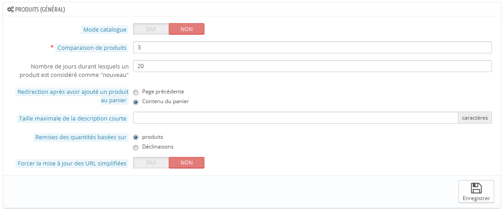
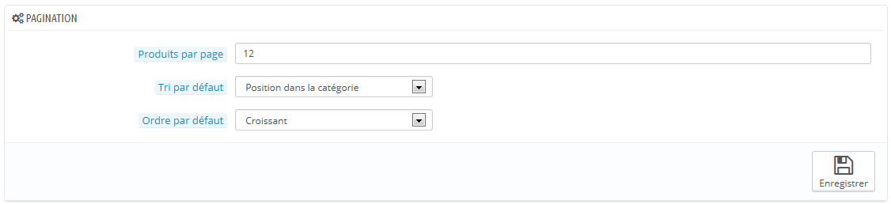
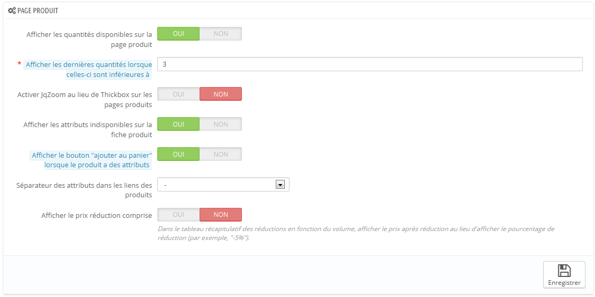
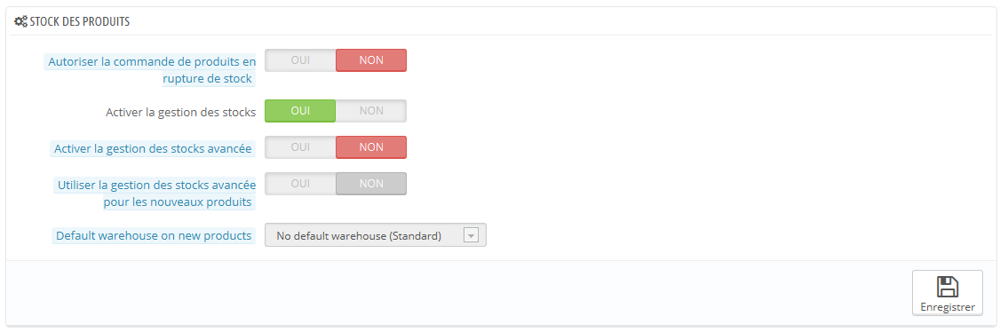

# Préférences des produits

Cette page contient les préférences se rattachant à la manière dont vos produits sont gérés et affichés par PrestaShop.

## Préférences générales 

* **Mode catalogue**. Activer le mode catalogue signifie que vous transformez votre boutique en une simple galerie de produits, n'offrant aucune possibilité d'achat.
* **Comparaison de produits**. Réglez le nombre maximal de produits qui peuvent être sélectionnés pour être comparés entre eux.
* **Nombre de jours durant lesquels un produit est considéré comme "nouveau"**. Quand vous ajoutez un produit à votre boutique, il est considéré comme étant nouveau, et se trouve dans le bloc "Nouveaux produits" et la page du même nom. Ce champ vous permet de préciser le nombre de jours durant lesquels un produit est considéré comme nouveau.\
  &#x20;Cette option vous permet donc de mieux contrôler la manière dont vous gérez les nouveautés de votre boutique. La page des nouveaux produits est surtout visitée par les clients réguliers.
* **Redirection après avoir ajouté un produit au panier**. Vous pouvez soit renvoyer le client vers la page précédente, soit vers le récapitulatif du panier.
* **Taille maximale de la description courte**. Votre produit dispose de deux descriptions : une description courte ou une classique. La courte, qui apparaît dans les moteurs de recherche et la description du produit dans la catégorie, est limitée à 400 caractères par défaut, mais cette option vous permet de changer cette valeur. 0 signifie qu'il n'y a pas de limite.
* **Remises des quantités basées sur**. Définit sur quelle base (produits ou déclinaisons) sont calculés les remises de quantité.

## Pagination 

* **Produits par page**. Indique le nombre de produits affichés sur les pages de vos catégories.
* **Tri par défaut**. Indique l'ordre des produits dans les catégories de votre boutique. 6 choix sont possibles :
  * **Nom du produit**. Affiche vos produits par ordre alphabétique de leurs noms.
  * **Prix du produit**. Affiche vos produits en fonction de leurs prix.
  * **Date d'ajout**. Affiche vos produits en fonction de leurs dates d'ajout.
  * **Position dans la catégorie**. Affiche vos produits tels qu'ils sont positionnés au sein de la catégorie, dans le catalogue. La position d'un produit peut être changée directement dans le catalogue de votre boutique en utilisant les flèches de positionnement. Ainsi, vous pouvez placer vos produits de la manière la plus à même de provoquer une vente.
  * **Marque**. Affiche vos produits par ordre alphabétique du nom de leurs marques.
  * **Date de modification**. Quand vous modifiez un produit, sa date de modification est changée. Cette option les fait apparaître par ordre de modification.
* **Ordre par défaut**. L'option ci-dessus peut être arrangée par ordre croissant ou décroissant.

## Page produit 

* **Afficher les quantités disponibles sur la page produit**. En activant cette fonctionnalité, vos visiteurs peuvent voir la quantité disponible en stock de chaque produit. Vous pouvez utiliser cette information pour doper les ventes quand le stock est bas. Les quantités affichées sont pour les attributs et déclinaisons sélectionnés.
* **Afficher les dernières quantités lorsque celles-ci sont inférieures à**. Vous pouvez choisir d'afficher une notification quand le stock disponible d'un produit atteint une certaine limite. Cette option se montre particulièrement utile pour pousser à l'achat. Le texte et la position de la notification dépendent du thème ; dans le thème par défaut, la notification annonce "Attention : dernières pièces disponibles !", et est affiché directement sous le champ "Quantité".
* **Activer JqZoom au lieu de Thickbox sur les pages produits**. Par défaut, le fait de cliquer sur l'image d'un produit affiche une version plus grande de cette image sur la page. En activant cette option, les visiteurs pourront toujours cliquer sur l'image afin de zoomer dessus, mais une version zoomée apparaîtra également au survol de la souris.
* **Afficher les attributs indisponibles sur la fiche produit**. Votre produit peut être fait de nombreux attributs et déclinaisons : couleur, taille, capacité, etc. Les attributs peuvent être modifiés dans la page "Attributs" de votre menu "Catalogue". Lisez le chapitre "Un aperçu du catalogue" pour en apprendre plus sur les attributs, et savoir pleinement les utiliser.\
  Quand au moins un attribut n'est plus disponible, vous avez deux possibilités :
  * Premièrement : laisser cette préférence active. Par exemple : le produit "iPod Shuffle" n'est plus disponible en couleur "Bleu". En laissant cette option activée, la déclinaison du produit restera visible sur votre boutique. Un message indique alors que le produit n'est plus disponible pour l'option choisie, et invite les clients à en choisir une autre. Si vous avez activé l'option "Autoriser la commande de produits hors stock" (voir ci-dessous), alors ils pourront malgré tout commander cette déclinaison.
  * Deuxièmement : désactiver cette préférence. Si la déclinaison "Bleu" du produit "iPod Shuffle" n'est plus disponible, cette sélection n'est plus affichée sur le front-office, et les clients ne peuvent donc plus la sélectionner. Cette option vous aide à clairement afficher la disponibilité de vos produits.
* **Afficher le bouton "ajouter au panier" lorsque le produit a des attributs**. Cette option empêche vos clients d'ajouter des produits directement depuis la page de catégorie, si le produit a des déclinaisons. Cela oblige le client à se rendre sur la page du produit et à choisir une déclinaison, au lieu d'ajouter celle par défaut au panier. Notez que les produits qui n'ont pas de déclinaisons auront toujours un bouton "Ajouter au panier" sur la page de catégorie.
* **Séparateur des attributs dans les liens des produits**. Choisissez le séparateur, entre "-" et ",".
* **Afficher le prix réduction comprise**. Dans le tableau récapitulatif des réductions en fonction du volume, afficher le prix après réduction au lieu d'afficher le pourcentage de réduction.

## Stocks produit 

* **Autoriser la commande de produits hors stock**. Si un produit n'est plus disponible en stock, le client peut quand même le commander.
* **Activer la gestion des stocks**. Cette option vous donne à accès un gestionnaire de stock basique : vous pouvez régler la quantité actuelle d'un produit, et laisser PrestaShop diminuer ce nombre à chaque commande, et en rajouter à chaque commande annulée et produit retourné.\
  &#x20;Par défaut, vous devriez laisser cette fonctionnalité activée, car la désactiver affecte l'intégralité du gestionnaire d'inventaire de votre boutique. À ne désactiver que si vous n'avez aucun inventaire physique – par exemple, si vous ne vendez que des produits dématérialisés.
* **Activer la gestion des stocks avancée**. Cette autre petite option a des implications majeures : elle ajoute un nouveau menu nommé "Stock", qui vous permet de gérer précisément votre inventaire, sur plusieurs entrepôts si besoin est. Vous pouvez y voir tous les détails de votre stock : mouvement, couverture, commandes de restockage, etc.\
  &#x20;Vous pouvez en apprendre plus que le gestionnaire de stock avancé de PrestaShop en lisant le chapitre "Gérer le stock" de ce guide.
* **Activer la gestion des stocks avancée pour les nouveaux produits**.\
  ****
* **Entrepôt par défaut pour les nouveaux produits**.
