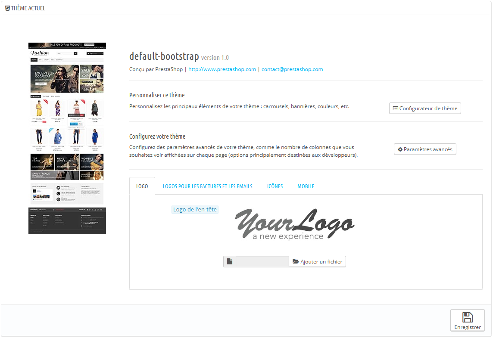

# Préférences des thèmes

/\*\<!\[CDATA\[\*/\
div.rbtoc1597053593006 {padding: 0px;}\
div.rbtoc1597053593006 ul {list-style: disc;margin-left: 0px;}\
div.rbtoc1597053593006 li {margin-left: 0px;padding-left: 0px;}\
\
/\*]]>\*/

* [Préférences des thèmes](preferences-des-themes.md#Préférencesdesthèmes-Préférencesdesthèmes)
  * [Votre thème actuel](preferences-des-themes.md#Préférencesdesthèmes-Votrethèmeactuel)
  * [Le Configurateur de thème](preferences-des-themes.md#Préférencesdesthèmes-LeConfigurateurdethème)
  * [Les paramètres avancés du thème](preferences-des-themes.md#Préférencesdesthèmes-Lesparamètresavancésduthème)
  * [Sélectionner le thème pour la boutique \<nom de la boutique>](preferences-des-themes.md#Préférencesdesthèmes-Sélectionnerlethèmepourlaboutique%3Cnomdelaboutique%3E)
  * [Importer et exporter un thème](preferences-des-themes.md#Préférencesdesthèmes-Importeretexporterunthème)
    * [Importer un thème : le bouton "Ajouter un thème"](preferences-des-themes.md#Préférencesdesthèmes-Importerunthème:lebouton%22Ajouterunthème%22)
    * [Créer un nouveau thème](preferences-des-themes.md#Préférencesdesthèmes-Créerunnouveauthème)
    * [Exporter un thème](preferences-des-themes.md#Préférencesdesthèmes-Exporterunthème)
  * [En direct de PrestaShop Addons !](preferences-des-themes.md#Préférencesdesthèmes-EndirectdePrestaShopAddons!)

Cette page vous permet de gérer efficacement vos thèmes.

## Votre thème actuel 

La première section de cette page vous sert de rappel du thème que vous utilisez actuellement, avec ses informations :

* Nom du thème ;
* Version du thème ;
* Nom, site web et adresse e-mail de l'auteur du thème ;
* Miniature du thème.

Cette section vous donne également accès à une poignée d'outils qui vous aident à rapidement personnaliser votre thème actuel : logo d'en-tête, d'e-mail et de factures, favicône, icône de magasin, etc. Ces outils sont regroupés ainsi :

* **Personnaliser ce thème**. Un lien vers le Configurateur de thème (à condition que le module Configurateur de thème soit installé et activé) ;
* **Configurez votre thème**. Un lien vers les paramètres avancés du thème ;
* Quatre onglets avec les options d'apparence du thème :
  * **Logo**. Le logo qui apparaîtra sur toutes les pages de votre boutique.
  * **Logos pour les factures et les e-mails**. Les logos qui apparaîtront respectivement sur les factures de votre boutique, et vos e-mails de notification.
  * **Icônes**. La favicône de votre boutique (affichée dans la barre d'adresse de votre navigateur web) et l'icône de magasin (utilisée dans la carte des magasins pour indiquer où un magasin se trouve).
  * **Mobile**. Le logo qui apparaîtra sur toutes les pages de votre boutique, lorsque vous y accédez par le biais d'un support mobile. Vous pouvez également choisir d'activer ou désactiver de manière sélective votre version mobile (si elle existe) pour les téléphones mobiles, les tablettes, ou les deux.

Le thème par défaut utilise un logo "YourLogo". Il est très fortement recommandé de changer toutes les instances de ce logo et de les remplacer par le vôtre !

En mode multiboutique, vous pouvez appliquer ces modifications à toutes les boutiques ou à un groupe de boutiques d'un coup, à l'aide du sélecteur multistore.

L'option "Activer le thème mobile" vous permet d'utiliser le thème mobile par défaut. Avec ce thème, n'importe quel marchant utilisant PrestaShop peut rendre sa boutique accessible aux appareils mobiles : depuis le page d'accueil jusqu'au processus de paiement, en passant par les pages produit et le tunnel de conversion.

Le thème mobile ne fonctionne qu'avec le thème par défaut de PrestaShop, car ses fichiers sont inclus dans son dossier : `/themes/default/mobile`. De fait, il ne fonctionnera pas si vous utilisez un autre thème ne disposant pas de son propre thème mobile.

Cela étant, vous pouvez facilement utiliser le thème mobile par défaut avec n'importe quel autre thème, ne serait-ce que temporairement : copiez simplement le dossier du thème mobile depuis le dossier du thème par défaut vers le dossier du nouveau thème, et vous devriez être paré. Par exemple, si le dossier de votre nouveau thème est `/themes/magnolia`, copiez le dossier `/themes/default/mobile` dans le dossier du nouveau thème.\
&#x20;Cette solution peut se révéler particulièrement utile si le nouveau thème ne dispose pas d'une conception dite "responsive" : ainsi, votre boutique pourra quand même être utilisable simplement sur les supports mobiles – mais avec le design par défaut.

## Le Configurateur de thème 

Le module Configurateur de thème vous permet de configurer certains aspects de votre thème.

En cliquant sur le bouton "Configurateur de thème", vous ouvrez la page de configuration du module. Celle-ci vous donne accès aux modules front-office les plus utilisés : vous pouvez ainsi activer ou désactiver une dizaine de fonctionnalités, comme l'affichage des boutons de partage social ou le bloc Facebook (à condition que leurs modules respectifs sont activés, et obtenir un accès direct à leurs pages de configuration. Vous pouvez également activer et accéder au Live Configurator depuis cette page, qui vous permet de facilement modifier la couleur principale et la police de votre thème.

Dans la seconde section, le Configurateur de thème vous permet de facilement attacher des images avec des liens à certains points d'accroches (hooks) spécifiques de la page d'accueil : home, top, left, right, footer. Chaque langue disponible a son propre onglet avec ses propres points d'accroche que vous pouvez modifier depuis cette page : c'est un point essentiel, car les images contiennent souvent directement du texte, ce qui nécessite du coup d'avoir une version de chaque image pour chaque langue.

Ce module est expliqué en profondeur le chapitre "Configurer les modules natifs" de ce guide.

Si vous utilisez le thème par défaut et souhaitez le personnaliser, voici [les différentes tailles d'images](https://www.prestashop.com/blog/fr/tailles-formats-dimages-theme-defaut-prestashop/) que vous devez utiliser.

## Les paramètres avancés du thème 

En cliquant sur le bouton "Paramètres avancés", vous ouvrez la page d'information du thème (lisez la section "Créer un nouveau thème" ci-dessous pour avoir une explication des champs).

Sous la section principale, une section "Apparence des colonnes" présente des informations sur la manière dont les colonnes gauche et droite apparaissent, en fonction de la page :

* Si la case est cochée, la colonne apparaît sur cette page (par exemple, la page Catégorie).
* Si elle n'est pas cochée, la colonne n'apparaît pas sur cette page.

Notez bien que vous pouvez cliquer sur les cases comme vous le souhaitez, mais que ces réglages sont principalement à titre d'information, et que les thèmes ne sont pas toujours capables de s'adapter à vos choix !

## Sélectionner le thème pour la boutique \<nom de la boutique> 

C'est dans cette section que vous allez choisir le thème actuel de votre boutique. L'interface vous présente une liste de miniatures des thèmes actuellement disponibles sur votre installation PrestaShop, et il vous revient de choisir le thème que vous souhaitez utiliser.

Cette section affiche simplement les miniatures des thèmes disponibles, avec leurs noms.

Placez le curseur de votre souris sur la miniature pour afficher un menu avec deux options :

* **Utiliser ce thème**. Cela remplacer votre thème actuel par ce thème.
* **Supprimer ce thème**. Cela supprimera les fichiers de ce thème de votre serveur web.

En haut à droite, un lien "Consulter le catalogue de thèmes" vous ouvre une page de la place de marché PrestaShop Addons, où vous trouverez plus de thèmes.

En mode multiboutique, vous ne pouvez pas appliquer un thème à toutes les boutiques ou à un groupe de boutiques ; vous devez sélectionner une boutique dans le sélecteur multiboutique, puis choisir un thème.

## Importer et exporter un thème 

Deux boutons en haut de l'écran vous permettent d'ajouter un thème et de l'installer (avec ses modules attachés), ou d'exporter un thème et ses modules afin de le partager avec le monde entier.

### Importer un thème : le bouton "Ajouter un thème" 

Cet écran vous présente trois méthodes pour installer un nouveau thème : depuis votre ordinateur, depuis un site public, ou depuis votre propre serveur FTP. Un dernier bouton vous amène au formulaire de création de thème, présenté ci-dessus.

Quelle que soit la méthode, le processus reste le même : indiquer l'emplacement de l'archive Zip du thème, puis cliquer sur "Enregistrer". Seule la source du fichier Zip diffère :

* **Importer depuis l'ordinateur** : utilisez l'explorateur de fichiers pour trouver l'archive.
* **Importer depuis le web** : indiquez directement l'adresse web de l'archive.
* **Importer depuis le serveur FTP** : à l'aide d'un client FTP, mettez l'archive en ligne dans le dossier suivant : `/themes/` .

Cliquez de nouveau sur "Suivant" pour valider votre choix. Le thème est maintenant installé, et PrestaShop vous demande si vous souhaitez installer les modules qui étaient joints au thème, ce que vous souhaitez faire avec la configuration actuelle des modules, et la manière dont vous souhaitez que la configuration des images soit prise en compte.

Cliquez sur "Suivant" une dernière fois. Une dernière page de confirmation vous présente toutes les modifications appliquées à votre site PrestaShop. Cliquez sur "Terminer" pour mettre fin au processus.

### Créer un nouveau thème 

La meilleure manière de créer un nouveau thème pour PrestaShop est de copier les fichiers du thème par défaut, et de commencer à modifier ses fichiers TPL et CSS pour les faire vôtres. Il y a une bonne raisons à cela : un thème PrestaShop a besoin de nombreux fichiers, et en partant d'un thème complet au lieu de faire table rase, vous vous assurez qu'aucune section ne manque à votre propre thème.

Vous pouvez le faire directement sur votre serveur web, mais PrestaShop facilite la copie de fichiers depuis un thème installé et l'enregistrement de ce thème dans son système (une étape que vous aurez à faire dans tous les cas).

Tout ceci se fait en cliquant sur le bouton "Créer un thème" de l'écran le bouton derrière le bouton "Ajouter un thème" en haut de l'écran. Cela affiche un formulaire de création.

Remplissez les champs :

* **Nom du thème**. Faites en sorte que le nom n'est pas déjà utilisé par un autre thème.
* **Prévisualiser l'image pour le thème**. Vous devriez toujours ajouter une miniature comme rappel de l'aspect du thème. Si vous n'en avez pas encore une, vous pouvez l'ajouter plus tard, quand sera venu le temps de diffuser votre thème.
* **Colonne gauche par défaut** et **Colonne droite par défaut**. Indique si votre thème a une colonne (ou même deux colonnes), et si oui, sur quelle côté de l'écran. C'est purement à titre d'information, et peut être changé à tout moment.
* **Nom du répertoire du thème**. Efforcez-vous d'utiliser un nom proche de celui du thème. Si vous n'avez pas déjà créé un dossier de thème, PrestaShop le créera pour vous.
* **Copier les fichiers manquants du thème existant**. C'est là la méthode la plus propre pour commencer un nouveau thème à partir des fichiers d'un autre thème. Choisissez "default-bootstrap", ou tout autre thème à partir duquel vous voulez partir.
* **Responsive**. Indiquez si vous thème dispose d'un design "responsive" ou non (si vous ne voyez pas ce qu'est le "responsive design", alors il faudra sans doute choisir "Non"). C'est purement à titre d'information, et peut être changé à tout moment.

Cliquez sur Enregistrez, et PrestaShop enregistrera ces informations pour vous : le thème apparaît est prêt à être activé, et sa miniature apparaît dans le sélecteur de thème.

Il vous revient maintenant de modifier les fichiers du thème pour le rendre unique ! Sur votre installation locale (pas une installation en production !), sélectionnez le nouveau thème, et lancez-vous !\
Une fois que vous aurez terminé votre redesign et que vous l'aurez intégré, retournez à la page des réglages du thème, et modifiez-la en conséquence : miniature définitive, colonne par défaut, nombre de produits, aspect responsive.

Votre thème est-il si bon que d'autres marchants pourraient vous l'acheter ? Vous pouvez le vendre sur Addons, la place de marché officielle des thèmes et modules PrestaShop : [http://addons.prestashop.com/](http://addons.prestashop.com/).

### Exporter un thème 

Cette section n'est disponible que si vous avez au moins un thème installé sur votre site PrestaShop. Elle vous donne une méthode pour exporter votre module dans un format correct (en particulier, avec un fichier de configuration qui fonctionne).

Il peut se révéler très utile d'exporter un thème, que ce soit pour le sauvegarder par sécurité, pour créer une archive à donner à un ami, ou pour vendre le thème sur le site Addons ([http://addons.prestashop.com/fr/](http://addons.prestashop.com/fr/)). L'exportateur ne fait pas que générer une archive Zip complète de votre thème, il ajoute également de nombreuses informations dans des fichiers XML, qui se révèleront très utiles lors de la mise à disposition sur Addons, et lors de l'import dans une boutique PrestaShop.

Choisissez un thème et cliquez sur le bouton "Exporter ce thème". Un formulaire de configuration apparaît, avec lequel vous pouvez configurer les paramètres du thème : auteur, nom du thème, version de compatibilité, modules liés (s'il en a), etc.

Une fois tous les paramètres en place, cliquez sur le bouton "Enregistrer". Vous obtiendrez rapidement un fichier à télécharger à l'aide de votre navigateur. Enregistrez-le sur votre disque dur, puis donnez un nom compréhensible à ce fichier au lieu de la suite de caractère. Partant de là, vous pouvez facilement partager ce thème, et s'il s'agit de votre propre création, vous pouvez également le mettre en vente sur la place de marché PrestaShop Addons, à l'adresse [http://addons.prestashop.com/](http://addons.prestashop.com/).

## En direct de PrestaShop Addons ! 

Cette dernière section vous présente 12 des thèmes les plus récents en provenance du site PrestaShop Addons. Vous pouvez cliquer sur chaque image pour aller sur la page individuelle de chaque thème et obtenir plus d'information.

