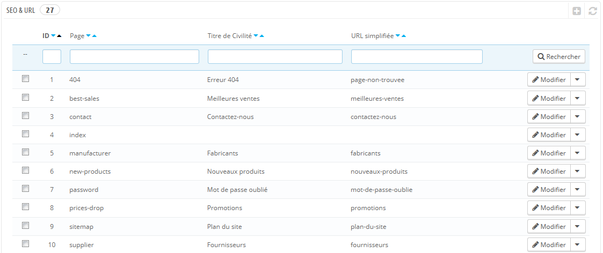
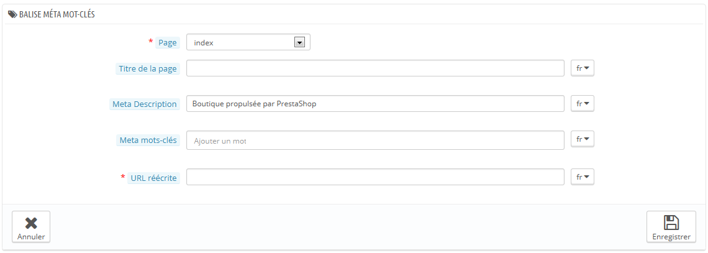
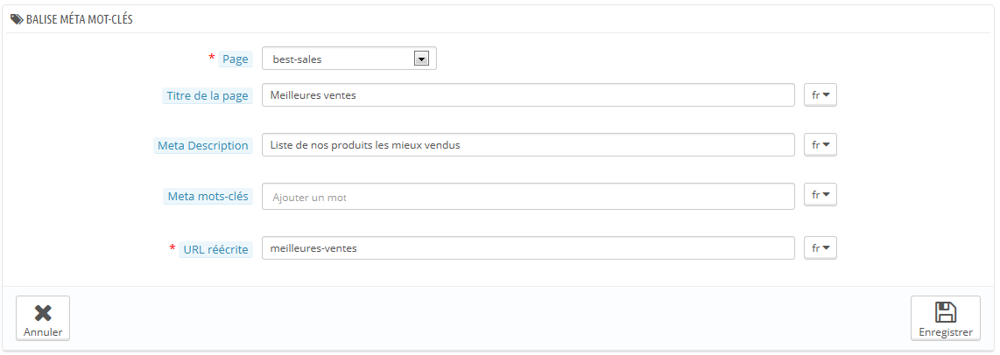
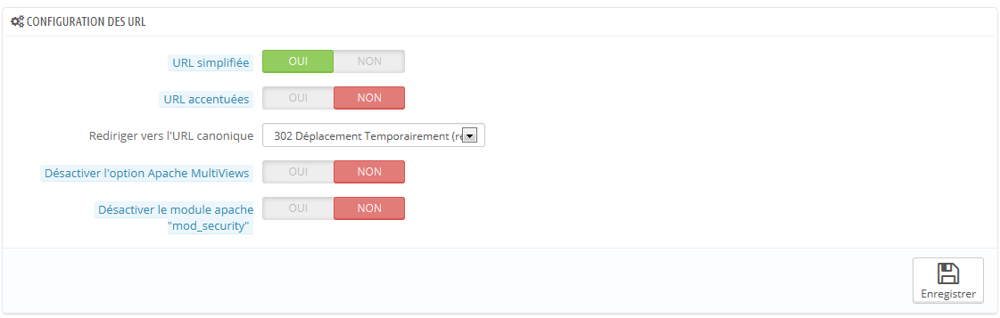
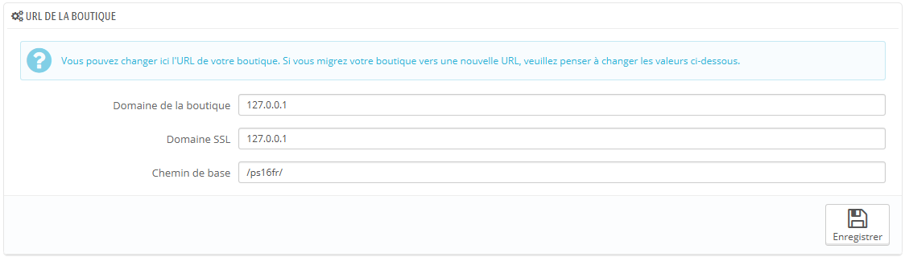
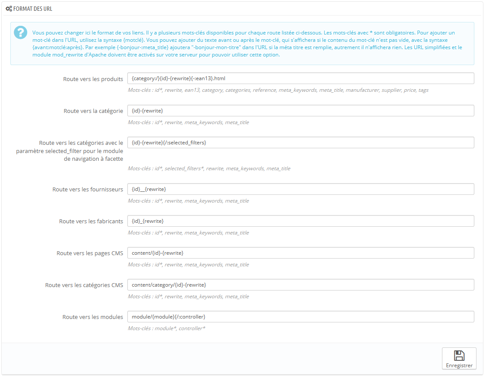
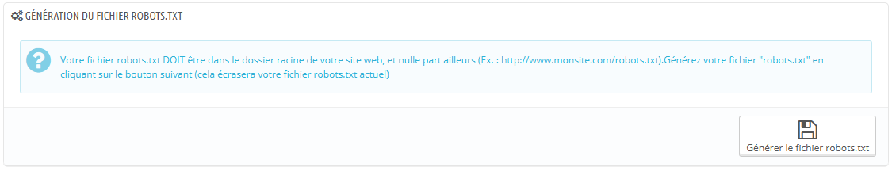

# Préférences SEO & URL

Les outils sur cette page vous permettent d'améliorer la présence de votre site PrestaShop sur les moteurs de recherche, et donc d'atteindre plus de clients potentiels.

SEO signifie "search engine optimization" (soit "Optimisation pour les moteurs de recherche"). Il s'agit d'un ensemble de techniques et de meilleures pratiques créées dans le but d'améliorer le référencement d'un site web sur les moteurs de recherche. Vous pouvez en apprendre plus en lisant la page Wikipedia : [http://fr.wikipedia.org/wiki/Optimisation\_pour\_les\_moteurs\_de\_recherche](http://fr.wikipedia.org/wiki/Optimisation\_pour\_les\_moteurs\_de\_recherche).\
&#x20;Les outils de cette page vous aident à améliorer la position de votre site PrestaShop dans les recherches Internet, et donc à vous apporter plus de clients potentiels.

URL signifie "uniform resource locator" (soit "localisateur uniforme de ressource"). Il s'agit de l'adresse en ligne d'une page web. Vous pouvez en apprendre plus en lisant la page Wikipedia : [http://fr.wikipedia.org/wiki/Uniform\_Resource\_Locator](http://fr.wikipedia.org/wiki/Uniform\_Resource\_Locator).

Par défaut, les adresses les plus profondes de PrestaShop (c'est à dire les pages spécifiques plutôt que le nom de domaine) ne donnent pas vraiment d'information ni à l'acheteur, ni aux moteurs de recherche : une adresse comme [http://www.myprestashop.com/product.php?id\_product=27](http://www.myprestashop.com/product.php?id\_product=27) n'aide pas le visiteur à savoir quel produit se trouve sur cette page. Les URL simplifiée (ou "Friendly URLs") permettent d'améliorer cela, en donnant par exemple [http://www.myprestashop.com/2-music-players/27-ipod-nano-green](http://www.myprestashop.com/2-music-players/27-ipod-nano-green).

Comme vous pouvez le voir dans le second exemple ci-dessus, les catégories comme les produits peuvent disposer d'une URL simplifiée : dans l'exemple ci-dessus, `id_category=2` `2-music-players`, et `id_product=27` devient `27-ipod-nano-green`. Bien que le numéro d'identifiant ne peut pas être enlevé par défaut, les mots peuvent aussi bien être générés pour le nom de la catégorie/du produit, qu'écrits à la main. Tout se passe directement dans la page de configuration du produit ou de la catégorie (dans le menu "Catalogue") : l'adresse simplifiée peut se trouver directement dans la page principale de configuration d'une catégorie, et dans l'onglet "SEO" de la page de configuration d'un produit.

Il y a d'autres pages individuelles que PrestaShop installe et qui pourront certainement bénéficier d'adresses simplifiées : les pages CMS, les pages de compte de l'utilisateur, les pages ayant un contenu généré automatiquement. La page "SEO & URL" vous donne la liste de ces pages, et vous permet de modifier leurs URL simplifiées ainsi que leurs balises méta (titre, description, mot-clé).

Les URL simplifiées ne fonctionnent qu'avec un serveur configuré pour reconnaître la réécriture d'URL (par le biais de la fonctionnalité `mod_rewrite` du serveur Apache, par exemple). Assurez-vous que le vôtre est bien configuré (demandez à votre hébergeur !), car si ce n'est pas le cas et que vous activez les adresses simplifiées, votre boutique peut devenir totalement inaccessible à vos clients.

Réglages SEO de la page d'accueil

Ainsi, pour changer les balises méta de la page d'accueil, vous devez simplement ouvrir la page "SEO & URL", cliquer sur la page "index" et de là vous pouvez librement modifier les informations importantes sur le SEO.

Quelques conseils :

* Le titre par défaut de la page d'accueil est le nom de la boutique, et donc le champ titre de l'index est vide. Si vous mettez dans du contenu dans le champ, le titre complet de la page d'accueil sera "\<votre contenu> - \<le nom de votre boutique>".\
  Le nom de la boutique est configuré pour sa part lors de l'installation de PrestaShop, et peut être formé dans la page de préférence "Coordonnées & magasins", à l'aide de l'option "Nom de la boutique" de la section "Coordonnées".
* Utilisez une description courte : un paragraphe de texte suffit.
* Pour ajouter un mot-clé, cliquez dans le champ" Ajouter un tag" et validez en appuyant sur la touche Envoi. Vous pouvez enlever des mots-clés en cliquant sur la croix rouge.
* Vous n'avez pas à ajouter une URL réécrite s'il n'y en a pas déjà une.

Notez que si votre boutique a déjà été indexée par Google ou n'importe quel autre moteur de recherche, l'apparition de vos modifications dans les résultats de recherche peut prendre du temps. Soyez patient.

En bas de la page "SEO & URL" se trouvent trois sections avec des options supplémentaires : Configuration des URL, URL de la boutique et Génération du fichier robots.txt.

## Ajouter une nouvelle URL simplifiée 

Les URL simplifiées sont à définir dans les pages de configuration de chaque produit, chaque catégorie, chaque page CMS... La présente page de création ne sert que pour certaines pages automatiques, et vous n'aurez la plupart du temps pas à vous en soucier.

Faites en sorte de remplir les champs pour toutes les langues disponibles sur votre boutique : c'est non seulement extrêmement utile pour vos utilisateurs internationaux, mais certains moteurs de recherche peuvent également faire bon usage de telles informations locales.

Cliquez sur le bouton "Créer" pour atteindre le formulaire de création. Il contient une poignée de champs :

* **Page**. La liste déroulante vous donne toutes les pages pouvant bénéficier d'une URL simplifiée.
* **Titre de la page**. Le titre de cette page, qui apparaîtra dans les résultats des moteurs de recherche.
* **Méta description**. Une présentation de la page en quelques mots, afin d'attirer le regard du visiteur. Elle apparaîtra dans les moteurs de recherche.
* **Méta mots-clés**. Vous pouvez définir des mots-clés afin de référencer votre site sur les moteurs de recherche. Vous pouvez en donner plusieurs : saisissez les mots, appuyer sur Entrée, et vous verrez vos mots-clés encapsulés dans un bloc jaune, avec une petite croix rouge pour les effacer.
* **URL réécrite**. C'est ici que vous configurez vos adresses simplifiées. Faites court et descriptif, n'utilisez que des lettres et des chiffres, et remplacez les espaces (" ") par des tirets ("-").

## Configuration des URL 

Les principales options des URL simplifiées sont :

*   **URL simplifiée**. Modifiez cette option **si vous savez que votre serveur peut utiliser la réécriture d'URL**. Si ce n'est pas le cas, laissez l'option sur "Non".

    Il se peut que s'affiche la notification "_Le mode de réécriture d'URL (mod\_rewrite) n'est pas activé sur votre serveur, ou il est impossible de vérifier la configuration. Pour utiliser les URL réécrites, vous devez activer ce mode._" Dans ce cas, PrestaShop ne peut pas détecter votre configuration serveur, mais cela ne veut pas dire que la fonctionnalité ne peut pas fonctionner. Vous devez la tester vous-mêmes.
* **URL accentuées.** PrestaShop peut générer des adresses web avec des caractères spéciaux, pour les produits ayant un nom avec des caractères non ASCII (accents, etc.). Vous pouvez désactiver cette option ici.
* **Rediriger vers l'URL canonique**. Une page PrestaShop donnée peut avoir plusieurs adresses web, la plupart du temps suite à la prise en compte de paramètres: par exemple, `http://example.com/product.php?id=5&option1` et `http://example.com/product.php?id=5&option2` pointent vers le même produit, avec une simple différence. Étant donné qu'il est préférable qu'un produit n'aie qu'une adresse web et non plusieurs dupliquées entre elles, vous devriez activer l'option des adresses canoniques.\
  Les adresses canoniques sont une manière d'éliminer les contenus dupliqués que vous avez créé – ce qui peut faire considérablement chuter votre référencement, étant donné que le contenu est alors considéré comme étant du spam. Pour éviter que les moteurs de recherche vous voient comme un spammeur, PrestaShop utilise la balise `rel="canonical"` qui indique quelle est la page originale d'un contenu.\
  &#x20;Bien qu'il soit vivement recommandé d'activer cette option, elle dépend également de votre thème, et de son implantation de la balise `rel="canonical"` dans l'en-tête HTML. Demandez plus d'information au concepteur du thème.\
  Il y a trois options :
  * **Aucune redirection**. Vous risquez d'avoir des adresses dupliquées.
  * **301 Déplacé Définitivement**. Renvoi le code HTTP 301, en pointant vers l'adresse principale et en notifiant les moteurs de recherche que c'est là la seule adresse à prendre en compte.
  * **302 Déplacé Temporairement**. Renvoi le code HTTP 302, en pointant vers l'adresse principale et en notifiant les moteurs de recherche que l'adresse principale peut changer plus tard.
* **Désactiver l'option Apache MultiViews**. Apache est le serveur web le plus populaire, et c'est selon toute probabilité celui qui est utilisé pour votre hébergement (même si vous devriez vérifier vous-même). L'option Multiviews active un système de négociation de contenu, grâce auquel le serveur Web tente d'envoyer au visiteur la page qui correspond le mieux à sa langue, ce quelle que soit l'adresse Web de la page. Malheureusement, cette option peut être incompatible avec les URL simplifiées. Si c'est le cas, désactivez simplement les Multiviews avec cette option.
* **Désactiver le module apache "mod\_security"**. `mod_security` est un module du serveur Apache qui sert de pare-feu, protégeant ainsi vos serveurs des intrusions. Il peut cependant bloquer certaines fonctionnalités importantes, et même produire des erreurs en fonction de la configuration. Dans ces cas, désactiver le module ici.

Dans les précédentes versions de PrestaShop, vous deviez manuellement générer le fichier `.htaccess` après avoir activé les URL simplifiées. Ce n'est plus le cas depuis la version 1.5 : le fichier `.htaccess` est désormais géré automatiquement par PrestaShop, et vous n'avez plus à vous en soucier.

## URL de la boutique 

Dans cette section, vous pouvez voir et modifier certains de réglages serveur par défaut :

* **Domaine**. Le domaine principal de votre boutique.
* **Domaine SSL**. Le domaine sécurisé (`https://`) de votre boutique.
* **Chemin**. Le dossier où vous avez installé PrestaShop. Si c'est à la racine de votre domaine, utilisez "`/`".

La plupart du temps, vous ne devriez pas toucher ces champs sans savoir exactement ce que vous faites. Une modification seulement peut rendre votre boutique inaccessible.

## Format des URL 

**Nouveauté 1.6**.

_N'est affiché que si les URL simplifiées sont activées._

Vous pouvez changer la manière dont les URL simplifiées sont générées, en modifiant la "route" vers la ressource de votre boutique.

Par exemple, la route par défaut pour afficher un produit est `{category:/}{id}-{rewrite}{-:ean13}.html`, ce qui donne `/summer-dresses/7-printed-chiffon-dress.html`\
Vous pourriez changer cette route pour utiliser `{manufacturer:/}{id}-{rewrite:/}` afin d'obtenir `/fashion-manufacturer//7-printed-chiffon-dress/`

8 champs sont disponibles par défaut, et chacun est accompagné d'une liste de mots-clés. Certains mots-clés sont obligatoires, et sont indiqués par une `*`.

Une fois que vous avez mis à jour vos champs, n'oubliez pas d'enregistrer vos modifications, puis de cliquer sur le bouton "Enregistrer" de la section "Configuration des URL" afin de regénérer le fichier .htaccess, qui est nécessaire au URL simplifiées.

## Génération du fichier robots.txt 

Un fichier `robots.txt` vous permet de bloquer des robots et autres logiciels automatiques qui parcourent le Web afin d'y trouver plus de pages à ajouter au serveur de leur société. Vous voudrez sûrement donner les pleins accès à certains robots, comme ceux de Google ou de Yahoo!, tandis que d'autres devront trouver porte fermée, comme les robots de spam, les voleurs de contenus, les collecteurs d'adresse e-mails, etc. Notez que les robots les plus malicieux ne respectent pas les directives de ce fichier, qui ne sont pas imposées.

L'outil de génération de `robots.txt` de PrestaShop créé simplement un fichier avec des directives d'exclusion pour les fichiers et dossiers qui ne sont pas censés être publics, et ne devraient donc pas être indexés. Ces directives s'appliquent donc à tous les robots, bons et mauvais : le fichier généré utilise la chaîne "User-agent: \*"

En cliquant sur le bouton "Générer le fichier robots.txt", vous remplacez tout fichier `robots.txt` par le nouveau. Ainsi, si vous souhaitez ajouter vos propres règles, faites-le après que PrestaShop ait généré le fichier.

