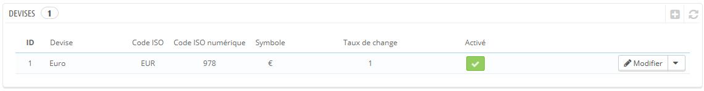
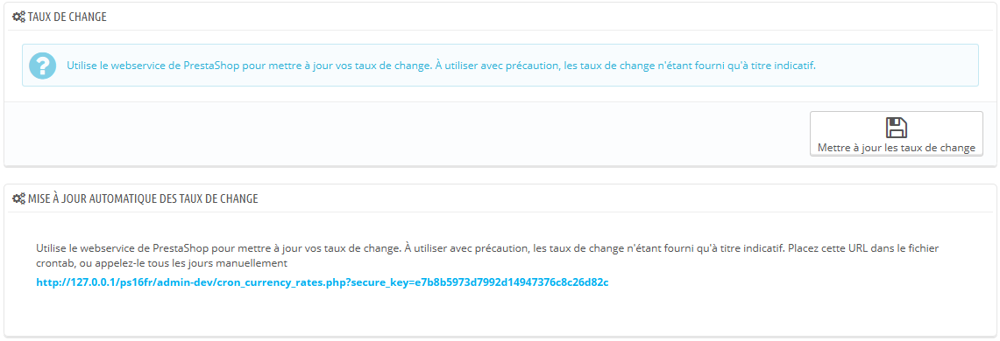
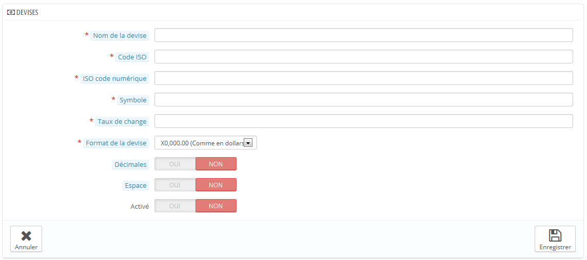

# Devises

PrestaShop accepte un grand nombre de devises. Il n'y en a qu'une par défaut : celle de votre pays. Cependant, vous devez ajouter et configurer autant de nouvelles devises que vos clients en requièrent. En effet, les clients apprécient de pouvoir afficher les prix de votre boutique dans la monnaie de leur pays.

Les deux sections en bas de la page "Devises" sont très simples mais essentielles, car elles sont en rapport avec les taux de change de vos devises (ou "taux de conversion"). Pour citer Wikipedia, "Le taux de change d'une devise (une monnaie) est le cours (autrement dit le prix) de cette devise par rapport à une autre." Ce taux est également considéré comme la valeur de la monnaie d'un pays en fonction d'une autre monnaie. Les taux changent tous les jours, parfois de manière drastique en fonction de l'actualité, et votre boutique devrait toujours utiliser les dernières valeurs.

Pour changer la devise par défaut, vous devez vous rendre dans la page "Localisation" du menu "Localisation", et utiliser l'option "Devise par défaut" de la section "Configuration".\
Si la devise que vous souhaitez utiliser n'est pas disponible dans cette option, vous devez l'importer depuis un pays qui l'utilise, à l'aide de la section "Import de pack de localisation" de la page "Localisation".

## Mettre à jour les taux de change 

Il y a deux manières de mettre à jour les taux de change dans PrestaShop :

* **Manuellement**. Dans la section "Taux de change", cliquez sur le bouton "Mettre à jour les taux de change". Le fichier de mise à jour sera téléchargé depuis les serveurs de PrestaShop.com par le biais du service web de PrestaShop.
* **Automatiquement**. C'est la méthode recommandée. Au lieu de devoir cliquer sur le bouton "Mettre à jour les taux de change" une voire plusieurs fois par jour, vous pouvez mettre en place une tâche Cron qui déclenchera le téléchargement de fichiers de taux, aussi souvent que vous le souhaitez. Ajoutez l'URL à votre fichier `crontab` afin d'activer la mise à jour automatique. Si vous ne savez pas ce qu'est une tâche Cron ou un fichier crontab, contactez votre hébergeur web.

Notez que les taux sont fournis à titre indicatif : l'équipe de PrestaShop s'efforce de fournir des taux exacts dans ces fichiers, mais ils peuvent varier légèrement des véritables taux, ne serait-ce que parce que ces taux varient grandement dans un très court laps de temps.

## Ajouter une nouvelle devise 

La manière la plus simple d'ajouter la devise d'un pays consiste à importer son pack de localisation. Cela se fait via la page "Localisation", du menu du même nom. Une fois la devise importée, vous devez vous rendre sur la page "Devises" pour l'activer.

Vous pourriez avoir besoin d'une devise qui n'est présente dans aucun pack de localisation. Dans ce cas, vous pouvez utiliser le formulaire de création.

* **Nom de la devise**. Le nom de la devise, de préférence en anglais pour que le plus grand nombre possible de clients puissent la lire.
* **Code ISO**. Le code ISO 4217 de la devise. Référez-vous à la page Wikipedia : [http://en.wikipedia.org/wiki/ISO\_4217](http://en.wikipedia.org/wiki/ISO\_4217) (en anglais).
* **ISO code numérique**. Le code a trois chiffres ISO 4217. Même page que ci-dessus.
* **Symbole**. Le symbole de la devise, si elle en a un. Référez-vous à cette page Wikipedia : [http://en.wikipedia.org/wiki/Currency\_sign](http://en.wikipedia.org/wiki/Currency\_sign) (en anglais).
* **Taux de change** (ou **Taux de conversion** dans les versions précédentes). Ce taux est défini en fonction de la devise par défaut de la boutique. Par exemple, si la devise par défaut est l'Euro et que la devise créée est le dollar, saisissez "1.31", étant donné que 1€ vaut $1.31 (à l'heure de publication de ce chapitre). Utilisez ce convertisseur pour vous aider : [http://www.xe.com/fr/](http://www.xe.com/fr/).
* **Format**. Configurez la manière dont vous voulez que le prix soit affiché. Le X correspond à l'emplacement du symbole de la devise. Vous avez cinq possibilités.
* **Décimales**. Vous pouvez indiquer si votre boutique doit afficher les décimales des prix. Bien que vous puissiez choisir d'arrondir tous les prix, les promotions et autres variations de prix peuvent nécessiter des décimales. Vous pouvez éviter cela avec cette option.
* **Espace**. Une fois que vous avez choisi le format de la devise, vous pouvez choisir s'il faut mettre un espace entre le symbole et le prix lui-même. Certaines langues le requièrent. Par exemple, les espagnols utilisent "50€" tandis que les français utilisent "50 €". Choisissez celui qui vous convient le mieux.
* **Activé**. N'importe quelle devise peut être désactivée quand vous le voulez, à la fois depuis sa propre page d'édition, et depuis le tableau des devises de la page "Devises".
* **Boutique associée**. Vous pouvez ne rendre une devise disponible que pour certaines boutiques, par exemple une boutique locale.
