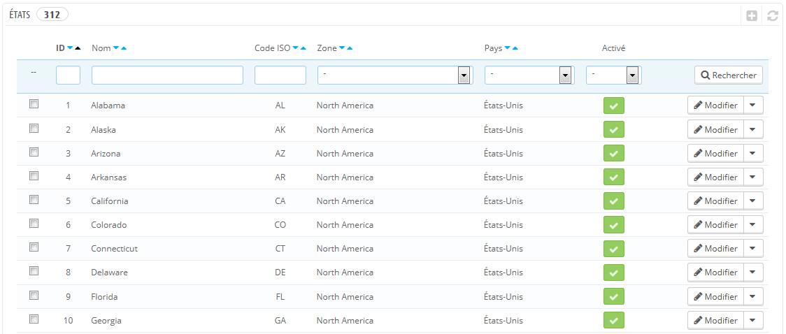

# États

Par "États", PrestaShop sous-entend les divisions administratives de premier niveau d'un pays. Aux États-Unis, ce sont des _states_ ; en Italie, des _regioni_ (singulier : _regione_) ; en France, des _régions_ ; au Royaume-Uni, des _regions_.\
Par défaut, PrestaShop vous propose un ensemble d'états : 54 états territoires des États-Unis, 13 provinces et territoires canadiennes, 31 _estados_ mexicains, 24 _provincias_ argentines, 34 _provinsi_ indonésiennes et 110 _province_ italiennes (singulier : _provincia_).

Avoir des états correctement définis dans votre base de données vous permet de mieux représenter les possibilités de livraison de vos transporteurs. Ces états peuvent également se révéler essentiels pour le calcul des règles de taxes, selon le pays. Il est donc important d'enregistrer toutes les divisions administratives si elles sont importantes pour vos transporteurs. Vous pouvez trouver une liste de ces divisions sur cette page Wikipedia : [http://en.wikipedia.org/wiki/Table\_of\_administrative\_divisions\_by\_country](http://en.wikipedia.org/wiki/Table\_of\_administrative\_divisions\_by\_country) (en anglais).

Le formulaire d'adresse de PrestaShop ne liste à l'heure actuelle que les états qui sont disponibles pour le client. De fait, assurez-vous de créer une liste raisonnée lorsque vous ajoutez du contenu à votre liste d'états. C'est la raison pour laquelle la liste actuelle ne contient que des _province_ italiennes (divisions administratives de second niveau) et non des _regioni_ (divisions administratives de premier niveau).

## Ajouter un nouvel état 

Créons un nouvel état. Cliquez sur le bouton "Créer" pour ouvrir le formulaire de création.

* **Nom**. Le nom de l'état, tel qu'il doit être affiché sur les factures et le colis. Il faut donc l'écrire dans la langue du pays de l'état.
* **Code ISO**. Le code ISO-3166-2 de l'état :
  1. Allez sur cette page Wikipedia : [http://fr.wikipedia.org/wiki/ISO\_3166-2](http://fr.wikipedia.org/wiki/ISO\_3166-2),
  2. Cliquez le code à deux lettres du pays de l'état,
  3. Sur la page qui s'ouvre, trouvez le code de l'état (il devrait être dans une liste de cette page, ou directement dans le texte pour les pays les plus petits),
  4. S'il y en a un, enlevez le préfixe du pays afin d'obtenir un code à moins de 4 caractères. Par exemple, le code ISO 3166-2 complet du Devon, au Royaume-Uni, est "GB-DEV". Utilisez simplement "DEV" en tant que code ISO – il est déjà rattaché au pays par la liste déroulante "Pays" de PrestaShop (étape suivante).
* **Pays**. Indiquez le pays de l'état à l'aide de la liste déroulante.
* **Zone**. Indiquez la zone géographique du pays à l'aide de la liste déroulante. Faites attention à ne pas choisir la mauvaise zone, car PrestaShop risquerai alors de ne plus s'y retrouver entre ses réglages de pays et de zones.
* **État**. Un état désactivé ne sera pas proposé comme option quand vos visiteurs tenteront de créer un nouveau compte.
