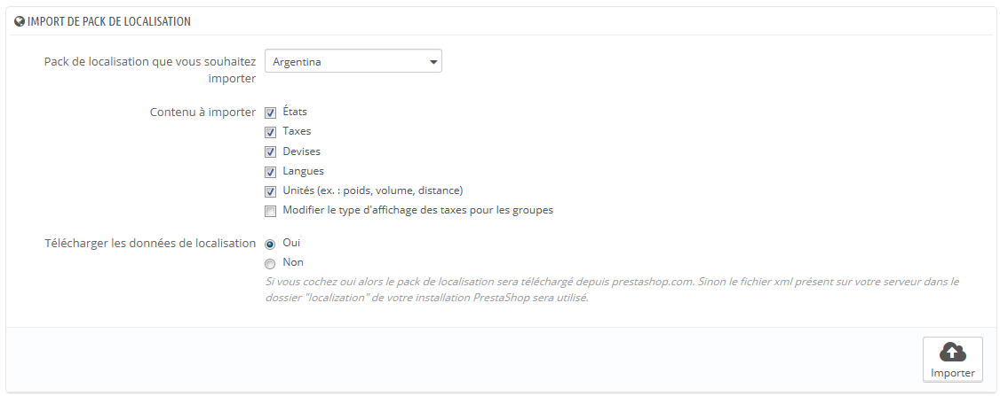
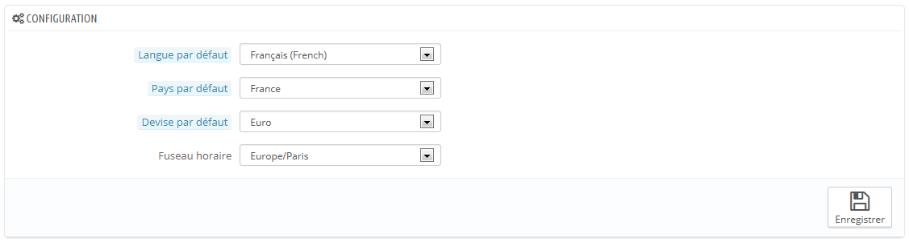
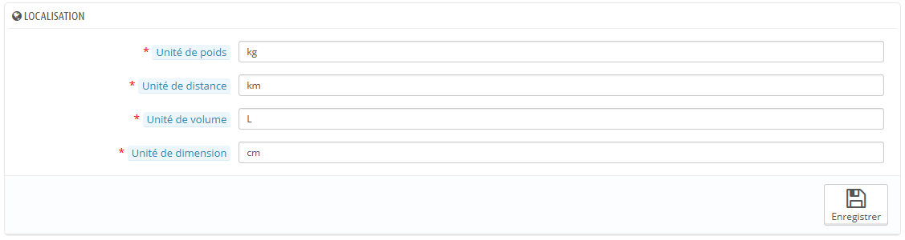
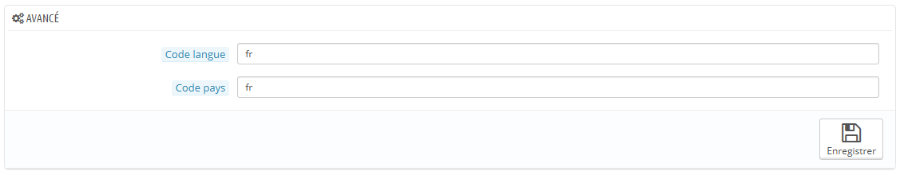

# Localisation

La page principale du menu "Localisation" vous permet de configurer les unités utilisées pour vos produits.

## Import de pack de localisation 

Cette section vous présente une large liste de packs de localisation existant. Elle vous permet non seulement de configurer votre installation de PrestaShop avec les bonnes unités locales, mais également avec d'autres données :

* **États**. Lorsque vous expédiez un produit vers un pays, il peut être important de savoir dans quel état géographique vous l'envoyez, car cela peut avoir un impact sur les douanes et taxes locales. Les états ajoutés peuvent être affichés et modifiés depuis la page "États" du menu "Localisation".
* **Taxes**. La véritable importance de la localisation tient aux taxes locales, et elles peuvent se révéler nombreuses et variées en fonction du pays ou de l'état. PrestaShop offre un support basique des principales taxes et règles de taxes. Les taxes et règles de taxes ajoutées peuvent être affichées et modifiées depuis les pages "Taxes" et "Règles de taxes" du menu "Localisation".
* **Devises**. Les clients étrangers apprécieront de pouvoir convertir vos prix dans leur propre monnaie. Vous devriez au moins disposer des euros et des dollars américains en plus de la monnaie de votre pays (s'il ne s'agit pas de l'une de ces deux monnaies). Une fois une devise ajoutée, vous devez l'activer en passant par la page "Devises" du menu "Localisation", et assurez-vous que le taux de conversion est correct. Les devises ajoutées peuvent être affichées et modifiées depuis cette page "Devises".
* **Langues**. Tous les champs publics de votre boutique peuvent être rédigés en plusieurs langues, et il est très important que vous le fassiez pour au moins les noms des produits et leurs descriptions. Notez que le fait d'importer une langue importe également son format de date (j/m/a, m/d/a, d.m.a, ...), entre autres choses. Les langues ajoutées peuvent être affichées et modifiées depuis la page "Langues" du menu "Localisation".
* **Unités**. Poids, dimension, volume, distance : ces unités de mesure sont essentielles pour décrire correctement un produit à vos clients, et pour vos propres informations sur l'emballage. Elles peuvent être affichées et modifiées depuis la présente page, dans la section "Localisation".
* **Modifier le type d'affichage des taxes pour les groupes**. Il ne s'agit pas de données à importer mais d'une option que vous pouvez modifier pour influencer l'importation.

Comme vous pouvez le constater, ces contenus à importer sont facultatifs : vous pouvez par exemple choisir de n'importer que la monnaie et la langue d'un pays donné, et pas ses taxes.

Bien qu'il faille faire attention de ne pas ajouter trop de données locales pour ne pas submerger à la fois vos clients et vous-même, il peut se révéler utile d'importer les packs de localisation des pays d'où proviennent le plus gros de vos visiteurs (selon vos statistiques).

En dehors des unités par défaut, **vous ne pouvez pas automatiquement enlever toutes les données liées à un pays** ; si vous avez besoin de supprimer des données, il vous faudra le faire à la main, dans leurs pages respectives du menu "Localisation".

## Configuration 

Cette section regroupe 4 réglages locaux de première importance :

* **Langue par défaut**. Il s'agit de la langue principale de votre boutique. Ce réglage aura une influence sur la langue de votre back-office (y compris la langue principale de vos produits), ainsi que sur le front-office. Notez que la langue du front-office peut s'adapter aux réglages du navigateur web du visiteur.
* **Pays par défaut**. Là où se trouve votre société. Si vous avez des filiales dans de nombreux pays, utilisez le pays de la filiale principale, et le pays d'origine de la société.
* **Devise par défaut**. La devise dans laquelle les prix des produits sont configurés. D'autres devises peuvent être ajoutées en important la devise d'un pays. Notez que si vous changez la devise par défaut alors que vous avez déjà mis en place les prix de certains produits, vous devrez mettre à jour tous les prix manuellement. Assurez-vous de faire ce réglage une bonne fois pour toute.
* **Fuseau horaire**. Votre propre fuseau horaire. Particulièrement utile par exemple pour les promotions quotidiennes : vous savez exactement quand elles commencent et se terminent.

## Localisation 

Les unités physiques présentées dans cette section (poids, distance, volume, dimension) sont utilisés à la fois pour vos fiches produit et pour vos propres besoins d'emballage – en définitive, elles sont un point essentiel de votre relation avec votre transporteur.

Ces valeurs peuvent être mises en place quand vous importez un pack de localisation pour un pays, mais vous pouvez les modifier manuellement après importation. Par exemple, si vous préférez utiliser des centilitres au lieu de litres, modifiez la valeur par défaut de "L" à "cL".

Les champs doivent utiliser les symboles du Système international d'unités ([http://fr.wikipedia.org/wiki/Syst%C3%A8me\_international\_d%27unit%C3%A9s](http://fr.wikipedia.org/wiki/Syst%C3%A8me\_international\_d'unit%C3%A9s)).

## Avancé 

Cette dernière section vous demande d'indiquer la langue et le pays de votre serveur web, sous forme de code ISO :

* Pour la langue, le code ISO 639-1 : [http://en.wikipedia.org/wiki/ISO\_639](http://en.wikipedia.org/wiki/ISO\_639).
* Pour le pays, le code ISO 3166-1 Alpha-2 : [http://fr.wikipedia.org/wiki/ISO\_3166-1](http://fr.wikipedia.org/wiki/ISO\_3166-1).

Ces valeurs peuvent être mises en place quand vous importez un pack de localisation pour un pays, mais vous pouvez les modifier manuellement après importation.
