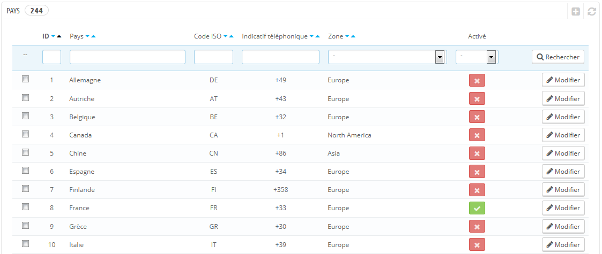

# Pays

Votre installation PrestaShop doit connaître tous les pays existants afin que vos clients puissent indiquer où ils vivent dans le monde.

Il y a environ 200 pays dans le monde, mais PrestaShop en propose 244. Cela s'explique par le fait que certains comptes des régions outremer qui font partie intégrante du pays.\
&#x20;Par exemple, les départements français connus formellement sous le nom de DOM (Guadeloupe, Martinique, Mayotte, La Réunion, et Guinée Française) ont de nos jours le même statut que les régions métropolitaines françaises. De la même manière, Hawaï et l'Alaska sont des états des États-Unis à part entière.\
&#x20;Cependant, envoyer un colis en Guadeloupe ne signifie pas l'envoyer en France, ne serait-ce que pour les frais de port. De fait, la liste des prix de PrestaShop sépare le pays de la région.

Par défaut, seul votre propre pays est activé. Vous devez les activer un à un, en fonction des besoins de vos clients. Si vous ne savez pas lesquels activer, fiez-vous aux statistiques par pays de vos visiteurs.

En bas de la liste, la section "Préférences pays" vous permet de n'afficher en front-office que les pays couverts par vos transporteurs. Nous vous recommandons d'activer ce réglage, car il évite que vos clients aient à faire défiler une longue liste de pays avant de trouver le leur.

## Ajouter un nouveau pays 

Normalement, PrestaShop dispose déjà de tous les pays existants dans sa base de données. Mais dans le cas où de nouveaux apparaissent, vous devez les ajouter.

* **Pays**. Le nom officiel du pays que vous voulez créer, dans toutes les langues reconnues par votre boutique. Vérifiez sur la page Wikipedia du pays si vous n'êtes pas certain du nom.
* **Code ISO**. Le code ISO-3166 du pays, que vous pouvez trouver sur la page officielle de l'ISO : [http://www.iso.org/iso/fr/home/standards/country\_codes/country\_names\_and\_code\_elements.htm?=](http://www.iso.org/iso/fr/home/standards/country\_codes/country\_names\_and\_code\_elements.htm?=).
* **Indicatif téléphonique**. Le numéro d'appel international, que vous pouvez trouver sur cette page Wikipedia : [http://fr.wikipedia.org/wiki/Liste\_des\_indicatifs\_t%C3%A9l%C3%A9phoniques\_internationaux\_par\_pays](http://fr.wikipedia.org/wiki/Liste\_des\_indicatifs\_t%C3%A9l%C3%A9phoniques\_internationaux\_par\_pays).
* **Devise par défaut**. Vous pouvez utiliser la devise par défaut de la boutique (telle que configurée dans la page "Localisation" du menu du même nom), ou l'une des autres devises installées. Souvenez-vous qu'en cas de besoin, vous pouvez ajouter une nouvelle devise depuis la page "Devises".
* **Zone**. La région du globe à laquelle ce pays est rattaché. En cas de besoin, vous pouvez ajouter de nouvelles zones depuis la page "Zones", sous le menu "Localisation".
* **Requiert un code postal?**. Indique si l'utilisateur vivant dans ce pays doit indiquer ou non son code postal lors de l'inscription sur votre boutique.
* **Format du code postal**. Vous pouvez également donner plus de détails sur le format du code postal (ou zip code). Si vous ne mettez rien, PrestaShop acceptera n'importe quelle valeur et ne vérifiera rien.\
  &#x20;Utilisez les codes suivants pour le code postal : "L" pour une lettre, "N" pour un chiffre, et "C" pour le code ISO du pays (tel qu'entré dans le champ ci-dessus).\
  &#x20;Si vous ne connaissez pas le format du code postal du pays, vous pouvez le chercher sur la page Wikipedia dédiée : [http://en.wikipedia.org/wiki/List\_of\_postal\_codes](http://en.wikipedia.org/wiki/List\_of\_postal\_codes) (en anglais). Ne faites pas de copier/coller de la notation de Wikipedia ! Par exemple, Wikipedia indique "AAA 999\*" pour Malte, alors que la notation PrestaShop devrait être "LLL NNNN" (sans le \* final).
* **Format de l'adresse**. Donne des détails sur la manière dont l'adresse doit être affichée aux clients. Vous pouvez cliquer sur les différents liens d'assistance sur le côté du champ texte afin d'ajouter d'autres champs. En utilisation réelle, ces champs sont automatiquement remplacés par les données du compte de l'utilisateur.\
  &#x20;Vos modifications ne sont enregistrées qu'une fois que vous avez enregistré la page entière. Si vous avez fait une erreur, vous pouvez toujours utiliser l'un des boutons d'assistance en bas du formulaire, en fonction de la situation.
* **Activé**. Un pays désactivé ne sera pas suggéré au visiteur qui veut créer un compte.
* **Contient des états/régions**. Indique si le pays a des "états" ou non. Cette option rajoute un champ au formulaire de création d'adresse de PrestaShop. Notez que les "états" peuvent être des régions, des provinces, des départements... n'importe quoi qui soit compatible avec les usages du service postal.
* **Requiert un numéro d'identification fiscale ?** et **Afficher le label de la taxe**. Le numéro d'identification fiscale est un numéro d'identification utilisé par les services du fisc du pays lors de l'application des impôts. Tous les pays n'en ont pas besoin, et certains n'en ont même pas. Renseignez-vous auprès des services fiscaux du pays.
* **Association de boutique**. Vous pouvez ne rendre un pays disponible que pour certaines boutiques, par exemple une boutique locale.
