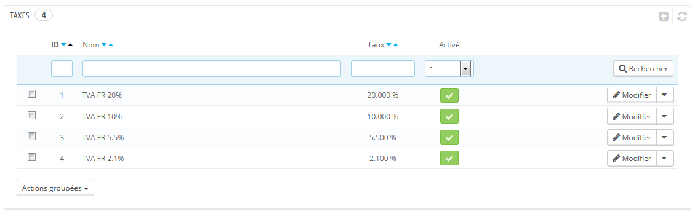
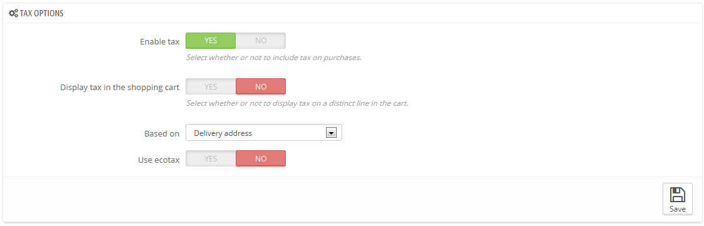
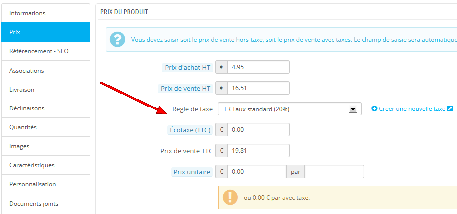
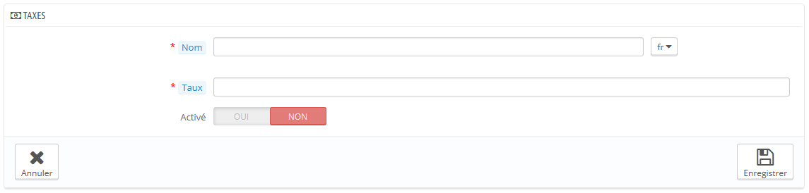

# Taxes (fr)

Les taxes sont un sujet complexe, qu'il faut s'efforcer de bien comprendre tant elles peuvent avoir un impact significatif sur le prix de vos produits ou vos frais de port. Ce guide n'est pas destiné à vous enseigner tous les tenants et aboutissants des taxes, mais nous tenterons de vous donner quelques indications.

Les taxes sont une contribution obligatoire au revenu de l'état. Le gouvernement les perçoit sur le salaire des travailleurs et les profits des entreprises, ou sous forme de coût ajouté à certains produits, services et transactions. En clair, tous les produits que vous vendez sont susceptibles d'être taxés, en fonction des lois fiscales de votre pays ou état. Dans les faits, vous contribuez au bon fonctionnement de votre pays (biens et services publics) par un pourcentage de vos ventes, tel que défini par les taux d'imposition locaux.

Il y a des nombreuses taxes dans le monde, et elles varient considérablement d'un pays à l'autre, voire même au sein d'un même pays si celui-ci a des états fédéraux (États-Unis, Allemagne, Espagne, Russie...). Vous devez donc vous assurer de vous conformer strictement aux lois fiscales de votre pays, de votre état ou même de votre ville si elles s'appliquent à vous. Renseignez-vous auprès de votre centre fiscal local dès que possible afin d'obtenir tous les détails officiels.

Dans PrestaShop, par défaut, une taxe s'applique à tous les pays/états/zones. Pour appliquer un taux de taxe spécifique à un seul pays ou à un ensemble de pays (et pas d'autres), vous devez créer une règle de taxe. Cette règle de taxe est ensuite appliquée aux produits un par un, au moment de leur création (dans l'onglet "Prix").

Vous ne pouvez pas directement appliquer une taxe à un produit ; vous ne pouvez appliquer que des règles de taxe. De fait, vous devez d'abord créer toutes les taxes pertinentes, puis créer une règle de taxe pour cette taxe, règle qui précisera les pays auxquels la taxe s'applique, et pour finir appliquer la règle de taxe au produit.

## Options des taxes 

En bas de la page "Taxes" se trouve la section des options de taxes. Ces options s'appliquent à toute la boutique, et à toutes les commandes.

* **Activer les taxes**. Indique si les taxes doivent être inclues dans chaque commande ou non.
* **Afficher les taxes dans le panier**. Vous pourriez préférer que le client ne soit pas au courant des taxes qui sont appliquées sur leur commande. Dans ce cas, désactivez cette option.
* **Basé sur**. Le client peut choisir de ne pas faire livrer ses produits à la même adresse que celle de facturation. Cela peut avoir un grand impact sur les taxes. Par défaut, PrestaShop base ses taux de taxes sur l'adresse de livraison, mais vous pouvez choisir de les baser sur l'adresse de facturation.
* **Utiliser l'écotaxe**. L'écotaxe est une taxe visant à promouvoir les activités écologiquement durables par le biais d'incitations économiques. C'est une taxe que le vendeur paye afin de "sentir le poids social de ses actions". Vous pouvez en apprendre plus sur la page Wikipedia : [http://fr.wikipedia.org/wiki/%C3%89cotaxe](http://fr.wikipedia.org/wiki/%C3%89cotaxe).\
  &#x20;Une fois que vous avez activé l'écotaxe, toutes les pages back-office de vos produits disposent d'un champ "Écotaxe (TTC)" dans leur onglet "Prix". Vous devriez remplir ce champ avec la valeur exacte de la taxe, qui dépend des lois fiscales de votre pays (il s'agit probablement d'un pourcentage du prix du produit).

Si vous décidez d'activer l'écotaxe après avoir ajouté des produits, vous devrez tous les modifier afin de configurer la taxe correctement pour chaque produit.\
&#x20;Notez que si vous avez déjà réglé l'écotaxe de vos produits, puis que vous choisissez de désactiver l'écotaxe, alors tous vos produits perdront ce réglage. Réactiver l'écotaxe signifiera devoir re-régler l'écotaxe de tous vos produits.\
&#x20;Le client peut voir l'écotaxe sur la page du produit.

## Ajouter une nouvelle taxe 

Il est très facile d'ajouter une nouvelle taxe, car ce sont les règles de taxe qui ont la charge de préciser les pays où la taxe s'applique. Le formulaire de création de taxe est donc très court.

* **Nom**. Soyez très précis, car cela vous aidera à mettre en place vos règles de taxes plus rapidement.\
  &#x20;Nous vous recommandons d'ajouter des pense-bêtes dans le nom, tel que le pays, le groupe ou la zone auquel la taxe s'applique, et son taux. Cela vous aidera grandement à reconnaître la taxe qui doit être utilisée dans une règle de taxe.
* **Taux**. Le taux exact de la taxe, au format XX.XX.
* **Activé**. Vous pouvez désactiver et réactiver une taxe à n'importe quel moment.

